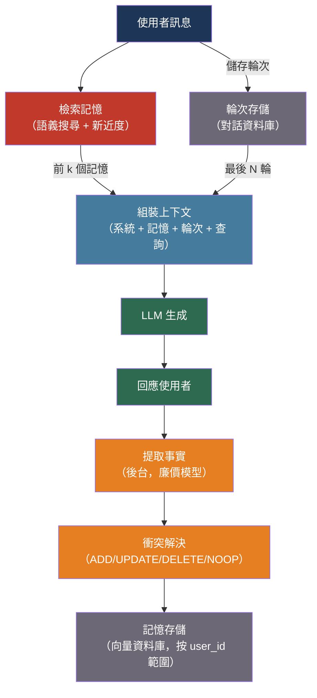

# [BEE-519] 長期運行代理的 AI 記憶系統

:::info
上下文視窗是代理的全部工作記憶 —— 有界、短暫，且在會話之間消失。賦予代理持久記憶，需要明確地在上下文視窗之外存儲情節記錄、提取的事實和檢索的上下文，然後在查詢時只載入相關的部分。
:::

## 背景

沒有外部記憶的 LLM 代理在呼叫之間是無狀態的。每個會話都從零開始：使用者的名字、偏好、過去的決定，以及上次對話中發生的一切都消失了。對於短暫的任務這是可以接受的。但對於長期運行的應用 —— 跨數週追蹤程式碼庫的程式碼助理、處理同一客戶多個工單的客服代理、累積使用者偏好的個人助理 —— 無狀態是根本性的能力缺口。

MemGPT 論文（Packer et al.，arXiv:2310.08560，2023）以作業系統類比來描述這個問題：上下文視窗是 RAM，小而快但易失；外部儲存是磁碟，大且持久但需要明確的載入/存儲操作。就像作業系統在 RAM 和磁碟之間交換記憶頁，給程式一種擁有無限記憶的幻覺，具有外部儲存的代理可以維持無限上下文的幻覺。MemGPT 的開源後繼者 Letta 框架，將其實作為生產級別的代理運行時。

生成式代理論文（Park et al.，arXiv:2304.03442，2023）從不同角度探討記憶：模擬人類代理維護情節記憶流，並定期將其整合為更高層次的反思。他們的檢索模型在三個維度上對候選記憶評分 —— 新近度、重要性和相關性 —— 並檢索得分最高的組合，這密切反映了人類情節記憶的運作方式。

在生產規模上，Mem0（arXiv:2504.19413，2025）證明了自動記憶提取和衝突解決更新周期，比未增強的模型在 LLM-as-a-Judge 基準上提高了 26%，P95 延遲降低了 91%，方法是只在檢索池中保留重要事實而非原始對話輪次。

## 設計思維

認知科學區分了四種記憶類型，直接映射到代理架構：

| 記憶類型 | 認知角色 | 代理實作 |
|---------|---------|---------|
| 工作記憶 | 主動推理 | 上下文視窗 —— 模型現在看到的內容 |
| 情節記憶 | 特定過去事件 | 對話輪次資料庫，可按時間或語義搜尋 |
| 語義記憶 | 一般事實和知識 | 提取的事實存儲（鍵值或向量） |
| 程序記憶 | 如何執行任務 | 系統 Prompt、工具定義、微調權重 |

工程挑戰在於工作記憶和三種長期記憶類型之間的邊界。資訊在每個請求中進入上下文視窗；大部分不應該持久化；一小部分真正值得保留。識別並存儲這一小部分 —— 而不讓語義存儲充斥噪音 —— 是核心問題。

三個設計決策由此而來：

**什麼觸發記憶寫入？** 每輪都寫（噪音高），代理決定時寫（工具呼叫開銷），或在後台進程非同步寫（延遲安全但最終一致）。後台整合對非關鍵事實最適合生產環境。

**什麼觸發記憶讀取？** 載入最後 N 輪（簡單、可預測），或嵌入當前查詢並語義檢索相似記憶（相關性更好，延遲增加）。大多數系統結合兩者：最近輪次始終包含，更舊的記憶按語義檢索。

**記憶如何結構化？** 原始對話輪次（高保真、高費用）、提取的事實三元組（緊湊、有損）或分層摘要（中間路徑）。生成式代理的反思模式 —— 將情節整合為更高層次的觀察 —— 是中間路徑。

## 最佳實踐

### 按揮發性和存取模式分層記憶

**SHOULD**（應該）至少實作兩個記憶層：

```
┌─────────────────────────────────────────┐
│  上下文視窗（工作記憶）                  │  ~8K–32K Token，短暫
│  ┌──────────────────┐                   │
│  │ 系統 Prompt      │ ← 程序記憶        │
│  │ 核心事實         │ ← 語義記憶（熱）  │
│  │ 最近輪次         │ ← 情節記憶（熱）  │
│  │ 檢索的記憶       │ ← 情節/語義       │
│  └──────────────────┘                   │
└─────────────────────────────────────────┘
         ↕  每輪載入/存儲
┌─────────────────────────────────────────┐
│  外部儲存（長期記憶）                    │  無界，持久
│  ┌──────────────────┐                   │
│  │ 情節存儲         │ ← 對話資料庫      │
│  │ 語義存儲         │ ← 事實向量資料庫  │
│  │ 歸檔存儲         │ ← 完整歷史        │
│  └──────────────────┘                   │
└─────────────────────────────────────────┘
```

**MUST**（必須）在每個請求中始終將最近的對話輪次包含在上下文視窗中。舊記憶的語義檢索無法替代最後 3–5 輪的連貫性；始終逐字包含這些輪次。

**SHOULD** 將上下文中檢索記憶的部分限制在固定的 Token 預算內（例如上下文視窗的 20%）。無界的記憶檢索可能會將當前查詢和最近輪次推出上下文，適得其反。

### 非同步提取並存儲語義事實

**SHOULD** 在每個使用者輪次之後的後台任務中執行記憶提取，而非在關鍵路徑上：

```python
import asyncio
from anthropic import AsyncAnthropic

client = AsyncAnthropic()

EXTRACTION_PROMPT = """
分析這段對話輪次，提取任何值得記住的關於使用者的事實。
返回 JSON 列表。每個事實：{"fact": "...", "category": "preference|identity|context"}
如果沒有值得記住的，返回 []。
只包含持久事實，不包含短暫狀態。

使用者訊息：{user_message}
助理回應：{assistant_response}
"""

async def extract_and_store(
    user_id: str,
    user_message: str,
    assistant_response: str,
    memory_store,
):
    """在回應已發送給使用者後執行。"""
    response = await client.messages.create(
        model="claude-haiku-4-5-20251001",  # 提取使用廉價模型
        max_tokens=512,
        messages=[{
            "role": "user",
            "content": EXTRACTION_PROMPT.format(
                user_message=user_message,
                assistant_response=assistant_response,
            ),
        }],
    )
    facts = json.loads(response.content[0].text)
    for fact in facts:
        await memory_store.upsert(user_id=user_id, **fact)
```

**MUST NOT**（不得）在記憶提取運行時阻塞給使用者的回應。提取增加延遲；應先讓使用者收到回應。

**SHOULD** 使用廉價、快速的模型進行提取（Haiku、gpt-4o-mini），而非主要生成模型。提取是分類/解析任務，不是推理任務。

### 在生成前檢索記憶

**SHOULD** 將相關記憶的檢索作為上下文組裝步驟的一部分，在呼叫生成模型之前進行：

```python
async def assemble_context(
    user_id: str,
    user_query: str,
    memory_store,
    turn_store,
    system_prompt: str,
    context_budget: int = 8000,
) -> list[dict]:
    # 1. 始終包含最近輪次（最後 5 輪）
    recent_turns = await turn_store.get_recent(user_id, n=5)

    # 2. 檢索語義相關記憶
    relevant_memories = await memory_store.search(
        user_id=user_id,
        query=user_query,
        top_k=10,
    )

    # 3. 符合上下文預算
    memory_text = format_memories(relevant_memories)
    if len(tokenize(memory_text)) > context_budget * 0.20:
        relevant_memories = relevant_memories[:5]  # 超出預算時修剪
        memory_text = format_memories(relevant_memories)

    return [
        {"role": "system", "content": system_prompt},
        {"role": "system", "content": f"[使用者記憶]\n{memory_text}"},
        *recent_turns,
        {"role": "user", "content": user_query},
    ]
```

**SHOULD** 結合新近度和相關性對檢索記憶評分，遵循生成式代理的方法：

```python
import math
from datetime import datetime, timezone

def memory_score(memory: dict, query_embedding: list[float]) -> float:
    # 新近度：半衰期為 1 小時的指數衰減
    age_hours = (datetime.now(timezone.utc) - memory["created_at"]).total_seconds() / 3600
    recency = math.exp(-0.693 * age_hours)  # 0.693 ≈ ln(2)

    # 相關性：餘弦相似度（在提取時預計算並存儲）
    relevance = cosine_similarity(query_embedding, memory["embedding"])

    # 重要性：提取時 LLM 評分 1-10，正規化
    importance = memory.get("importance", 5) / 10.0

    return recency * 0.3 + relevance * 0.5 + importance * 0.2
```

### 使用衝突解決更新周期

新事實常常與舊事實矛盾（「使用者以前偏好 Python，現在偏好 TypeScript」）。兩者都存儲會產生噪音；代理必須在寫入時解決衝突：

**SHOULD** 在寫入新事實時實作 ADD / UPDATE / DELETE / NOOP 邏輯，遵循 Mem0 模式：

```python
CONFLICT_PROMPT = """
新事實：{new_fact}
現有相似事實：{existing_facts}

決定操作：
- ADD：新事實是新穎的，無衝突
- UPDATE：新事實取代現有事實（返回要更新的 ID）
- DELETE：新事實與現有事實矛盾（返回要刪除的 ID）
- NOOP：新事實已被捕捉

以 JSON 回應：{{"operation": "ADD|UPDATE|DELETE|NOOP", "target_id": "..."}}
"""

async def upsert_memory(user_id: str, new_fact: str, memory_store, llm):
    # 搜尋相似的現有事實
    candidates = await memory_store.search(user_id=user_id, query=new_fact, top_k=5)

    if not candidates:
        await memory_store.insert(user_id=user_id, fact=new_fact)
        return

    decision = await llm.extract_json(
        CONFLICT_PROMPT.format(new_fact=new_fact, existing_facts=format_facts(candidates))
    )
    match decision["operation"]:
        case "ADD":    await memory_store.insert(user_id=user_id, fact=new_fact)
        case "UPDATE": await memory_store.update(decision["target_id"], fact=new_fact)
        case "DELETE": await memory_store.delete(decision["target_id"])
        case "NOOP":   pass  # 無需操作
```

### 以使用者為範圍的記憶並強制刪除

**MUST** 將所有記憶的讀寫範圍限定在已驗證的使用者識別符。使用者 A 的記憶絕不能出現在使用者 B 的上下文中：

```python
# 每個查詢都有範圍 —— 不可能跨使用者洩漏
async def search_memory(user_id: str, query: str) -> list[dict]:
    return await vector_db.query(
        collection="agent_memory",
        vector=embed(query),
        filter={"user_id": {"$eq": user_id}},  # 硬性過濾，非軟性
        top_k=10,
    )
```

**MUST** 實作在請求時刪除使用者所有記憶的刪除 API。GDPR 第 17 條（被遺忘權）要求可刪除持久的個人資料：

```python
async def delete_user_memory(user_id: str, memory_store, turn_store):
    """硬刪除 —— 移除此使用者的所有存儲資料。"""
    await memory_store.delete_all(user_id=user_id)
    await turn_store.delete_all(user_id=user_id)
    # 記錄刪除事件以供合規稽核
    await audit_log.record(action="memory_erasure", user_id=user_id)
```

**SHOULD** 為情節記錄設定 TTL（存留時間）。逐字的對話輪次不需要無限期保留；30–90 天涵蓋了大多數重新參與的時間窗。提取的語義事實有更長的有用壽命，但也應定期審查。

### 對長期運行的會話應用反思模式

對於隨時間累積許多情節記憶的代理，直接檢索會變得嘈雜。生成式代理的反思模式將情節記憶整合為更高層次的語義觀察：

**MAY**（可以）定期執行反思來綜合情節記錄：

```python
REFLECTION_PROMPT = """
根據這些最近的對話摘要，生成 3-5 個關於此使用者的高層次觀察，
以幫助助理在未來更好地服務他們。
具體且基於事實。不要推測。

最近記憶：
{memories}
"""

async def run_reflection(user_id: str, memory_store, llm):
    # 當累積重要性分數超過閾值時執行
    recent = await memory_store.get_recent_episodic(user_id, n=20)
    total_importance = sum(m["importance"] for m in recent)
    if total_importance < 100:  # 來自生成式代理論文的閾值
        return

    observations = await llm.extract_list(
        REFLECTION_PROMPT.format(memories=format_episodes(recent))
    )
    for obs in observations:
        await memory_store.insert(
            user_id=user_id,
            fact=obs,
            type="reflection",
            importance=8,  # 反思本身就是高重要性的
        )
```

## 視覺圖



## 相關 BEE

- [BEE-30002](ai-agent-architecture-patterns.md) -- AI 代理架構模式：記憶系統是有狀態代理架構的關鍵元件；協調者和子代理模式在不同範圍與記憶互動
- [BEE-30007](rag-pipeline-architecture.md) -- RAG 管線架構：語義記憶檢索使用與 RAG 相同的 ANN 搜尋和重排序管線；記憶和 RAG 共用向量基礎設施
- [BEE-30010](llm-context-window-management.md) -- LLM 上下文視窗管理：記憶的上下文內部分與檢索文件、對話歷史和系統 Prompt 競爭相同的 Token 預算
- [BEE-30014](embedding-models-and-vector-representations.md) -- 嵌入模型與向量表示：記憶檢索依賴嵌入品質；相同的模型選擇和快取考量適用於記憶嵌入

## 參考資料

- [Charles Packer et al. MemGPT: Towards LLMs as Operating Systems — arXiv:2310.08560, 2023](https://arxiv.org/abs/2310.08560)
- [Joon Sung Park et al. Generative Agents: Interactive Simulacra of Human Behavior — arXiv:2304.03442, 2023](https://arxiv.org/abs/2304.03442)
- [Mem0 Team. Mem0: Building Production-Ready AI Agents with Scalable Long-Term Memory — arXiv:2504.19413, 2025](https://arxiv.org/abs/2504.19413)
- [Theodore R. Sumers et al. Cognitive Architectures for Language Agents — arXiv:2309.02427, 2023](https://arxiv.org/abs/2309.02427)
- [Letta. Stateful Agents Framework — github.com/letta-ai/letta](https://github.com/letta-ai/letta)
- [Mem0. Universal Memory Layer for AI Agents — github.com/mem0ai/mem0](https://github.com/mem0ai/mem0)
- [OpenAI. Memory and New Controls for ChatGPT — openai.com](https://openai.com/index/memory-and-new-controls-for-chatgpt/)
- [GDPR Article 17. Right to Erasure — gdpr-info.eu](https://gdpr-info.eu/art-17-gdpr/)
