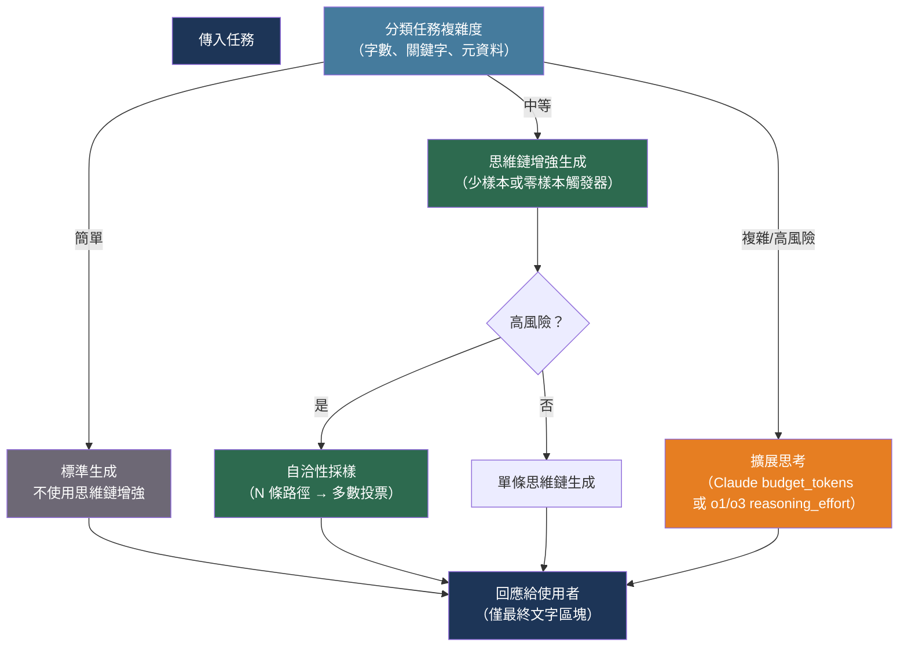

# [BEE-30023] 思維鏈與擴展思考模式

:::info
思維鏈提示與擴展思考模型都以推理成本換取推理品質——關鍵的工程決策在於知道何時這個交換是值得的、如何呼叫各種方法，以及如何根據任務複雜度在它們之間路由。
:::

## 背景

LLM 是自回歸的：它們一次預測一個 Token，每個 Token 只以之前的內容為條件。這意味著要求模型直接生成答案，會將所有推理壓縮到單一生成步驟中，沒有中間錯誤修正的機會。Wei 等人（arXiv:2201.11903，NeurIPS 2022）表明，提供解題範例——示範中間推理步驟出現在最終答案之前——在多步驟算術和常識推理基準上顯著提高準確性。Kojima 等人（arXiv:2205.11916，NeurIPS 2022）表明，無需範例也能達到相同效果：在使用者問題後附加「讓我們一步步思考」，使模型在答案前生成推理軌跡，在某些基準上將零樣本性能提高多達 40 個百分點。

其機制是資訊性的。推理 Token 成為下一個預測的提示的一部分：模型寫下的每個步驟都會為後續步驟的生成建立條件，有效地給予模型超越原始提示的工作記憶。Wang 等人（arXiv:2203.11171，ICLR 2023）以自洽性擴展了這一點：在溫度 > 0 的情況下多次採樣相同的推理增強提示，然後取最頻繁的最終答案。這種對推理路徑的邊際化始終優於單樣本思維鏈。

下一代推理模型將這個過程內部化。OpenAI 的 o1/o3 系列和 Anthropic 的擴展思考模式在產生回應之前在內部運行思維鏈推理，在推理時花費額外的運算，而不是需要提示工程。Snell 等人（arXiv:2408.03314，2024）表明，這種測試時運算擴展比簡單使用更大的模型更有效率：具有 4 倍更多測試時運算的較小模型可以在推理基準上超越 14 倍更大的模型。DeepSeek-R1（arXiv:2501.12948，2025）表明，純粹基於結果獎勵的強化學習會使模型自發地發展出自我反思、驗證和回溯行為——無需訓練中任何標記的推理軌跡。

## 設計思維

有兩種截然不同的機制，它們不可互換：

**基於提示的思維鏈**通過向提示添加推理指令或範例，在任何模型上工作。添加成本低，會線性增加輸出 Token 數（以及成本和延遲），推理是可見且可控的。思考過程出現在使用者看到的輸出中。

**模型原生擴展思考**（o1/o3、Claude 擴展思考）在生成最終回應之前運行內部推理階段。推理與可見輸出分離，每個 Token 通常成本更高，但產生質上不同的推理——模型可以以線性思維鏈無法實現的方式回溯、重訪和驗證。這就是測試時運算擴展。

這些模式之間的路由決策（以及思考密集型和標準生成之間）應在任務層面做出，而非在查詢層面。大多數生產系統使用分層路由層效果更好，該層對傳入任務進行分類並選擇適當的推理模式。

## 最佳實踐

### 對標準模型使用基於提示的思維鏈

**SHOULD**（應該）為始終需要多步驟推理的任務，在系統提示中添加少樣本思維鏈範例。對於結構化領域，具體範例優於僅有指令的方式（「逐步推理」）：

```python
MATH_SYSTEM_PROMPT = """You are a math tutor. When solving problems, always show
your reasoning before stating the answer.

Example:
User: A store sells 3 apples for $1.50. How much do 7 apples cost?
Assistant: Each apple costs $1.50 / 3 = $0.50. Seven apples cost 7 × $0.50 = $3.50.
The answer is $3.50.

Always follow this format: work through the problem step by step, then state the final answer."""
```

**SHOULD** 當少樣本範例不實際時（動態任務、多樣領域），在使用者訊息後附加零樣本思維鏈觸發器。「讓我們一步步思考」和「仔細思考這個問題」是最可靠有效的觸發器：

```python
def add_cot_trigger(user_message: str, task_type: str) -> str:
    triggers = {
        "math": "Let's think step by step.",
        "code_review": "Let's analyze this carefully, checking each part.",
        "planning": "Let's break this down into steps.",
        "default": "Let's think through this step by step.",
    }
    return f"{user_message}\n\n{triggers.get(task_type, triggers['default'])}"
```

**MUST NOT**（不得）在推理之前要求最終答案。「答案是什麼？展示您的工作」會使模型先承諾一個答案然後合理化它——這與有用的推理恰恰相反。先要推理，最後要答案。

**SHOULD** 對準確性比延遲更重要的高風險決策使用自洽性採樣。採樣 3-5 條推理路徑並取多數答案：

```python
import asyncio
from collections import Counter
from openai import AsyncOpenAI

client = AsyncOpenAI()

async def self_consistent_answer(prompt: str, n: int = 5) -> str:
    """採樣 n 條推理路徑並返回最常見的最終答案。"""
    tasks = [
        client.chat.completions.create(
            model="gpt-4o",
            messages=[{"role": "user", "content": prompt}],
            temperature=0.7,  # 多樣性需要非零溫度
        )
        for _ in range(n)
    ]
    responses = await asyncio.gather(*tasks)
    # 從每個回應中提取最終答案（特定於應用的解析）
    answers = [extract_final_answer(r.choices[0].message.content) for r in responses]
    return Counter(answers).most_common(1)[0][0]
```

### 對複雜高風險任務使用擴展思考

**SHOULD** 當任務涉及無法在單一線性步驟中可靠完成的多步驟推理時，路由到 Claude 的擴展思考模式——複雜的程式碼分析、多步驟規劃、數學證明或後果重大的決策：

```python
import anthropic

client = anthropic.Anthropic()

def solve_with_extended_thinking(problem: str, budget_tokens: int = 10_000) -> dict:
    """
    返回 {"thinking": str, "answer": str, "thinking_tokens": int}。
    budget_tokens：最小 1,024；典型範圍 2,000-30,000。
    """
    response = client.messages.create(
        model="claude-sonnet-4-6",
        max_tokens=16_000,
        thinking={"type": "enabled", "budget_tokens": budget_tokens},
        messages=[{"role": "user", "content": problem}],
    )

    thinking_text = ""
    answer_text = ""
    for block in response.content:
        if block.type == "thinking":
            thinking_text = block.thinking
        elif block.type == "text":
            answer_text = block.text

    return {
        "thinking": thinking_text,
        "answer": answer_text,
        "thinking_tokens": response.usage.cache_read_input_tokens,
        "input_tokens": response.usage.input_tokens,
        "output_tokens": response.usage.output_tokens,
    }
```

對於 Claude Sonnet 4.6 和 Opus 4.6，優先使用自動校準推理深度的自適應思考：

```python
response = client.messages.create(
    model="claude-sonnet-4-6",
    max_tokens=16_000,
    thinking={"type": "adaptive", "effort": "medium"},  # 最難任務用 "high"
    messages=[{"role": "user", "content": problem}],
)
```

**SHOULD** 在 OpenAI o1/o3 的強項領域（數學推理、程式碼生成、形式驗證）使用它們，並根據工作負載可接受的成本品質權衡設置 `reasoning_effort`：

```python
from openai import OpenAI

client = OpenAI()

def solve_with_o1(problem: str, effort: str = "medium") -> str:
    """
    effort: "low"（較快、較便宜）、"medium"（預設）、"high"（最高品質）
    o1/o3 在內部執行思維鏈——不要添加思維鏈提示。
    """
    response = client.chat.completions.create(
        model="o3",
        messages=[
            # 注意：o1-2024-12-17+ 使用 developer 角色，而非 system
            {"role": "developer", "content": "You are an expert software engineer."},
            {"role": "user", "content": problem},
        ],
        reasoning_effort=effort,
    )
    return response.choices[0].message.content
```

**MUST NOT** 呼叫 o1/o3 模型時添加「讓我們一步步思考」或其他思維鏈觸發短語。這些模型獨立於此類提示運行內部推理；添加它們可能使模型困惑或降低性能。

**MUST NOT** 嘗試引出或顯示 o1/o3 的內部推理鏈。OpenAI 不通過 API 暴露推理 Token，嘗試重建或「越獄」推理鏈違反其使用政策。

### 實作任務複雜度路由器

**SHOULD** 建立一個基於任務信號選擇推理模式的輕量級路由層，而非始終使用最昂貴的模型：

```python
from enum import Enum

class InferenceMode(Enum):
    STANDARD = "standard"           # gpt-4o、claude-sonnet-4-6（無擴展思考）
    COT_AUGMENTED = "cot"           # 標準模型 + 思維鏈提示
    EXTENDED_THINKING = "extended"  # Claude 擴展思考 / o1/o3

TASK_SIGNALS = {
    # 提示推理密集型任務的關鍵字
    "hard": ["prove", "derive", "verify", "optimize", "analyze the complexity",
             "debug", "step by step", "multi-step"],
    "medium": ["explain", "compare", "evaluate", "design", "review"],
}

def classify_task(user_message: str, task_metadata: dict | None = None) -> InferenceMode:
    msg_lower = user_message.lower()
    word_count = len(user_message.split())

    # 顯式元資料覆蓋啟發式規則
    if task_metadata:
        if task_metadata.get("requires_proof") or task_metadata.get("high_stakes"):
            return InferenceMode.EXTENDED_THINKING

    # 啟發式分類
    hard_signals = sum(1 for kw in TASK_SIGNALS["hard"] if kw in msg_lower)
    if hard_signals >= 2 or word_count > 300:
        return InferenceMode.EXTENDED_THINKING

    medium_signals = sum(1 for kw in TASK_SIGNALS["medium"] if kw in msg_lower)
    if medium_signals >= 1 or word_count > 100:
        return InferenceMode.COT_AUGMENTED

    return InferenceMode.STANDARD


async def route_and_generate(user_message: str, task_metadata: dict | None = None) -> str:
    mode = classify_task(user_message, task_metadata)

    if mode == InferenceMode.EXTENDED_THINKING:
        result = solve_with_extended_thinking(user_message, budget_tokens=10_000)
        return result["answer"]
    elif mode == InferenceMode.COT_AUGMENTED:
        augmented = add_cot_trigger(user_message, "default")
        # 使用思維鏈增強提示呼叫標準模型
        return await standard_generate(augmented)
    else:
        return await standard_generate(user_message)
```

### 按任務難度按比例分配預算 Token

**SHOULD** 根據估計的任務難度擴展 `budget_tokens`，而非使用固定值。預算太小會強制模型截斷推理；預算太大會在簡單任務上浪費 Token：

| 任務類型 | 建議的 budget_tokens |
|---------|---------------------|
| 一個推理步驟的簡單事實 | 1,024-2,000 |
| 多步驟數學或邏輯（3-5 步） | 2,000-5,000 |
| 複雜程式碼分析或規劃 | 5,000-15,000 |
| 形式推理、證明、困難研究 | 15,000-30,000 |

**SHOULD NOT**（不應）預設向終端使用者展示原始思考 Token。思考內容是冗長的內部推理，對大多數使用者來說是困惑而非reassuring。將其記錄用於偵錯和品質分析，但只向使用者呈現最終的 `text` 區塊。在建立 AI 輔助偵錯介面時，將思考作為開發者工具暴露。

## 視覺圖



## 何時不使用擴展思考

擴展思考並非總是正確的選擇。在以下情況下避免使用：

- **延遲是主要限制。** 擴展思考在第一個可見 Token 之前增加了推理階段，使 TTFT（首 Token 時間）增加數秒或更多。實時對話功能無法吸收這一點。
- **任務主要是檢索或分類。** 事實查找、情感分類和簡單摘要不受益於擴展推理；模型要麼知道答案要麼不知道，更多思考不會改變這一點。
- **輸出格式簡單。** 如果答案是布林值、短標籤或數字，擴展思考會為瑣碎的結論產生冗長的推理。
- **預算不可用。** 推理 Token 作為輸出 Token 計費，對於困難任務可能顯著超過最終答案的 Token 數。

## 相關 BEE

- [BEE-30001](llm-api-integration-patterns.md) -- LLM API 整合模式：標準模型呼叫的重試、超時和串流模式同樣適用於擴展思考呼叫；擴展思考更高的延遲使超時配置更為重要
- [BEE-30005](prompt-engineering-vs-rag-vs-fine-tuning.md) -- 提示工程 vs RAG vs 微調：思維鏈提示是一種提示工程技術，與 RAG 和微調並列於能力階梯中
- [BEE-30010](llm-context-window-management.md) -- LLM 上下文視窗管理：擴展思考輸出消耗上下文視窗；前幾輪對話中的思考區塊在多輪對話中必須謹慎處理
- [BEE-30011](ai-cost-optimization-and-model-routing.md) -- AI 成本優化與模型路由：擴展思考模型每次呼叫成本更高；此處描述的任務複雜度路由器是一個成本優化層

## 參考資料

- [Wei et al. 思維鏈提示在大型語言模型中激發推理 — arXiv:2201.11903, NeurIPS 2022](https://arxiv.org/abs/2201.11903)
- [Kojima et al. 大型語言模型是零樣本推理器 — arXiv:2205.11916, NeurIPS 2022](https://arxiv.org/abs/2205.11916)
- [Wang et al. 自洽性改善思維鏈推理 — arXiv:2203.11171, ICLR 2023](https://arxiv.org/abs/2203.11171)
- [Yao et al. 思維樹：用大型語言模型進行深思熟慮的問題解決 — arXiv:2305.10601, NeurIPS 2023](https://arxiv.org/abs/2305.10601)
- [Snell et al. 最優擴展 LLM 測試時運算 — arXiv:2408.03314, 2024](https://arxiv.org/abs/2408.03314)
- [DeepSeek Team. DeepSeek-R1：通過強化學習激勵推理 — arXiv:2501.12948, 2025](https://arxiv.org/abs/2501.12948)
- [Anthropic. 擴展思考 — platform.claude.com](https://platform.claude.com/docs/en/build-with-claude/extended-thinking)
- [OpenAI. 推理模型（o1/o3）— platform.openai.com](https://platform.openai.com/docs/guides/reasoning)
