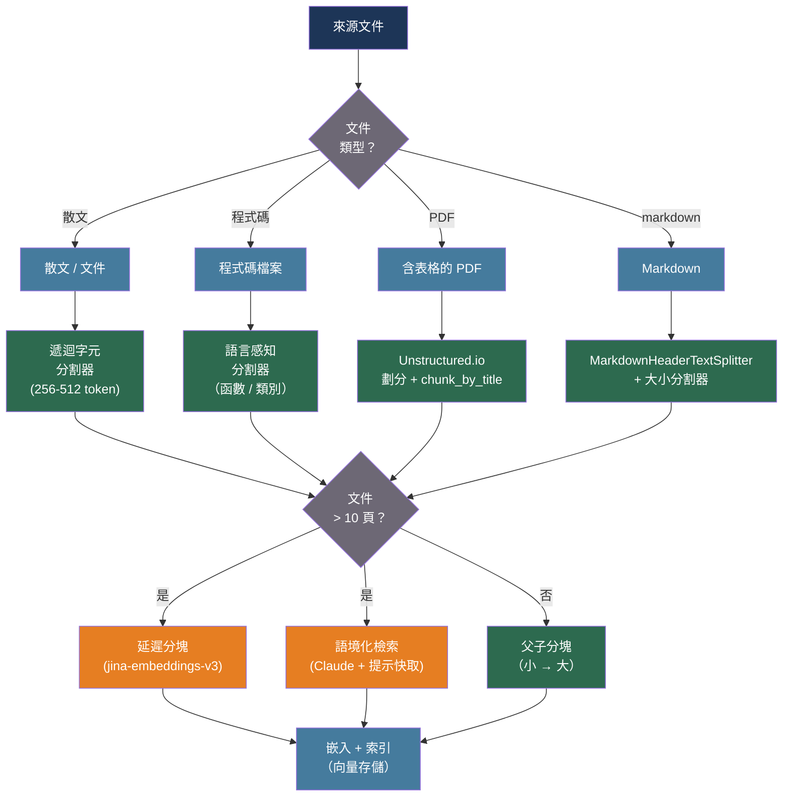

# [BEE-559] RAG 系統的分塊策略

:::info
文件如何被切割成文字塊，是 RAG 檢索品質中最大的可控變數：太小則文字塊失去上下文；太大則相關性分數被無關內容稀釋。根據文件類型和查詢模式調整文字塊大小及邊界策略 — 而非使用固定大小 — 無需更換嵌入模型或檢索演算法即可產生可量化的改善。
:::

## 背景脈絡

檢索增強生成系統（BEE-509）將文件片段索引為嵌入向量，並在查詢時檢索最相似的片段。檢索的基本單位就是文字塊。文字塊太小會檢索到精確的段落，但會失去生成準確回應所需的周邊上下文；文字塊太大則會用不相關的內容稀釋查詢相關訊號，降低檢索召回率。

Kamradt（2023 年，「文字分割的 5 個等級」）建立了一個廣泛採用的分塊複雜度分類法，從簡單的字元分割到 LLM 驅動的代理式分割。該分類法後來通過實證基準工作得到正式化和擴展。Bhat、Rudat、Spiekermann 和 Flores-Herr（弗勞恩霍夫 IAIS，arXiv:2505.21700）在四個數據集上以八種大小（64 到 2,048 個 token）測量了文字塊大小的影響，發現沒有普遍最優解：基於事實的查詢（SQuAD）在 64-128 個 token 時召回率達到峰值 64.1%，而技術性長答案任務（TechQA）從 64 個 token 的 4.8% 召回率單調增長到 1,024 個 token 的 71.5%。嵌入模型也會影響最優值 — 解碼器型模型偏好較大的文字塊；編碼器型模型偏好較小的文字塊。

一個常見假設是語意分塊 — 在嵌入相似度斷點而非固定 token 數量處分割 — 可靠地優於固定大小分割。Qu、Tu 和 Bao（Vectara，arXiv:2410.13070，NAACL Findings 2025）在十個真實世界檢索基準上測試了這一假設，發現固定大小分塊在真實文件上的表現與語意分塊相當甚至更好；語意分塊只在人工構建的基準（將異質主題拼接而成）上勝出。語意分塊的計算成本（為斷點檢測嵌入每個句子）很少是值得的。

文字塊邊界處的上下文丟失是更深層的架構問題。當文字塊孤立嵌入時，由周邊文字解析的代詞和實體引用會產生誤導性向量。Günther、Mohr、Williams、Wang 和 Han Xiao（Jina AI，arXiv:2409.04701，2024）引入了「延遲分塊」：將完整文件通過轉換器計算整個文件的 token 級注意力，然後對每個文字塊邊界應用平均池化 — 因此每個文字塊的嵌入攜帶了完整文件上下文。Anthropic 的語境化檢索（2024 年）在文字層面解決了同樣的問題：在嵌入前，Claude 生成一個 50-100 個 token 的摘要，將每個文字塊置於其來源文件的上下文中，並預附到文字塊文字之前。

## 最佳實踐

### 預設使用遞迴字元分割，而非固定大小分割

**不得**（MUST NOT）使用固定字元數分割作為預設值。固定分割忽略句子和段落邊界，產生在句子中間開始或結束的文字塊。遞迴字元文字分割器按優先順序嘗試自然分隔符 — `"\n\n"`（段落）、`"\n"`（行）、`" "`（詞）、`""`（字元） — 並遞迴直到文字塊落在目標大小範圍內：

```python
from langchain_text_splitters import RecursiveCharacterTextSplitter

# 適用於一般散文的良好起始點
splitter = RecursiveCharacterTextSplitter(
    chunk_size=512,          # token 數（近似 — 此處以字元為基礎）
    chunk_overlap=50,        # 以 token 計的重疊，保留跨邊界上下文
    length_function=len,
    separators=["\n\n", "\n", " ", ""],
)

chunks = splitter.split_text(document_text)
```

**按內容類型的文字塊大小起始點**（來自弗勞恩霍夫 IAIS arXiv:2505.21700 和 Unstructured.io 建議）：

| 內容類型 | 建議大小 | 理由 |
|---|---|---|
| 短事實問答（FAQ、支援） | 64-128 token | 緊密的檢索精度；單一事實答案 |
| 一般散文 / 文件 | 256-512 token | 均衡；涵蓋單一想法 |
| 技術 / 長答案查詢 | 512-1,024 token | 需要上下文；事實是較大解釋的一部分 |
| 含表格的財務報告 | 1,024 token 或頁面級別 | 表格必須與其標題保持在一起 |
| 程式碼檔案 | 函數 / 類別邊界 | 語意單元；永遠不要在函數中間分割 |

**重疊：** 使用文字塊大小的 10-20%。對於 512 個 token 的文字塊，50-100 個 token 的重疊（Weaviate 建議）可在不複製大部分內容的情況下保留跨邊界上下文。較大的重疊增加儲存成本而不產生相應的檢索增益。

### 根據文件結構選擇文字塊邊界

**必須**（MUST）對具有明確結構的內容使用文件感知分割。通用分割器會破壞表格行、函數中間的程式碼和跨節引用：

```python
from langchain_text_splitters import MarkdownHeaderTextSplitter

# 對於 Markdown 文件：先按標題分割
headers_to_split_on = [
    ("#", "h1"),
    ("##", "h2"),
    ("###", "h3"),
]
header_splitter = MarkdownHeaderTextSplitter(headers_to_split_on=headers_to_split_on)
header_chunks = header_splitter.split_text(markdown_text)

# 然後在每個部分內應用基於大小的分割
size_splitter = RecursiveCharacterTextSplitter(chunk_size=512, chunk_overlap=50)
final_chunks = size_splitter.split_documents(header_chunks)
# 每個文字塊繼承 {"h1": "...", "h2": "..."} 元數據以供過濾
```

```python
from langchain_text_splitters import PythonCodeTextSplitter

# 對於 Python 原始碼：在 def/class/模組層級分割
code_splitter = PythonCodeTextSplitter(chunk_size=1024, chunk_overlap=0)
code_chunks = code_splitter.split_text(python_source)
```

**對於含表格和圖形的 PDF：** 在分塊前使用版面感知工具提取。通用的 PDF 轉文字提取將表格單元格合併成詞流，破壞數值關係。

```python
# Unstructured.io：先劃分為具有類型的元素
from unstructured.partition.pdf import partition_pdf
from unstructured.chunking.title import chunk_by_title

elements = partition_pdf(
    filename="report.pdf",
    strategy="hi_res",              # 對表格和圖形進行版面檢測
    infer_table_structure=True,     # 將表格提取為 HTML
)
chunks = chunk_by_title(
    elements,
    max_characters=1000,            # 每個文字塊的硬性大小限制
    new_after_n_chars=500,          # 軟性目標；在此之後的下一個邊界處分割
    combine_text_under_n_chars=100, # 將短片段合併到前一個文字塊
)
# 每個文字塊的 .metadata.section_hierarchy 保留標題路徑
```

### 使用父子分塊將檢索精度與生成上下文解耦

**應該**（SHOULD）儲存小的子文字塊用於檢索，並在內容長度差異很大時將較大的父文字塊返回給 LLM 用於生成。這解決了基本矛盾：小文字塊 = 精確相似性；大文字塊 = 有用的上下文：

```python
from llama_index.core import SimpleDirectoryReader, VectorStoreIndex
from llama_index.core.node_parser import HierarchicalNodeParser, get_leaf_nodes
from llama_index.core.retrievers import AutoMergingRetriever
from llama_index.core.storage.docstore import SimpleDocumentStore

# 建立三層次結構：2048 → 512 → 128 token
parser = HierarchicalNodeParser.from_defaults(chunk_sizes=[2048, 512, 128])
nodes = parser.get_nodes_from_documents(documents)

leaf_nodes = get_leaf_nodes(nodes)  # 128 token 節點 — 索引用於檢索

docstore = SimpleDocumentStore()
docstore.add_documents(nodes)       # 所有層次存儲用於合併

# 僅在葉節點上建立向量索引
index = VectorStoreIndex(leaf_nodes)
base_retriever = index.as_retriever(similarity_top_k=6)

# AutoMergingRetriever：如果來自同一父節點的大多數兄弟節點被檢索，
# 則返回父節點（更豐富的上下文，更少的碎片）
retriever = AutoMergingRetriever(
    base_retriever,
    storage_context=index.storage_context,
    verbose=False,
)
```

**應該**（SHOULD）在檢索單個句子時也考慮句子視窗方法：以句子粒度嵌入和檢索，然後擴展到 ±2 句視窗用於生成。LlamaIndex 的 `SentenceWindowNodeParser` + `MetadataReplacementPostProcessor` 實現了此模式。

### 為長文件保留跨文字塊上下文

**應該**（SHOULD）對超過幾頁的文件應用延遲分塊或語境化檢索，其中文字塊邊界的上下文丟失明顯降低了檢索品質。

**延遲分塊**（需要長上下文嵌入模型，例如 `jina-embeddings-v3`）：

```python
# 延遲分塊工作流程：
# 1. 將整個文件通過嵌入模型
# 2. 收集 token 級輸出嵌入（池化前）
# 3. 僅對屬於每個所需文字塊範圍的 token 進行平均池化
# 注意力機制已「看過」整個文件，
# 因此每個文字塊的嵌入攜帶了完整文件上下文。

# jina-embeddings-v3 原生支援延遲分塊：
import requests

# 文字塊邊界偏移（token 開始，token 結束）— 預先計算
spans = [(0, 128), (100, 256), (230, 384)]   # 如果需要可以帶重疊

response = requests.post(
    "https://api.jina.ai/v1/embeddings",
    headers={"Authorization": "Bearer <JINA_API_KEY>"},
    json={
        "model": "jina-embeddings-v3",
        "input": [document_text],
        "late_chunking": True,          # 啟用延遲分塊模式
    },
)
# 返回模型分塊器定義的每個 token 範圍的一個嵌入
```

**語境化檢索**（Anthropic，適用於任何嵌入模型）：

```python
import anthropic

CONTEXT_PROMPT = """\
<document>
{document}
</document>
<chunk>
{chunk}
</chunk>
Please give a short succinct context (2-3 sentences) to situate this chunk \
within the overall document for improved search retrieval. Answer only with the context."""

async def add_chunk_context(
    document: str,
    chunk: str,
    client: anthropic.AsyncAnthropic,
) -> str:
    """
    在嵌入前為每個文字塊預附文件級上下文。
    使用 Claude 3 Haiku（廉價/快速）+ 提示快取，使
    文件每個文件處理一次，而非每個文字塊一次。
    費用：使用快取時每百萬文件 token 約 $1.02。
    """
    response = await client.messages.create(
        model="claude-haiku-4-5-20251001",
        max_tokens=150,
        system=[{
            "type": "text",
            "text": "You are a helpful assistant that generates retrieval context.",
            "cache_control": {"type": "ephemeral"},  # 快取系統提示
        }],
        messages=[{
            "role": "user",
            "content": [
                {
                    "type": "text",
                    "text": document,
                    "cache_control": {"type": "ephemeral"},  # 快取文件正文
                },
                {
                    "type": "text",
                    "text": CONTEXT_PROMPT.format(document="", chunk=chunk),
                }
            ],
        }],
    )
    context = response.content[0].text
    return f"{context}\n\n{chunk}"
```

Anthropic 的基準顯示，語境化檢索將前 20 個文字塊的檢索失敗率從 5.7% 降至 3.7%（僅嵌入），2.9%（嵌入 + BM25），加上重排序後降至 1.9% — 端到端降低 67%。

## 視覺化



## 常見錯誤

**對所有文件使用固定的 512 個 token 文字塊。** 弗勞恩霍夫 IAIS（arXiv:2505.21700）測量到 512 個 token 對短事實檢索（64-128 更好）和長技術內容（1,024 更好）都是次優的。在選擇預設值前，先對您的內容類型進行基準測試。

**假設語意分塊總是優於固定大小分割。** Vectara NAACL 2025 論文（arXiv:2410.13070）發現，在真實文件上，固定大小分塊在大多數基準上與語意分塊相當。語意分塊增加了顯著的斷點檢測 CPU/記憶體成本，只有當來源文件混合了高度異質的主題且沒有結構標記時才有益。

**不保留文字塊元數據。** 節標題、頁碼、文件標題和來源 URL 應作為可過濾元數據儲存在每個文字塊向量旁邊。沒有元數據過濾的檢索會從錯誤的文件、錯誤的版本或錯誤的租戶返回結果。

**在表格行中間分割。** 將表格視為純文字的遞迴字元分割器會在行內的空格處分割，破壞數值關係。始終在基於大小的分割前將表格提取為結構化文字（HTML 或 Markdown）。

**忽略文字塊重疊。** 零重疊分塊在每個邊界靜默地丟棄上下文。跨越兩個相鄰文字塊的想法變得無法檢索 — 兩個文字塊都不包含完整的思想。使用至少 10-20% 的重疊作為最小值。

**使用相同的文字塊大小用於索引和上下文視窗預算。** 文字塊大小決定檢索精度；檢索的文字塊數量乘以文字塊大小決定消耗多少上下文視窗。根據檢索品質設置文字塊大小，然後計算有多少文字塊適合模型的上下文預算，而不是從上下文大小反推。

## 相關 BEE

- [BEE-30007](rag-pipeline-architecture.md) -- RAG 管道架構：分塊為其提供輸入的整體檢索管道
- [BEE-30015](retrieval-reranking-and-hybrid-search.md) -- 檢索重排序與混合搜尋：分塊後結合向量和 BM25 檢索
- [BEE-30029](advanced-rag-and-agentic-retrieval-patterns.md) -- 進階 RAG 與代理檢索模式：依賴文字塊品質的多跳檢索
- [BEE-30051](llm-tokenization-internals-and-token-budget-management.md) -- LLM 分詞內部機制與 Token 預算管理：token 計數的文字塊大小需要分詞器精確計算

## 參考資料

- [Bhat 等人 重新思考長文件檢索的文字塊大小 — arXiv:2505.21700，弗勞恩霍夫 IAIS 2025](https://arxiv.org/html/2505.21700v2)
- [Qu、Tu 和 Bao. 語意分塊的計算成本值得嗎？— arXiv:2410.13070，NAACL Findings 2025](https://aclanthology.org/2025.findings-naacl.114/)
- [Günther 等人 延遲分塊：使用長上下文嵌入模型的語境化文字塊嵌入 — arXiv:2409.04701，Jina AI 2024](https://arxiv.org/abs/2409.04701)
- [Anthropic. 語境化檢索 — anthropic.com，2024](https://www.anthropic.com/news/contextual-retrieval)
- [Kamradt. 文字分割的 5 個等級 — github.com/FullStackRetrieval-com，2023](https://github.com/FullStackRetrieval-com/RetrievalTutorials/blob/main/tutorials/LevelsOfTextSplitting/5_Levels_Of_Text_Splitting.ipynb)
- [LlamaIndex. 優化：基本策略 — developers.llamaindex.ai](https://developers.llamaindex.ai/python/framework/optimizing/basic_strategies/basic_strategies/)
- [Unstructured.io. RAG 分塊：最佳實踐 — unstructured.io](https://unstructured.io/blog/chunking-for-rag-best-practices)
