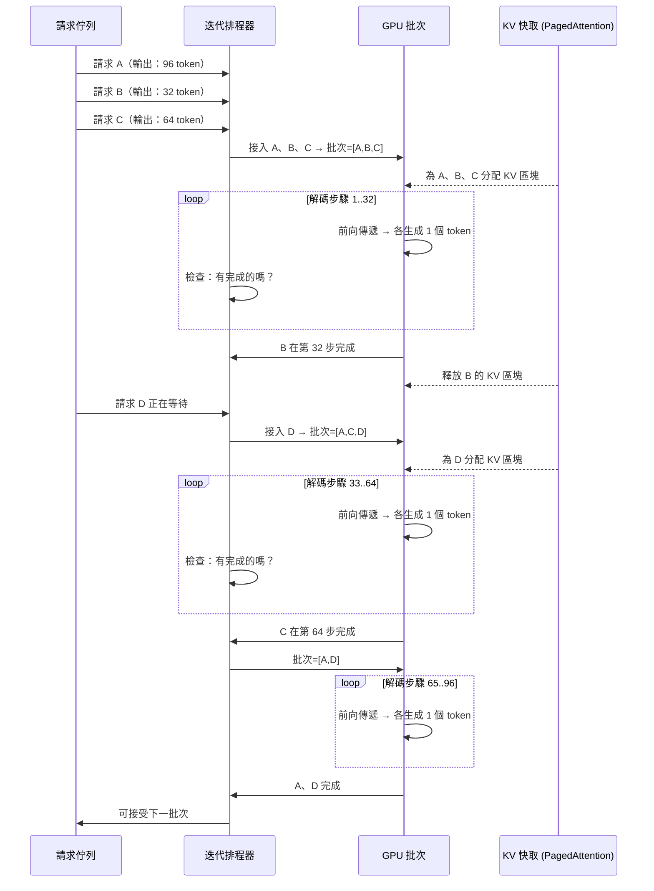

# [BEE-567] 連續批次處理與迭代層級排程

:::info
連續批次處理（Continuous Batching）以單次解碼迭代為粒度來排程 LLM 推論，而非以完整請求為粒度。當一個序列完成後，其槽位立即重新分配給下一個等待中的請求——消除了靜態批次處理造成的 GPU 閒置問題，在相同延遲下可將吞吐量提升 2–36 倍。
:::

## 背景

在密集 Transformer 的前向傳遞中，批次中的所有序列共享同一個計算圖。靜態批次處理（Static Batching）要求批次中的每個序列都完成後，才能讓新的請求進入——系統必須等待執行時間最長的序列，才能釋放 GPU 資源。這造成兩個複合問題。

第一是**隊首阻塞（Head-of-Line Blocking）**：一個需生成 2,048 個 token 的回應，會迫使另外 31 個較短的請求佔用其 GPU 記憶體槽位，白白浪費數千個解碼步驟。第二是**GPU 使用率低下**：在典型生產流量中，輸出長度服從 Zipf 分布，靜態批次處理會在 padding 和被阻塞的槽位上浪費 60–80% 的可用算力。

**Orca**（Yu 等人，USENIX OSDI 2022）提出了解決方案：**迭代層級排程（Iteration-Level Scheduling）**。Orca 不以請求作為排程的原子單位，而是以每個解碼步驟（生成一個 token）作為原子單位。每次迭代後，排程器可驅逐已完成的序列，並從等待佇列中接入新的請求。結果是批次持續循環：完成的請求離開、新請求進入，GPU 保持滿載狀態。Orca 報告在 GPT-3 175B 上，以等效延遲與 NVIDIA FasterTransformer 相比，吞吐量提升了 36.9 倍。

**vLLM**（Kwon 等人，ACM SOSP 2023）將連續批次處理與 **PagedAttention** 結合——一種以虛擬記憶體分頁為靈感的 KV 快取分配器。靜態 KV 快取分配因記憶體碎片化而浪費 60–80% 的 GPU 記憶體，因為每個請求都預先分配了其最大可能的上下文空間。PagedAttention 將每個序列的 KV 快取切分為固定大小的區塊，儲存於非連續記憶體中，消除了外部碎片，並在序列完成時實現精細的記憶體回收。vLLM 相比 HuggingFace Transformers 達到 24 倍吞吐量提升，相比 HuggingFace TGI 達到 3.5 倍提升。

## 連續批次處理的運作方式

靜態批次處理需等待整個批次完成才能換入新請求：

```
靜態（請求層級）：
步驟  1：[A_t1] [B_t1] [C_t1]
步驟  2：[A_t2] [B_t2] [C_t2]
...
步驟 64：[A_t64] [----] [C_t64]   ← B 在第 32 步完成；槽位閒置 32 步
步驟 96：[A_t96] [----] [C_t96]   ← A 在第 80 步完成；槽位閒置 16 步
          ↓
         新批次開始（D、E、F 進入）
```

連續批次處理在每個解碼步驟後即回收槽位：

```
連續（迭代層級）：
步驟  1：[A_t1] [B_t1] [C_t1]
步驟  2：[A_t2] [B_t2] [C_t2]
...
步驟 32：[A_t32] [B_t32:完成] [C_t32]
步驟 33：[A_t33] [D_t1:新加入] [C_t33]  ← D 立即進入
步驟 64：[A_t64] [D_t32]    [C_t64:完成]
步驟 65：[A_t65] [D_t33]    [E_t1:新加入] ← E 立即進入
```

排程器在一個緊密循環中運行：計算一個解碼步驟 → 檢查是否有序列完成 → 在批次 token 預算內接入新請求 → 重複。

## 分塊預填充（Chunked Prefill）

即使有連續批次處理，仍存在第二個問題：**預填充對解碼的飢餓現象**。對長提示（例如 32K token）進行預填充（Prefill）會在整個批次迭代期間阻塞所有解碼步驟，導致所有其他活躍序列的首個 Token 時間（TTFT，Time To First Token）出現尖峰。

**分塊預填充**將大型預填充操作拆分為受 token 預算（`max_num_batched_tokens`）限制的子塊，在各塊之間穿插來自其他活躍序列的解碼步驟：

```
不使用分塊預填充：
批次迭代 1：[長提示預填充：32K token]     ← 其他序列的解碼被阻塞
批次迭代 2：[D_t1] [E_t1] [F_t1]         ← 長提示進入解碼

使用分塊預填充（塊大小 = 512）：
批次迭代 1：[長提示第 1/64 塊] + [D_t3] [E_t3] [F_t3]
批次迭代 2：[長提示第 2/64 塊] + [D_t4] [E_t4] [F_t4]
...
批次迭代 65：[長提示最後一塊] + [D_t67] [E_t67] [F_t67]
```

這以適度增加 p50 TTFT（長提示整體耗時更長）為代價，換取 p95 TTFT 的大幅改善。在 50 個並發用戶且輸入為 32K token 的場景下，分塊預填充將 p95 TTFT 從約 2,800ms 降至約 890ms，尾延遲改善 68%。

在 vLLM v1.x 中，分塊預填充預設啟用。在舊版本中：

```bash
# vLLM v0.x：顯式啟用分塊預填充
vllm serve meta-llama/Llama-3.1-8B-Instruct \
  --enable-chunked-prefill \
  --max-num-batched-tokens 512   # 越小 → TTFT 方差越低，但開銷越高
```

## 最佳實踐

### 根據延遲目標調整 `max_num_batched_tokens`

**SHOULD**（應該）將 `max_num_batched_tokens` 視為平衡 TTFT 與 Token 間延遲（ITL，Inter-Token Latency）的主要旋鈕：

```python
from vllm import LLM, SamplingParams

# 吞吐量優化：較大批次，較高 ITL
llm_throughput = LLM(
    model="meta-llama/Llama-3.1-70B-Instruct",
    max_num_batched_tokens=8192,   # 每步驟較大的 token 預算
    max_num_seqs=256,              # 更多並發序列
    enable_chunked_prefill=True,
)

# 延遲優化：較小批次，較低 ITL
llm_latency = LLM(
    model="meta-llama/Llama-3.1-70B-Instruct",
    max_num_batched_tokens=2048,   # 較小的 token 預算
    max_num_seqs=64,
    enable_chunked_prefill=True,
)
```

較大的 `max_num_batched_tokens` 允許每步驟處理更多預填充 token（更高吞吐量），但會增加活躍序列的解碼步驟間隔時間（更高 ITL）。互動式對話目標 ITL < 100ms；批次任務目標吞吐量最大化。

### 對有嚴格延遲 SLO 的場景，將預填充與解碼分離到不同副本

**SHOULD**（應該）在 TTFT 與 ITL 要求相互衝突時使用預填充-解碼分離架構。在分離部署中，**預填充實例**僅處理提示 token 並將 KV 快取傳輸給**解碼實例**；解碼實例負責所有自回歸生成。預填充實例可使用針對算力吞吐量優化的大批次；解碼實例使用小批次以達到低 ITL：

```bash
# 使用 vLLM（v0.7+）的分離式服務
# 預填充實例：最大化提示處理吞吐量
vllm serve meta-llama/Llama-3.1-70B-Instruct \
  --role prefill \
  --max-num-batched-tokens 65536 \
  --kv-transfer-config '{"kv_connector":"PyNcclConnector","kv_role":"kv_producer"}'

# 解碼實例：最小化 Token 間延遲
vllm serve meta-llama/Llama-3.1-70B-Instruct \
  --role decode \
  --max-num-seqs 128 \
  --kv-transfer-config '{"kv_connector":"PyNcclConnector","kv_role":"kv_consumer"}'
```

**SHOULD NOT**（不應該）在平均提示長度較短（< 512 token）時使用分離架構。對短提示而言，KV 快取傳輸開銷超過了收益。

### 監控排程器佇列深度與搶佔率

**MUST**（必須）對以下指標進行埋點，以檢測排程器瓶頸：

```python
from prometheus_client import Gauge, Counter

class BatchSchedulerMetrics:
    """
    為 Prometheus 抓取暴露連續批次處理健康狀態。
    掛接到服務框架的排程器循環中。
    """
    waiting_requests = Gauge(
        "llm_scheduler_waiting_requests",
        "排隊中、尚未被 GPU 接入的請求數",
    )
    running_sequences = Gauge(
        "llm_scheduler_running_seqs",
        "當前佔用 GPU 批次槽位的序列數",
    )
    preempted_sequences = Counter(
        "llm_scheduler_preemptions_total",
        "因 KV 快取耗盡而被從 GPU 驅逐的序列數",
    )
    gpu_kv_cache_usage = Gauge(
        "llm_gpu_kv_cache_usage_fraction",
        "GPU KV 快取區塊的使用比例",
    )
    tokens_per_second = Gauge(
        "llm_throughput_tokens_per_second",
        "所有序列每秒生成的 token 總數",
    )

# 告警閾值：
# waiting_requests > 50 → 排程器積壓；需增加副本
# preempted_sequences 速率 > 1/分鐘 → KV 快取壓力；減少 max_num_seqs
# gpu_kv_cache_usage > 0.95 → 接近 OOM；減少 max_model_len 或增加 GPU 記憶體
```

**搶佔（Preemption）**發生在解碼中途 KV 快取耗盡時：排程器必須驅逐某個序列（將其 KV 快取儲存到 CPU，或直接丟棄並重新計算）。搶佔代價高昂（需重新計算）或記憶體密集（交換到 CPU）。穩態下搶佔率超過每分鐘 1 次，表示系統已過載。

### 生產環境優先選用連續批次處理框架

**SHOULD**（應該）使用成熟的服務框架，而非裸 HuggingFace `model.generate()` 循環。吞吐量差距顯著：

| 框架 | 相對吞吐量 | 說明 |
|---|---|---|
| HuggingFace Transformers | 1×（基準） | 靜態批次，無 PagedAttention |
| HuggingFace TGI | ~7× | 連續批次，有限 PagedAttention 支援 |
| vLLM | ~24× | PagedAttention + 連續批次處理 |
| TensorRT-LLM | ~30–40× | In-flight 批次處理，H100 上支援 FP8 |
| SGLang | ~25–35× | RadixAttention + 零開銷排程器 |

## 示意圖



## 常見錯誤

**混淆 `max_num_seqs` 與 `max_num_batched_tokens`。** `max_num_seqs` 限制並發序列數量（記憶體約束）；`max_num_batched_tokens` 限制每次迭代處理的 token 總數（算力約束）。若 `max_num_seqs` 設置過高而 `max_num_batched_tokens` 過小，每個解碼步驟每個序列處理的 token 極少，開銷反而增大。`max_num_seqs × 平均每步解碼長度` 的乘積不應超過 `max_num_batched_tokens`。

**用 `model.generate(padding=True)` 替代連續批次處理。** 對批次中最長序列進行 padding 雖然看似批次處理，但會在 padding token 上浪費算力，且在整個批次完成前仍會阻塞新請求。這本質上是靜態批次處理。請使用具備真正連續批次排程器的服務框架。

**忽略搶佔指標。** 當 KV 快取滿載時，排程器會靜默地搶佔序列並從頭重新計算。這會使受影響請求的延遲翻倍（甚至更多），表現為神秘的高 p99 TTFT。必須始終監控搶佔計數器。

**未啟用分塊預填充就設置 `max_num_batched_tokens`。** 在不啟用分塊預填充的情況下，`max_num_batched_tokens` 必須超過 `max_model_len`，否則 vLLM 在啟動時會拒絕該配置。啟用分塊預填充後，`max_num_batched_tokens` 成為可調整的預算，可以小於 `max_model_len`。

**為延遲敏感型工作負載過度配置序列數。** 更高的並發數可提升吞吐量，但會增加 Token 間延遲，因為每次 GPU 前向傳遞需要服務更多序列。對於 p95 ITL 要求 < 100ms 的互動式對話場景，應限制 `max_num_seqs` 以保持在延遲預算內。在設定生產值之前，先進行負載測試評估。

## 相關 BEE

- [BEE-30021](llm-inference-optimization-and-self-hosting.md) -- LLM 推論優化與自主託管：更廣泛的推論優化概述，包含硬體選型
- [BEE-30063](prefix-caching-and-kv-cache-reuse.md) -- 前綴快取與 KV 快取複用：KV 快取區塊複用如何與連續批次排程器整合
- [BEE-30064](mixture-of-experts-architecture-and-serving.md) -- 混合專家架構與服務：MoE 專家分發通過 Expert Parallel 與批次排程互動
- [BEE-30058](llm-load-testing-and-capacity-planning.md) -- LLM 負載測試與容量規劃：在連續批次處理下測量 TTFT、ITL 與吞吐量

## 參考資料

- [Yu 等人. Orca: A Distributed Serving System for Transformer-Based Generative Models — USENIX OSDI 2022](https://www.usenix.org/system/files/osdi22-yu.pdf)
- [Kwon 等人. Efficient Memory Management for Large Language Model Serving with PagedAttention — ACM SOSP 2023](https://arxiv.org/abs/2309.06180)
- [vLLM. Engine Arguments — docs.vllm.ai](https://docs.vllm.ai/en/stable/configuration/engine_args/)
- [vLLM. Optimization — docs.vllm.ai](https://docs.vllm.ai/en/stable/configuration/optimization/)
- [NVIDIA TensorRT-LLM. Overview — nvidia.github.io](https://nvidia.github.io/TensorRT-LLM/overview.html)
- [Zheng 等人. SGLang: Efficient Execution of Structured Language Model Programs — arXiv:2312.07104](https://arxiv.org/abs/2312.07104)
