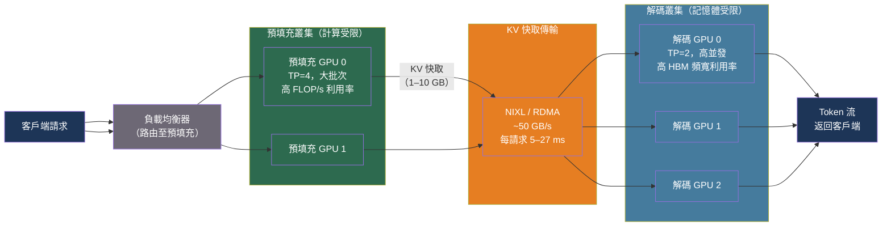

# [BEE-30067] LLM 服務的預填充與解碼分離

:::info
預填充（Prefill，處理輸入提示）與解碼（Decode，逐個生成輸出 token）具有截然相反的硬體使用特性——前者受計算能力限制，後者受記憶體頻寬限制。將兩者運行在同一 GPU 上迫使雙方各自妥協。分離式服務（Disaggregated Serving）將兩個階段部署在獨立的實例上，分別優化各自的效能，在吞吐量與尾延遲方面實現帕累托改進。
:::

## 背景

LLM 推論由兩個截然不同的階段組成。**預填充（Prefill）** 在單次前向傳遞中處理整個輸入提示，同時計算所有輸入 token 的鍵值（KV）張量。這是計算密集型操作：對長度為 L 的提示執行 O(L²) 的注意力運算，且能從大批次中受益，充分利用 GPU 的算術單元。

**解碼（Decode）** 則逐個生成輸出 token，每次都需要一次前向傳遞——對提示的完整 KV 快取以及已生成的所有 token 進行注意力計算。這是記憶體頻寬限制型操作：每個解碼步驟都必須從 HBM 讀取 KV 快取，而無論批次大小如何，每個 token 的有效計算量都很小。Roofline 分析顯示，在 H100 上批次大小低於約 32 時，解碼吞吐量完全受限於記憶體頻寬，而非計算能力。

在同一 GPU 上同時運行兩個階段會導致結構性相互干擾。一個大型預填充請求會阻塞其他序列的解碼步驟（隊首阻塞），使 TTFT 飆升。解碼密集型工作負載讓 GPU 長期處於記憶體頻寬受限的模式，剝奪了預填充所需的計算能力。分塊預填充（BEE-30065）能緩解最嚴重的 TTFT 尖峰，但無法消除根本性的資源爭用問題。

2023–2024 年的三篇論文正式確立了**預填充-解碼分離（P/D Disaggregation）**的理論基礎：

- **Splitwise**（Patel 等人，arXiv:2311.18677，Microsoft Research，2023）提出跨機器的階段切分，指出預填充更適合計算優化型硬體，解碼更適合記憶體頻寬優化型硬體，報告了 2–7 倍的吞吐量提升。
- **DistServe**（Zhong 等人，arXiv:2401.09670，北京大學/UCSD，2024）根據集群頻寬拓撲聯合優化每個階段的資源分配和平行化策略，在相同延遲約束下實現了 7.4 倍的請求服務能力和 12.6 倍更嚴格的 SLO 達成率。
- **Mooncake**（Qin 等人，arXiv:2407.00079，Moonshot AI，2024）將分離架構延伸為以 KV 快取為中心的設計，將 KV 狀態溢出至 GPU HBM、DRAM 和 NVMe 多個儲存層。在長上下文場景中相比同地部署基線實現了高達 525% 的吞吐量提升。

## 分離架構的運作方式

在分離式系統中，預填充和解碼作為獨立的服務叢集運行。請求進入預填充叢集，處理提示並生成完整的 KV 快取；KV 快取隨後通過網絡傳輸到解碼實例，後者使用傳輸的狀態繼續生成 token。

```
客戶端 → 負載均衡器
              ↓
        預填充叢集              解碼叢集
   [P0] [P1] [P2] ...    [D0] [D1] [D2] ...
         ↑                        ↑
    計算受限：               記憶體受限：
    大批次                   小批次
    TP=4 每實例              TP=2 每實例
         |                        |
         └─── KV 快取傳輸 ────────┘
              (RDMA / NCCL / NIXL)
```

**KV 快取傳輸機制**：預填充完成後，整個提示的 KV 張量（大小 ≈ 2 × 層數 × KV 頭數 × 頭維度 × 序列長度 × 資料型別位元組數）傳輸到解碼實例。以 BF16 精度的 Llama-3 70B 模型、4K token 提示為例：`2 × 80 × 8 × 128 × 4096 × 2 位元組 ≈ 1.34 GB`。通過 NDR InfiniBand 鏈路（400 Gb/s ≈ 50 GB/s），傳輸僅需約 27 ms——少於一個 30–50 ms 的解碼步驟。

常用傳輸協議：

| 協議 | 頻寬 | 延遲 | 使用場景 |
|---|---|---|---|
| NVLink（節點內） | 900 GB/s | ~1 ms | 同一物理節點 |
| RDMA / InfiniBand NDR | ~50 GB/s | ~5–15 ms | 跨節點集群 |
| RoCE（以太網 RDMA） | ~25–50 GB/s | ~10–20 ms | 以太網集群 |
| PCIe 5.0 | ~64 GB/s | ~15–30 ms | 低成本部署 |

NVIDIA 的 **NIXL**（推論傳輸庫）提供統一的傳輸 API，支持 RDMA、RoCE、NVMe-oF 和 S3，採用多路徑調度在 H20 GPU 集群上達到約 245 GB/s 的傳輸速率。

## 最佳實踐

### 僅對大型模型和長上下文啟用分離

**SHOULD**（應該）在模型超過約 70B 參數且平均輸入序列長度超過約 4K token 時才應用 P/D 分離。KV 傳輸成本是固定的；收益隨上下文長度和模型規模的增長而擴大。

| 模型規模 | ISL < 1K | ISL 4K–10K | ISL > 10K |
|---|---|---|---|
| < 20B | 建議同地部署 | 建議同地部署 | 分離勉強可行 |
| 70B | 建議同地部署 | 分離有收益 | 強烈建議分離 |
| > 120B | 視情況而定 | 分離有收益 | 強烈建議分離 |

**SHOULD NOT**（不應該）對小型模型（<20B）或短序列（ISL < 512，OSL < 200）採用分離架構。對小型 KV 快取而言，傳輸開銷超過計算節省。

### 對每個階段獨立調整平行化配置

**SHOULD**（應該）根據各階段不同的瓶頸，為預填充和解碼實例配置不同的張量平行和流水線平行度：

```bash
# 預填充實例：計算受限，較大 TP，較高批次大小
vllm serve meta-llama/Llama-3-70b-hf \
  --tensor-parallel-size 4 \
  --max-num-batched-tokens 65536 \
  --kv-transfer-config '{
    "kv_connector": "NixlConnector",
    "kv_role": "kv_producer"
  }'

# 解碼實例：記憶體受限，較小 TP，較低批次大小，更高並發
vllm serve meta-llama/Llama-3-70b-hf \
  --tensor-parallel-size 2 \
  --max-num-seqs 256 \
  --kv-transfer-config '{
    "kv_connector": "NixlConnector",
    "kv_role": "kv_consumer"
  }'
```

Llama-3 70B：預填充在 TP=4、批次大小 64+ 時達到飽和；解碼在 TP=2、最多 256 個並發序列時保持較低的 Token 間延遲。

### 根據預填充與解碼的計算比例調整叢集規模

**MUST**（必須）根據工作負載的計算比率來分配預填充和解碼的 GPU 數量，而非按 1:1 配置。對於典型工作負載（ISL 約 2K，OSL 約 500），解碼階段每個請求需要的 GPU 時間通常是預填充的 3–5 倍，因為解碼需要串行執行數百個步驟，而預填充是單次大型並行計算。

```python
def compute_fleet_ratio(
    avg_input_len: int,
    avg_output_len: int,
    prefill_flops_per_token: float,
    decode_flops_per_token: float,
) -> float:
    """
    估算所需解碼 GPU 數與預填充 GPU 數的比率。
    簡化計算：假設兩個階段的 GPU 吞吐量相同。
    """
    prefill_work = avg_input_len * prefill_flops_per_token
    decode_work = avg_output_len * decode_flops_per_token
    # 對典型 ISL/OSL 而言，decode_work >> prefill_work
    return decode_work / prefill_work

# 範例：ISL=2048，OSL=512
# 70B 模型 BF16 精度下的計算量
ratio = compute_fleet_ratio(
    avg_input_len=2048,
    avg_output_len=512,
    prefill_flops_per_token=2e12,   # H100 上約 50% MFU
    decode_flops_per_token=4e11,    # 小批次下每有效 token 約慢 5 倍
)
# ratio > 1.0 → 需要比預填充更多的解碼 GPU
```

實用起點：對 ISL=2K、OSL=500 的工作負載，初始配置 1 張預填充 GPU : 3 張解碼 GPU。通過實際流量分析後再精確校準。

### KV 傳輸使用 RDMA 或 NIXL，避免使用 TCP

**MUST**（必須）在生產環境的 P/D 分離中使用支持 RDMA 的傳輸協議。在 100 Gbps 以太網鏈路上，TCP 傳輸 1.34 GB KV 負載的有效速率約 10 GB/s，會增加約 134 ms 延遲——相當於 2–4 個解碼步驟。這完全抵消了分離架構的收益。RDMA 消除了 CPU 介入，充分利用物理鏈路頻寬：

```python
# vLLM NIXL 連接器配置（推薦用於生產環境）
kv_transfer_config = {
    "kv_connector": "NixlConnector",
    "kv_role": "kv_producer",        # 或 "kv_consumer"
    "kv_rank": 0,                    # 在 P/D 對中的排名
    "kv_parallel_size": 2,           # 組內 P+D 實例總數
    "kv_buffer_size": 1e9,           # 1 GB 傳輸緩衝區
}

# 備選方案：基於 NCCL 的 GPU 間傳輸（同集群，無需 RDMA 網絡）
kv_transfer_config_nccl = {
    "kv_connector": "P2pNcclConnector",
    "kv_role": "kv_consumer",
    "kv_rank": 1,
    "kv_parallel_size": 2,
}
```

### 監控包含傳輸時間的端到端 TTFT

**MUST**（必須）將 KV 傳輸延遲作為獨立的指標組件進行埋點。在同地部署系統中，TTFT = 排隊 + 預填充；在分離系統中，TTFT = 排隊 + 預填充 + KV 傳輸 + 解碼調度。若傳輸延遲出現尖峰（例如網絡擁塞），TTFT 將相應增加，即使預填充本身很快也可能違反 SLO。

```python
import time
from dataclasses import dataclass

@dataclass
class DisaggregatedTTFTBreakdown:
    queue_ms: float          # 在預填充佇列中等待的時間
    prefill_ms: float        # 計算 KV 快取的時間
    transfer_ms: float       # 將 KV 快取傳輸到解碼實例的時間
    decode_sched_ms: float   # 等待解碼 GPU 槽位的時間

    @property
    def total_ttft_ms(self) -> float:
        return self.queue_ms + self.prefill_ms + self.transfer_ms + self.decode_sched_ms

    def is_transfer_dominant(self) -> bool:
        """如果 KV 傳輸佔 TTFT 總量 >20%，則發出告警。"""
        return self.transfer_ms / self.total_ttft_ms > 0.20
```

## 示意圖



## 常見錯誤

**期待分離架構無條件地提升吞吐量。** vLLM 官方文檔指出，分離式預填充並不能提升聚合吞吐量——它改善的是尾部 Token 間延遲（ITL）控制，通過消除預填充-解碼干擾來實現。只有在兩個階段確實爭用不同硬體資源的工作負載上（大型模型、長上下文），才能獲得吞吐量收益。對於在普通硬體上運行的同質工作負載，帶有分塊預填充的同地部署可能優於分離架構。

**在生產環境中使用 TCP 進行 KV 快取傳輸。** 在 100 Gbps 以太網鏈路上通過 TCP 傳輸 1.34 GB 的 KV 負載（有效速率 10 GB/s）會增加 134 ms——相當於 2–4 個解碼步驟。這使分離架構失去意義。必須使用支持 RDMA 的網絡（InfiniBand、RoCE）或 NIXL。

**將預填充叢集與解碼叢集的規模配置為 1:1。** 對於典型的輸出長度，解碼每個請求需要遠多於預填充的 GPU 時間。1:1 的叢集比率會使解碼 GPU 長期過載、TPOT 居高不下，抵消延遲收益。應分析實際的 ISL/OSL 分布並按比例分配解碼 GPU。

**在 TTFT 統計中忽略傳輸開銷。** 團隊往往只對預填充延遲進行基準測試並據此預測 TTFT，卻在生產中發現實際 TTFT 更高——這是因為遺漏了 KV 傳輸時間。在預發布環境中，始終要測量完整的 TTFT 流水線，包括解碼叢集的排隊時間和 KV 傳輸延遲。

**對無狀態短會話工作負載應用分離架構。** 如果 90% 的請求 ISL < 512 且 OSL < 100（例如分類、抽取任務），KV 快取體積小，傳輸成本相對較高。獨立叢集、路由層、KV 傳輸基礎設施等架構開銷完全無法被收益覆蓋。

## 相關 BEE

- [BEE-30065](continuous-batching-and-iteration-level-scheduling.md) -- 連續批次處理與迭代層級排程：分塊預填充部分緩解了分離架構所要解決的問題
- [BEE-30066](tensor-parallelism-and-pipeline-parallelism-for-llm-inference.md) -- LLM 推論的張量平行與流水線平行：在分離式部署中，預填充和解碼可使用不同的 TP/PP 配置
- [BEE-30063](prefix-caching-and-kv-cache-reuse.md) -- 前綴快取與 KV 快取複用：預填充叢集的前綴快取命中率可降低傳輸量，攤薄 KV 傳輸成本
- [BEE-30021](llm-inference-optimization-and-self-hosting.md) -- LLM 推論優化與自主託管：更廣泛的服務基礎設施背景

## 參考資料

- [Patel 等人. Splitwise: Efficient Generative LLM Inference Using Phase Splitting — arXiv:2311.18677, Microsoft Research 2023](https://arxiv.org/abs/2311.18677)
- [Zhong 等人. DistServe: Disaggregating Prefill and Decoding for Goodput-Optimized Large Language Model Serving — arXiv:2401.09670, 2024](https://arxiv.org/abs/2401.09670)
- [Qin 等人. Mooncake: A KVCache-centric Disaggregated Architecture for LLM Serving — arXiv:2407.00079, Moonshot AI 2024](https://arxiv.org/abs/2407.00079)
- [vLLM. Disaggregated Prefilling — docs.vllm.ai](https://docs.vllm.ai/en/latest/features/disagg_prefill/)
- [NVIDIA NIXL. Inference Transfer Library — github.com/ai-dynamo/nixl](https://github.com/ai-dynamo/nixl)
