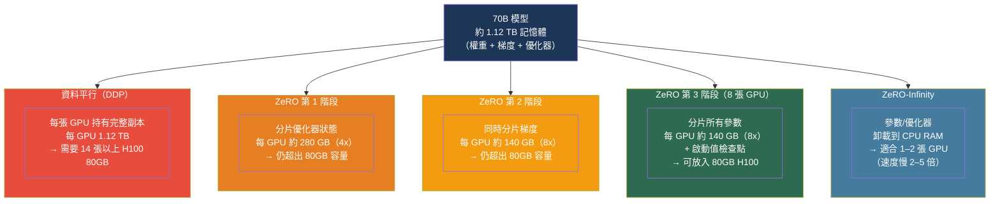

# [BEE-30070] 大型語言模型的分散式訓練基礎設施

:::info
訓練一個 70B 參數的模型每個副本需要約 1.4 TB 的 GPU 記憶體——超過任何現有 A100 叢集的單機容量。ZeRO 優化器分片、梯度檢查點和混合精度訓練是三種正交技術，使兆參數訓練成為可能，每種技術針對記憶體預算的不同組成部分。
:::

## 背景

對大型語言模型進行微調或從頭訓練，需要管理四類截然不同的 GPU 記憶體：模型權重、梯度（每個權重一個）、優化器狀態（Adam 的每個權重兩個 FP32 張量：動量和方差）以及啟動值（前向傳遞中保留用於反向傳遞的中間張量）。對於使用 Adam 的 FP32 精度 70B 參數模型：

```
權重：          70B × 4 位元組 =  280 GB
梯度：          70B × 4 位元組 =  280 GB
Adam 動量：     70B × 4 位元組 =  280 GB
Adam 方差：     70B × 4 位元組 =  280 GB
──────────────────────────────────────────
小計：                          1,120 GB（啟動值之前）
```

單張 H100 80GB 甚至無法容納權重本身。標準的**資料平行（DDP）** 訓練在每個 GPU 上複製完整模型，這意味著 70B 模型僅存放權重就需要約 14 張 H100 80GB，更別提梯度和優化器狀態了。

**ZeRO（Zero Redundancy Optimizer）** 框架由 Rajbhandari 等人在微軟提出，發表於《ZeRO: Memory Optimizations Toward Training Trillion Parameter Models》（arXiv:1910.02054，2019），通過將優化器狀態、梯度和參數分布到所有資料平行工作節點來消除冗餘。其核心洞察是：在 DDP 中，每個工作節點都持有優化器狀態和梯度的完全相同副本——ZeRO 在保持相同計算語義的同時消除了這種冗餘。

**梯度檢查點（Gradient Checkpointing）**（Chen 等人，arXiv:1604.06174，2016）以正交的方式解決啟動值記憶體問題：它在前向傳遞中丟棄中間啟動值，在反向傳遞時按需重新計算，而非全程保留。代價是約 33% 更多的計算量，換取 O(√n) 而非 O(n) 的啟動值記憶體。

**混合精度訓練**——使用 BF16 或 FP16 進行前向/反向傳遞，同時為優化器維護 FP32 主權重——通過將權重和梯度張量的大小減半，進一步降低記憶體需求，同時不損害訓練穩定性。

## ZeRO 記憶體分片

ZeRO 定義了三個階段，每個階段將新類別的張量加入分區：

| 階段 | 分片內容 | 記憶體減少 | 與 DDP 的通訊量比較 |
|---|---|---|---|
| ZeRO-1 | 僅優化器狀態 | 4× | 相同 |
| ZeRO-2 | + 梯度 | 8× | 相同 |
| ZeRO-3 | + 參數 | Nd×（隨 DP 度數線性擴展） | +50% |

在 16 路資料平行下，ZeRO-3 實現每個 GPU 16 倍的記憶體減少。額外的 50% 通訊開銷來自每次前向傳遞前的參數 AllGather 和每次反向傳遞後的 Reduce-Scatter，相比 DDP 僅有單次梯度 AllReduce。

**ZeRO-Infinity** 將 ZeRO-3 延伸至將權重、梯度和優化器狀態卸載到 CPU DRAM 或 NVMe SSD。CPU 卸載將每個 GPU 的記憶體需求降低到當前微批次所需的工作集，代價是 PCIe 頻寬（每次前向傳遞的 CPU→GPU 傳輸）。NVMe 卸載進一步降低成本，但受限於磁碟的順序頻寬。

## PyTorch FSDP 與 DeepSpeed ZeRO 對比

PyTorch 的**完全分片資料平行（FSDP）** 以原生方式實現了 ZeRO-3 的概念，無需 DeepSpeed 依賴。分片策略的對應關係如下：

| FSDP 策略 | 等效 ZeRO 階段 |
|---|---|
| `NO_SHARD` | DDP（無分片） |
| `SHARD_GRAD_OP` | ZeRO-2（梯度 + 優化器狀態） |
| `FULL_SHARD` | ZeRO-3（參數 + 梯度 + 優化器狀態） |

FSDP 的分片單位是 `FlatParameter`：給定模組中的所有參數被展平為一個張量後分片。這簡化了實現，但需要在模型定義中顯式進行 `FSDPModule` 封裝。DeepSpeed ZeRO-3 通過就地修補模型實現，無需結構性更改，更易應用於現有訓練代碼。

對於 10B 以下的模型，FSDP `FULL_SHARD` 的吞吐量通常高於 DeepSpeed ZeRO-3，因為其參數 AllGather 與計算的融合更好。對於 70B 以上的模型，差異縮小，因為無論哪種方式通訊開銷都佔主導。

## 最佳實踐

### 70B 以上模型在 8 張 GPU 上微調時，同時使用 ZeRO-3 和梯度檢查點

**SHOULD**（應該）同時應用兩種技術，以便在單個 8×H100 節點上進行 70B 微調。8 張 GPU 上的 ZeRO-3 提供 8 倍記憶體減少（1,120 GB → 140 GB）；梯度檢查點將啟動值記憶體降至 O(√L)，其中 L 是層數：

```python
from torch.distributed.fsdp import FullyShardedDataParallel as FSDP
from torch.distributed.fsdp import ShardingStrategy
from torch.utils.checkpoint import checkpoint_wrapper, CheckpointImpl

# 首先用梯度檢查點封裝每個 Transformer 塊
def apply_checkpointing(model):
    for layer in model.model.layers:
        layer = checkpoint_wrapper(
            layer,
            checkpoint_impl=CheckpointImpl.NO_REENTRANT,  # 現代 PyTorch 推薦
        )
    return model

# 在啟用檢查點後再封裝 FSDP
model = apply_checkpointing(model)
model = FSDP(
    model,
    sharding_strategy=ShardingStrategy.FULL_SHARD,
    cpu_offload=None,              # 保留在 GPU 上以保證吞吐量
    auto_wrap_policy=transformer_auto_wrap_policy,
)
```

### 在現代硬體上使用 BF16 而非 FP16 訓練

**SHOULD**（應該）在支持 BF16 的任何硬體（A100、H100、B100）上使用 BF16 混合精度。BF16 與 FP32 具有相同的指數範圍（8 位元指數），消除了 FP16 所需的損失縮放和 FP32 主權重：

```python
# DeepSpeed：BF16 混合精度（無需損失縮放器）
ds_config = {
    "bf16": {"enabled": True},
    "zero_optimization": {
        "stage": 3,
        "offload_optimizer": {"device": "none"},
        "reduce_scatter": True,
        "allgather_partitions": True,
    },
    "gradient_clipping": 1.0,
    "train_micro_batch_size_per_gpu": 1,
    "gradient_accumulation_steps": 8,
}

# PyTorch FSDP：等效配置
from torch.distributed.fsdp import MixedPrecision
import torch

bf16_policy = MixedPrecision(
    param_dtype=torch.bfloat16,
    reduce_dtype=torch.bfloat16,   # BF16 梯度規約
    buffer_dtype=torch.bfloat16,
)
model = FSDP(model, mixed_precision=bf16_policy, ...)
```

**MUST NOT**（不得）在沒有損失縮放器的情況下使用 FP16。FP16 有限的動態範圍（最大約 65,504）導致梯度下溢——梯度在優化器步驟前四捨五入為零，訓練悄然發散。BF16 在現代加速器上完全避免了這個問題。

### 使用梯度累積將批次大小與每個 GPU 的記憶體解耦

**SHOULD**（應該）當目標全局批次大小無法放入每個 GPU 的記憶體時，使用梯度累積。有效批次為 512 個序列，微批次大小為 1，8 張 GPU 需要 64 個累積步驟：

```python
# 帶梯度累積的訓練循環
effective_batch_size = 512
micro_batch_size = 1
num_gpus = 8
accumulation_steps = effective_batch_size // (micro_batch_size * num_gpus)  # = 64

optimizer.zero_grad()
for step, batch in enumerate(dataloader):
    outputs = model(**batch)
    loss = outputs.loss / accumulation_steps      # 累積前歸一化
    loss.backward()

    if (step + 1) % accumulation_steps == 0:
        # 僅在更新步驟裁剪梯度
        torch.nn.utils.clip_grad_norm_(model.parameters(), max_norm=1.0)
        optimizer.step()
        scheduler.step()
        optimizer.zero_grad()
```

**SHOULD NOT**（不應該）在不歸一化損失的情況下樸素地累積梯度。除以 `accumulation_steps` 確保梯度幅度無論使用 1 步還是 64 步都保持一致。

### 僅在 GPU 記憶體是硬性限制時才啟用 CPU 卸載

**MAY**（可以）在即使使用 ZeRO-3 模型仍無法放入 GPU 記憶體時，使用 ZeRO-Infinity CPU 卸載。代價是顯著的：CPU 卸載增加了 PCIe 往返（優化器更新時 GPU→CPU，參數恢復時 CPU→GPU），通常使訓練吞吐量降低 2–5 倍：

```python
# DeepSpeed ZeRO-Infinity 帶 CPU 卸載
ds_config = {
    "zero_optimization": {
        "stage": 3,
        "offload_optimizer": {
            "device": "cpu",              # 優化器狀態存入 CPU RAM
            "pin_memory": True,           # 釘頁記憶體以加快 PCIe
        },
        "offload_param": {
            "device": "cpu",              # 參數存入 CPU RAM
            "pin_memory": True,
        },
        "overlap_comm": True,
        "contiguous_gradients": True,
        "sub_group_size": 1e9,
    },
}
```

**SHOULD**（應該）在吞吐量很重要時優先增加 GPU 數量而非使用 CPU 卸載。CPU 卸載最適合一次性微調任務，在這種情況下，掛鐘時間不如適配現有硬體重要。

### 測量並以模型 FLOP 利用率（MFU）為目標

**SHOULD**（應該）將 MFU 作為分散式訓練的主要效率指標。MFU = （實際每秒 token 數 × 每 token 的 FLOP）/ 理論峰值 FLOP。在 H100 上，優化良好的 70B 訓練可達到 40–55% MFU；低於 30% 表示存在通訊瓶頸或批次配置不佳：

```python
def compute_mfu(
    model_params: int,
    tokens_per_second: float,
    hardware_peak_flops: float,   # 例如，H100 BF16 為 989e12
) -> float:
    """
    使用 Transformer 每 token FLOP 的 6N 近似估算 MFU。
    （每個權重每次前向+反向傳遞約 2 次乘加 ≈ 6 × 參數數量）
    """
    flops_per_token = 6 * model_params
    return (tokens_per_second * flops_per_token) / hardware_peak_flops

# 範例：70B 模型，8×H100 BF16（每個 989 TFLOPs/s）上每秒 400 個 token
mfu = compute_mfu(
    model_params=70e9,
    tokens_per_second=400,
    hardware_peak_flops=8 * 989e12,
)
print(f"MFU：{mfu:.1%}")   # ~3.5% — 存在瓶頸（目標：40-55%）
# 8 張 GPU 上 MFU 過低 → 增大批次大小或通過調整梯度檢查點減少 ZeRO-3 開銷
```

## 示意圖



## 常見錯誤

**在沒有損失縮放器的情況下使用 FP16 混合精度。** FP16 梯度在深層 Transformer 中頻繁下溢為零。每當使用 FP16 時，必須啟用 PyTorch 的 `GradScaler`；縮放器在反向傳遞前將損失乘以一個大因子，然後在優化器步驟前將梯度除回來。BF16 完全消除了這一要求，應在 A100/H100 上優先採用。

**在未基準測試的情況下對每一層應用梯度檢查點。** 對每一層進行檢查點會讓每個啟動值被計算兩次——一次在前向傳遞中，一次在反向傳遞中——增加 33% 的開銷。對於相對於參數記憶體而言啟動值記憶體較小的模型（例如隱藏維度大但序列短的模型），這一開銷收益甚微。啟用檢查點前，先分析啟動值記憶體，僅對最消耗記憶體的層選擇性地啟用。

**將微批次大小設為 1 而不調整梯度累積步數。** 微批次為 1 導致矩陣乘法期間 GPU 使用率低下——許多 CUDA 核心在較大批次下才能達到峰值吞吐量。應將微批次大小調整為記憶體允許的最大值，然後通過梯度累積達到目標有效批次大小。

**忘記在梯度累積中歸一化損失。** 累積原始損失值而非 `loss / accumulation_steps`，會導致梯度與累積步數成比例放大，使有效學習率膨脹並破壞訓練穩定性。在調用 `loss.backward()` 前始終先除以累積步數。

**在節點間混用不同 ZeRO 階段。** ZeRO 訓練任務中的所有工作節點必須使用相同的分片策略。為不同機器分配不同階段會導致梯度通訊不匹配和訓練失敗。確保 DeepSpeed 或 FSDP 配置在任務中所有節點上保持一致。

## 相關 BEE

- [BEE-30012](fine-tuning-and-peft-patterns.md) -- 微調與 PEFT 模式：LoRA 和 QLoRA 減少了可訓練參數的數量，大幅降低了 ZeRO 必須分片的梯度和優化器狀態佔用
- [BEE-30061](llm-quantization-for-inference.md) -- LLM 推論量化：量化減少推論記憶體；訓練時 QLoRA（4 位元基礎權重 + BF16 LoRA）將兩種技術結合
- [BEE-30066](tensor-parallelism-and-pipeline-parallelism-for-llm-inference.md) -- LLM 推論的張量平行與流水線平行：三維平行將基於 ZeRO 的資料平行與 TP/PP 結合，用於最大規模的訓練
- [BEE-30068](llm-serving-autoscaling-and-gpu-cluster-management.md) -- LLM 服務的自動擴縮與 GPU 叢集管理：訓練的 GPU 叢集管理原則與服務有顯著重疊

## 參考資料

- [Rajbhandari 等人. ZeRO: Memory Optimizations Toward Training Trillion Parameter Models — arXiv:1910.02054, Microsoft 2019](https://arxiv.org/abs/1910.02054)
- [Chen 等人. Training Deep Nets with Sublinear Memory Cost — arXiv:1604.06174, 2016](https://arxiv.org/abs/1604.06174)
- [Micikevicius 等人. FP8 Formats for Deep Learning — arXiv:2209.05433, NVIDIA 2022](https://arxiv.org/abs/2209.05433)
- [PyTorch. DistributedDataParallel — docs.pytorch.org](https://docs.pytorch.org/docs/stable/generated/torch.nn.parallel.DistributedDataParallel.html)
- [PyTorch. Fully Sharded Data Parallel — docs.pytorch.org](https://docs.pytorch.org/docs/stable/fsdp.html)
- [PyTorch. Activation Checkpointing — docs.pytorch.org](https://docs.pytorch.org/docs/stable/checkpoint.html)
- [DeepSpeed. ZeRO Stage 3 — deepspeed.readthedocs.io](https://deepspeed.readthedocs.io/en/latest/zero3.html)
- [NVIDIA Megatron-Core. Parallelism Guide — docs.nvidia.com](https://docs.nvidia.com/megatron-core/developer-guide/latest/user-guide/parallelism-guide.html)
