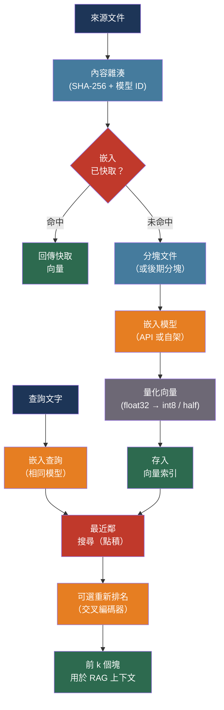

# [BEE-516] 嵌入模型與向量表示

:::info
嵌入模型將文字轉換為稠密的數值向量，使語義相似的文字產生幾何上接近的向量。選擇正確的模型、維度、距離度量和快取策略，決定了依賴它的 RAG 管線、語義搜尋和推薦功能的檢索品質。
:::

## 背景

每個基於 Transformer 的 LLM 都會產生 Token 的內部向量表示。嵌入模型是一種特別微調的 Transformer，它將整個 Token 序列 —— 一個句子、一個段落、一份文件 —— 投影到一個捕捉其語義意義的單一稠密向量中。這個向量空間的幾何結構編碼了關係：「機器學習」和「深度學習」產生相近的向量；「機器學習」和「季度盈利」則不然。

實際結果是：嵌入空間中的最近鄰搜尋近似於語義相似性。這支撐了檢索增強生成（RAG）、語義搜尋、文件聚類、異常偵測和推薦系統。所有這些下游應用的品質直接受嵌入模型品質的上限約束。

有兩種池化策略用於將每個 Token 的表示折疊為單一向量。CLS Token 池化取第一個 Token（在每個序列前添加的特殊分類 Token）的表示。均值池化對序列中所有 Token 的表示取平均。均值池化在語義相似性基準上持續優於 CLS 池化，是現代嵌入模型的預設選擇。

大規模文字嵌入基準（MTEB，arXiv:2210.07316，2022）是比較嵌入模型的標準，涵蓋 56 個資料集和 8 個任務類別：分類、聚類、配對分類、重新排名、檢索、語義文字相似性（STS）、摘要和雙語文字挖掘。huggingface.co/spaces/mteb/leaderboard 上的 MTEB 排行榜提供持續更新的排名。對於以檢索為核心的應用，BEIR 基準上的 NDCG@10（排名前 10 的正規化折扣累積增益）是最有預測力的指標。

## 設計思維

三個決策主導嵌入模型的選擇：

**品質與費用**：較大的模型（70 億+ 參數）在 MTEB 排行榜上名列前茅，但運行費用更高，並產生增加儲存和索引建立時間的更高維度向量。對大多數生產工作負載而言，4–6 億參數範圍內的模型能以一小部分推論費用達到排行榜冠軍 90–95% 的品質。

**託管 API vs. 自架**：託管嵌入 API（OpenAI、Cohere）不需要基礎設施，但引入了每 Token 費用、速率限制和資料層的廠商鎖定。自架模型（BGE、E5）消除了每 Token 費用，但需要 GPU 基礎設施。交叉點取決於請求量和文件語料庫大小。

**通用 vs. 領域特定**：在網路規模資料上訓練的通用嵌入模型，在大多數領域表現足夠。生物醫學、法律、程式碼等專業領域，受益於在領域特定語料庫上微調的模型，因為通用模型可能缺乏區分密切相關領域概念的詞彙或語域。

## 最佳實踐

### 對照 MTEB 基準選擇模型

**SHOULD**（應該）使用您自己的文件語料庫和查詢分布的樣本，在 MTEB 檢索子任務上評估嵌入模型候選者。排行榜報告跨多個領域的平均分數；您的領域可能表現不同。

品質/費用範圍中的現有領先模型：

| 模型 | 維度 | 上下文 | 最適用於 |
|------|-----|------|---------|
| NVIDIA NV-Embed-v2 | 4096 | 32K | 最高品質；需要 GPU |
| intfloat/e5-mistral-7b-instruct | 4096 | 32K | 高品質；英文；需要 GPU |
| openai/text-embedding-3-large | 3072 | 8K | 託管 API；最高 OpenAI 品質 |
| BAAI/bge-m3 | 1024 | 8192 | 多語言；可自架；混合檢索 |
| openai/text-embedding-3-small | 1536 | 8K | 託管 API；良好品質/費用比 |
| BAAI/bge-large-en-v1.5 | 1024 | 512 | 英文；可自架；無需指令 |
| Jina embeddings v3 | 1024 | 8192 | 多語言；支援後期分塊；Matryoshka |

**SHOULD** 使用產生索引文件的嵌入模型來嵌入查詢。在索引和查詢之間混合嵌入模型會產生無意義的結果 —— 不同模型的向量存在於不相容的空間中。

**MUST NOT**（不得）在不先重新嵌入整個文件語料庫的情況下，為現有索引切換嵌入模型。嵌入漂移 —— 查詢向量和文件向量由不同模型版本產生 —— 會靜默降低檢索品質而不拋出錯誤。

### 理解距離度量並正規化向量

**MUST** 使用與嵌入模型訓練方式相符的距離度量。大多數現代嵌入模型使用餘弦相似度訓練；它們在回傳前對向量進行 L2 正規化。

對於 L2 正規化向量，餘弦相似度等於點積：

```
cosine(a, b) = (a · b) / (|a| × |b|)
             = a · b   （當 |a| = |b| = 1 時）
```

**SHOULD** 在生產向量資料庫中優先使用點積而非餘弦相似度 —— 對正規化向量計算等價，但點積省去了正規化步驟：

```python
import numpy as np

def embed(text: str, model) -> np.ndarray:
    vec = model.encode(text)
    return vec / np.linalg.norm(vec)  # 若模型未執行則進行 L2 正規化

# 對正規化向量而言，點積搜尋等價於餘弦相似度
def retrieve(query: str, index, model, top_k: int = 10):
    q_vec = embed(query, model)
    # 在 pgvector 中：SELECT * FROM docs ORDER BY embedding <#> $1 LIMIT 10
    # <#> 是負內積（最大化 = 找最近鄰）
    return index.search(q_vec, top_k, metric="dot_product")
```

**SHOULD** 只在向量大小攜帶意義時使用歐幾里得（L2）距離 —— 這對文字嵌入很少見。餘弦/點積是預設的正確選擇。

### 使用 Matryoshka 嵌入提高儲存效率

Matryoshka 表示學習（MRL，arXiv:2205.13147，NeurIPS 2022）訓練模型使得完整嵌入的前 N 個維度本身就是有效的低維嵌入。這使得截斷嵌入維度而無需重新訓練成為可能：

**SHOULD** 使用具備 Matryoshka 能力的模型（OpenAI text-embedding-3、Jina v3、bge-m3），並測試截斷到一半或四分之一維度對您的品質需求是否可接受：

```python
from openai import OpenAI

client = OpenAI()

# 完整的 3072 維嵌入
full = client.embeddings.create(
    model="text-embedding-3-large",
    input="熔斷器模式防止級聯故障。",
)

# 截斷到 1024 維 —— 有效的 Matryoshka 子嵌入
compact = client.embeddings.create(
    model="text-embedding-3-large",
    input="熔斷器模式防止級聯故障。",
    dimensions=1024,   # 減少 3 倍儲存；OpenAI 在截斷前正規化
)
```

對 OpenAI text-embedding-3-large：從 3072 截斷到 1024 維，儲存減少 3 倍，同時在大多數基準上保留約 95% 的檢索品質。截斷到 256 維減少 12 倍，保留約 85%。

**SHOULD** 在確定維度選擇前，在留存的檢索基準上評估截斷與完整維度。最佳截斷點因領域而異。

### 對大型索引應用向量量化

對於超過一千萬個向量的索引，float32 儲存變得不切實際：

| 格式 | 位元組/維度 | 1M × 1536 維 | 速度 |
|-----|-----------|------------|-----|
| float32 | 4 | 6.1 GB | 基準 |
| float16 | 2 | 3.1 GB | ~1.5× |
| int8 | 1 | 1.5 GB | ~3.7× |
| 二進位 | 0.125 | 192 MB | ~25× |

**SHOULD** 對大型索引使用 int8 純量量化作為預設。它減少 4 倍儲存，查詢延遲降低約 3.7 倍，在 MTEB 檢索基準上的準確率損失通常低於 2%：

```python
# pgvector：使用 int8 量化建立索引（pgvector 0.7+）
CREATE INDEX ON documents
  USING hnsw (embedding vector_ip_ops)  -- 內積（適用於正規化向量）
  WITH (m = 16, ef_construction = 64);

-- 或使用 halfvec 類型自動 float16 儲存：
ALTER TABLE documents ALTER COLUMN embedding TYPE halfvec(1536);
```

**MAY**（可以）對超大型索引使用二進位量化（每維度 1 位元），前提是可接受兩階段檢索：先對完整索引進行二進位搜尋以獲得大量候選集，再用 float32 向量對最終前 k 名重新評分。

### 對長文件應用後期分塊

標準分塊 —— 將文件分割成塊，獨立嵌入每個塊 —— 會丟失跨塊的上下文。包含「上述定理」的塊在嵌入層無法存取「上述」所指的內容。

後期分塊（arXiv:2409.04701，2024）顛倒了順序：先嵌入整個文件以獲得具有完整上下文的每 Token 表示，再透過對每個塊邊界內的 Token 表示進行均值池化來擷取塊嵌入：

```python
# Jina 透過 API 參數實現後期分塊
import requests

response = requests.post(
    "https://api.jina.ai/v1/embeddings",
    headers={"Authorization": f"Bearer {JINA_API_KEY}"},
    json={
        "model": "jina-embeddings-v3",
        "input": [full_document],   # 整份文件，最多 8192 個 Token
        "late_chunking": True,      # 每個塊回傳一個嵌入
        "task": "retrieval.passage",
    },
)
# 回應包含每個邏輯塊的一個嵌入，帶有跨塊上下文
chunk_embeddings = response.json()["data"]
```

**SHOULD** 對文件中塊頻繁引用同一文件其他部分的實體、定義或結論的情況使用後期分塊。技術規格、法律合約和學術論文受益最多。

**SHOULD** 在後期分塊不可用時，考慮 Anthropic 的上下文檢索技術作為替代：使用快速 LLM 呼叫在嵌入前，為每個塊添加上下文摘要前綴（從完整文件生成）。這在索引時每個塊增加一次 LLM 呼叫，但使用 Prompt 快取降低費用。Anthropic 報告檢索失敗減少 49%，結合重新排名時上升至 67%。

### 依內容雜湊快取嵌入

重複嵌入相同文字浪費 API 配額和算力。除非管線是冪等的，否則每次索引重建都會重新嵌入文件。

**SHOULD** 使用內容尋址快取：對輸入文字加上模型識別符進行雜湊；以該雜湊為鍵儲存向量：

```python
import hashlib
import json

def embed_with_cache(text: str, model: str, cache) -> list[float]:
    key = hashlib.sha256(f"{model}:{text}".encode()).hexdigest()
    cached = cache.get(key)
    if cached:
        return json.loads(cached)
    vec = embedding_api.embed(text, model=model)
    cache.set(key, json.dumps(vec), ex=86400 * 30)  # 30 天 TTL
    return vec
```

**SHOULD** 在模型版本更改時使快取失效。模型版本升級產生不相容的向量；混合舊模型的快取向量與新嵌入，會靜默損壞索引。

**MUST NOT** 單獨使用輸入文字作為快取鍵 —— 始終包含模型識別符。兩個模型對相同輸入可能產生相同的快取鍵，但回傳不相容空間中的向量。

### 安全處理嵌入模型更新

**MUST** 將嵌入模型更新視為索引的破壞性變更。文件和查詢向量必須來自同一模型。安全的更新流程：

1. 使用新模型對完整文件語料庫並行建立新索引
2. 在查詢基準上執行 A/B 檢索評估，比較新舊索引
3. 原子式將查詢流量切換到新索引（藍綠部署）
4. 驗證後停用舊索引

**SHOULD** 在向量儲存中繼資料中為每個嵌入標記模型識別符和模型版本。這使得偵測混合模型索引在機制上可行：

```sql
-- 偵測索引損壞：來自多個模型版本的向量
SELECT embedding_model, COUNT(*) 
FROM document_embeddings 
GROUP BY embedding_model;
-- 應回傳恰好一行
```

## 視覺圖



## 相關 BEE

- [BEE-30007](rag-pipeline-architecture.md) -- RAG 管線架構：嵌入模型是 RAG 索引和查詢管線的核心元件；塊大小決策與模型的上下文視窗直接交互
- [BEE-17004](../search/vector-search-and-semantic-search.md) -- 向量搜尋與語義搜尋：ANN 索引結構（HNSW、IVF）和近似搜尋的權衡，直接適用於基於嵌入的檢索
- [BEE-30011](ai-cost-optimization-and-model-routing.md) -- AI 成本優化與模型路由：嵌入 API 呼叫有其自身的每 Token 費用，在索引規模下會累積；快取和量化是費用槓桿
- [BEE-30009](llm-observability-and-monitoring.md) -- LLM 可觀測性與監控：嵌入延遲和快取命中率應作為獨立指標，與 RAG 系統中的生成延遲分開追蹤

## 參考資料

- [Niklas Muennighoff et al. MTEB: Massive Text Embedding Benchmark — arXiv:2210.07316, EMNLP 2023](https://arxiv.org/abs/2210.07316)
- [Aditya Kusupati et al. Matryoshka Representation Learning — arXiv:2205.13147, NeurIPS 2022](https://arxiv.org/abs/2205.13147)
- [Michael Günther et al. Late Chunking: Contextual Chunk Embeddings Using Long-Context Embedding Models — arXiv:2409.04701, 2024](https://arxiv.org/abs/2409.04701)
- [Aamir Shakir et al. NV-Embed: Improved Techniques for Training LLMs as Generalist Embedding Models — arXiv:2405.17428, 2024](https://arxiv.org/abs/2405.17428)
- [MTEB Leaderboard — huggingface.co/spaces/mteb/leaderboard](https://huggingface.co/spaces/mteb/leaderboard)
- [OpenAI. Embeddings Guide — developers.openai.com](https://developers.openai.com/api/docs/guides/embeddings)
- [Cohere. Embed Documentation — docs.cohere.com](https://docs.cohere.com/docs/cohere-embed)
- [BAAI. bge-m3 Model Card — huggingface.co/BAAI/bge-m3](https://huggingface.co/BAAI/bge-m3)
- [JinaAI. Late Chunking in Long-Context Embedding Models — jina.ai](https://jina.ai/news/late-chunking-in-long-context-embedding-models/)
- [Anthropic. Contextual Retrieval — anthropic.com/news](https://www.anthropic.com/news/contextual-retrieval)
- [Hugging Face. Embedding Quantization — huggingface.co/blog](https://huggingface.co/blog/embedding-quantization)
