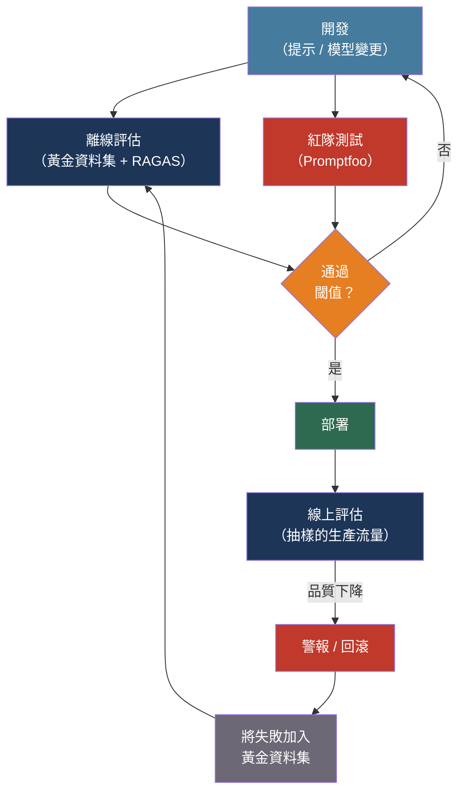

# [BEE-506] 評估與測試 LLM 應用程式

:::info
LLM 輸出是機率性的，且往往需要主觀判斷——傳統的二元通過/失敗斷言行不通。有效的 LLM 評估結合了自動化指標、LLM 作為評審員的評分、精心整理的黃金資料集，以及持續的生產監控。
:::

## 背景

傳統軟體測試建立在一個簡單的前提上：輸入 X 產生輸出 Y，任何偏差都是錯誤。LLM 從兩端都打破了這個契約。即使在溫度為零的情況下，相同的提示也可能在不同運行中產生不同的輸出，因為 GPU 矩陣運算中的浮點算術依賴於硬體執行順序（Yin 等人，arXiv:2408.04667）。更根本的是，通常不存在單一正確的輸出——關於部署容器化服務的問題有許多有效的答案，而「正確性」取決於上下文、完整性和評估者的判斷。

該領域借鑒了機器翻譯和文本摘要研究，繼承了 BLEU（Papineni 等人，2002 年）和 ROUGE（Lin，2004 年）等指標。兩者都測量與參考文本的 n-gram 重疊。兩者在現代 LLM 評估中都表現不佳：它們懲罰正確的改述，忽略語義等價性，並且對開放式生成（存在許多有效答案）產生無資訊的分數。BERTScore（Zhang 等人，2019 年）透過使用嵌入相似度而非令牌重疊改善了情況，但它仍然依賴於在生產中可能不存在的參考答案。

2025 年的主流評估範式是 LLM 作為評審員：使用一個能力較強的模型（通常是 GPT-4 或 Claude）來根據評分標準對另一個模型的輸出進行評分。Liu 等人（G-Eval，arXiv:2303.16634，2023 年）表明，帶有思維鏈推理的 GPT-4 在摘要任務上與人類評估者的一致率超過 80%。對於 RAG 特定評估，Shahul Es 等人（RAGAS，arXiv:2309.15217，EACL 2024）開發了一個無需參考答案的框架，無需黃金標準答案即可對檢索和生成品質進行評分——這是生產評估的實際需求，因為精心整理的答案通常不存在。

## 設計思維

LLM 評估有兩種不同的設定，各有不同的要求：

**離線評估**（部署前）：對具有已知可接受答案的精選黃金資料集執行。快速的反饋循環。在問題到達用戶之前捕獲回歸。僅限於您想到要包含的情況。

**線上評估**（生產環境）：持續對抽樣的實時流量進行評分。偵測離線資料集所錯過的真實世界故障模式——分佈偏移、邊緣情況、對抗性輸入。需要抽樣（評估 100% 的流量很昂貴）和隱私感知的日誌記錄。

有效的方法同時執行兩者：離線評估阻止部署，線上評估在部署後監控漂移，新發現的生產故障將添加到離線資料集。

第二個設計軸是評估方法的光譜：

```
廉價、快速                                           昂貴、準確
|------------------------------------------|
精確匹配 → 參考指標 → LLM 作為評審員 → 人工評估
```

精確匹配適用於結構化輸出（JSON Schema 合規性、分類）。參考指標（BLEU、ROUGE、BERTScore）適用於有明確正確答案的狹窄任務。LLM 作為評審員適用於開放式品質評估。人工評估是基準，應用於校準所有其他方法。

## 最佳實踐

### 在撰寫測試之前定義評估維度

**MUST（必須）** 在選擇指標之前定義哪些維度對您的特定應用程式重要。不同的應用程式需要不同的評估優先順序：

| 維度 | 測量內容 | 何時關鍵 |
|------|---------|---------|
| 事實準確性 | 聲明是否真實且有支撐？| 問答、研究輔助 |
| 答案相關性 | 輸出是否回應了查詢？| 所有應用程式 |
| 忠實度 | 聲明是否建立在檢索到的上下文上？| RAG 系統 |
| 格式合規性 | 輸出是否符合預期的 Schema？| API 整合、結構化輸出 |
| 毒性/安全性 | 輸出是否有害或存在偏見？| 面向用戶的應用程式 |
| 延遲和成本 | P95 延遲、消耗的令牌數、每請求成本 | 所有生產系統 |

**SHOULD（應該）** 根據生產影響對維度加權。醫療資訊應用程式中的事實錯誤比冗長的回應更嚴重。兒童應用程式中的毒性是阻斷性問題。在部署之前定義每個維度的可接受閾值。

### 使用帶有明確評分標準的 LLM 作為評審員

**SHOULD（應該）** 對無法透過參考指標測量的品質維度使用 LLM 作為評審員——相關性、連貫性、有用性、忠實度。帶有結構化評分標準的 LLM 作為評審員可靠地接近人類水準的一致性（根據 G-Eval，超過 80%）。

**MUST（必須）** 考慮 MT-Bench 研究（Zheng 等人，arXiv:2306.05685）中識別的評審員偏差：
- **冗長偏差**：評審員約 90% 的時間偏好較長的回應，無論品質如何。透過指示評審員將簡潔性作為一個因素來緩解。
- **位置偏差**：評審員偏向首先出現的答案。透過以位置互換的方式執行每個比較兩次並取平均值來緩解。
- **自我增強偏差**：作為評審員的模型會提高同一模型家族輸出的分數。透過使用不同的模型家族作為評審員來緩解。

```python
FAITHFULNESS_RUBRIC = """
您正在評估以下答案是否忠實於所提供的上下文。
忠實意味著：答案中的每個事實聲明都可以追溯到上下文中。
不要獎勵添加上下文中未找到的正確資訊的答案。

按 1-5 分制評分：
5 - 所有聲明直接由上下文支撐
4 - 輕微改述；所有聲明都可從上下文推斷
3 - 大部分有支撐；一個無支撐的聲明
2 - 多個無支撐的聲明
1 - 答案與上下文矛盾或忽略上下文

上下文：{context}
答案：{answer}

首先逐步推理，然後以以下格式輸出您的分數：分數：N
"""
```

### 建立和維護黃金資料集

**MUST（必須）** 維護一個版本化的黃金資料集——一個精選的輸入、可選的參考輸出和預期品質屬性的集合——用於回歸測試。在黃金資料集上品質回歸的模型更新或提示變更不得部署。

**SHOULD（應該）** 從真實的生產流量而非合成範例中建立黃金資料集。合成範例會錯過真實查詢的長尾。啟動後，持續抽樣模型表現不佳的生產輸入並將其添加到資料集中。

**SHOULD（應該）** 包含對抗性案例：旨在引發幻覺的查詢、應用程式邊界附近的邊緣情況，以及已知在類似系統中引起問題的輸入。邊緣情況的覆蓋率比原始資料集大小更重要。

**MUST NOT（不得）** 將評估資料重用於微調或提示最佳化。基準汙染——在訓練期間使用測試資料——會產生不能推廣到生產環境的虛高離線指標。

最小資料集條目：

```json
{
  "id": "order-status-001",
  "input": "我的訂單 #12345 的狀態是什麼？",
  "context": "訂單 #12345 已於 4 月 10 日透過 FedEx 發貨，預計於 4 月 14 日到達。",
  "expected_properties": {
    "mentions_shipping_carrier": true,
    "mentions_expected_date": true,
    "tone": "helpful",
    "format_compliant": true
  },
  "tags": ["order-lookup", "core-path"]
}
```

### 使用 RAGAS 指標評估 RAG 管道

對於 RAG 系統，RAGAS（Shahul Es 等人，2023 年）提供了四個無需參考答案的指標，涵蓋了檢索品質和生成品質：

**上下文精確度（Context Precision）**：檢索到的區塊是否按相關性排序？檢索到正確區塊但將其埋在不相關區塊中的系統會降低生成品質。

**上下文召回率（Context Recall）**：檢索是否捕獲了回答問題所需的所有資訊？低召回率意味著模型缺乏上下文，必須產生幻覺或拒絕回答。

**忠實度（Faithfulness）**：生成的答案是否只提出由檢索到的上下文支撐的聲明？RAG 核心的反幻覺指標。

**答案相關性（Answer Relevance）**：答案是否真正回應了用戶的問題？一個忠實但不相關的答案在此指標上會失敗。

```python
from ragas import evaluate
from ragas.metrics import faithfulness, answer_relevancy, context_precision, context_recall
from datasets import Dataset

samples = Dataset.from_list([{
    "question": "訂單 #12345 是何時發貨的？",
    "answer": "訂單 #12345 於 4 月 10 日透過 FedEx 發貨。",
    "contexts": ["訂單 #12345 已於 4 月 10 日透過 FedEx 發貨，預計於 4 月 14 日到達。"],
    "ground_truth": "4 月 10 日",
}])

results = evaluate(
    samples,
    metrics=[faithfulness, answer_relevancy, context_precision, context_recall],
)
# results: {'faithfulness': 1.0, 'answer_relevancy': 0.95, ...}
```

**SHOULD（應該）** 分別對 RAG 管道的每個元件執行 RAGAS 指標。低忠實度分數可能表示生成問題。低上下文召回率分數表示檢索問題——修復檢索器，而非提示。

### 在上線前進行紅隊測試

**MUST（必須）** 在部署任何面向用戶的 LLM 應用程式之前進行對抗性測試。紅隊測試系統性地探測：
- 提示注入漏洞
- 繞過內容政策的越獄
- 資料洩露（系統是否洩露訓練資料、系統提示或其他用戶的資料？）
- 有害內容生成
- 壓力下的幻覺（對未知主題的錯誤信心）

**Promptfoo**（開源，MIT 授權）等工具針對與 OWASP LLM Top 10 一致的 20 多個漏洞類別自動進行紅隊測試。在 CI/CD 中執行以防止回歸：

```yaml
# promptfoo 配置：在每個 PR 的 CI 中執行
targets:
  - id: openai:gpt-4o
    config:
      temperature: 0

redteam:
  strategies:
    - jailbreak
    - prompt-injection
    - harmful:hate
  plugins:
    - owasp:llm
```

### 將評估整合到 CI/CD 中

**SHOULD（應該）** 在每個更改提示、模型配置或檢索管道的 pull request 上執行離線評估。根據評估分數閾值阻止合併。

**SHOULD（應該）** 在生產環境中監控品質指標，同時監控操作指標（延遲、錯誤率、成本）。由於模型更新或分佈偏移，系統在延遲和錯誤率方面可能是健康的，但答案品質卻在悄悄下降。

**SHOULD（應該）** 對 1-5% 的生產流量進行抽樣，而非評估所有流量。分層抽樣確保樣本在用戶群體、查詢類型和複雜性水準上具有代表性。

```python
# 最小持續評估管道
import random

def maybe_evaluate(request: dict, response: dict, sample_rate: float = 0.02):
    if random.random() > sample_rate:
        return
    # 在發送給評審員之前清理 PII
    scrubbed = redact_pii({"question": request["query"], "answer": response["text"]})
    score = llm_judge(scrubbed, rubric=RELEVANCE_RUBRIC)
    metrics.record("answer_relevance", score, tags={"model": response["model"]})
```

## 視覺化



生產失敗會回饋到黃金資料集，使離線評估隨著時間的推移越來越強大。

## 工具概覽

| 工具 | 類型 | 最適合 |
|------|------|--------|
| [Promptfoo](https://www.promptfoo.dev/) | 開源 | 提示比較、紅隊測試、CI/CD |
| [RAGAS](https://github.com/explodinggradients/ragas) | 開源函式庫 | RAG 管道評估 |
| [Langfuse](https://langfuse.com) | 開源平台 | 可觀測性 + 評估，可自架 |
| [LangSmith](https://smith.langchain.com) | 受管理（LangChain） | 基於 LangChain 的應用程式 |
| [OpenAI Evals](https://github.com/openai/evals) | 開源框架 | 基準測試、模型比較 |
| [Braintrust](https://www.braintrust.dev) | 受管理（企業） | 大規模評估、SOC 2、HIPAA |

**SHOULD（應該）** 大多數團隊從 Promptfoo 和 RAGAS 開始。兩者都是開源的，不需要供應商依賴，與 CI/CD 整合，並涵蓋最重要的評估場景。當團隊規模、合規需求或跨團隊協作的成本合理時，再添加受管理的平台（LangSmith、Braintrust）。

## 相關 BEE

- [BEE-30001](llm-api-integration-patterns.md) -- LLM API 整合模式：語義快取和成本控制降低了執行持續評估的成本；捕獲生產追蹤的相同儀器為評估管道提供資料
- [BEE-30002](ai-agent-architecture-patterns.md) -- AI 代理架構模式：代理評估增加了軌跡維度——不僅是輸出品質，還包括代理是否按正確順序採取了正確的行動
- [BEE-15006](../testing/testing-in-production.md) -- 在生產中測試：LLM 應用程式的抽樣、影子測試和金絲雀部署策略是傳統生產測試相同模式的延伸
- [BEE-14005](../observability/slos-and-error-budgets.md) -- SLO 與錯誤預算：品質指標（忠實度 >0.9、幻覺率 <2%）可以被形式化為 SLO；錯誤預算決定了在回滾之前可接受多少品質下降

## 參考資料

- [Shahul Es 等人. RAGAS: Automated Evaluation of Retrieval Augmented Generation — arXiv:2309.15217, EACL 2024](https://arxiv.org/abs/2309.15217)
- [Yang Liu 等人. G-Eval: NLG Evaluation using GPT-4 with Better Human Alignment — arXiv:2303.16634, 2023](https://arxiv.org/abs/2303.16634)
- [Lianmin Zheng 等人. Judging LLM-as-a-Judge with MT-Bench and Chatbot Arena — arXiv:2306.05685, NeurIPS 2023](https://arxiv.org/abs/2306.05685)
- [Tianyi Zhang 等人. BERTScore: Evaluating Text Generation with BERT — ICLR 2020](https://arxiv.org/abs/1904.09675)
- [Promptfoo. LLM Red-Teaming Documentation — promptfoo.dev](https://www.promptfoo.dev/docs/red-team/)
- [RAGAS. Documentation — docs.ragas.io](https://docs.ragas.io/)
- [Langfuse. LLM Evaluation 101 — langfuse.com](https://langfuse.com/blog/2025-03-04-llm-evaluation-101-best-practices-and-challenges)
- [OpenAI. Evals Framework — github.com/openai/evals](https://github.com/openai/evals)
- [Nature. Detecting Hallucinations in Large Language Models Using Semantic Entropy — nature.com, 2024](https://www.nature.com/articles/s41586-024-07421-0)
