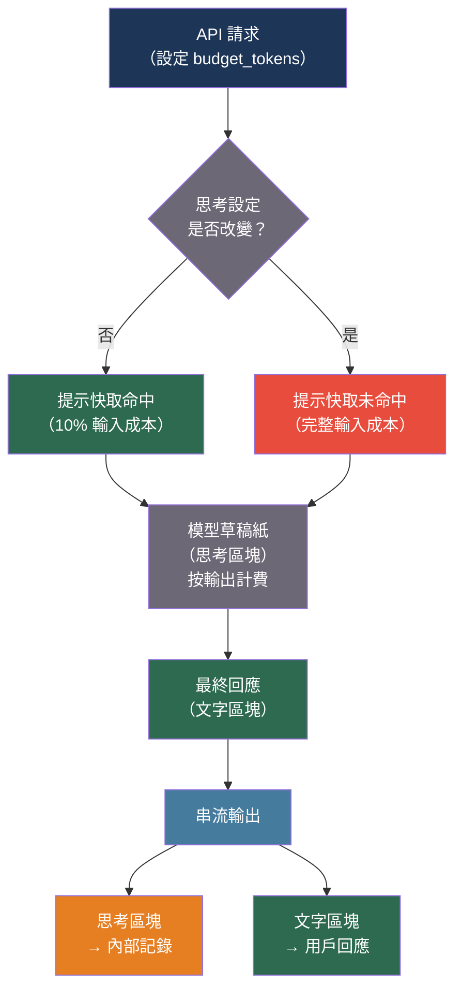

# [BEE-30054] 延伸思考與推理追蹤管理

:::info
延伸思考（Anthropic）和推理 token（OpenAI o1/o3）讓模型在產生最終答案前有額外的計算預算來處理問題 — 以更高的 token 計費、更長的延遲和提示快取失效為代價，改善多步驟推理任務的準確性。管理推理預算、將思考區塊與回應分開串流，以及判斷延伸思考何時有益或有害，是不同的工程考量。
:::

## 背景脈絡

標準 LLM 推理在上下文視窗上進行單次前向傳播，逐 token 解碼。延伸思考通過分配單獨的計算預算 — `thinking` 區塊 — 擴展這一過程，其中模型生成不受限於字面最終輸出的思維鏈。模型使用思考區塊作為草稿紙，然後基於其結論生成可見回應。

Anthropic 的延伸思考 API（隨 Claude 3.7 Sonnet 發布）將思考區塊作為回應中類型為 `"thinking"` 的結構化內容區塊公開。`budget_tokens` 參數（1,024-32,000 token）控制模型可以花費多少計算量。思考 token 以與輸出 token 相同的費率計費，並計入上下文視窗。串流時，思考區塊在文字區塊之前到達；下游消費者必須處理兩種區塊類型。

OpenAI 的 o1 和 o3 模型系列以類似方式實現推理，但不公開推理追蹤：只返回最終答案。計費包括作為輸出 token 的推理 token，使得相同任務的 o1/o3 呼叫比 GPT-4o 呼叫昂貴得多。

Geiping、McLeish、Jain、Kirchenbauer、Bartoldson、Kailkhura 和 Goldstein（arXiv:2512.12777，「使用隱性推理擴展測試時計算：遞迴深度方法」，2024）研究了在推理時分配更多計算 — 在隱性（隱藏）空間而非 token 空間 — 如何在不成比例增加 token 成本的情況下改善推理。這一區別很重要：`budget_tokens` 控制可見 token 的生成，而硬體級優化降低每個推理步驟的 token 成本。目前的 Anthropic 和 OpenAI API 以更多 token 換取更多推理。

對後端工程師而言，延伸思考並非普遍改善。具有清晰單步答案的任務（實體提取、分類、短文件摘要）在啟用延伸思考時速度更慢、成本更高，且不會帶來準確性提升。需要多步驟演繹、數學推理、代碼調試或消歧義的任務則會看到顯著的準確性改善。必須按任務類型進行性能分析。

## 最佳實踐

### 只為受益的任務啟用延伸思考

**不得**（MUST NOT）為所有請求啟用延伸思考。在承諾之前，對每種任務類型分別測量有無延伸思考的準確性基準：

```python
import anthropic
import asyncio
from dataclasses import dataclass

# 始終受益於延伸思考的任務：
THINKING_BENEFICIAL_TASKS = {
    "math_proof",
    "code_debugging",
    "multi_step_reasoning",
    "ambiguous_classification",
    "logical_deduction",
}

# 延伸思考增加成本但不提升準確性的任務：
THINKING_WASTEFUL_TASKS = {
    "entity_extraction",
    "simple_summarization",
    "single_fact_lookup",
    "sentiment_classification",
    "format_conversion",
}

@dataclass
class ThinkingConfig:
    enabled: bool
    budget_tokens: int = 8_000

def get_thinking_config(task_type: str) -> ThinkingConfig:
    if task_type in THINKING_BENEFICIAL_TASKS:
        return ThinkingConfig(enabled=True, budget_tokens=8_000)
    return ThinkingConfig(enabled=False)

async def call_with_thinking(
    prompt: str,
    task_type: str,
    model: str = "claude-sonnet-4-20250514",
) -> dict:
    client = anthropic.AsyncAnthropic()
    config = get_thinking_config(task_type)

    params = {
        "model": model,
        "max_tokens": 16_000,   # 啟用思考時必須超過 budget_tokens
        "messages": [{"role": "user", "content": prompt}],
    }

    if config.enabled:
        params["thinking"] = {
            "type": "enabled",
            "budget_tokens": config.budget_tokens,
        }

    response = await client.messages.create(**params)

    thinking_text = ""
    response_text = ""
    for block in response.content:
        if block.type == "thinking":
            thinking_text = block.thinking
        elif block.type == "text":
            response_text = block.text

    return {
        "thinking": thinking_text,
        "response": response_text,
        "input_tokens": response.usage.input_tokens,
        "output_tokens": response.usage.output_tokens,   # 包括思考 token
    }
```

### 串流思考區塊並分開路由

**應該**（SHOULD）串流延伸思考回應，並將思考區塊路由到單獨的記錄基礎設施，而非向最終用戶公開原始推理追蹤：

```python
async def stream_with_thinking(
    prompt: str,
    model: str = "claude-sonnet-4-20250514",
    budget_tokens: int = 8_000,
) -> tuple[str, str]:
    """
    在串流完成後返回 (thinking_trace, final_response)。
    思考區塊首先到達；文字區塊之後到達。
    """
    client = anthropic.AsyncAnthropic()
    thinking_parts = []
    response_parts = []
    current_block_type = None

    async with client.messages.stream(
        model=model,
        max_tokens=16_000,
        thinking={"type": "enabled", "budget_tokens": budget_tokens},
        messages=[{"role": "user", "content": prompt}],
    ) as stream:
        async for event in stream:
            if hasattr(event, "type"):
                if event.type == "content_block_start":
                    current_block_type = event.content_block.type
                elif event.type == "content_block_delta":
                    delta = event.delta
                    if current_block_type == "thinking" and hasattr(delta, "thinking"):
                        thinking_parts.append(delta.thinking)
                    elif current_block_type == "text" and hasattr(delta, "text"):
                        response_parts.append(delta.text)

    return "".join(thinking_parts), "".join(response_parts)
```

### 在思考參數改變時考慮快取失效

**不得**（MUST NOT）假設添加或更改 `thinking` 參數會保留提示快取命中。當 `thinking` 設定改變時，Anthropic 的提示快取會失效：

```python
# 快取行為：更改思考設定會破壞快取。
# 在思考設定更改後的第一個請求中，
# 系統提示和對話歷史會重新處理。

# 如果您的系統提示有 50,000 個 token 且您切換思考：
# - 第一個請求：快取未命中，計費 50,000 個輸入 token
# - 使用相同思考設定的後續請求：快取命中
# - 再次更改是否啟用思考：快取未命中

def estimate_thinking_cost(
    input_tokens: int,
    thinking_budget: int,
    output_tokens: int,
    cache_hit: bool,
    price_per_million_input: float = 3.0,     # 美元，claude-sonnet-4
    price_per_million_output: float = 15.0,   # 思考 token 按輸出計費
) -> float:
    """
    思考 token 以輸出 token 費率計費。
    大型提示上的快取未命中會增加顯著成本。
    """
    effective_input = input_tokens * (0.1 if cache_hit else 1.0)
    # thinking_budget 是上限；實際使用量可能更低
    total_output = output_tokens + thinking_budget   # 最差情況
    return (
        effective_input / 1_000_000 * price_per_million_input
        + total_output / 1_000_000 * price_per_million_output
    )
```

**應該**（SHOULD）將思考設定的更改視為快取失效事件，如果您的系統提示足夠大以至於快取未命中成本顯著，則將其安排在非高峰時段。

## 視覺化



## 常見錯誤

**為所有任務啟用延伸思考。** 啟用思考後，實體提取、分類和短摘要任務速度更慢、成本更高，且準確性沒有提升。在啟用前按任務類型分析準確性和成本。

**將 `max_tokens` 設置低於 `budget_tokens`。** Anthropic API 要求在啟用思考時 `max_tokens` 超過 `budget_tokens`，因為思考 token 計入最大值。將 `max_tokens` 設置為 4,096 而 `budget_tokens` 為 8,000 會返回 API 錯誤。

**向用戶顯示原始思考追蹤。** 思考區塊包含模型未過濾的推理，可能包括中間的錯誤答案、自我糾正和被放棄的推理路徑。只向最終用戶展示最終文字區塊。

**不在成本模型中考慮思考 token。** 思考 token 以輸出 token 費率計費，大多數模型的輸出費率是輸入費率的 5 倍。在 claude-sonnet-4 上有 10,000 個思考 token 的請求僅思考就花費 $0.15。只計算文字輸出 token 的成本儀表板在啟用思考時會系統性地低報實際成本。

**頻繁切換思考。** 每次思考設定更改都會使提示快取失效。如果您有 100,000 token 的系統提示並且每個請求都切換思考，您將在每次呼叫時支付完整的輸入成本，而不是 10% 的快取命中率。

## 相關 BEE

- [BEE-30023](chain-of-thought-and-extended-thinking-patterns.md) -- 思維鏈與延伸思考模式：提示級推理策略
- [BEE-30024](llm-caching-strategies.md) -- LLM 快取策略：思考設定影響的提示快取機制
- [BEE-30011](ai-cost-optimization-and-model-routing.md) -- AI 成本優化與模型路由：啟用思考模型的路由決策

## 參考資料

- [Anthropic 延伸思考文件 — docs.anthropic.com](https://docs.anthropic.com/en/docs/build-with-claude/extended-thinking)
- [Geiping 等人 使用隱性推理擴展測試時計算：遞迴深度方法 — arXiv:2512.12777，2024](https://arxiv.org/abs/2512.12777)
- [OpenAI o1 系統卡 — openai.com/o1-system-card](https://openai.com/index/openai-o1-system-card/)
- [Anthropic 提示快取 — docs.anthropic.com](https://docs.anthropic.com/en/docs/build-with-claude/prompt-caching)
