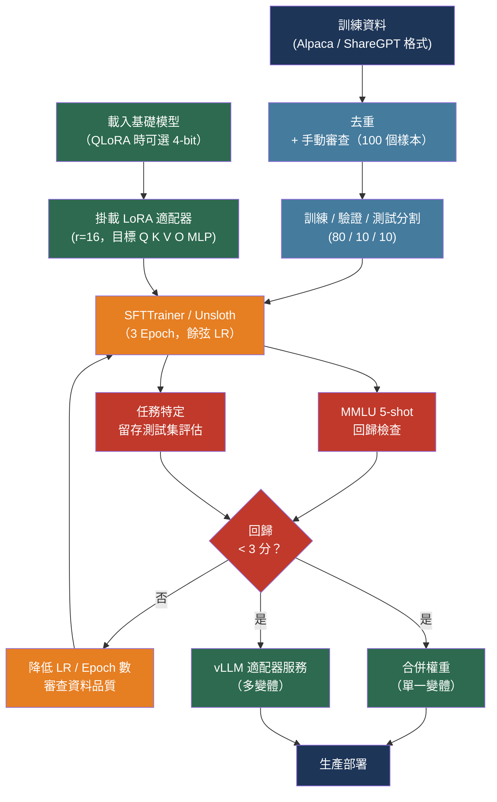

# [BEE-30012] 微調與 PEFT 模式

:::info
微調（Fine-tuning）將預訓練模型調整至特定風格、領域或任務。參數高效微調（Parameter-Efficient Fine-Tuning，PEFT）方法 —— 尤其是 LoRA 與 QLoRA —— 讓這在單張 GPU 上切實可行：1,000 個高品質訓練範例加上一張 48 GB VRAM 的 GPU，就能產出一個媲美完整微調品質、卻只需一小部分費用的微調 65B 參數模型。
:::

## 背景

大型語言模型在預訓練階段透過網路規模的語料庫獲取廣泛知識。預訓練成本高昂 —— 數十萬 GPU 小時 —— 由模型供應商一次完成。微調是第二階段：從預訓練 checkpoint 出發，繼續在較小的任務特定資料集上訓練，以調整模型行為。

對大多數工程團隊而言，微調解決以下三個問題之一。第一，風格與格式一致性：在數千個期望輸出格式的範例上訓練的模型，無需繁複的 Prompt 工程即可可靠地產出該格式。第二，領域專業化：接觸大量領域特定文字 —— 病歷、法律合約、內部程式碼 —— 的模型，習得 Prompt 工程無法可靠注入的詞彙、縮寫與推理模式。第三，任務效能：當特定能力（函式呼叫、結構化擷取、分類準確率）必須超越 Prompt 工程所能達到的水準時。

完整微調 —— 更新模型的所有參數 —— 需要與模型大小乘以優化器狀態成比例的 GPU 記憶體：對 70 億參數的模型而言，使用 Adam 優化器大約需要 112 GB。這超出了大多數可用硬體的 VRAM。參數高效微調透過只訓練一小部分參數、凍結預訓練權重來解決此限制。

主流的 PEFT 方法是 LoRA（Low-Rank Adaptation，arXiv:2106.09685）。它在 Transformer 層中注入可訓練的秩分解矩陣。LoRA 不直接更新權重矩陣 W，而是將更新表示為 W' = W + αAB，其中 A 和 B 是秩為 r ≪ d 的低秩矩陣。對 70 億參數模型使用 r = 16，LoRA 將可訓練參數相較於完整微調減少約 10,000 倍，同時達到相當的下游任務效能。

QLoRA（arXiv:2305.14314）透過在訓練前將凍結的基礎權重量化為 4-bit NormalFloat（NF4）格式來擴展 LoRA。這使得 650 億參數的模型得以在單張 48 GB GPU 上微調 —— 若使用完整微調，需要八張 80 GB A100。Guanaco 模型透過 QLoRA 在單張 GPU 上訓練 24 小時，在 Vicuna 基準上達到 ChatGPT 效能的 99.3%。

## 設計思維

微調不是預設解方。決策順序應為：

1. **Prompt 工程**：迭代系統 Prompt 和少樣本範例。數天內可解決，訓練時零費用。
2. **RAG**：用於會變化的知識或超過上下文視窗的知識。每月增加 $70–1,000 的基礎設施費用，但不需要訓練。
3. **微調**：當 Prompt 工程和 RAG 都已用盡，或使用案例需要一致格式、降低延遲、或透過較小的專用模型降低推論費用時。

微調一個在通用任務上已表現良好的模型只會帶來邊際改善。微調一個根本無法完成任務的模型，只會產生一個以更專業的方式失敗的模型。診斷測試：你能寫出一個在評估集 70–80% 上產出正確輸出的 Prompt 嗎？如果能，微調很可能填補剩餘差距。如果不能，更多資料和更好的 Prompt 是先決條件。

資料品質主導資料集大小。LIMA 論文（arXiv:2305.11206）證明，1,000 個精心策劃的範例就能讓 650 億參數的模型在用戶偏好評估上與 GPT-4 和 Bard 競爭。實際上，200 個仔細審核的範例勝過 2,000 個嘈雜的範例。

## 最佳實踐

### 選擇合適的 PEFT 方法

**SHOULD**（應該）將 LoRA 作為預設的 PEFT 方法。它被廣泛支援、理解充分，且在大多數任務上達到完整微調的品質：

```python
from peft import LoraConfig, get_peft_model, TaskType

config = LoraConfig(
    task_type=TaskType.CAUSAL_LM,
    r=16,               # 秩 — 越高容量越大、記憶體越多
    lora_alpha=32,      # 縮放因子；有效學習率 = alpha / r
    target_modules=["q_proj", "k_proj", "v_proj", "o_proj",
                    "gate_proj", "up_proj", "down_proj"],
    lora_dropout=0.05,
    bias="none",
)
model = get_peft_model(base_model, config)
model.print_trainable_parameters()
# trainable params: 83,886,080 || all params: 8,030,261,248 || trainable%: 1.045
```

關鍵超參數及其影響：

| 參數 | 範圍 | 指引 |
|-----|-----|-----|
| 秩（`r`） | 4–64 | 從 16 開始。複雜任務或大型資料集時增加。使用 2 的冪次。 |
| Alpha（`lora_alpha`） | — | 設為 `r` 或 `2r`。控制有效學習率縮放。 |
| 目標模組 | — | 最少：Q、K、V、O 注意力投影。更難的任務加上 MLP 層。 |
| Dropout | 0.0–0.1 | 小型資料集用 0.05；大型資料集用 0.0（正則化需求較低）。 |

**SHOULD** 在 GPU 記憶體受限時（7B 模型低於 24 GB VRAM，或 65B 模型低於 48 GB）使用 QLoRA：

```python
from transformers import BitsAndBytesConfig
import torch

bnb_config = BitsAndBytesConfig(
    load_in_4bit=True,
    bnb_4bit_quant_type="nf4",       # NormalFloat4 — 最適合 LLM 權重
    bnb_4bit_compute_dtype=torch.bfloat16,
    bnb_4bit_use_double_quant=True,  # 雙重量化節省約每參數 0.4 位元
)

model = AutoModelForCausalLM.from_pretrained(
    model_id,
    quantization_config=bnb_config,
    device_map="auto",
)
```

**MAY**（可以）在 LoRA 顯示品質差距時使用 DoRA（arXiv:2402.09353，ICML 2024 Oral）。DoRA 將權重分解為大小與方向分量，只對方向更新應用 LoRA。它在推理基準上持續優於 LoRA，且無額外推論負擔。在 `LoraConfig` 中設定 `use_dora=True` 即可啟用。

### 仔細準備訓練資料

**MUST**（必須）使用一致的資料格式。兩種標準格式為：

**Alpaca 格式** — 用於單輪指令遵循：
```json
{
  "instruction": "對以下評論的情感進行分類。",
  "input": "送貨遲到了，但產品品質非常好。",
  "output": "混合"
}
```

**ShareGPT/ChatML 格式** — 用於多輪對話和工具使用：
```json
{
  "messages": [
    {"role": "system", "content": "你是一個結構化資料擷取器。"},
    {"role": "user", "content": "從以下文字擷取發票號碼：Invoice #INV-2024-0042, dated March 15"},
    {"role": "assistant", "content": "{\"invoice_number\": \"INV-2024-0042\", \"date\": \"2024-03-15\"}"}
  ]
}
```

**MUST** 在訓練前對資料集去重。近重複範例會讓模型死記而非泛化。先使用精確雜湊去重，再使用 MinHash LSH 處理近似重複。

**SHOULD** 針對任務特定微調目標 1,000–5,000 個範例，針對使用專用基礎模型的領域適應目標 100–500 個。更多不總是更好：一個 6 GB 的篩選資料集已被證明在下游基準上可媲美 300 GB 的未篩選資料集。

**MUST NOT**（不得）在訓練集中包含評估範例。在任何資料清理或選擇之前，至少保留 10% 的範例作為留存測試集。

**SHOULD** 在開始任何訓練執行之前，手動審查 100 個隨機訓練範例。資料格式、輸出品質或標籤準確性的系統性錯誤很常見，且會累積 —— 提早發現可節省訓練時間。

### 使用 SFTTrainer 執行訓練

**SHOULD** 使用 Hugging Face TRL 的 `SFTTrainer` 作為訓練迴圈。它處理分詞、將短序列打包進完整上下文視窗，以及 PEFT 整合：

```python
from trl import SFTTrainer, SFTConfig
from transformers import TrainingArguments

training_args = SFTConfig(
    output_dir="./output",
    num_train_epochs=3,
    per_device_train_batch_size=2,
    gradient_accumulation_steps=4,   # 有效批次 = 8
    learning_rate=2e-4,
    lr_scheduler_type="cosine",
    warmup_ratio=0.05,
    bf16=True,                        # 在 Ampere+ GPU 上使用 bf16
    logging_steps=10,
    save_strategy="epoch",
    eval_strategy="epoch",
    load_best_model_at_end=True,
    max_seq_length=2048,
    packing=True,                     # 打包短範例以填滿上下文
)

trainer = SFTTrainer(
    model=model,
    args=training_args,
    train_dataset=train_dataset,
    eval_dataset=eval_dataset,
    peft_config=lora_config,
)
trainer.train()
```

**SHOULD** 在支援的 GPU 架構上使用 Unsloth，以達到 2 倍訓練速度和 70% 更低 VRAM 使用量。Unsloth 對 LoRA 前向和反向傳播應用了核心層級優化：

```python
from unsloth import FastLanguageModel

model, tokenizer = FastLanguageModel.from_pretrained(
    model_name="unsloth/Meta-Llama-3.1-8B",
    max_seq_length=2048,
    load_in_4bit=True,
)
model = FastLanguageModel.get_peft_model(
    model,
    r=16,
    target_modules=["q_proj", "k_proj", "v_proj", "o_proj",
                    "gate_proj", "up_proj", "down_proj"],
    lora_alpha=32,
    lora_dropout=0.05,
)
```

### 對照基準評估回歸情況

**MUST** 在訓練前對基礎模型執行 MMLU 5-shot 評估，訓練後再執行一次。MMLU 在 57 個科目上衡量廣泛的通用知識。超過 3 分的回歸表示發生災難性遺忘：

```bash
# 使用 lm-evaluation-harness
lm_eval --model hf \
  --model_args pretrained=./output/checkpoint-final \
  --tasks mmlu \
  --num_fewshot 5 \
  --device cuda:0
```

**MUST** 在宣告微調成功前，在留存的任務特定測試集上進行評估。任務特定指標（擷取的 F1、分類的準確率、生成的 BLEU/ROUGE）衡量 Prompt 工程無法達到的目標。與使用最佳系統 Prompt 的基礎模型比較 —— 微調應改善指標，而非僅改變輸出格式。

**SHOULD** 在應用涉及一般聊天或助理行為時，執行 MT-Bench 評估以衡量指令遵循品質：

| 指標 | 可接受的回歸 | 超出時的處置 |
|-----|-----------|-----------|
| MMLU（5-shot） | ≤ 2–3 分 | 降低學習率、減少 Epoch 數 |
| 任務特定 F1 / 準確率 | 任何改善 | — |
| MT-Bench | ≤ 0.3 分 | 縮減資料集大小，審查資料品質 |

### 提供微調模型的服務

部署微調模型有兩種策略，各有不同權衡：

**合併權重** —— 在部署前將 LoRA 適配器合併進基礎模型權重：

```python
from peft import PeftModel

base_model = AutoModelForCausalLM.from_pretrained(base_model_id)
model = PeftModel.from_pretrained(base_model, adapter_path)
merged = model.merge_and_unload()  # 原地合併
merged.save_pretrained("./merged-model")
```

零推論延遲負擔。適用於將單一適配器部署到單一端點的場景。

**使用 vLLM 的適配器服務** —— 只部署一次基礎模型並動態載入適配器。vLLM 支援並行 LoRA 適配器，實現多租戶或多變體部署：

```bash
python -m vllm.entrypoints.openai.api_server \
  --model meta-llama/Meta-Llama-3.1-8B \
  --enable-lora \
  --max-loras 4 \
  --max-lora-rank 64 \
  --lora-modules \
    customer-support=./adapters/cs-adapter \
    code-review=./adapters/code-adapter
```

適配器服務增加 10–30% 的 Prompt 處理負擔，但以一個基礎模型部署的成本提供多個專用模型。S-LoRA 架構（MLSys 2024）透過分頁記憶體管理，將此擴展到數千個並行適配器。

**SHOULD** 在運作同一基礎模型的兩個以上微調變體時使用適配器服務。共享基礎模型權重的記憶體節省，在超過該點後勝過推論負擔。

## 視覺圖



## 相關 BEE

- [BEE-30005](prompt-engineering-vs-rag-vs-fine-tuning.md) -- Prompt 工程 vs RAG vs 微調：微調是正確工具的決策框架，以及與替代方案的權衡
- [BEE-30001](llm-api-integration-patterns.md) -- LLM API 整合模式：透過相容供應商的 API 端點提供微調模型服務、串流與重試模式
- [BEE-30011](ai-cost-optimization-and-model-routing.md) -- AI 成本優化與模型路由：微調的較小模型是費用降低工具 —— 為特定流量微調的 8B 模型，避免了將這些呼叫路由到昂貴的前沿模型
- [BEE-30009](llm-observability-and-monitoring.md) -- LLM 可觀測性與監控：使用 TTFT、Token 吞吐量及輸出品質等指標，在生產中評估適配器品質

## 參考資料

- [Edward Hu et al. LoRA: Low-Rank Adaptation of Large Language Models — arXiv:2106.09685, ICLR 2022](https://arxiv.org/abs/2106.09685)
- [Tim Dettmers et al. QLoRA: Efficient Finetuning of Quantized LLMs — arXiv:2305.14314, NeurIPS 2023](https://arxiv.org/abs/2305.14314)
- [Shih-Yang Liu et al. DoRA: Weight-Decomposed Low-Rank Adaptation — arXiv:2402.09353, ICML 2024 Oral](https://arxiv.org/abs/2402.09353)
- [Chunting Zhou et al. LIMA: Less Is More for Alignment — arXiv:2305.11206, NeurIPS 2023](https://arxiv.org/abs/2305.11206)
- [Ying Sheng et al. S-LoRA: Serving Thousands of Concurrent LoRA Adapters — MLSys 2024](https://proceedings.mlsys.org/paper_files/paper/2024/file/906419cd502575b617cc489a1a696a67-Paper.pdf)
- [Vladislav Lialin et al. Scaling Down to Scale Up: A Guide to Parameter-Efficient Fine-Tuning — arXiv:2303.15647, 2023](https://arxiv.org/abs/2303.15647)
- [Hugging Face. PEFT: Parameter-Efficient Fine-Tuning — huggingface.co/docs/peft](https://huggingface.co/docs/peft/en/index)
- [Hugging Face. TRL SFTTrainer — huggingface.co/docs/trl/sft_trainer](https://huggingface.co/docs/trl/sft_trainer)
- [Unsloth. Fine-Tuning LLMs Guide — unsloth.ai/docs](https://unsloth.ai/docs/get-started/fine-tuning-llms-guide)
- [Axolotl. Fine-Tuning Framework Documentation — docs.axolotl.ai](https://docs.axolotl.ai/)
- [vLLM. Using LoRA Adapters — docs.vllm.ai](https://docs.vllm.ai/en/stable/features/lora/)
