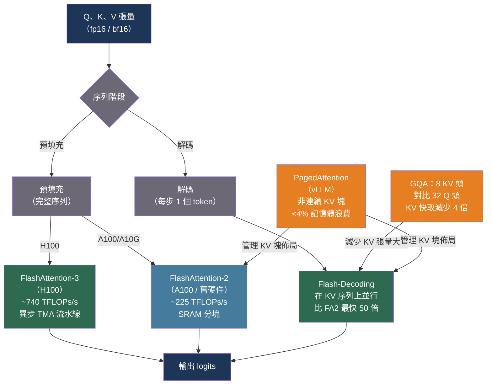

# [BEE-564] FlashAttention 與高效注意力核心

:::info
標準注意力在每次前向傳遞中將 N×N 矩陣具現化到 GPU HBM，使記憶體頻寬——而非計算——成為長序列的瓶頸。FlashAttention 及其後繼者通過將注意力分塊放入 SRAM 來避免這一問題，而分組查詢注意力（GQA）則縮小了在解碼步驟中存儲注意力狀態的 KV 快取。這些技術共同使現代 LLM 能夠在不需要成比例增加更多 GPU 的情況下服務 128K token 的上下文。
:::

## 背景

自注意力的記憶體成本在序列長度上是 O(N²)：計算 N 個 token 的 Q·Kᵀ 產生一個 N×N 矩陣，必須寫入 HBM 並在 softmax 和加權求值時讀回。對於 N = 32,768 個 token 和 fp16 格式的模型，僅此矩陣就佔用 2 GB——比整個序列的 KV 張量還要大。在這些長度下，GPU 花在 HBM 和 Tensor Core 之間傳輸數據的時間多於計算；FLOPS 利用率降至 10% 以下。

**FlashAttention**（Dao 等人，arXiv:2205.14135，NeurIPS 2022）通過 IO 感知分塊解決了這一問題。通過在適合片上 SRAM（共享記憶體）的塊中計算注意力，並且從不將完整的 N×N 矩陣寫入 HBM，將記憶體複雜度降至 O(N)，並將 HBM 讀/寫次數減少 N/block_size 倍。在 GPT-2 的 1K token 序列上，FlashAttention 比 PyTorch 的標準注意力快 3 倍。在 BERT-large 上，端到端訓練快 15%。Path-X（64K token）首次變得可解，精度達到 63.1%。

**FlashAttention-2**（Dao，arXiv:2307.08691，ICLR 2024）通過減少非矩陣乘 FLOP（將縮放操作移到內循環之外）並在每個注意力頭內跨查詢序列維度並行化來提升 FA1，提高了 GPU 佔用率。FA2 吞吐量比 FA1 提高約 2 倍：在 A100 上最高達 225 TFLOPs/s（72% 模型 FLOPS 利用率），而 FA1 約為 25–40%。

**FlashAttention-3**（Shah 等人，arXiv:2407.08608，2024）針對 H100 的 Hopper 架構，FA2 在該架構上僅達到約 35% 利用率，因為 H100 Tensor Core 足夠快，使得 GEMM 之間的 softmax 計算成為瓶頸。FA3 使用 warp 特化通過 H100 的張量記憶體加速器（TMA）異步流水線化 GEMM 和 softmax，FP16 前向傳遞達到約 740 TFLOPs/s（75% 利用率），使用 FP8 接近 1.2 PFLOPs/s。

一個關鍵缺口仍然存在：這些 FA 變體在批次大小和查詢長度上並行化。在自回歸解碼期間，批次大小很小，查詢長度為 1——因此 FA2 GPU 利用率降至 1% 以下。**Flash-Decoding**（Dao 等人，2023；Stanford CRFM 博客）在 KV 序列長度上增加了第三個並行化維度，將鍵和值分成並行處理的塊，並以數值穩定的方式減少部分 softmax 結果。對於 CodeLlama-34B，注意力計算在長序列上比 FA2 最快提高 50 倍；端到端生成最快提高 8 倍。

注意力核心優化計算，但 KV 快取記憶體限制了可以並發服務的請求數量。兩種架構更改減少了 KV 快取大小。**多查詢注意力（MQA）**（Shazeer，arXiv:1911.02150，2019）在所有 Q 頭之間共享一組 K/V 頭，將 KV 快取減少 H 倍（頭的數量）。**分組查詢注意力（GQA）**（Ainslie 等人，arXiv:2305.13245，EMNLP 2023）使用 G 個組（1 < G < H），在保持接近 MHA 質量的同時獲得大部分 MQA 的記憶體節省。GQA 檢查點可以使用原始預訓練計算的 5% 從 MHA 轉換而來。Mistral 7B 使用 32 個查詢頭和 8 個 KV 頭（4 倍減少）；Llama 3 所有規格和 Gemma 2 使用 GQA。

## 最佳實踐

### 為所有 GPU 訓練和推論啟用 FlashAttention-2

**必須（MUST）** 對 GPU 上超過 512 個 token 的任何序列使用 FlashAttention。PyTorch 2.1+ 通過 `scaled_dot_product_attention`（SDPA）自動調度它：

```python
import torch
import torch.nn.functional as F

# SDPA 在 CUDA 上對 fp16/bf16 自動調度到 FlashAttention-2。
# 如果您的模型已經使用此調用，無需更改代碼。
out = F.scaled_dot_product_attention(
    query, key, value,       # (batch, heads, seq, head_dim)
    attn_mask=None,          # 因果掩碼由 is_causal 處理
    dropout_p=0.0,
    is_causal=True,          # 無需具現化掩碼即可啟用因果掩碼
)

# 顯式選擇後端（對調試或強制 FA 有用）：
from torch.nn.attention import sdpa_kernel, SDPBackend
with sdpa_kernel(SDPBackend.FLASH_ATTENTION):
    out = F.scaled_dot_product_attention(query, key, value, is_causal=True)
```

對於 HuggingFace 模型，在加載時啟用 FA2：

```python
from transformers import AutoModelForCausalLM
import torch

# FA2 要求模型為 fp16 或 bf16
model = AutoModelForCausalLM.from_pretrained(
    "meta-llama/Llama-3.1-8B-Instruct",
    torch_dtype=torch.bfloat16,
    attn_implementation="flash_attention_2",
    device_map="auto",
)
```

**不得（MUST NOT）** 在 fp32 模型上使用 `attn_implementation="flash_attention_2"`——FA2 需要半精度輸入。如果需要 fp32 支持，使用 `attn_implementation="sdpa"`（SDPA 的記憶體高效後端支持 fp32）。

### 在 H100 上使用 FA3

**應該（SHOULD）** 在 H100 部署上安裝 FA3。FA2 在 H100 上僅達到約 35% 利用率，因為 GPU 的 GEMM 吞吐量超過了 FA2 的 softmax 流水線。FA3 通過異步 TMA 流水線達到約 75% 利用率：

```bash
# 安裝帶 FA3 支持的 FlashAttention（需要 CUDA 12.3+，H100）
pip install flash-attn --no-build-isolation

# 在 Python 中：在 Hopper 硬件上安裝 flash_attn >= 3.0 時自動選擇 FA3；
# 無需更改 API。
```

對於 H100 上的 vLLM，安裝軟件包後自動使用 FA3；無需配置標誌。

### 部署使用 GQA 的模型以減輕 KV 快取記憶體壓力

**應該（SHOULD）** 在 KV 快取是瓶頸記憶體約束時優先選擇使用 GQA 的模型。在高並發下，所有活躍請求的 KV 快取與模型權重競爭 GPU VRAM。

每個 token 每層的 KV 快取記憶體（一個序列，fp16）：

```
kv_cache_bytes_per_token_per_layer = 2 * n_kv_heads * head_dim * 2
# 係數 2：一個 K 張量 + 一個 V 張量
# 係數 2：fp16 每個元素 2 字節

# Llama-3.1-8B：n_kv_heads=8，head_dim=128，32 層
kv_per_token = 2 * 8 * 128 * 2 = 4,096 字節 = 4 KB 每個 token
# 4K 上下文：4 KB * 4,096 = 每個請求 16 MB
# 128K 上下文：4 KB * 131,072 = 每個請求 512 MB

# 使用 MHA 的 Llama-3.1-8B（32 KV 頭）：KV 快取多 4 倍
# = 每個 4K 上下文請求 64 MB——並發請求少得多就會填滿 VRAM
```

對於在具有 V GB 空閒 VRAM（模型權重後）的 GPU 上以上下文長度 L 服務 N 個並發請求的目標：

```python
def max_concurrent_requests(
    vram_gb: float,
    n_kv_heads: int,
    head_dim: int,
    n_layers: int,
    context_length: int,
    dtype_bytes: int = 2,       # fp16
) -> int:
    kv_per_token_per_layer = 2 * n_kv_heads * head_dim * dtype_bytes
    kv_per_request = kv_per_token_per_layer * n_layers * context_length
    return int((vram_gb * 1e9) / kv_per_request)

# Llama-3.1-8B（GQA，8 KV 頭），4K 上下文，40 GB 空閒 VRAM：
print(max_concurrent_requests(40, n_kv_heads=8, head_dim=128, n_layers=32, context_length=4096))
# → 2,500 個並發請求

# 假設的 MHA 變體（32 KV 頭）：
print(max_concurrent_requests(40, n_kv_heads=32, head_dim=128, n_layers=32, context_length=4096))
# → 625 個並發請求——少 4 倍
```

### 為長上下文推論啟用 FlashDecoding

**應該（SHOULD）** 確保推論框架在序列長度超過約 8K token 時啟用 FlashDecoding。在 vLLM 中，FlashDecoding 在 KV 序列較長時的解碼步驟中自動使用。在原始 FlashAttention 中：

```python
# flash_attn_with_kvcache 在序列長度超過閾值時自動啟用 Flash-Decoding
from flash_attn import flash_attn_with_kvcache

# k_cache, v_cache: (batch, seqlen_cache, n_kv_heads, head_dim)——分頁或連續
output = flash_attn_with_kvcache(
    q=query_tokens,     # (batch, 1, n_heads, head_dim)——單個解碼 token
    k_cache=k_cache,
    v_cache=v_cache,
    cache_seqlens=cache_seqlens,   # 每個序列的實際長度
    causal=True,
)
# 當 seqlen_cache 較大時應用 Flash-Decoding 的並行 KV 分割
```

**不應（SHOULD NOT）** 僅在預填充階段測試注意力核心。FlashAttention-2 的加速在長序列預填充時最為明顯。Flash-Decoding 的加速在長 KV 長度的解碼時最為明顯。生產 LLM 工作負載通常在解碼而非預填充上花費更多時間。應分別使用 TTFT（預填充）和 ITL（解碼）指標測試兩個階段（見 BEE-560）。

## 圖解



## 常見錯誤

**在 fp32 模型上使用 `attn_implementation="flash_attention_2"`。** FA2 需要半精度（fp16 或 bf16）。傳入 fp32 張量會引發運行時錯誤。在啟用 FA2 之前，始終將模型轉換為 bf16，或使用 `attn_implementation="sdpa"`（它會回退到記憶體高效的 fp32 核心）。

**僅在預填充階段進行基準測試。** FlashAttention-2 的加速在長序列預填充時最為明顯。Flash-Decoding 的加速在長 KV 長度解碼時最為明顯。生產 LLM 工作負載通常在解碼比預填充花費更多時間。應使用 TTFT（預填充）和 ITL（解碼）指標分別測試兩個階段（見 BEE-560）。

**擴展上下文長度時忽略 KV 快取大小。** 將上下文從 4K 擴展到 128K 將每個請求的 KV 快取乘以 32 倍。沒有 GQA，這會在達到理論上下文限制的一小部分時耗盡 GPU VRAM。在向用戶宣傳最大上下文長度之前，始終計算 KV 快取記憶體。

**將 GQA 視為免費午餐。** GQA 將 KV 快取減少 H/G，並在 G=1（MQA）時輕微降低質量。模型使用經驗選擇的比例（通常為 4:1 到 8:1 的查詢與 KV 組），平衡質量和快取減少。將 MHA 檢查點轉換為 GQA 需要繼續預訓練（根據 Ainslie 等人，約需 5% 的預訓練計算）——不能通過簡單地重塑權重來完成。

**安裝 FA2 但不確認它是否被調度。** 如果 FA2 未安裝或輸入為 fp32，PyTorch SDPA 會靜默回退到數學注意力。通過以下方式驗證：

```python
import torch

q = torch.randn(1, 8, 512, 64, dtype=torch.bfloat16, device="cuda")
with torch.backends.cuda.sdp_kernel(
    enable_flash=True, enable_math=False, enable_mem_efficient=False
):
    try:
        out = torch.nn.functional.scaled_dot_product_attention(q, q, q)
        print("FlashAttention 已調度")
    except RuntimeError as e:
        print(f"FA 不可用：{e}")
```

## 相關 BEE

- [BEE-30021](llm-inference-optimization-and-self-hosting.md) -- LLM 推論優化與自托管：更廣泛的推論優化領域
- [BEE-30058](llm-load-testing-and-capacity-planning.md) -- LLM 負載測試與容量規劃：用於測量 FA 和 FlashDecoding 收益的 TTFT 和 ITL 指標
- [BEE-30059](speculative-decoding-for-llm-inference.md) -- LLM 推論的投機解碼：正交技術；FlashAttention 和投機解碼可以結合
- [BEE-30061](llm-quantization-for-inference.md) -- LLM 推論量化：FA3 FP8 模式結合了量化和分塊

## 參考資料

- [Dao et al. FlashAttention: Fast and Memory-Efficient Exact Attention with IO-Awareness — arXiv:2205.14135, NeurIPS 2022](https://arxiv.org/abs/2205.14135)
- [Dao. FlashAttention-2: Faster Attention with Better Parallelism and Work Partitioning — arXiv:2307.08691, ICLR 2024](https://arxiv.org/abs/2307.08691)
- [Shah et al. FlashAttention-3: Fast and Accurate Attention with Asynchrony and Low-precision — arXiv:2407.08608, 2024](https://arxiv.org/abs/2407.08608)
- [Dao et al. Flash-Decoding for Long-Context Inference — crfm.stanford.edu, 2023](https://crfm.stanford.edu/2023/10/12/flashdecoding.html)
- [Shazeer. Fast Transformer Decoding: One Write-Head is All You Need — arXiv:1911.02150, 2019](https://arxiv.org/abs/1911.02150)
- [Ainslie et al. GQA: Training Generalized Multi-Query Transformer Models from Multi-Head Checkpoints — arXiv:2305.13245, EMNLP 2023](https://arxiv.org/abs/2305.13245)
- [Kwon et al. Efficient Memory Management for Large Language Model Serving with PagedAttention — arXiv:2309.06180, SOSP 2023](https://arxiv.org/abs/2309.06180)
- [Dao-AILab. FlashAttention GitHub — github.com/Dao-AILab/flash-attention](https://github.com/Dao-AILab/flash-attention)
- [HuggingFace. GPU 推論文檔 — huggingface.co/docs/transformers](https://huggingface.co/docs/transformers/main/en/perf_infer_gpu_one)
