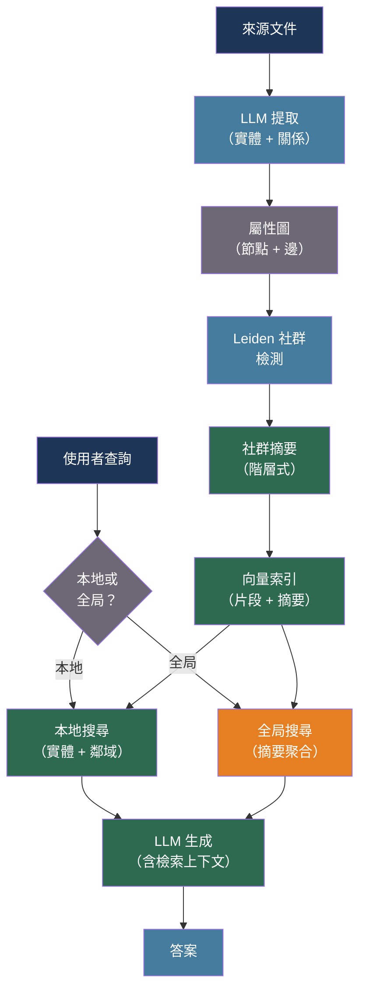

# [BEE-554] GraphRAG 與知識圖譜增強生成

:::info
標準向量 RAG 檢索孤立的文字片段 — 它無法遍歷多跳關係或對社群結構進行推理。GraphRAG 從來源文件建立知識圖譜，使用 Leiden 演算法檢測社群，並生成階層式摘要，讓系統能夠進行本地實體查詢和全局主題級別查詢，而這些是平面檢索無法回答的。
:::

## 背景脈絡

具有密集向量搜尋的檢索增強生成（BEE-509）可以檢索語義相似的文字片段，但將每個片段視為獨立單元。當查詢需要跨多個文件聚合資訊時 — 「這個語料庫的主要主題是什麼？」或「實體 A 如何通過中間實體與實體 B 相關？」— 向量相似性單獨無法遍歷關係圖。

Edge、Trinh、Cheng、Bradley、Chao、Mody、Truitt 和 Larson（arXiv:2404.16130，Microsoft Research，2024）介紹了 GraphRAG，這是一個從來源文字中使用 LLM 提取實體-關係三元組、建立屬性圖、應用 Leiden 社群檢測演算法（Traag、Waltman 和 van Eck，arXiv:1810.08473）將實體劃分為階層式社群，並生成與原始文字片段一起索引的社群摘要的管道。在查詢時，GraphRAG 路由到本地搜尋（實體查詢、鄰域擴展）或全局搜尋（社群摘要聚合），根據查詢類型匹配檢索策略。

Peng、Xia、Galley 和 Gao（arXiv:2408.08921，2024）調查了圖增強 LLM 方法，按圖結構的整合方式分類：作為檢索上下文（GraphRAG 風格）、作為結構化輸入到圖感知編碼器，或作為推理追蹤。他們的分析顯示，全局查詢 — 需要跨文件合成的查詢 — 僅通過基於圖的檢索才有顯著改善；本地事實查詢在圖和向量方法之間表現相當，使混合檢索成為實際預設選項。

對後端工程師而言，GraphRAG 增加了一個一次性運行（或隨著文件添加而增量更新）的構建階段，同時存儲原始嵌入向量和社群摘要。查詢路由邏輯必須將每個查詢分類為本地或全局，成本模型也截然不同：全局查詢聚合許多摘要，成本更高；本地查詢與標準向量 RAG 相當。

## 最佳實踐

### 使用 LLM 提取的三元組建立知識圖譜

**必須**（MUST）從來源文件中提取實體-關係三元組，而非假設名詞短語單獨能捕捉圖結構。每個文字片段一次 LLM 遍歷可提取實體、關係類型和屬性：

```python
from dataclasses import dataclass, field
from typing import Literal
import json

@dataclass
class Entity:
    name: str
    type: str          # PERSON, ORG, CONCEPT, LOCATION, EVENT
    description: str
    source_chunk_id: str

@dataclass
class Relationship:
    source: str        # 實體名稱
    target: str        # 實體名稱
    relation: str      # 例如 "FOUNDED", "ACQUIRED", "PART_OF"
    description: str
    weight: float = 1.0

EXTRACTION_PROMPT = """\
Given the following text chunk, extract all entities and relationships.
Return JSON with keys "entities" and "relationships".

Each entity: {"name": str, "type": str, "description": str}
Each relationship: {"source": str, "target": str, "relation": str, "description": str}

Text:
{chunk_text}
"""

async def extract_graph_elements(
    chunk: str,
    chunk_id: str,
    client,
    model: str = "claude-haiku-4-5-20251001",
) -> tuple[list[Entity], list[Relationship]]:
    """
    使用廉價、快速的模型進行提取 — 這對每個片段只運行一次。
    整個語料庫可能有數千個片段；token 成本會累積。
    """
    response = await client.messages.create(
        model=model,
        max_tokens=2048,
        messages=[{"role": "user", "content": EXTRACTION_PROMPT.format(chunk_text=chunk)}],
    )
    data = json.loads(response.content[0].text)
    entities = [Entity(**e, source_chunk_id=chunk_id) for e in data.get("entities", [])]
    relationships = [Relationship(**r) for r in data.get("relationships", [])]
    return entities, relationships
```

**應該**（SHOULD）通過標準化名稱（小寫、去除標點符號）並按規範形式分組，合併跨片段的重複實體。當「OpenAI」、「Open AI」和「openai」被視為獨立節點時，圖的品質會急劇下降。

### 應用 Leiden 社群檢測進行階層式摘要

**必須**（MUST）在生成摘要前對圖進行社群劃分。Leiden 演算法產生可證明高模塊度的社群，並支援階層式解析度等級：

```python
import networkx as nx

def build_graph(entities: list[Entity], relationships: list[Relationship]) -> nx.Graph:
    G = nx.Graph()
    for entity in entities:
        G.add_node(entity.name, type=entity.type, description=entity.description)
    for rel in relationships:
        if G.has_edge(rel.source, rel.target):
            # 加強現有邊而不是重複
            G[rel.source][rel.target]["weight"] += rel.weight
        else:
            G.add_edge(rel.source, rel.target, relation=rel.relation, weight=rel.weight)
    return G

def detect_communities(G: nx.Graph, resolution: float = 1.0) -> dict[str, int]:
    """
    透過 graspologic 或 igraph 使用 Leiden 演算法。
    resolution > 1.0 產生更多、更小的社群。
    resolution < 1.0 產生更少、更大的社群。
    以多個解析度運行以進行階層式索引。
    """
    try:
        from graspologic.partition import hierarchical_leiden
        partitions = hierarchical_leiden(G, resolution=resolution)
        return {node: partitions[node] for node in G.nodes()}
    except ImportError:
        # 備選：Louvain（品質較低但廣泛可用）
        from networkx.algorithms.community import louvain_communities
        communities = louvain_communities(G, resolution=resolution)
        return {node: i for i, comm in enumerate(communities) for node in comm}

async def generate_community_summary(
    community_nodes: list[str],
    G: nx.Graph,
    client,
    model: str = "claude-haiku-4-5-20251001",
) -> str:
    """
    摘要一個社群內的實體和關係。
    摘要被存儲並用於全局查詢的檢索。
    """
    node_descriptions = [
        f"{node}: {G.nodes[node].get('description', '')}"
        for node in community_nodes
        if node in G.nodes
    ]
    edge_descriptions = [
        f"{u} --[{G[u][v].get('relation', 'related')}]--> {v}"
        for u, v in G.subgraph(community_nodes).edges()
    ]
    prompt = (
        "Summarize the following knowledge graph community in 3-5 sentences. "
        "Identify the central theme and key relationships.\n\n"
        "Entities:\n" + "\n".join(node_descriptions) + "\n\n"
        "Relationships:\n" + "\n".join(edge_descriptions)
    )
    response = await client.messages.create(
        model=model,
        max_tokens=512,
        messages=[{"role": "user", "content": prompt}],
    )
    return response.content[0].text
```

### 在本地搜尋和全局搜尋之間路由查詢

**必須**（MUST）在檢索前分類查詢 — 本地查詢（實體特定、事實性）受益於鄰域擴展；全局查詢（主題性、聚合性）需要社群摘要聚合：

```python
from enum import Enum

class QueryType(Enum):
    LOCAL = "local"    # 實體查詢、事實檢索、關係追蹤
    GLOBAL = "global"  # 主題分析、趨勢摘要、跨實體合成

LOCAL_SIGNALS = ["who", "when", "where", "what did", "how did", "which company"]
GLOBAL_SIGNALS = ["what are the main themes", "summarize", "overall", "in general", "trends"]

def classify_query(query: str) -> QueryType:
    q_lower = query.lower()
    global_score = sum(1 for s in GLOBAL_SIGNALS if s in q_lower)
    local_score = sum(1 for s in LOCAL_SIGNALS if q_lower.startswith(s))
    return QueryType.GLOBAL if global_score > local_score else QueryType.LOCAL

async def hybrid_retrieve(
    query: str,
    vector_store,      # 標準嵌入向量 + FAISS/pgvector
    graph: nx.Graph,
    community_summaries: dict[int, str],  # community_id -> 摘要文字
    embedder,
    top_k: int = 5,
) -> list[str]:
    query_type = classify_query(query)

    if query_type == QueryType.LOCAL:
        # 標準向量搜尋，然後擴展實體鄰域
        chunks = await vector_store.search(query, top_k=top_k)
        # 提取提到的實體並提取其圖鄰居
        return chunks

    else:
        # 全局：嵌入查詢，找到相似的社群摘要
        query_embedding = await embedder.embed(query)
        summary_texts = list(community_summaries.values())
        # 按相關性排名摘要（餘弦相似性或 LLM 評分）
        # 返回頂部摘要作為生成步驟的上下文
        return summary_texts[:top_k]
```

**應該**（SHOULD）記錄每個查詢使用的檢索路徑，並單獨監控全局查詢成本。聚合 50 個社群摘要的單個全局查詢可能花費本地查詢的 10-50 倍。

## 視覺化



## 常見錯誤

**跳過實體去重。** 重複節點使圖碎片化並產生孤立社群。在建立圖之前，始終規範化實體名稱。

**僅在一個解析度下生成社群摘要。** 使用單一 Leiden 解析度會錯過細粒度的實體集群和粗粒度的主題分組。以兩到三個解析度等級生成摘要，並按查詢類型選擇。

**將所有查詢路由到全局搜尋。** 全局搜尋聚合許多摘要，比本地向量檢索昂貴得多。將全局搜尋保留給真正的聚合性查詢。

**不快取社群摘要。** 社群檢測和摘要生成步驟是管道中最昂貴的部分，對靜態語料庫產生穩定的輸出。始終快取摘要；只有在文件或圖結構改變時才重新生成。

**將 GraphRAG 視為向量 RAG 的即插即用替換。** 構建管道（提取、圖建立、社群檢測、摘要）對大型語料庫可能需要幾分鐘到幾小時。計劃增量更新而非在每次添加文件時完全重建。

## 相關 BEE

- [BEE-30007](rag-pipeline-architecture.md) -- RAG 管道架構：GraphRAG 擴展的向量檢索基礎
- [BEE-30029](advanced-rag-and-agentic-retrieval-patterns.md) -- 進階 RAG 與代理檢索模式：多跳和代理驅動的檢索策略
- [BEE-30015](retrieval-reranking-and-hybrid-search.md) -- 檢索重排序與混合搜尋：結合向量和圖訊號

## 參考資料

- [Edge 等人 從局部到全局：一種面向查詢摘要的 Graph RAG 方法 — arXiv:2404.16130，Microsoft Research 2024](https://arxiv.org/abs/2404.16130)
- [Peng 等人 圖檢索增強生成：調查 — arXiv:2408.08921，2024](https://arxiv.org/abs/2408.08921)
- [Traag、Waltman 和 van Eck。從 Louvain 到 Leiden：保證良好連接的社群 — arXiv:1810.08473，Scientific Reports 2019](https://arxiv.org/abs/1810.08473)
- [Microsoft GraphRAG — github.com/microsoft/graphrag](https://github.com/microsoft/graphrag)
- [Neo4j GraphRAG Python 套件 — neo4j.com/labs/genai-ecosystem/graphrag](https://neo4j.com/labs/genai-ecosystem/graphrag)
