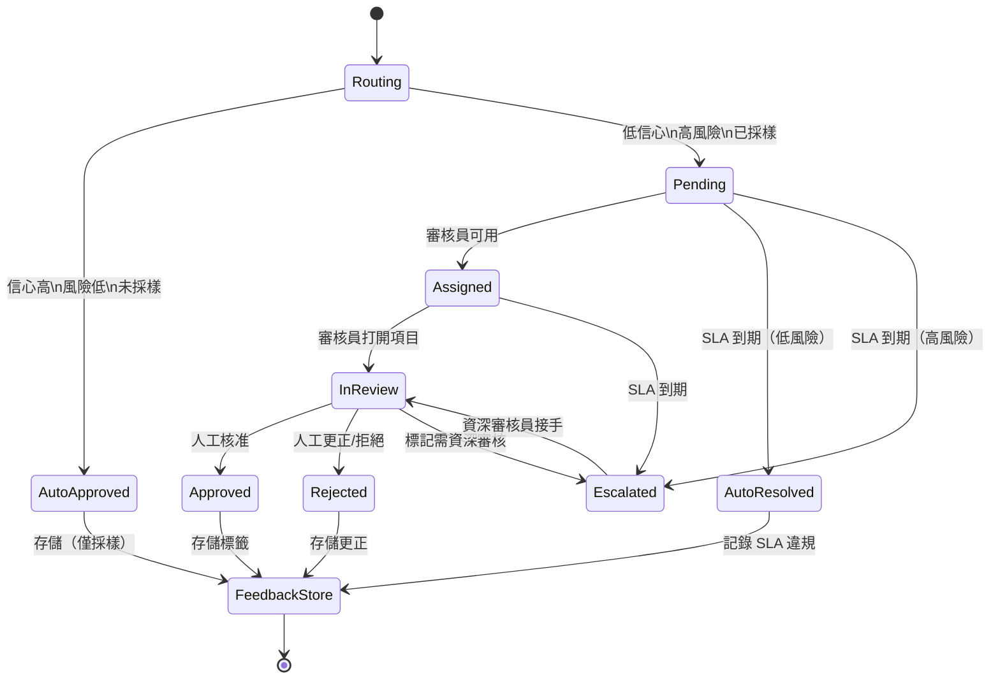

# [BEE-30022] 人工介入 AI 模式

:::info
人工介入（HITL）是一個架構層，當模型信心不足、動作不可逆，或合規稽核要求時，將 AI 輸出路由給人工審核員——並將審核結果作為標記資料回饋，以持續改進。
:::

## 背景

沒有任何生產 AI 系統能在沒有某種人工監督的情況下運作。問題在於如何組織這種監督。原始版本——人工手動審核每個輸出——無法擴展。退化版本——沒有人工看到模型產生的內容——在法規審查下失敗，且不產生改進信號。工程挑戰在於建立一個管道，將人工注意力放在效益最高的地方。

Amershi 等人在 2019 年 ICSE 對 Microsoft 生產 ML 系統的研究中記錄了這種張力：ML 工程中最重要的過程不是模型訓練，而是資料管理以及將人工判斷連接回模型的反饋迴路。沒有收集人工更正的結構化機制，隨著世界偏離訓練分佈，模型會靜默地退化。

主動學習研究（Settles，「主動學習文獻調查」，2009）正式確立了這樣的見解：人工標注在模型不確定的範例上最有價值——而非模型已能正確處理的簡單案例。主動學習開發的按委員會查詢和不確定性採樣策略直接轉化為生產 HITL 路由：將模型最不自信的決策發送給人工。

## 設計思維

HITL 有三個經常被混淆的架構關注點：

**路由**決定哪些輸出需要人工審核。它是應用於模型自身輸出或信心的分類問題。路由層應在關鍵路徑上運行，但必須快速——每次回應前 500ms 的信心檢查是不可接受的。廉價的代理（Token 對數概率、口頭表達的不確定性、基於規則的觸發器）幾乎總是足夠的。

**審核佇列**是保存工作項目、將其分配給審核員、追蹤 SLA 並處理升級的基礎設施。它是一個工作流系統，而非 ML 系統。佇列設計決策（優先級、分配、超時策略）對審核員效率的影響遠超任何模型端優化。

**反饋迴路**將人工審核的結果連接回模型。這是 HITL 運營價值得以實現的地方——但這需要將人工更正視為標記資料集，持久地存儲它們，並最終對其採取行動（微調、規則更新或檢索語料庫更新）。

## 最佳實踐

### 基於信心、風險和採樣進行路由

**SHOULD**（應該）將路由實作為三因素決策，而非單一閾值：

```python
from dataclasses import dataclass
from enum import Enum

class ReviewReason(Enum):
    LOW_CONFIDENCE = "low_confidence"
    HIGH_RISK_ACTION = "high_risk_action"
    AUDIT_SAMPLE = "audit_sample"

@dataclass
class RoutingDecision:
    route_to_human: bool
    reason: ReviewReason | None
    priority: int  # 1 = 高, 3 = 低

import random

def route_output(
    output: str,
    confidence: float,
    action_risk: str,     # "low" | "medium" | "high" | "critical"
    audit_sample_rate: float = 0.05,
) -> RoutingDecision:
    # 高風險或不可逆動作始終進行人工審核
    if action_risk in ("high", "critical"):
        return RoutingDecision(
            route_to_human=True,
            reason=ReviewReason.HIGH_RISK_ACTION,
            priority=1 if action_risk == "critical" else 2,
        )

    # 基於信心的路由
    if confidence < 0.75:
        return RoutingDecision(
            route_to_human=True,
            reason=ReviewReason.LOW_CONFIDENCE,
            priority=2,
        )

    # 隨機稽核採樣——捕獲信心分數遺漏的問題
    if random.random() < audit_sample_rate:
        return RoutingDecision(
            route_to_human=True,
            reason=ReviewReason.AUDIT_SAMPLE,
            priority=3,
        )

    return RoutingDecision(route_to_human=False, reason=None, priority=0)
```

**MUST NOT**（不得）僅依賴模型自身 softmax 概率的信心分數。LLM softmax 輸出是失準的——模型可以輸出高概率的 Token 序列，同時自信地犯錯。使用校準代理：

- **口頭表達的不確定性**：提示模型表達自己的信心（「從 0-100 評估您的信心並解釋原因」）。這比 Token 對數概率更嘈雜，但對 LLM 與實際準確性的相關性更好。
- **一致性採樣**：使用溫度 > 0 多次呼叫相同的提示（3-5 次）並測量輸出一致性。高方差 = 低可靠性。
- **基於規則的觸發器**：輸出中存在「我不確定」、「大約」、「我認為」等短語；缺少必需的結構化欄位；回應長度遠超預期範圍。

**SHOULD** 獨立於信心閾值設置稽核採樣率。採樣能捕獲系統性失敗——模型自信地犯錯的情況——這是基於信心的路由完全遺漏的。對自動核准決策的 5% 稽核率通常足以在數天內捕獲分佈漂移。

### 將審核佇列設計為狀態機

**SHOULD** 將每個審核項目建模為顯式狀態機，而非簡單的狀態欄位。這可防止項目無聲地卡住：

```python
from enum import Enum
from datetime import datetime, timedelta, timezone

class ReviewState(Enum):
    PENDING = "pending"           # 等待審核員分配
    ASSIGNED = "assigned"         # 已分配給審核員
    IN_REVIEW = "in_review"       # 審核員已打開項目
    APPROVED = "approved"         # 人工核准 AI 輸出
    REJECTED = "rejected"         # 人工拒絕；存儲更正後的輸出
    ESCALATED = "escalated"       # 超時或標記需資深審核
    AUTO_RESOLVED = "auto_resolved"  # SLA 到期，應用備用方案

VALID_TRANSITIONS = {
    ReviewState.PENDING: {ReviewState.ASSIGNED, ReviewState.ESCALATED, ReviewState.AUTO_RESOLVED},
    ReviewState.ASSIGNED: {ReviewState.IN_REVIEW, ReviewState.ESCALATED, ReviewState.AUTO_RESOLVED},
    ReviewState.IN_REVIEW: {ReviewState.APPROVED, ReviewState.REJECTED, ReviewState.ESCALATED},
    ReviewState.ESCALATED: {ReviewState.IN_REVIEW, ReviewState.APPROVED, ReviewState.REJECTED},
    ReviewState.APPROVED: set(),
    ReviewState.REJECTED: set(),
    ReviewState.AUTO_RESOLVED: set(),
}

def transition(item: dict, to_state: ReviewState) -> dict:
    current = ReviewState(item["state"])
    if to_state not in VALID_TRANSITIONS[current]:
        raise ValueError(f"無效轉換：{current} → {to_state}")
    item["state"] = to_state.value
    item["updated_at"] = datetime.now(timezone.utc).isoformat()
    return item
```

**MUST** 在項目建立時設置 SLA 截止日期，並運行後台作業來升級或自動解決過期項目。讓項目無限期等待會阻塞下游工作流並破壞審核員信任：

```python
async def process_sla_violations(review_queue, fallback_policy: str):
    """定期運行（例如每分鐘）以處理超時項目。"""
    now = datetime.now(timezone.utc)
    stale_items = await review_queue.find_where(
        state__in=["pending", "assigned"],
        sla_deadline__lt=now.isoformat(),
    )
    for item in stale_items:
        if fallback_policy == "auto_approve":
            await review_queue.transition(item["id"], ReviewState.AUTO_RESOLVED)
            await downstream.release(item["id"], decision="approved", source="sla_timeout")
        elif fallback_policy == "escalate":
            await review_queue.transition(item["id"], ReviewState.ESCALATED)
            await pager.alert(f"審核 SLA 違規：{item['id']}")
        elif fallback_policy == "hold":
            # 不做任何操作——阻塞下游直到審核員採取行動
            await audit_log.record(item["id"], "sla_violation", details={...})
```

**SHOULD** 按動作風險而非單一全局 SLA 定義 SLA 等級。標記的付款授權需要 5 分鐘 SLA；低信心的產品描述需要 24 小時 SLA。

### 為高風險代理動作建立核准工作流

當 AI 代理即將採取不可逆的動作——發送訊息、執行資料庫寫入、收取付款——它應該暫停並請求人工核准，而不是自主繼續。BEE-30002 確立了原則；這是實現：

```python
import asyncio
import uuid

async def request_approval(
    action_type: str,
    action_payload: dict,
    agent_reasoning: str,
    timeout_seconds: int = 300,
) -> dict:
    """
    暫停代理並等待人工核准。
    返回 {"approved": bool, "reviewer_id": str, "notes": str}。
    """
    approval_id = str(uuid.uuid4())
    await approval_queue.submit({
        "id": approval_id,
        "action_type": action_type,
        "action_payload": action_payload,
        "agent_reasoning": agent_reasoning,  # 顯示模型的思維鏈
        "state": "pending",
        "sla_deadline": (datetime.now(timezone.utc) + timedelta(seconds=timeout_seconds)).isoformat(),
    })

    # 輪詢直到核准、拒絕或超時
    deadline = asyncio.get_event_loop().time() + timeout_seconds
    while asyncio.get_event_loop().time() < deadline:
        item = await approval_queue.get(approval_id)
        if item["state"] in ("approved", "rejected"):
            return {
                "approved": item["state"] == "approved",
                "reviewer_id": item.get("reviewer_id"),
                "notes": item.get("reviewer_notes", ""),
            }
        await asyncio.sleep(2.0)

    # 超時——應用配置的備用方案（不要自動核准關鍵動作）
    await approval_queue.transition(approval_id, ReviewState.AUTO_RESOLVED)
    raise TimeoutError(f"核准請求 {approval_id} 在 {timeout_seconds} 秒後超時")
```

**MUST** 在核准請求中包含模型的推理過程，而非只有提議的動作。看到「DELETE user_id=12345」但沒有上下文的審核員無法做出明智的決定。看到代理思維鏈和觸發使用者請求的審核員可以評估動作是否正確。

**MUST NOT** 當 SLA 到期時靜默自動核准關鍵或不可逆動作。高風險動作的超時備用方案應是保持或拒絕，而非核准。

### 持久地收集和存儲反饋

**SHOULD** 將每個人工審核決定視為標記的訓練範例，並以適合未來微調或檢索的格式存儲：

```python
async def record_review_decision(
    original_input: str,
    ai_output: str,
    human_decision: str,   # "approved" | "corrected" | "rejected"
    corrected_output: str | None,
    reviewer_id: str,
    review_reason: ReviewReason,
):
    """存儲在只追加的反饋表中。"""
    await feedback_store.insert({
        "id": str(uuid.uuid4()),
        "created_at": datetime.now(timezone.utc).isoformat(),
        "original_input": original_input,
        "ai_output": ai_output,
        "human_decision": human_decision,
        "corrected_output": corrected_output,  # 若核准未修改則為 Null
        "reviewer_id": reviewer_id,
        "review_reason": review_reason.value,
        # 不存儲 PII；如涉及使用者資料則匿名化 reviewer_id
    })
```

**SHOULD** 在可行的情況下優先使用成對偏好標注，而非二元核准/拒絕。「版本 A 比版本 B 更好」比「版本 A 很好」信息量更大，因為它控制了審核員的嚴格程度。這是 RLHF 管道中用於訓練獎勵模型的資料格式。

**MUST NOT** 通過先顯示 AI 輸出讓反饋迴路引入審核員偏見。當目標是收集人工的獨立判斷（而非驗證 AI）時，在不顯示 AI 答案的情況下呈現任務。

### 儀器化 HITL 管道

**MUST** 至少追蹤以下指標：

| 指標 | 揭示的內容 |
|------|----------|
| 升級率 | 路由到人工審核的輸出比例 |
| 覆蓋率 | 人工更改或拒絕輸出的審核項目比例 |
| 審核時間（p50/p95） | 審核員容量和 SLA 健康狀況 |
| SLA 違規率 | 審核前超時的項目比例 |
| 審核員不一致率 | 兩個審核員達到不同決定的比例 |
| 稽核採樣覆蓋率 | 自信的 AI 決策是否實際正確 |

**SHOULD** 對覆蓋率趨勢而非絕對值發出警報。15% 的覆蓋率可能是可接受的；兩週內從 5% 上升到 15% 的覆蓋率是模型已漂移的信號。

## 視覺圖



## 相關 BEE

- [BEE-30002](ai-agent-architecture-patterns.md) -- AI 代理架構模式：BEE-30002 確立了高風險代理動作的人工檢查點原則；BEE-30022 提供這些檢查點背後的佇列和工作流實現
- [BEE-30004](evaluating-and-testing-llm-applications.md) -- 評估和測試 LLM 應用：稽核採樣和覆蓋率追蹤是饋入 BEE-30004 中描述的持續評估迴路的評估信號
- [BEE-30017](ai-memory-systems-for-long-running-agents.md) -- 長運行代理的 AI 記憶體系統：人工更正的輸出是一種情節記憶，可以存儲和檢索以改進未來的回應
- [BEE-30020](llm-guardrails-and-content-safety.md) -- LLM 護欄與內容安全：安全違規是饋入 HITL 佇列的主要升級觸發器之一

## 參考資料

- [Settles. 主動學習文獻調查 — University of Wisconsin-Madison TR1648, 2009](https://burrsettles.com/pub/settles.activelearning.pdf)
- [Amershi et al. 機器學習的軟體工程：案例研究 — ICSE-SEIP 2019](https://www.microsoft.com/en-us/research/wp-content/uploads/2019/03/amershi-icse-2019_Software_Engineering_for_Machine_Learning.pdf)
- [Guo et al. 關於現代神經網路的校準 — arXiv:1706.04599, ICML 2017](https://arxiv.org/abs/1706.04599)
- [Angelopoulos and Bates. 保形預測溫和介紹 — people.eecs.berkeley.edu](https://people.eecs.berkeley.edu/~angelopoulos/publications/downloads/gentle_intro_conformal_dfuq.pdf)
- [Hugging Face. 圖解來自人類反饋的強化學習 — huggingface.co](https://huggingface.co/blog/rlhf)
- [AWS. 使用 Amazon Augmented AI 進行人工審核 — docs.aws.amazon.com](https://docs.aws.amazon.com/sagemaker/latest/dg/a2i-use-augmented-ai-a2i-human-review-loops.html)
- [Google Cloud. Document AI 的人工介入 — docs.cloud.google.com](https://docs.cloud.google.com/document-ai/docs/hitl)
- [Temporal. 工作流引擎設計原則 — temporal.io](https://temporal.io/blog/workflow-engine-principles)
