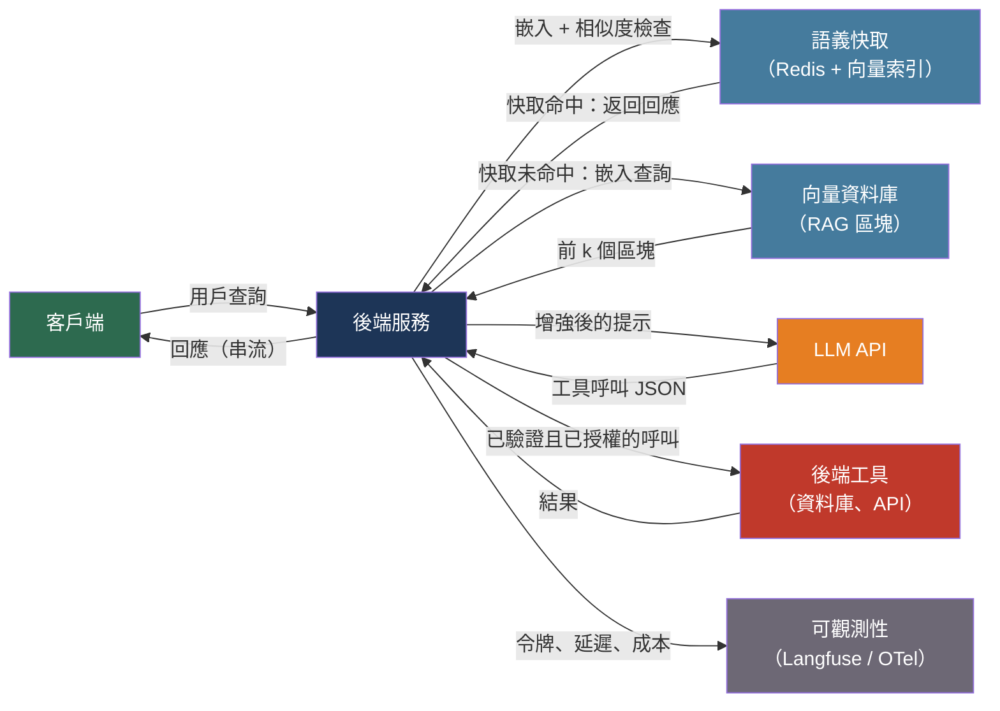

# [BEE-30001] LLM API 整合模式

:::info
將大型語言模型（LLM）API 整合到後端服務中，會引入一類獨特的營運問題：無狀態的上下文管理、基於令牌的計費、機率性輸出，以及全新的攻擊面。將 LLM 呼叫視為一般 HTTP 請求，將產生不可靠、昂貴且不安全的系統。
:::

## 背景

商業 LLM API 時代始於 2020 年 6 月，OpenAI 透過 API 形式發布了 GPT-3。2022 年 11 月 ChatGPT 的問世，使 LLM API 從研究領域的稀罕事物轉變為生產工程的關切焦點，推動了專用工具、可觀測性平台和安全框架的誕生。到 2025 年，OWASP 已發布 LLM 應用程式 Top 10，並建立生成式 AI 安全項目，標誌著 LLM 整合已成為一等軟體安全領域。

LLM API 與傳統服務 API 之間的根本差異在於狀態性與輸出確定性。資料庫呼叫在網路層面是確定性且無狀態的。LLM API 呼叫在網路層面是無狀態的——模型在呼叫之間沒有記憶——但輸出是機率性的：相同的提示可能產生不同的回應。無狀態性意味著每次多輪對話必須在每個請求中重新發送完整的對話歷史。機率性意味著輸入驗證必須同時覆蓋輸出，而不僅僅是輸入。

基於令牌的計費取代了按請求定價，在實作選擇——發送多少上下文、是否快取回應、如何積極截斷對話歷史——與基礎設施成本之間建立了直接關聯。一個功能正確但設計粗糙的 LLM 整合，其成本可能是精心設計版本的十倍。

## 核心概念

**令牌（Token）**：LLM 處理的基本單位。令牌不是單詞——它是由分詞器（OpenAI 使用 tiktoken，詞彙表為 cl100k 或 o200k）產生的子詞單位。粗略估計，一個令牌約等於四個英文字元或 0.75 個英文單詞。LLM API 對輸入令牌（提示）和輸出令牌（回應）分別計費，輸出令牌通常比輸入令牌貴二到四倍。

**上下文視窗（Context window）**：模型在單個請求中可處理的最大令牌數——包括輸入提示和輸出回應的總和。截至 2025 年，上下文視窗範圍從 8k 令牌（較小模型）到 1M 令牌（GPT-4.1、Gemini 1.5 Pro）。超過上下文視窗將產生錯誤。

**聊天訊息格式**：多輪對話的業界標準格式使用具有三種角色的訊息物件陣列：`system`（初始指令）、`user`（人類輪次）、`assistant`（模型輪次）。API 沒有會話狀態——每個請求必須發送完整的對話歷史。

**串流（Streaming）**：LLM 逐令牌地生成內容。串流透過伺服器傳送事件（SSE）在令牌生成時立即傳遞給客戶端，而非等待完整回應。這大幅降低了感知延遲，但以更複雜的實作為代價。

## 最佳實踐

### 發送結構化上下文，而非原始對話

**MUST（必須）在每個請求中以角色排序格式發送完整的對話歷史。** 模型在 API 呼叫之間沒有記憶。

```python
messages = [
    {"role": "system", "content": "You are a helpful assistant for an e-commerce platform."},
    {"role": "user",   "content": "What is the status of order #12345?"},
    {"role": "assistant", "content": "Order #12345 is in transit, expected delivery Thursday."},
    {"role": "user",   "content": "Can I change the delivery address?"},
]
response = client.chat.completions.create(model="gpt-4o", messages=messages)
```

**SHOULD（應該）在上下文視窗填滿之前實作對話壓縮策略**：將早期輪次摘要為單個 `assistant` 訊息並捨棄逐字歷史。從頭部截斷會移除關鍵上下文；從尾部截斷會移除最近的上下文。滾動摘要可同時保留兩者。

**SHOULD NOT（不應該）** 在提示中包含憑證、API 金鑰或內部系統識別碼——它們會對模型可見，若存在提示注入攻擊時將被洩露。

### 向客戶端串流回應

**SHOULD（應該）為任何超過一句話的用戶互動串流回應。** 串流使用 SSE：回應標頭設定 `Content-Type: text/event-stream`，每個令牌區塊作為 `data:` 事件到達。

```python
# FastAPI 串流端點
from fastapi import FastAPI
from fastapi.responses import StreamingResponse

async def stream_completion(prompt: str):
    with client.chat.completions.stream(
        model="gpt-4o",
        messages=[{"role": "user", "content": prompt}],
    ) as stream:
        for text in stream.text_stream:
            yield f"data: {text}\n\n"
    yield "data: [DONE]\n\n"

@app.get("/chat")
async def chat(prompt: str):
    return StreamingResponse(stream_completion(prompt), media_type="text/event-stream")
```

### 控制令牌成本

**MUST（必須）在發送可能接近模型上下文限制的請求之前計算輸入令牌數。** 使用模型的分詞器（OpenAI 使用 tiktoken）計算令牌並在達到限制之前截斷或壓縮。

```python
import tiktoken

def count_tokens(messages: list[dict], model: str = "gpt-4o") -> int:
    enc = tiktoken.encoding_for_model(model)
    # 每條訊息 4 個令牌開銷，回應引子 2 個
    total = 2
    for m in messages:
        total += 4 + len(enc.encode(m["content"]))
    return total
```

**SHOULD（應該）實作語義快取**，以避免對語義等價的提示重複查詢模型。語義快取將每個提示的嵌入向量與其回應一起儲存；對於新請求，若新提示的嵌入與已快取提示的相似度超過閾值（通常為 0.85 餘弦相似度），則返回已快取的回應。這可使用 GPTCache 或帶向量搜尋的 Redis 來實現，可降低重複或同義查詢的延遲和成本。

**SHOULD（應該）在每個請求上設定明確的 `max_tokens`** 以限制輸出長度並防止費用失控。選擇適合預期輸出的值，而非模型最大值。

### 防禦提示注入攻擊

提示注入是 LLM 版本的 SQL 注入：攻擊者控制的輸入會改變模型的指令集。與 SQL 注入不同，提示中的指令和資料之間沒有語法邊界——模型將兩者都作為自然語言推理。

**MUST（必須）在將用戶提供的輸入注入提示之前驗證和清理它。** 最低要求：
- 拒絕包含已知注入模式的輸入（`ignore all previous instructions`、`DAN mode`、角色切換命令）
- 將從外部來源（網頁、上傳文件）獲取的內容視為不受信任的資料，類似 SQL 用戶輸入

**MUST NOT（不得）** 僅基於 LLM 輸出允許模型執行具有重大後果的操作（發送電子郵件、刪除記錄、扣款），而不經過驗證層。模型的輸出不是受信任的指令來源。

**SHOULD（應該）在基於模型輸出執行操作之前，根據預期的 Schema 驗證模型輸出。** 如果模型預期返回結構化 JSON，請解析並驗證它——不要評估或執行它。

```python
import json
from pydantic import BaseModel

class OrderAction(BaseModel):
    action: str  # "cancel" | "update" | "none"
    order_id: str

def parse_model_action(completion: str) -> OrderAction:
    try:
        data = json.loads(completion)
        return OrderAction(**data)  # 驗證型別和枚舉值
    except (json.JSONDecodeError, ValueError) as e:
        raise ValueError(f"模型返回無法解析的輸出：{e}")
```

### 以指數退避實作重試

LLM API 以每分鐘請求數（RPM）和每分鐘令牌數（TPM）執行速率限制。超過其中任一限制會產生 HTTP 429。

**MUST（必須）在 429、500、502、503 和 504** 回應上以指數退避和抖動進行重試：

```python
import random, time
from openai import RateLimitError, APIStatusError

def call_with_backoff(messages: list[dict], max_retries: int = 5):
    for attempt in range(max_retries):
        try:
            return client.chat.completions.create(model="gpt-4o", messages=messages)
        except RateLimitError:
            if attempt == max_retries - 1:
                raise
            delay = (2 ** attempt) + random.uniform(0, 1)
            time.sleep(delay)
        except APIStatusError as e:
            if e.status_code in (500, 502, 503, 504):
                if attempt == max_retries - 1:
                    raise
                time.sleep((2 ** attempt) + random.uniform(0, 1))
            else:
                raise  # 400、401、403 不可重試
```

**MUST NOT（不得）重試** 400（格式錯誤的請求）、401（無效的 API 金鑰）或 403（拒絕存取），而不先修復根本原因。

### 使用 RAG 為知識接地

檢索增強生成（RAG）無需重新訓練即可將模型回應錨定在權威、最新的文件上。其模式為：將文件分塊為令牌大小的片段，用嵌入模型進行嵌入，儲存在向量資料庫中，在查詢時檢索前 k 個最相似的區塊，並將其注入提示中。

```
用戶查詢
  → 嵌入查詢
  → 向量資料庫相似度搜尋（前 k 個區塊）
  → 建構提示：系統指令 + 檢索到的區塊 + 對話歷史 + 用戶查詢
  → LLM 回應
```

關鍵實作決策：
- **區塊大小**：250 令牌是常見的起點。較小的區塊檢索精確；較大的區塊為模型提供更多上下文。區塊大小 10-20% 的重疊可減少邊界效應。
- **嵌入模型**：必須與索引時嵌入文件所用的模型一致。
- **前 k 個**：通常為 3-5 個區塊；更多上下文有填滿視窗和引入雜訊的風險。

**SHOULD（應該）** 將檢索品質與生成品質分開測試。RAG 流程可能在檢索（返回錯誤的區塊）時獨立於生成（模型正確使用區塊）而失敗。

### 保護工具使用 / 函式呼叫

函式呼叫允許模型透過返回結構化 JSON 物件來請求執行後端函式。後端執行函式並將結果回饋給模型。

**MUST（必須）在執行函式之前驗證模型返回的每個參數。** 模型可能會幻覺出合理但不正確的參數值。

**MUST（必須）對每個函式呼叫執行授權檢查。** 模型在用戶的身份下操作——檢查請求用戶是否有權限使用這些參數呼叫該函式。

```python
def execute_tool_call(user_id: str, tool_name: str, args: dict) -> str:
    # 1. 驗證函式是否在允許的集合中
    if tool_name not in ALLOWED_TOOLS:
        raise PermissionError(f"未知工具：{tool_name}")
    # 2. 檢查授權——用戶只能存取自己的訂單
    if tool_name == "get_order" and args.get("order_id"):
        order = db.get_order(args["order_id"])
        if order.user_id != user_id:
            raise PermissionError("存取被拒絕")
    # 3. 使用已驗證的參數執行
    return ALLOWED_TOOLS[tool_name](**args)
```

**MUST（必須）記錄每個函式呼叫**，包括用戶身份、函式名稱、參數和結果，以用於稽核和事故回應。

**SHOULD（應該）要求人工審批**高影響且不可逆的操作（付款、刪除），而非允許模型自主觸發它們。

### 為所有 LLM 呼叫添加儀器

**MUST（必須）為每個 LLM 呼叫記錄輸入令牌數、輸出令牌數、模型版本、延遲和成本。** 沒有這些資料，成本歸因和效能除錯將無從進行。

**SHOULD（應該）使用 OpenTelemetry** 搭配 LLM 感知的儀器庫（openlit、OpenLLMetry），以發出標準化的 span，捕獲提示內容、令牌計數和模型參數，同時包含分散式追蹤上下文。

**SHOULD（應該）使用專門的 LLM 可觀測性平台**（Langfuse、LangSmith 或 Helicone）補充通用 APM。這些平台以適合 LLM 除錯的格式顯示提示-回應對、隨時間的令牌使用量和每次呼叫成本。Langfuse 為有資料駐留要求的團隊提供自架的 MIT 授權版本。

## 視覺化



後端是信任邊界。LLM 是不受信任的外部服務：其輸出在被執行之前必須驗證，其輸入在發送之前必須清理。

## 相關 BEE

- [BEE-2005](../security-fundamentals/cryptographic-basics-for-engineers.md) -- 工程師的密碼學基礎：嵌入模型生成稠密向量；理解餘弦相似度需要理解向量空間和距離度量
- [BEE-9001](../caching/caching-fundamentals-and-cache-hierarchy.md) -- 快取基礎：語義快取是一個專門的快取失效問題——回應按語義接近度快取，而非精確鍵值
- [BEE-12002](../resilience/retry-strategies-and-exponential-backoff.md) -- 重試策略與指數退避：LLM API 的重試模式與任何具有速率限制的外部服務相同
- [BEE-12007](../resilience/rate-limiting-and-throttling.md) -- 速率限制與節流：LLM API 執行 RPM 和 TPM 速率限制；後端應實作客戶端速率限制以保持在配額內
- [BEE-17004](../search/vector-search-and-semantic-search.md) -- 向量搜尋與語義搜尋：RAG 依賴向量搜尋來檢索相關區塊；嵌入和相似度搜尋概念是共享的
- [BEE-2016](../security-fundamentals/broken-object-level-authorization-bola.md) -- 物件層級授權失效（BOLA）：函式呼叫的繞過必須通過與 REST 端點相同的物件層級授權檢查來防止

## 參考資料

- [OpenAI. Chat Completions API Reference — platform.openai.com](https://platform.openai.com/docs/api-reference/chat/create)
- [Anthropic. Messages API Reference — docs.anthropic.com](https://docs.anthropic.com/en/api/messages)
- [OWASP. Top 10 for Large Language Model Applications — owasp.org](https://owasp.org/www-project-top-10-for-large-language-model-applications/)
- [OWASP. LLM Prompt Injection Prevention Cheat Sheet — cheatsheetseries.owasp.org](https://cheatsheetseries.owasp.org/cheatsheets/LLM_Prompt_Injection_Prevention_Cheat_Sheet.html)
- [OpenTelemetry. LLM Observability — opentelemetry.io](https://opentelemetry.io/blog/2024/llm-observability/)
- [Weaviate. Chunking Strategies for RAG — weaviate.io](https://weaviate.io/blog/chunking-strategies-for-rag)
- [Redis. What is Semantic Caching? — redis.io](https://redis.io/blog/what-is-semantic-caching/)
- [GPTCache. Semantic Cache for LLMs — github.com/zilliztech/GPTCache](https://github.com/zilliztech/GPTCache)
- [Microsoft. LLMLingua Prompt Compression — github.com/microsoft/LLMLingua](https://github.com/microsoft/LLMLingua)
- [Langfuse. LLM Observability Platform — langfuse.com](https://langfuse.com/docs/observability/overview)
- [GMO Flatt Security. Securing LLM Function Calling — flatt.tech](https://flatt.tech/research/posts/securing-llm-function-calling/)
- [Martin Fowler. Function Calling Using LLMs — martinfowler.com](https://martinfowler.com/articles/function-call-LLM.html)
