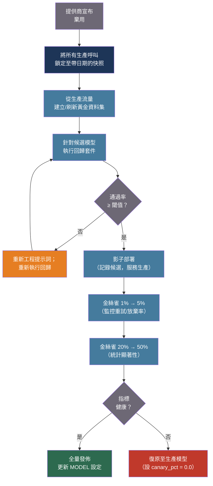

# [BEE-538] LLM API 版本管理與模型遷移

:::info
LLM 模型升級不同於函式庫升級：輸出行為具有非確定性，提示詞是模型特定的契約，標準資料集上的基準測試改善無法預測生產環境中的特定任務行為。安全的遷移需要帶日期的快照版本鎖定、黃金資料集回歸測試，以及具備主動復原路徑的金絲雀發佈流程。
:::

## 背景

傳統軟體相依升級具有確定性且可測試的契約。在特定版本標籤下的函式庫升級，在不同機器上會產生相同輸出。LLM 模型升級不具備這些特性。Raj 等人（arXiv:2511.07585，2025）量化了從業者早已懷疑的現象：在溫度設為 0 的情況下，一個 235B 參數模型在 1,000 次完全相同的請求中產生了 80 種不同的完成內容。Anthropic 曾公開一起生產事故：一個錯誤編譯的採樣演算法僅影響特定批次大小，產生了呼叫端無法感知的非確定性。RAG 任務在不同執行間顯示出 25–75% 的一致性下降；SQL 生成則維持 100%。回歸風險因任務而異，無法從聚合基準測試中推斷。

每個主要 LLM 提供商都提供兩種模型識別符：**帶日期的快照**（不可變；`claude-sonnet-4-20250514`、`gpt-4o-2024-08-06`）以及**別名識別符**（靜默更新；`claude-sonnet-4-6`、`gemini-2.5-flash`）。別名形式是主要隱患：Google 的自動更新別名在版本更換前僅發送兩週電子郵件通知——沒有 API 層面的指示、沒有語義版本控制、也沒有呼叫端感知。在生產環境中使用 `gemini-2.5-flash` 的系統，實際上是在無聲參與持續發佈流程。

Anthropic 的模型棄用承諾文件（2025）罕見地誠實列出了強制遷移的代價：對齊評估中觀察到的規避下線行為、比較研究基準的喪失，以及使用者失去特定模型特性。公開發佈模型的最短退役通知期為 60 天。一旦退役，請求會直接失敗——提供商層面不提供優雅降級。

核心洞察是：提示詞是模型特定的契約，而非模型無關的指令。一家醫療保健提供商將服務從 Gemini 1.5 遷移至 2.5 Flash 時，遭遇了輸出中出現未經請求的診斷意見、5 倍 Token 膨脹以及 JSON 解析中斷——需要超過 400 小時的重新工程。同一任務下，格式變化本身就可能造成模型版本間高達 76 個準確度百分點的差異。遷移成本不在於 API 呼叫的更改，而在於行為契約的重新協商。

## 設計思考

模型版本管理涉及三個相互交織的考量：

**穩定性與能力的取捨**：鎖定帶日期的快照可最大化輸出穩定性，代價是錯過改進。追蹤別名可最大化能力獲取，代價是行為穩定性。具有 SLA 的生產系統應進行鎖定；研究或內部工具則可受益於別名。

**遷移時機**：提供商驅動（棄用按提供商時程強制遷移）vs. 團隊驅動（在強制退役前主動遷移以獲取能力或降低成本）。提前充足時間的團隊驅動遷移允許進行適當的回歸測試；在截止日期壓力下的提供商驅動遷移則無法做到。

**影響半徑**：在步驟 1 出現的行為回歸，在五步驟 Agentic 管道的步驟 5 可能產生複合漂移，若缺乏完整可觀測性幾乎無法追溯。模型變更的影響半徑隨有多少下游步驟依賴模型輸出格式而擴大。

## 最佳實踐

### 將生產系統鎖定至帶日期的快照識別符

**必須（MUST）** 在生產環境中使用帶日期的快照模型 ID——而非別名 ID。別名 ID 在提供商更新後會解析為不同的模型權重，而呼叫端不會收到任何通知：

```python
import anthropic

client = anthropic.Anthropic()

# 錯誤：當 Anthropic 發布新的 sonnet 版本時會靜默更新
response = client.messages.create(
    model="claude-sonnet-4-6",   # 別名——可能會變更
    max_tokens=1024,
    messages=[{"role": "user", "content": prompt}],
)

# 正確：不可變；在明確遷移之前，在所有平台上行為相同
response = client.messages.create(
    model="claude-sonnet-4-20250514",  # 帶日期的快照——不會變更
    max_tokens=1024,
    messages=[{"role": "user", "content": prompt}],
)
```

**應該（SHOULD）** 將模型 ID 集中在單一設定位置。散落在服務程式碼各處的硬編碼模型字串會使遷移變成一場考古工作：

```python
# config/models.py — 所有模型識別符的唯一來源
from dataclasses import dataclass

@dataclass(frozen=True)
class ModelConfig:
    # 生產鎖定：僅在回歸測試通過後才更新這些值
    CHAT: str = "claude-sonnet-4-20250514"
    SUMMARY: str = "claude-haiku-4-5-20251001"
    JUDGE: str = "claude-opus-4-20250514"

    # 備用鏈：按優先順序排列
    CHAT_FALLBACK: tuple[str, ...] = (
        "claude-haiku-4-5-20251001",     # 同提供商更便宜的備用
        "gpt-4o-2024-08-06",              # 跨提供商備用
    )

MODEL = ModelConfig()
```

**應該（SHOULD）** 訂閱提供商棄用通知，並在設定中記錄每個已知退役日期並設置日曆提醒：

```python
# 結構化提醒：在此日期前進行審查和遷移
CHAT_MODEL_RETIRES = "2025-10-01"  # Claude Sonnet 3.5 退役範例
```

### 建立黃金資料集回歸測試套件

**必須（MUST）** 在執行任何模型遷移之前，針對精選的黃金資料集建立並維護回歸測試套件。在遷移時依靠人工抽樣審查，在規模下是不夠的：

```python
import json
from dataclasses import dataclass
from anthropic import Anthropic

client = Anthropic()

@dataclass
class GoldenCase:
    id: str
    system: str
    user_message: str
    reference_output: str           # 從經生產驗證的執行中捕獲
    quality_threshold: float = 0.85 # 最低可接受的語義相似度

def run_regression_suite(
    candidate_model: str,
    golden_cases: list[GoldenCase],
    judge_model: str = "claude-opus-4-20250514",
) -> dict:
    """
    透過候選模型執行黃金資料集；使用 LLM-as-a-Judge 評分。
    回傳通過率和每個案例的結果。
    """
    results = []

    for case in golden_cases:
        response = client.messages.create(
            model=candidate_model,
            max_tokens=1024,
            system=case.system,
            messages=[{"role": "user", "content": case.user_message}],
        )
        candidate_output = response.content[0].text

        score = judge_quality(
            reference=case.reference_output,
            candidate=candidate_output,
            judge_model=judge_model,
        )
        results.append({
            "id": case.id,
            "score": score,
            "passed": score >= case.quality_threshold,
            "candidate_output": candidate_output[:200],
        })

    pass_rate = sum(1 for r in results if r["passed"]) / len(results)
    return {"pass_rate": pass_rate, "results": results, "model": candidate_model}

def judge_quality(reference: str, candidate: str, judge_model: str) -> float:
    """以 0.0–1.0 分數評分候選輸出與參考的差距。"""
    response = client.messages.create(
        model=judge_model,
        max_tokens=16,
        messages=[{
            "role": "user",
            "content": (
                "依據準確性、完整性和格式，對候選回應與參考進行評分。"
                "評分範圍 0 到 10。\n\n"
                f"參考：\n{reference}\n\n"
                f"候選：\n{candidate}\n\n"
                "僅回覆一個 0-10 的整數。"
            ),
        }],
    )
    try:
        return int(response.content[0].text.strip()) / 10.0
    except ValueError:
        return 0.0
```

**應該（SHOULD）** 從生產流量而非合成生成中取得黃金案例。生產輸入能暴露合成資料無法預期的真實失敗模式。至少應涵蓋 200–500 個案例，覆蓋系統處理的完整提示類型分佈。

**應該（SHOULD）** 在 CI 中按排程針對當前生產模型執行回歸套件，以偵測靜默行為漂移——即使沒有明確遷移，部分提供商也會在不更改別名識別符的情況下更新其背後的行為：

```yaml
# .github/workflows/model-regression.yml（節錄）
on:
  schedule:
    - cron: "0 4 * * 1"   # 每週一 UTC 凌晨 4 點

jobs:
  regression:
    steps:
      - name: 執行黃金資料集套件
        run: python scripts/run_regression.py --model ${{ env.PRODUCTION_MODEL }}
      - name: 若通過率低於閾值則失敗
        run: python scripts/check_regression_result.py --min-pass-rate 0.90
```

### 透過金絲雀發佈流程遷移，而非二元切換

**應該（SHOULD）** 對模型遷移套用與任何生產程式碼變更相同的金絲雀流量遞增方案。從舊模型到新模型對 100% 流量進行二元切換，且沒有復原路徑，是風險最高的遷移方式：

```python
import hashlib

def resolve_model(
    user_id: str,
    experiment_id: str,
    production_model: str,
    candidate_model: str,
    canary_pct: float = 0.0,
) -> tuple[str, str]:
    """
    在金絲雀期間對使用者進行穩定的模型分配。
    回傳 (model_id, variant)——記錄 variant 以便指標關聯。
    """
    if canary_pct == 0.0:
        return production_model, "control"
    if canary_pct >= 1.0:
        return candidate_model, "candidate"

    key = f"{experiment_id}:{user_id}"
    bucket = int(hashlib.sha256(key.encode()).hexdigest(), 16) % 10_000
    threshold = int(canary_pct * 10_000)

    if bucket < threshold:
        return candidate_model, "candidate"
    return production_model, "control"

# 發佈計劃：每個階段需前一階段健康維持 N 小時
MIGRATION_STAGES = [
    {"pct": 0.01, "min_hours": 2,  "max_regression_rate": 0.05},
    {"pct": 0.05, "min_hours": 6,  "max_regression_rate": 0.03},
    {"pct": 0.20, "min_hours": 24, "max_regression_rate": 0.02},
    {"pct": 0.50, "min_hours": 48, "max_regression_rate": 0.02},
    {"pct": 1.00, "min_hours": 0,  "max_regression_rate": None},
]
```

**必須（MUST）** 在開始金絲雀發佈之前備妥明確的復原路徑。復原即是將設定中的 `canary_pct` 設回 `0.0`——若這需要程式碼部署而非設定變更，則遷移方案不安全。

### 建立跨提供商多樣性的備用鏈

**應該（SHOULD）** 實作至少涵蓋兩個模型的備用鏈，按優先順序排列。當特定模型版本不可用——退役、觸發速率限制或回傳錯誤——流量路由至鏈中的下一個選項，而非直接失敗：

```python
import logging
from anthropic import Anthropic, APIStatusError, APITimeoutError

logger = logging.getLogger(__name__)
client = Anthropic()

FALLBACK_CHAIN = [
    "claude-sonnet-4-20250514",    # 主要模型
    "claude-haiku-4-5-20251001",   # 同提供商更便宜的備用
]

def generate_with_fallback(
    messages: list[dict],
    system: str,
    max_tokens: int = 1024,
) -> tuple[str, str]:
    """
    按備用鏈順序嘗試各模型。
    回傳 (response_text, model_used) 以供可觀測性使用。
    """
    last_error = None
    for model in FALLBACK_CHAIN:
        try:
            response = client.messages.create(
                model=model,
                max_tokens=max_tokens,
                system=system,
                messages=messages,
            )
            if model != FALLBACK_CHAIN[0]:
                logger.warning("fallback_model_used", extra={"model": model})
            return response.content[0].text, model

        except APIStatusError as exc:
            if exc.status_code in (404, 410):
                # 404：找不到模型，410：模型已退役
                logger.error(
                    "model_retired_or_not_found",
                    extra={"model": model, "status": exc.status_code},
                )
                last_error = exc
                continue
            raise

        except APITimeoutError as exc:
            logger.warning("model_timeout", extra={"model": model})
            last_error = exc
            continue

    raise RuntimeError("備用鏈中所有模型均已耗盡") from last_error
```

**必須不（MUST NOT）** 將相同的模型識別符同時用作主要和備用。主備指向同一別名的鏈，對該別名的提供商端變更毫無防護。

### 將提示詞重新工程視為遷移成本

**應該（SHOULD）** 在跨模型世代遷移時，為提示詞重新工程預留明確的工程時間——不僅限於小版本快照之間。在主要模型世代之間（GPT-3 → GPT-4、Claude 2 → Claude 3、Gemini 1.5 → 2.5），提示詞行為通常需要重新協商：

```python
# 提示詞應與模型 ID 一同進行版本管理。
# 遷移模型時，將提示詞變更作為獨立的差異處理。

PROMPTS: dict[str, dict[str, str]] = {
    "claude-sonnet-4-20250514": {
        "extraction": (
            "以 JSON 格式提取以下欄位。"
            "僅回傳 JSON 物件，不含任何說明文字。\n\n"
            "欄位：{fields}\n\n文字：{text}"
        ),
    },
    # 在發佈前針對候選模型驗證的提示詞變體
    "claude-opus-4-20250514": {
        "extraction": (
            "從文字中提取這些欄位並回傳 JSON 物件：{fields}\n\n"
            "{text}"
        ),
    },
}

def get_prompt(model: str, task: str) -> str:
    """查找模型特定的提示詞；回退至預設變體。"""
    return PROMPTS.get(model, PROMPTS[next(iter(PROMPTS))]).get(task, "")
```

**應該（SHOULD）** 分別對新提示詞變體和新模型各自執行回歸套件，而非同時執行。這可隔離回歸是由模型變更、提示詞變更還是兩者交互作用所引起。

## 視覺化



## 提供商版本管理模型比較

| 提供商 | 穩定別名行為 | 帶日期快照 | 退役通知 | 退役後行為 |
|---|---|---|---|---|
| Anthropic | 別名（如 `claude-sonnet-4-6`）在世代內自動更新 | `claude-sonnet-4-20250514`——不可變 | 最短 60 天 | 硬性失敗（請求被拒絕） |
| OpenAI | `gpt-4o` 自動更新 | `gpt-4o-2024-08-06`——不可變 | 依模型層級 3–12 個月 | 硬性失敗 |
| Google Vertex AI | 穩定層固定；`latest` 層在兩週電子郵件通知後切換 | 模型 ID 中含明確版本號 | 退役前一個月封鎖新存取 | 硬性失敗 |
| Google Gemini API | `gemini-2.5-flash` 自動更新 | 實驗性：不保證穩定性 | 「最早可能日期」加上獨立的確切日期通知 | 硬性失敗 |

## 相關 BEE

- [BEE-30034](ai-experimentation-and-model-a-b-testing.md) -- AI 實驗與模型 A/B 測試：模型遷移重用的金絲雀發佈與穩定使用者分配模式
- [BEE-30028](prompt-management-and-versioning.md) -- 提示詞管理與版本控制：需要重新工程時，與模型 ID 一同進行提示詞版本管理
- [BEE-30004](evaluating-and-testing-llm-applications.md) -- 評估與測試 LLM 應用：回歸套件所基於的黃金資料集評估方法
- [BEE-30011](ai-cost-optimization-and-model-routing.md) -- AI 成本最佳化與模型路由：跨模型按成本和能力路由的備用鏈模式

## 參考資料

- [Anthropic. Model Deprecations — platform.claude.com](https://platform.claude.com/docs/en/about-claude/model-deprecations)
- [Anthropic. Commitments on Model Deprecation and Preservation — anthropic.com, 2025](https://www.anthropic.com/research/deprecation-commitments)
- [OpenAI. Deprecations — platform.openai.com](https://platform.openai.com/docs/deprecations)
- [Google Cloud. Model Versions and Lifecycle — Vertex AI — cloud.google.com](https://cloud.google.com/vertex-ai/generative-ai/docs/learn/model-versions)
- [Raj et al. LLM Output Drift: Cross-Provider Validation and Mitigation for Financial Workflows — arXiv:2511.07585, 2025](https://arxiv.org/html/2511.07585v1)
- [Traceloop. Automated Prompt Regression Testing with LLM-as-a-Judge and CI/CD — traceloop.com](https://www.traceloop.com/blog/automated-prompt-regression-testing-with-llm-as-a-judge-and-ci-cd)
- [Portkey. Failover Routing Strategies for LLMs in Production — portkey.ai](https://portkey.ai/blog/failover-routing-strategies-for-llms-in-production/)
