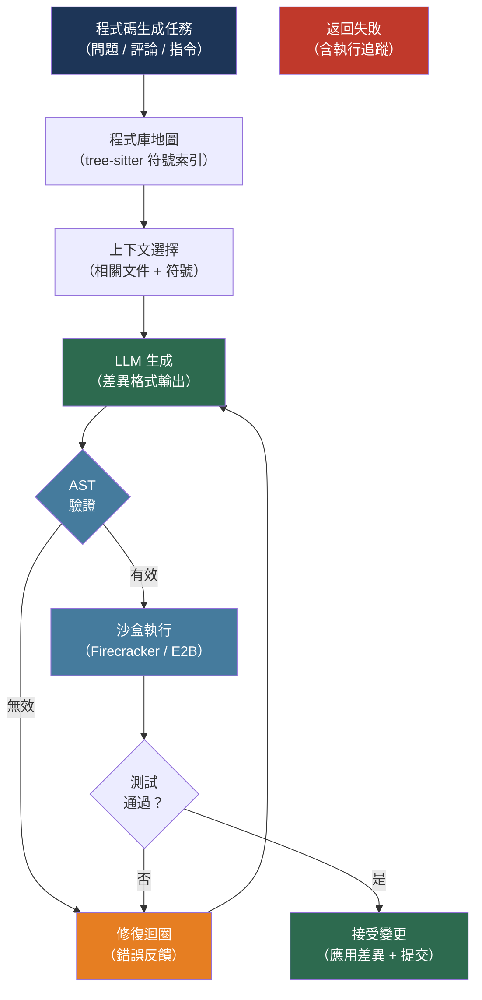

# [BEE-535] 基於 LLM 的程式碼生成與審查模式

:::info
將 LLM 整合到程式碼生成或審查流程中，需要的不只是一個提示詞和文字回應——它需要程式庫層級的上下文管理、基於 AST 的驗證、隔離的執行沙盒，以及下游工具可以直接操作的結構化輸出格式。
:::

## 背景

Li 等人（AlphaCode，arXiv:2203.07814，Science 2022）證明 LLM 能夠以媲美人類參賽者的水準解決競賽程式設計問題——不是靠生成一個完美的解法，而是生成數百萬個多樣化的候選方案，再過濾出最有可能通過測試的前十個。AlphaCode 的核心工程洞察是：生產品質的程式碼生成是一條流水線，而非單次呼叫：廣泛生成、按結構過濾、對測試執行，最後只返回存活的候選方案。

Rozière 等人（Code Llama，arXiv:2308.12950，Meta 2023）引入了填充中段（Fill-in-the-Middle，FIM）預訓練，這是 Bavarian 等人（arXiv:2207.14255，2022）所形式化的技術：模型不再總是從左到右生成，而是學習在給定前後上下文的情況下填充缺失的片段。FIM 是內嵌補全成為可能的能力——模型看到游標前後的程式碼，只生成中間部分。

生產程式碼生成中最困難的問題不是生成看起來合理的程式碼——現代模型能可靠地做到這一點。困難在於提供足夠的上下文。Jimenez 等人（SWE-bench，arXiv:2310.06770，ICLR 2024）在來自 12 個 Python 程式庫的真實 GitHub 問題上評估模型；即使有程式庫訪問權限，早期最先進的模型也只能解決不到 2% 的問題。瓶頸在於上下文：知道哪些文件與特定變更相關。通過建立呼叫圖、按引用排序文件或構建程式庫地圖來解決這個問題的系統，表現明顯更好。

## 設計思維

程式碼生成流程由四個層次組成：

1. **上下文選擇**——識別與當前任務相關的文件、符號和依賴關係；將它們精簡以符合模型的上下文視窗
2. **生成**——以選定的上下文呼叫模型；使用結構化輸出或差異格式來約束回應
3. **驗證**——在接受之前通過 AST 分析解析生成的程式碼；拒絕結構上無效的輸出
4. **執行**——在隔離的沙盒中運行測試或使用者程式碼；將失敗反饋給模型進行自我修復

每個層次都可以獨立最佳化。一個上下文選擇出色但缺乏驗證的系統，會以非微不足道的頻率生成語法錯誤的程式碼。一個有驗證但缺乏沙盒的系統，在生成的程式碼嘗試寫入磁碟、發起網路呼叫或消耗無限記憶體時會失敗。

## 最佳實踐

### 建立程式庫地圖進行上下文選擇

**SHOULD**（應該）構建程式庫地圖——程式碼庫的緊湊符號索引——而非天真地包含整個文件。包含一個超過 10,000 行的完整文件會消耗上下文預算，但對相關性的貢獻並不成比例：

```python
import subprocess
import json
from pathlib import Path

def build_repo_map(repo_path: str, query_files: list[str] = None) -> str:
    """
    使用 tree-sitter 提取函數/類別定義並按引用頻率排序，
    以構建緊湊的程式庫地圖。返回適合 LLM 上下文注入的字串。

    生產環境中，Aider 的 RepoMap 實作（aider.chat/docs/repomap.html）
    在符號引用圖上應用 PageRank 來排名重要性。
    """
    repo = Path(repo_path)
    definitions = []

    for py_file in repo.rglob("*.py"):
        relative = py_file.relative_to(repo)
        try:
            source = py_file.read_text(encoding="utf-8", errors="ignore")
        except OSError:
            continue

        # 提取頂層定義（簡化版；生產環境使用 tree-sitter 提高準確性）
        import ast as py_ast
        try:
            tree = py_ast.parse(source)
        except SyntaxError:
            continue

        for node in py_ast.walk(tree):
            if isinstance(node, (py_ast.FunctionDef, py_ast.AsyncFunctionDef, py_ast.ClassDef)):
                if node.col_offset == 0:  # 僅頂層
                    sig = f"{relative}:{node.lineno} — {node.name}"
                    definitions.append(sig)

    # 截斷以符合上下文預算（約 500 個符號 → 約 2,000 個標記）
    return "\n".join(definitions[:500])


def select_relevant_files(
    repo_path: str,
    task_description: str,
    repo_map: str,
    k: int = 5,
) -> list[str]:
    """
    根據程式庫地圖詢問模型哪些文件與任務相關。
    返回相對文件路徑列表。
    """
    import anthropic
    client = anthropic.Anthropic()

    response = client.messages.create(
        model="claude-sonnet-4-6",
        max_tokens=256,
        messages=[{
            "role": "user",
            "content": (
                f"Given this repository map:\n\n{repo_map}\n\n"
                f"Which {k} files are most relevant to this task: {task_description}\n\n"
                f"Return only a JSON array of relative file paths."
            ),
        }],
    )
    import json
    return json.loads(response.content[0].text)
```

**SHOULD NOT** 在還需要其他文件時，對超過約 200 行的文件包含完整內容。優先使用符號層級的上下文（函數簽名、類別定義、文件字串），僅對直接修改的文件補充完整內容。

### 以差異格式請求程式碼

**SHOULD** 指示模型以統一差異格式而非完整改寫文件來返回變更。差異更小（每個上下文可容納更多變更）、清晰表達意圖，且可確定性地應用：

```python
import anthropic

DIFF_SYSTEM_PROMPT = """\
You are a code editing assistant. When asked to modify code, respond ONLY with a unified diff
in the format produced by `diff -u`. Do not include any explanation outside the diff block.

Example format:
--- a/path/to/file.py
+++ b/path/to/file.py
@@ -10,6 +10,8 @@
 def existing_function():
-    old_line
+    new_line
+    added_line
     unchanged_line
"""

def generate_code_change(
    task: str,
    file_path: str,
    file_content: str,
    context_files: dict[str, str],  # {路徑: 內容}
) -> str:
    """返回統一差異字串。"""
    client = anthropic.Anthropic()

    context_block = "\n\n".join(
        f"# {path}\n```python\n{content}\n```"
        for path, content in context_files.items()
    )

    response = client.messages.create(
        model="claude-sonnet-4-6",
        max_tokens=2048,
        system=DIFF_SYSTEM_PROMPT,
        messages=[{
            "role": "user",
            "content": (
                f"Task: {task}\n\n"
                f"File to modify ({file_path}):\n```python\n{file_content}\n```\n\n"
                f"Related context:\n{context_block}"
            ),
        }],
    )
    return response.content[0].text

def apply_diff(original: str, diff_text: str) -> str:
    """使用 patch 工具將統一差異應用到文件內容。"""
    import tempfile, os
    with tempfile.NamedTemporaryFile(mode="w", suffix=".py", delete=False) as f:
        f.write(original)
        orig_path = f.name
    with tempfile.NamedTemporaryFile(mode="w", suffix=".patch", delete=False) as f:
        f.write(diff_text)
        patch_path = f.name
    try:
        result = subprocess.run(
            ["patch", "--output=-", orig_path, patch_path],
            capture_output=True, text=True,
        )
        if result.returncode != 0:
            raise ValueError(f"Patch failed: {result.stderr}")
        return result.stdout
    finally:
        os.unlink(orig_path)
        os.unlink(patch_path)
```

### 接受前以 AST 解析驗證生成的程式碼

**MUST**（必須）在將生成的程式碼寫入磁碟或執行之前，通過適合該語言的 AST 解析器進行解析。LLM 以非微不足道的頻率生成語法無效的程式碼，尤其是在接近上下文限制時以及對於較少見的語言：

```python
import ast as py_ast
from dataclasses import dataclass

@dataclass
class ValidationResult:
    valid: bool
    errors: list[str]

def validate_python(source: str) -> ValidationResult:
    """
    兩級驗證：
    1. 解析層：捕捉語法錯誤
    2. 語意層：捕捉常見結構問題
    """
    errors = []

    # 第 1 級：語法檢查
    try:
        tree = py_ast.parse(source)
    except SyntaxError as e:
        return ValidationResult(valid=False, errors=[f"SyntaxError at line {e.lineno}: {e.msg}"])

    # 第 2 級：結構檢查
    for node in py_ast.walk(tree):
        # 偵測不應出現在生成程式碼中的危險內建函數
        if isinstance(node, py_ast.Call):
            if isinstance(node.func, py_ast.Name) and node.func.id in ("exec", "eval", "__import__"):
                errors.append(f"Unsafe builtin call '{node.func.id}' at line {node.lineno}")

        # 偵測受限模組的導入
        if isinstance(node, (py_ast.Import, py_ast.ImportFrom)):
            module = (node.names[0].name if isinstance(node, py_ast.Import)
                      else node.module or "")
            if module.startswith(("os.system", "subprocess", "socket")):
                errors.append(f"Restricted module import '{module}' at line {node.lineno}")

    return ValidationResult(valid=len(errors) == 0, errors=errors)

def validate_and_repair(
    source: str,
    task: str,
    max_attempts: int = 3,
) -> str:
    """
    驗證 → 修復迴圈。失敗時，將錯誤作為修正的上下文反饋給模型。
    """
    import anthropic
    client = anthropic.Anthropic()

    for attempt in range(max_attempts):
        result = validate_python(source)
        if result.valid:
            return source

        error_msg = "\n".join(result.errors)
        response = client.messages.create(
            model="claude-sonnet-4-6",
            max_tokens=2048,
            messages=[{
                "role": "user",
                "content": (
                    f"The following code has errors:\n\n```python\n{source}\n```\n\n"
                    f"Errors:\n{error_msg}\n\n"
                    f"Fix the code to resolve these errors. "
                    f"Return only the corrected code, no explanation."
                ),
            }],
        )
        source = response.content[0].text.strip().removeprefix("```python").removesuffix("```")

    raise ValueError(f"Code failed validation after {max_attempts} attempts")
```

### 在隔離沙盒中執行

**MUST** 在隔離環境中執行 LLM 生成的程式碼。直接在主機上執行不受信任程式碼的程式碼生成系統容易受到文件系統訪問、網路資料外洩和資源耗盡的攻擊：

```python
# 使用 E2B（e2b.dev）——基於 Firecracker 微虛擬機的沙盒
# pip install e2b-code-interpreter

from e2b_code_interpreter import Sandbox

def execute_in_sandbox(
    code: str,
    timeout_seconds: int = 30,
) -> dict:
    """
    在 E2B Firecracker 微虛擬機中執行程式碼。
    每個沙盒都是隔離的：無主機文件系統訪問，預設無網路。
    沙盒在約 150ms 內啟動，呼叫結束後立即銷毀。
    """
    with Sandbox(timeout=timeout_seconds) as sandbox:
        execution = sandbox.run_code(code)

        return {
            "stdout": execution.logs.stdout,
            "stderr": execution.logs.stderr,
            "error": str(execution.error) if execution.error else None,
            "results": [r.text for r in execution.results if hasattr(r, "text")],
        }

def generate_and_run(task: str, test_code: str) -> dict:
    """
    完整流程：生成 → 驗證 → 沙盒執行 → 測試失敗時修復。
    """
    import anthropic
    client = anthropic.Anthropic()

    # 生成解法
    response = client.messages.create(
        model="claude-sonnet-4-6",
        max_tokens=1024,
        messages=[{
            "role": "user",
            "content": f"Write a Python function to: {task}\nReturn only the function code.",
        }],
    )
    generated = response.content[0].text.strip().removeprefix("```python").removesuffix("```")

    # AST 驗證
    result = validate_python(generated)
    if not result.valid:
        generated = validate_and_repair(generated, task)

    # 在沙盒中執行解法 + 測試程式碼
    combined = f"{generated}\n\n{test_code}"
    execution_result = execute_in_sandbox(combined)

    return {
        "code": generated,
        "execution": execution_result,
        "passed": execution_result["error"] is None and not execution_result["stderr"],
    }
```

**MUST NOT** 以主機層級的文件系統或網路訪問權限運行 LLM 生成的程式碼。即使看起來安全的程式碼也可能通過 DNS 查詢外洩機密，或寫入意外的路徑。使用在核心層面強制隔離的沙盒（Firecracker、gVisor），而非依賴 LLM 層面的安全過濾器。

### 為可操作性構建程式碼審查輸出

**SHOULD** 指示模型以結構化格式返回程式碼審查結果，而非自由格式散文，以便 CI 系統和 GitHub Actions 可以解析：

```python
from pydantic import BaseModel
from enum import Enum
import instructor

class Severity(str, Enum):
    CRITICAL = "critical"   # 安全漏洞、資料遺失風險
    HIGH = "high"           # 會導致錯誤行為的缺陷
    MEDIUM = "medium"       # 程式碼品質問題、可維護性風險
    LOW = "low"             # 風格、次要改進

class ReviewFinding(BaseModel):
    file_path: str
    line_start: int
    line_end: int
    severity: Severity
    category: str           # "security"、"correctness"、"performance"、"style"
    message: str
    suggestion: str | None  # 具體修復建議

class CodeReview(BaseModel):
    summary: str
    findings: list[ReviewFinding]
    approved: bool          # 若無 CRITICAL 或 HIGH 問題則為 True

def review_pull_request(
    diff: str,
    context: str = "",
) -> CodeReview:
    anthropic_client = instructor.from_anthropic(__import__("anthropic").Anthropic())

    return anthropic_client.messages.create(
        model="claude-sonnet-4-6",
        max_tokens=4096,
        messages=[{
            "role": "user",
            "content": (
                f"Review this code diff for correctness, security, and code quality.\n\n"
                f"Diff:\n```\n{diff}\n```\n\n"
                f"Additional context:\n{context}"
            ),
        }],
        response_model=CodeReview,
    )
```

## 視覺圖



## 沙盒技術比較

| 技術 | 隔離層級 | 啟動時間 | GPU 支援 | 最適合 |
|---|---|---|---|---|
| Docker（無沙盒） | 進程 | ~500ms | 是 | 僅開發/測試 |
| gVisor | 系統呼叫攔截 | ~200ms | 有限 | 一般不受信任程式碼 |
| Firecracker | KVM 微虛擬機 | ~125ms | 否 | 高吞吐量程式碼執行 |
| E2B | Firecracker 支援 | ~150ms | 否 | 代理程式碼執行、雲端託管 |
| Modal | gVisor + GPU | ~1s | 是（A100/H100） | 大規模 GPU 工作負載 |

## 相關 BEE

- [BEE-30006](structured-output-and-constrained-decoding.md) -- 結構化輸出與受限解碼：保持生成程式碼可解析格式的語法約束和函數呼叫機制
- [BEE-30018](llm-tool-use-and-function-calling-patterns.md) -- LLM 工具使用與函數呼叫模式：程式碼生成代理使用工具呼叫來調用沙盒執行器、程式碼檢查器和測試運行器
- [BEE-30004](evaluating-and-testing-llm-applications.md) -- 評估和測試 LLM 應用：SWE-bench 和 HumanEval 是黃金資料集評估模式的程式碼專屬實例

## 參考資料

- [Li et al. Competition-Level Code Generation with AlphaCode — arXiv:2203.07814, Science 2022](https://arxiv.org/abs/2203.07814)
- [Rozière et al. Code Llama: Open Foundation Models for Code — arXiv:2308.12950, Meta 2023](https://arxiv.org/abs/2308.12950)
- [Bavarian et al. Efficient Training of Language Models to Fill in the Middle — arXiv:2207.14255, 2022](https://arxiv.org/abs/2207.14255)
- [Jimenez et al. SWE-bench: Can Language Models Resolve Real-World GitHub Issues? — arXiv:2310.06770, ICLR 2024](https://arxiv.org/abs/2310.06770)
- [Aider. RepoMap: Repository-level context for LLMs — aider.chat/docs/repomap.html](https://aider.chat/docs/repomap.html)
- [E2B. Open-source secure sandboxes for AI code execution — e2b.dev](https://e2b.dev/)
- [Python. ast — Abstract Syntax Trees — docs.python.org](https://docs.python.org/3/library/ast.html)
