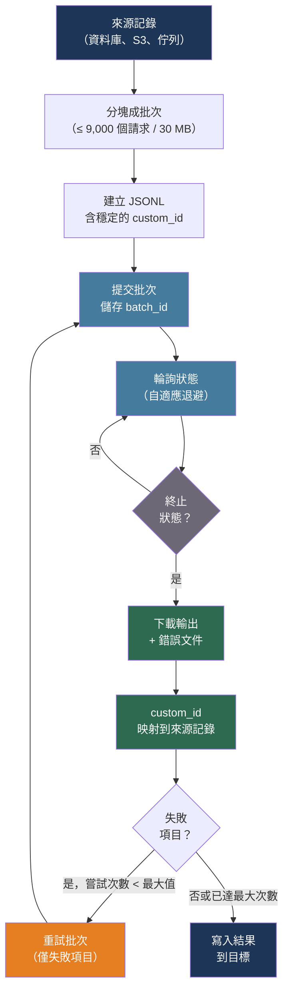

# [BEE-30025] LLM 批次處理模式

:::info
OpenAI 和 Anthropic 的批次處理 API 以最長 24 小時的完成時間換取 50% 的成本折扣——關鍵的工程工作在於構建具備冪等性的 JSONL 輸入、將 custom_id 映射回來源記錄，以及建立只重新提交失敗項目的重試邏輯。
:::

## 背景

即時 LLM API 呼叫針對互動性進行了最佳化：低延遲、即時回應、高每 Token 定價。許多生產工作負載並不需要互動性。將 50 萬張支援工單分類一整夜、為文件語料庫生成嵌入、使用 AI 撰寫的描述來豐富產品目錄——這些工作是吞吐量導向且對延遲容忍度高的。將它們通過即時 API 路由會浪費金錢，並與互動流量競爭速率限制配額。

OpenAI（於 2024 年推出）和 Anthropic 都提供了非同步批次 API 來利用這種不對稱性。OpenAI 的批次 API 提供輸入 Token 五折優惠，具有 24 小時 SLA，每批次接受最多 50,000 個請求，最大 200 MB。Anthropic 的訊息批次 API 提供輸入和輸出 Token 均享五折優惠，典型完成時間為一小時，上限為 24 小時，每批次接受最多 10,000 個請求。批次速率限制與同步 API 配額完全分離，因此大型批次作業不會降低互動功能的效能。

50% 的折扣與其他成本杠桿複合疊加。Anthropic 的折扣與提示快取疊加，對批次中重複的系統提示可實現高達 95% 的總節省。在規模上——每天一百萬次分類請求——即時和批次定價之間的差異每天達到數百美元。

## 設計思維

批次與即時路由決策應在工作流設計時做出，而非逐請求決定。主要標準：

**使用批次**的條件：結果由下游作業消費（非等待中的使用者），延遲可以以小時計，且工作負載足夠大使得 50% 折扣有實質意義。

**使用即時**的條件：有人類在等待回應，延遲必須低於秒級，或工作負載足夠小使得折扣不足以抵消運營複雜性。

最常見的生產模式是混合型：互動功能（聊天、自動補全、即時分類）使用即時呼叫，所有後台豐富化、評估執行和定時處理使用批次呼叫。這兩條路徑共享相同的提示和模型，但使用不同的 API 端點和預算。

## 最佳實踐

### 為批次處理選擇合適的工作負載

**SHOULD**（應該）將以下工作負載類型路由到批次 API：

| 工作負載 | 為何適合批次處理 |
|---------|--------------|
| 大規模文件分類 | 對延遲容忍、高量、確定性提示 |
| 語料庫嵌入生成 | 計算密集，受益於高吞吐量 |
| 夜間資料豐富化管道 | 結果由隔天作業消費 |
| 評估資料集執行 | 非互動、對成本敏感 |
| 批量內容生成 | 行銷文案、產品描述 |

**MUST NOT**（不得）對等待回應的使用者的互動功能使用批次 API，或對 24 小時延遲會違反 SLA 的時間敏感工作流使用批次 API。

### 為冪等性構建 JSONL 輸入

每個批次請求必須包含將結果映射回其來源記錄的 `custom_id`。這是冪等批次處理的關鍵：若批次部分失敗，`custom_id` 讓您能精確識別哪些記錄需要重新提交。

對於 OpenAI，輸入 JSONL 文件中的每一行有三個必填欄位：

```python
import json
import hashlib

def build_openai_batch_request(record_id: str, text: str, system_prompt: str) -> dict:
    """
    custom_id：從來源記錄衍生的穩定、確定性識別碼。
    使用內容的哈希（而非僅 DB ID）意味著使用相同輸入重新執行相同記錄
    會產生相同的 custom_id——對去重複很有用。
    """
    content_hash = hashlib.sha256(f"{record_id}:{text}".encode()).hexdigest()[:16]
    return {
        "custom_id": f"rec-{record_id}-{content_hash}",
        "method": "POST",
        "url": "/v1/chat/completions",
        "body": {
            "model": "gpt-4o-mini",
            "messages": [
                {"role": "system", "content": system_prompt},
                {"role": "user", "content": text},
            ],
            "max_tokens": 256,
            "temperature": 0,   # 分類任務的確定性輸出
        },
    }

def write_batch_jsonl(records: list[dict], system_prompt: str, path: str):
    with open(path, "w") as f:
        for record in records:
            line = build_openai_batch_request(record["id"], record["text"], system_prompt)
            f.write(json.dumps(line) + "\n")
```

對於 Anthropic，結構使用 `params` 欄位而非直接的 API 欄位：

```python
def build_anthropic_batch_request(record_id: str, text: str, system_prompt: str) -> dict:
    return {
        "custom_id": f"rec-{record_id}",
        "params": {
            "model": "claude-haiku-4-5-20251001",
            "max_tokens": 256,
            "system": system_prompt,
            "messages": [{"role": "user", "content": text}],
        },
    }
```

### 提交和輪詢批次

**SHOULD** 將批次提交和輪詢視為獨立、可恢復的步驟。在提交時將 `batch_id` 持久化，以便輪詢作業在中斷後能夠恢復：

```python
import time
from openai import OpenAI

client = OpenAI()

def submit_openai_batch(jsonl_path: str) -> str:
    """上傳文件並建立批次。返回用於輪詢的 batch_id。"""
    with open(jsonl_path, "rb") as f:
        uploaded = client.files.create(file=f, purpose="batch")

    batch = client.batches.create(
        input_file_id=uploaded.id,
        endpoint="/v1/chat/completions",
        completion_window="24h",
    )
    # 返回前將 batch.id 持久化到資料庫
    return batch.id

def poll_openai_batch(batch_id: str, poll_interval_seconds: int = 60) -> dict:
    """
    輪詢直到終止狀態。狀態：
    validating → in_progress → finalizing → completed | failed | expired
    """
    terminal = {"completed", "failed", "expired", "cancelled"}
    while True:
        batch = client.batches.retrieve(batch_id)
        if batch.status in terminal:
            return {
                "status": batch.status,
                "output_file_id": batch.output_file_id,
                "error_file_id": batch.error_file_id,
                "request_counts": batch.request_counts,
            }
        time.sleep(poll_interval_seconds)
```

對於 Anthropic：

```python
import anthropic

ac = anthropic.Anthropic()

def submit_anthropic_batch(requests: list[dict]) -> str:
    batch = ac.messages.batches.create(requests=requests)
    return batch.id  # 返回前持久化

def poll_anthropic_batch(batch_id: str, poll_interval_seconds: int = 60) -> str:
    """處理狀態：in_progress → ended（檢查 results_url）。"""
    while True:
        batch = ac.messages.batches.retrieve(batch_id)
        if batch.processing_status == "ended":
            return batch_id
        time.sleep(poll_interval_seconds)
```

**SHOULD** 對輪詢使用指數退避而非固定間隔。在長佇列末尾提交的批次可能很快完成；對早期批次應用線性輪詢會浪費 API 呼叫，並延遲對慢速批次的偵測：

```python
def adaptive_poll(batch_id: str, initial_interval: int = 10, max_interval: int = 300):
    interval = initial_interval
    while True:
        status = client.batches.retrieve(batch_id).status
        if status in {"completed", "failed", "expired", "cancelled"}:
            return status
        time.sleep(interval)
        interval = min(interval * 1.5, max_interval)
```

### 下載結果並映射回來源記錄

**MUST** 使用 `custom_id` 將每個結果映射回其來源記錄。批次 API 以任意順序返回結果；在處理前以 `custom_id` 建立索引：

```python
import json
from collections import defaultdict

def parse_openai_results(output_file_id: str, error_file_id: str | None) -> dict:
    """
    返回 {"succeeded": {custom_id: response_text}, "failed": {custom_id: error}}。
    """
    succeeded = {}
    failed = {}

    content = client.files.content(output_file_id).text
    for line in content.strip().splitlines():
        result = json.loads(line)
        cid = result["custom_id"]
        if result["response"]["status_code"] == 200:
            body = result["response"]["body"]
            succeeded[cid] = body["choices"][0]["message"]["content"]
        else:
            failed[cid] = result["response"]["body"]

    if error_file_id:
        error_content = client.files.content(error_file_id).text
        for line in error_content.strip().splitlines():
            err = json.loads(line)
            failed[err["custom_id"]] = err.get("error", {})

    return {"succeeded": succeeded, "failed": failed}
```

對於 Anthropic，迭代串流結果端點：

```python
def parse_anthropic_results(batch_id: str) -> dict:
    succeeded = {}
    failed = {}
    for result in ac.messages.batches.results(batch_id):
        cid = result.custom_id
        if result.result.type == "succeeded":
            succeeded[cid] = result.result.message.content[0].text
        else:
            failed[cid] = result.result.error
    return {"succeeded": succeeded, "failed": failed}
```

### 只重試失敗項目

**MUST** 只重試失敗的記錄，而非整個批次。重新提交已成功的記錄會浪費計算資源，並可能在下游系統中造成重複寫入：

```python
async def process_batch_with_retry(
    records: list[dict],
    system_prompt: str,
    max_retries: int = 2,
) -> dict[str, str]:
    """
    對最終成功的所有記錄返回 {record_id: result_text}。
    """
    pending = {r["id"]: r for r in records}
    final_results = {}

    for attempt in range(max_retries + 1):
        if not pending:
            break

        # 只為待處理記錄建立並提交批次
        requests = [
            build_anthropic_batch_request(rid, r["text"], system_prompt)
            for rid, r in pending.items()
        ]
        batch_id = submit_anthropic_batch(requests)
        poll_anthropic_batch(batch_id)
        results = parse_anthropic_results(batch_id)

        for custom_id, text in results["succeeded"].items():
            record_id = custom_id.replace("rec-", "")
            final_results[record_id] = text
            pending.pop(record_id, None)

        # 此次嘗試後仍在 pending 中的記錄將被重試
        if results["failed"] and attempt < max_retries:
            time.sleep(30 * (2 ** attempt))  # 重試批次之間的退避

    return final_results
```

### 分塊大型資料集

**MUST** 將超過 API 限制的資料集分割成多個批次。OpenAI 每批次限制 50,000 個請求和 200 MB；Anthropic 限制 10,000 個請求和 32 MB：

```python
def chunk_records(records: list[dict], chunk_size: int) -> list[list[dict]]:
    return [records[i:i + chunk_size] for i in range(0, len(records), chunk_size)]

async def process_large_dataset(records: list[dict], system_prompt: str) -> dict[str, str]:
    """依序提交多個批次；收集所有結果。"""
    results = {}
    for chunk in chunk_records(records, chunk_size=9_000):  # 保持在 10,000 限制以下
        chunk_results = await process_batch_with_retry(chunk, system_prompt)
        results.update(chunk_results)
    return results
```

**SHOULD** 在輪詢之前將每個 `batch_id` 及其關聯的記錄 ID 持久化到持久儲存。若輪詢過程崩潰，批次繼續在伺服器端處理，ID 允許您恢復收集而無需重新提交：

```python
# 虛擬碼——根據您的實際資料儲存調整
batch_tracking = {
    "batch_id": batch_id,
    "record_ids": [r["id"] for r in chunk],
    "submitted_at": datetime.utcnow().isoformat(),
    "status": "in_progress",
}
db.batch_jobs.insert(batch_tracking)
```

### 監控批次管道健康狀況

**MUST** 追蹤每次批次執行的以下指標：

| 指標 | 揭示的內容 |
|-----|----------|
| 成功率（成功 / 總計） | 資料品質和提示正確性 |
| 按錯誤類型劃分的錯誤率 | 系統性提示失敗 vs 暫時性 API 錯誤 |
| 每批次成本（Token × 批次價格） | 預算追蹤和每記錄成本 |
| 完成時間 | 批次是否在 SLA 內完成 |
| 重試次數分佈 | 重試是否有效或掩蓋了結構性問題 |

**SHOULD** 當批次在 `validating` 或 `finalizing` 狀態停留超過 30 分鐘，或批次錯誤率超過 5% 時發出警報。兩者都表明輸入 JSONL 格式或提示模板存在問題。

## 視覺圖



## 相關 BEE

- [BEE-30001](llm-api-integration-patterns.md) -- LLM API 整合模式：提交和輪詢步驟的重試和超時模式；批次 API 回應的結構化錯誤處理
- [BEE-30011](ai-cost-optimization-and-model-routing.md) -- AI 成本優化與模型路由：批次處理是離線工作負載的主要成本杠桿；BEE-30011 中的路由層應將非互動請求導向批次路徑
- [BEE-30024](llm-caching-strategies.md) -- LLM 快取策略：提示快取在 Anthropic 上與批次折扣疊加；批次規模下兩個層次合計可達 90-95% 的節省
- [BEE-5009](../architecture-patterns/background-job-and-task-queue-architecture.md) -- 後台作業和任務佇列架構：批次作業協調遵循相同的持久作業佇列原則；batch_id 追蹤映射到 BEE-5009 中的作業狀態機模式

## 參考資料

- [OpenAI. 批次 API 指南 — platform.openai.com](https://platform.openai.com/docs/guides/batch)
- [OpenAI. 批次 API 參考 — platform.openai.com](https://platform.openai.com/docs/api-reference/batch)
- [OpenAI. 批次 API 常見問題 — help.openai.com](https://help.openai.com/en/articles/9197833-batch-api-faq)
- [Anthropic. 訊息批次 API — platform.claude.com](https://platform.claude.com/docs/en/build-with-claude/batch-processing)
- [Anthropic. 建立訊息批次 — docs.anthropic.com](https://docs.anthropic.com/en/api/creating-message-batches)
- [OpenAI Cookbook. 批次處理 — cookbook.openai.com](https://cookbook.openai.com/examples/batch_processing)
