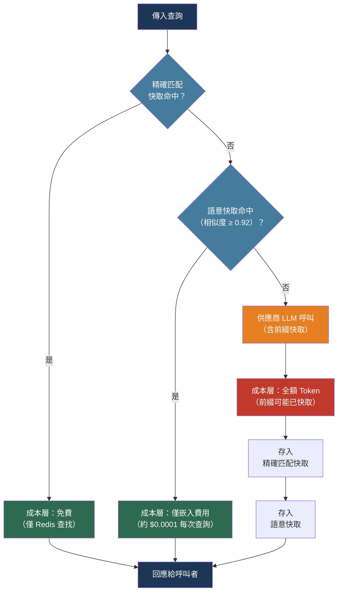

# [BEE-30024] LLM 快取策略

:::info
LLM 快取在三個層次上運作——精確匹配、語意和供應商前綴快取——每個層次都有不同的命中率、失效邏輯和成本特性。依序建立這三層可以將重複性工作負載的有效 Token 支出減少 70-95%。
:::

## 背景

相較於後端所做的幾乎所有其他網路呼叫，LLM API 呼叫既昂貴又緩慢。在 50,000 個 Token 上下文中進行的 GPT-4o 補全，僅輸入 Token 就需花費 $0.375，並增加數百毫秒的延遲。傳統快取原則——儲存昂貴的結果、從快取提供服務、在變更時失效——可以直接應用，但 LLM 工作負載呈現了傳統快取未曾面對的挑戰。

首先，輸入空間是巨大且高維的。兩個意思相同的查詢（「我如何重置密碼？」和「重設忘記密碼的流程是什麼？」）產生相同或幾乎相同的回應，但有不同的字節序列，因此精確匹配快取完全錯過它們。其次，沒有權威的過時性來源：昨天的快取回應今天可能同樣有效，也可能引用過時的定價或已棄用的 API。第三，LLM 呼叫中最昂貴的部分通常不是輸出而是輸入：在數千個請求中相同的系統提示或 RAG 上下文，在每次呼叫時仍按輸入 Token 計費。

供應商端前綴快取解決了第三個問題。OpenAI 於 2024 年引入自動前綴快取（對於 ≥1,024 個 Token 的提示自動應用，快取命中時享有 50% 成本折扣）。Anthropic 引入了 `cache_control` API，讓應用程式對哪些前綴區域被快取擁有明確的控制，讀取成本為基本輸入價格的 10%。兩者都大幅降低了重複前綴的邊際成本，無需應用程式端的快取基礎設施。

## 設計思維

三個快取層解決了問題的不同部分：

**精確匹配快取**捕獲重複的相同查詢（相同位元組、相同模型參數）。對於對話文本，命中率較低，但對分類任務、結構化提示和 FAQ 回應非常高。實現是哈希映射查找——零向量計算，亞毫秒成本。

**語意快取**捕獲改寫的查詢。嵌入傳入查詢，在向量儲存中搜索超過餘弦相似度閾值的相似過去查詢，若找到則返回快取回應。對自然語言工作負載，命中率高於精確匹配。閾值必須調整：太低會對相似但不同的問題產生不正確的回應；太高則退化為接近精確匹配的行為。

**供應商前綴快取**在伺服器端運作。將請求結構化，使靜態內容（系統提示、RAG 上下文、工具定義）首先出現且在請求中保持一致；供應商快取該前綴並對快取命中收取讀取費率。這不能替代應用程式端快取——它適用於完整 LLM 呼叫的輸入 Token——但它大幅降低了快取未命中的成本。

這三層並非互斥。請求首先檢查精確匹配；若未命中，則檢查語意快取；若未命中，才進行供應商呼叫（在內部受益於前綴快取）。三者一起複合其節省效果。

## 最佳實踐

### 為供應商前綴快取構建請求

**MUST**（必須）在每個請求中將靜態內容置於動態內容之前。供應商前綴快取在提示前綴的精確字節序列上運作：快取邊界之前的字符中的任何差異都會導致未命中。

對於 Anthropic，使用 `cache_control` 標記可快取前綴的邊界：

```python
import anthropic

client = anthropic.Anthropic()

def call_with_prompt_cache(system_prompt: str, user_message: str, budget_tokens: int = 0) -> str:
    """
    將系統提示置於 cache_control 下，使 Anthropic 快取它。
    最小可快取長度：Sonnet 為 2,048 個 Token，Opus/Haiku 為 4,096 個 Token。
    快取 TTL：5 分鐘（每次命中時刷新）。某些模型支援 1 小時 TTL。
    成本：寫入 = 1.25x 基本費率，讀取 = 0.10x 基本費率（折扣 90%）。
    """
    messages_params = {
        "model": "claude-sonnet-4-6",
        "max_tokens": 2048,
        "system": [
            {
                "type": "text",
                "text": system_prompt,
                "cache_control": {"type": "ephemeral"},  # 標記前綴以供快取
            }
        ],
        "messages": [{"role": "user", "content": user_message}],
    }

    response = client.messages.create(**messages_params)

    # 在回應中檢查快取使用情況
    usage = response.usage
    # usage.cache_creation_input_tokens：寫入快取的 Token（按 1.25x 收費）
    # usage.cache_read_input_tokens：從快取讀取的 Token（按 0.10x 收費）
    # usage.input_tokens：最後一個快取邊界之後的新 Token
    cache_hit = usage.cache_read_input_tokens > 0
    return response.content[0].text
```

對於 OpenAI，前綴快取是自動的——不需要 API 更改。通過 `usage.prompt_tokens_details.cached_tokens` 檢查快取是否命中：

```python
from openai import OpenAI

client = OpenAI()

def call_with_prefix_cache(system_prompt: str, user_message: str) -> str:
    """
    對於 >= 1,024 個 Token 的提示，OpenAI 自動快取。
    快取命中折扣：快取輸入 Token 享有 50% 折扣（GPT-4o 及更新版本）。
    不需要 API 更改——只需將靜態內容放在最前面。
    """
    response = client.chat.completions.create(
        model="gpt-4o",
        messages=[
            {"role": "system", "content": system_prompt},
            {"role": "user", "content": user_message},
        ],
    )

    cached_tokens = response.usage.prompt_tokens_details.cached_tokens
    return response.choices[0].message.content
```

**MUST** 在所有請求中保持前綴內容字節完全相同。即使是一個字符的差異（時間戳、會話 ID、嵌入系統提示中的隨機選擇問候）也會破壞供應商快取。將所有每請求的變量移到提示末尾，位於快取斷點之後。

**SHOULD**（應該）在自然內容邊界設置 Anthropic 快取斷點：在系統提示之後、在注入的文件之後、在工具定義之後。每個請求最多支援四個斷點。

### 實作精確匹配快取

**SHOULD** 將精確匹配快取作為第一個查找層添加。檢查幾乎不需要任何成本，且沒有誤報風險：

```python
import hashlib
import json
import redis
from typing import Any

cache = redis.Redis(host="localhost", port=6379, decode_responses=True)

def _cache_key(model: str, messages: list[dict], **params) -> str:
    """從所有影響回應的輸入生成確定性快取鍵。"""
    payload = {"model": model, "messages": messages, **params}
    canonical = json.dumps(payload, sort_keys=True, ensure_ascii=True)
    return "llm:exact:" + hashlib.sha256(canonical.encode()).hexdigest()

def exact_match_get(model: str, messages: list[dict], ttl_seconds: int = 3600, **params) -> str | None:
    return cache.get(_cache_key(model, messages, **params))

def exact_match_set(model: str, messages: list[dict], response: str, ttl_seconds: int = 3600, **params):
    cache.setex(_cache_key(model, messages, **params), ttl_seconds, response)
```

**SHOULD** 在快取鍵中包含模型名稱和任何影響輸出的參數（溫度、max_tokens、工具定義）。省略它們會在參數更改時導致過時的快取命中。

**MUST NOT**（不得）對準確性重要的任務快取使用 `temperature > 0` 生成的回應。非零溫度每次呼叫產生不同的輸出；快取其中一個並作為規範答案提供會違背採樣的目的。

### 實作語意快取

**SHOULD** 在精確匹配之後、供應商呼叫之前添加語意快取層。嵌入傳入查詢，搜索相似度閾值以上的相似過去查詢，若找到則提供快取回應：

```python
import numpy as np
from openai import OpenAI

# 需要：啟用向量搜索的 Redis（例如 Redis Stack 或 Redis Cloud）
# pip install redis[hiredis] openai numpy

client = OpenAI()

SIMILARITY_THRESHOLD = 0.92  # 按域調整；從 0.92 開始，謹慎降低

def embed(text: str) -> list[float]:
    """使用 text-embedding-3-small（1536 維）生成嵌入。"""
    response = client.embeddings.create(model="text-embedding-3-small", input=text)
    return response.data[0].embedding

def cosine_similarity(a: list[float], b: list[float]) -> float:
    va, vb = np.array(a), np.array(b)
    return float(np.dot(va, vb) / (np.linalg.norm(va) * np.linalg.norm(vb)))

def semantic_cache_get(query: str, namespace: str = "default") -> str | None:
    """搜索語意快取。返回快取回應或 None。"""
    query_embedding = embed(query)
    # 從 Redis 中檢索候選嵌入（簡化版——在生產中使用 FT.SEARCH 與 KNN）
    candidates = cache.hgetall(f"llm:semantic:{namespace}:index")
    best_similarity = 0.0
    best_key = None
    for stored_key, stored_embedding_json in candidates.items():
        stored_embedding = json.loads(stored_embedding_json)
        sim = cosine_similarity(query_embedding, stored_embedding)
        if sim > best_similarity:
            best_similarity = sim
            best_key = stored_key
    if best_similarity >= SIMILARITY_THRESHOLD and best_key:
        return cache.get(f"llm:semantic:{namespace}:response:{best_key}")
    return None

def semantic_cache_set(query: str, response: str, namespace: str = "default", ttl: int = 3600):
    """儲存查詢嵌入和回應。"""
    query_embedding = embed(query)
    key = hashlib.sha256(query.encode()).hexdigest()
    pipe = cache.pipeline()
    pipe.hset(f"llm:semantic:{namespace}:index", key, json.dumps(query_embedding))
    pipe.setex(f"llm:semantic:{namespace}:response:{key}", ttl, response)
    pipe.execute()
```

**SHOULD** 將相似度閾值從 0.92-0.95 開始，只有在測量代表性查詢樣本的誤報率後才降低它。誤報——對不同問題返回快取回應——比快取未命中更糟糕。監控誤報率；保持在 3% 以下。

**MUST NOT** 在具有不同回應要求的域之間共享語意快取。客戶支援快取和法律文件快取應該有單獨的命名空間；法律域中的查詢相似性可能比表面上相似的客戶支援查詢產生截然不同的有效答案。

### 建立三層查找

**SHOULD** 將所有三層結合在一個函數中，應用程式直接呼叫，而非 LLM 客戶端：

```python
async def cached_llm_call(
    system_prompt: str,
    user_message: str,
    model: str = "claude-sonnet-4-6",
    exact_ttl: int = 3600,
    semantic_ttl: int = 3600,
    use_semantic: bool = True,
) -> dict:
    """
    返回 {"response": str, "cache_layer": str, "cost_tier": str}。
    cache_layer: "exact" | "semantic" | "provider_hit" | "miss"
    """
    messages = [{"role": "user", "content": user_message}]

    # 第一層：精確匹配
    exact = exact_match_get(model, messages, exact_ttl, system=system_prompt)
    if exact:
        return {"response": exact, "cache_layer": "exact", "cost_tier": "free"}

    # 第二層：語意快取
    if use_semantic:
        semantic = semantic_cache_get(user_message)
        if semantic:
            return {"response": semantic, "cache_layer": "semantic", "cost_tier": "embedding_only"}

    # 第三層：供應商呼叫（Anthropic 提示快取在內部處理前綴）
    response_text = call_with_prompt_cache(system_prompt, user_message)

    # 為未來請求填充兩個快取
    exact_match_set(model, messages, response_text, exact_ttl, system=system_prompt)
    if use_semantic:
        semantic_cache_set(user_message, response_text, ttl=semantic_ttl)

    return {"response": response_text, "cache_layer": "miss", "cost_tier": "full"}
```

### 正確地使快取失效

**MUST** 在快取鍵中包含模型版本、系統提示版本和 RAG 語料庫版本。當其內容更改時遞增任何版本；過時的快取條目隨後自動產生未命中，無需手動清除：

```python
import os

def versioned_cache_key(base_key: str) -> str:
    model_version = os.environ["LLM_MODEL_VERSION"]        # 例如 "claude-sonnet-4-6-20250915"
    prompt_version = os.environ["SYSTEM_PROMPT_VERSION"]   # 例如 "v3"
    corpus_version = os.environ.get("RAG_CORPUS_VERSION", "none")  # 例如 "2026-04-15"
    return f"{base_key}:{model_version}:{prompt_version}:{corpus_version}"
```

**MUST** 在升級嵌入模型時使整個語意快取失效。來自不同模型的嵌入存在於不相容的向量空間中；使用新的查詢嵌入對舊嵌入進行快取命中會產生不正確的相似度分數。清除命名空間並重建：

```python
def invalidate_semantic_cache(namespace: str = "default"):
    """每當嵌入模型更改時呼叫此函數。"""
    keys = cache.keys(f"llm:semantic:{namespace}:*")
    if keys:
        cache.delete(*keys)
```

**SHOULD** 設置反映每種內容類型過時風險的 TTL，而非單一全局值：

| 內容類型 | 建議的 TTL |
|---------|-----------|
| 靜態 FAQ、政策文本 | 24 小時 |
| 產品描述、文件 | 4-8 小時 |
| 定價、庫存、即時資料 | 5-15 分鐘 |
| 個性化回應 | 不快取 |

## 視覺圖



## 相關 BEE

- [BEE-9001](../caching/caching-fundamentals-and-cache-hierarchy.md) -- 快取基礎與快取層次結構：BEE-9001 中描述的驅逐策略、快取雪崩預防和 TTL 策略直接適用於此處的精確匹配和語意快取層
- [BEE-30001](llm-api-integration-patterns.md) -- LLM API 整合模式：供應商呼叫的重試和超時邏輯；供應商前綴快取與那裡討論的串流回應互動
- [BEE-30007](rag-pipeline-architecture.md) -- RAG 管道架構：注入系統提示的 RAG 上下文是前綴快取的最大單一候選；語料庫版本必須反映在快取鍵中
- [BEE-30011](ai-cost-optimization-and-model-routing.md) -- AI 成本優化與模型路由：供應商前綴快取是主要成本降低杠桿之一，與模型路由和批次處理並列

## 參考資料

- [Anthropic. 提示快取 — platform.claude.com](https://platform.claude.com/docs/en/build-with-claude/prompt-caching)
- [OpenAI. 提示快取 — platform.openai.com](https://platform.openai.com/docs/guides/prompt-caching)
- [OpenAI. API 提示快取（部落格）— openai.com](https://openai.com/index/api-prompt-caching/)
- [Zilliztech. GPTCache — github.com/zilliztech/GPTCache](https://github.com/zilliztech/GPTCache)
- [Redis. 什麼是語意快取？— redis.io](https://redis.io/blog/what-is-semantic-caching/)
- [Gim et al. LLM 的語意快取 — arXiv:2411.05276, 2024](https://arxiv.org/abs/2411.05276)
- [AWS. 使用有效快取優化 LLM 回應成本和延遲 — aws.amazon.com](https://aws.amazon.com/blogs/database/optimize-llm-response-costs-and-latency-with-effective-caching/)
