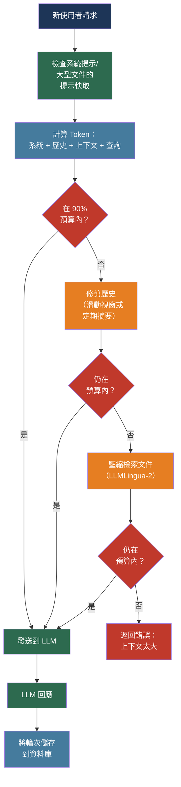

# [BEE-512] LLM 上下文視窗管理

:::info
上下文視窗是 LLM 請求所有組件共享的唯一有限資源——系統提示、對話歷史、檢索文件和生成輸出。有效管理它決定了成本、延遲，以及模型是否真的能找到並使用你放在它面前的資訊。
:::

## 背景

每個基於 Transformer 的 LLM 對單次前向傳播都有最大 Token 預算：上下文視窗。Token 代表輸入（提示 + 檢索上下文 + 對話歷史）和輸出（生成文字）兩者。廣告的大小——GPT-4o 的 128K Token、Claude 和 Gemini 1.5 Pro 的 1M Token——代表 API 強制執行的硬性上限。超過它會產生錯誤或靜默截斷。

實際情況比廣告數字更受限。Liu 等人在「Lost in the Middle: How Language Models Use Long Contexts」（arXiv:2307.03172，TACL 2024）中證明，模型性能沿上下文位置呈 U 形曲線：上下文視窗開頭和結尾的資訊比放在中間的資訊更可靠地被召回。當相關文件從邊界位置移到中間時，多文件問答的性能下降超過 30%。這在所有測試的前沿模型中都成立，儘管在更新的模型上嚴重程度有所降低。

兩個額外的約束加劇了位置退化。首先，預填充延遲——模型在生成第一個 Token 之前處理輸入所花費的時間——隨輸入長度線性擴展。100K Token 的上下文大約有 10K Token 上下文 10 倍的 TTFT。其次，無論模型是否有效地關注到這些 Token，輸入 Token 都按提供商定價計費。用 200K Token 的上下文填充模型部分會忽略的文件是不免費的：無論模型是閱讀並理解了每一段還是略過了 60%，成本都是相同的。

這三種力量——位置召回退化、預填充延遲和每 Token 成本——使上下文視窗管理成為一個一等工程關注點，而非次要最佳化。

## 設計思維

上下文視窗是一個固定容量的預算，必須在競爭需求之間分配：

```
總上下文預算 = 系統提示 + 歷史記錄 + 檢索上下文 + 輸出保留
```

分配給一個組件的每個 Token 對其他組件不可用。一個透過累積指令增長到 15K Token 的系統提示，為對話歷史留下的空間就少了 15K Token。填充 50 個檢索 Chunk 的 RAG 管道為模型輸出留下的空間更少。

分配問題有兩種狀態。對於小文件的短對話，約束是不可見的——一切都可以輕鬆容納。對於長時間運行的對話、大型語料庫或文件處理管道，約束是有約束力的，需要刻意管理：保留哪些歷史記錄、截斷哪些文件，以及何時摘要或壓縮。

正確的心智模型是資源受限系統中的記憶體管理。像物理記憶體一樣，上下文有固定容量，項目可以被驅逐，重要項目應該被保留，存取模式（模型被要求做什麼）應該告知驅逐策略。

## 最佳實踐

### 在發送前計算 Token 並分配預算

**MUST（必須）** 在構建最終請求之前計算 Token。API 在提交時強制執行限制；在組裝多組件提示後才發現溢出，浪費了所有前面步驟的工作。

**SHOULD（應該）** 使用提供商的原生分詞器進行精確計算。OpenAI 的 `tiktoken` 函式庫可以精確計算所有 OpenAI 模型的 Token：

```python
import tiktoken

def count_tokens(text: str, model: str = "gpt-4o") -> int:
    enc = tiktoken.encoding_for_model(model)
    return len(enc.encode(text))

def fits_in_budget(components: dict[str, str], model: str, limit: int) -> bool:
    total = sum(count_tokens(text, model) for text in components.values())
    return total <= limit * 0.90  # 10% 安全邊距
```

**SHOULD（應該）** 為每個組件定義明確的 Token 預算並獨立強制執行。從未寫下的預算是必然會被違反的預算：

| 組件 | 建議分配 |
|------|---------|
| 系統提示 | 2–5K Token（保持小巧；無情地最佳化） |
| 對話歷史 | 剩餘預算的 30–40% |
| 檢索上下文（RAG） | 剩餘預算的 40–50% |
| 輸出保留 | 剩餘預算的 10–15% |
| 安全邊距 | 5–10% |

**MUST NOT（不得）** 將整個上下文視窗分配給輸入而沒有輸出保留。在生成過程中達到上下文限制的模型會靜默截斷；回應在 Token 邊界處無聲結束。

### 明確管理對話歷史

無限制的對話歷史是生產聊天應用程式中上下文限制錯誤最常見的原因。經過 20–30 輪後，大多數對話超過了歷史記錄的實際預算。

**SHOULD（應該）** 根據應用程式需求實施四種策略之一：

**滑動視窗**：逐字保留最後 N 輪，丟棄較舊的訊息。實現簡單，記憶體有界，但丟失早期上下文。適用於當前任務是唯一相關上下文的任務完成聊天機器人。

**定期摘要**：每 K 輪後（或當歷史 Token 計數超過閾值時），摘要累積的輪次並以摘要替換它們。以顯著較低的 Token 成本保留語義連貫性：

```python
SUMMARIZE_THRESHOLD = 0.70  # 當歷史使用歷史預算的 70% 時摘要

def maybe_summarize_history(messages: list, budget: int, model: str) -> list:
    history_tokens = sum(count_tokens(m["content"], model) for m in messages)
    if history_tokens < budget * SUMMARIZE_THRESHOLD:
        return messages
    # 摘要最舊的 60% 的輪次，逐字保留最新的 40%
    cutoff = len(messages) * 4 // 10
    to_summarize = messages[:-cutoff]
    summary = call_llm(
        "摘要此對話，保留關鍵事實和決策：\n\n"
        + format_turns(to_summarize)
    )
    return [{"role": "system", "content": f"[早期對話摘要]: {summary}"}] + messages[-cutoff:]
```

**選擇性保留**：始終保留系統提示、第一個使用者訊息（建立意圖）和最近的 N 輪。刪除中間的對話訊息。適用於開場請求和最近狀態最重要的客戶支援。

**資料庫支援的狀態**：將完整對話儲存在以對話 ID 為鍵的資料庫中。在每一輪，只載入能容納的內容：最近的輪次加上任何提取的語義事實。這是唯一能在不丟失資訊的情況下擴展到任意長度對話的策略：

```sql
-- 對話表追蹤當前 Token 使用情況
CREATE TABLE conversations (
  id          UUID PRIMARY KEY,
  user_id     UUID NOT NULL,
  turns       JSONB DEFAULT '[]'::jsonb,
  summary     TEXT,
  token_count INT  DEFAULT 0,
  updated_at  TIMESTAMPTZ DEFAULT now()
);
```

**MUST NOT（不得）** 在應用程式伺服器記憶體中儲存對話狀態。伺服器重啟、水平擴展和會話親和性問題都會導致靜默的對話遺失。

### 對大型靜態內容使用提示快取

OpenAI 和 Anthropic 都提供提示快取，重用相同提示前綴的 KV 快取，在快取命中時將成本降低高達 90%，延遲降低高達 80%。

**SHOULD（應該）** 構建提示，使靜態內容（系統指令、大型參考文件、工具定義）首先出現，可變內容（使用者查詢、特定於會話的上下文）最後出現。快取命中需要精確的前綴匹配；較早內容的任何更改都會使所有後續內容的快取失效。

```python
# Anthropic：使用 cache_control 標記可快取的內容
response = anthropic.messages.create(
    model="claude-sonnet-4-6",
    system=[
        {
            "type": "text",
            "text": "您是 AcmeCorp 的支援代理。",
        },
        {
            "type": "text",
            "text": PRODUCT_DOCUMENTATION,  # 50K Token，很少更改
            "cache_control": {"type": "ephemeral"},  # 快取此塊
        },
    ],
    messages=conversation_turns,  # 可變的，未快取
    max_tokens=2048,
)
```

**SHOULD（應該）** 在以下情況使用提示快取：系統提示超過 2K Token、大型文件在許多請求中重用（FAQ 處理、對大型檔案的程式碼審查），或工具定義很長。

**MUST NOT（不得）** 將使用者特定或請求特定的內容放在快取前綴之前。快取失效發生在第一個不同的 Token；未快取 Token 之後的任何內容也會錯過快取。

### 對大型文件應用上下文壓縮

當文件或語料庫在歷史管理後仍太大而無法容納在可用的上下文預算中時，壓縮優於截斷。截斷靜默丟棄內容；壓縮保留資訊密度。

**SHOULD（應該）** 使用 LLMLingua-2（arXiv:2403.12968，ACL 2024）在注入前對文件進行 Token 級壓縮。它將壓縮定義為 Token 分類問題（保留或丟棄），比原始 LLMLingua 快 3–6 倍，在高達 6 倍的壓縮比下實現近乎無損的壓縮：

```python
# LLMLingua-2 將文件 Token 減少 4-6 倍
from llmlingua import PromptCompressor

compressor = PromptCompressor(
    model_name="microsoft/llmlingua-2-bert-base-multilingual-cased-meetingbank",
    use_llmlingua2=True,
)

compressed = compressor.compress_prompt(
    long_document,
    rate=0.33,           # 保留 33% 的 Token（3 倍壓縮）
    force_tokens=["\n"], # 始終保留換行符（結構性的）
)
```

**SHOULD（應該）** 在較新的 Chunk 之前壓縮較舊的檢索 Chunk。最近的上下文往往與當前查詢更相關；以完整保真度保留它，並壓縮背景材料。

**SHOULD（應該）** 對必須整體理解而非從中檢索的文件，優先使用分塊摘要：

```
文件（500K Token）→ 分成 50 個 10K 的 Chunk
  → 將每個 Chunk 摘要為 200 Token（每個 Chunk 壓縮 50 倍）
  → 50 個摘要 = 總計 10K Token
  → 輕鬆適合上下文
```

### 將關鍵資訊放在上下文邊界

鑑於 Liu 等人的 U 形召回曲線，資訊在上下文視窗中的位置與資訊本身同樣重要。

**MUST（必須）** 將最高優先級的資訊放在上下文視窗的開頭或結尾。在組裝包含系統提示和檢索文件的提示時，系統提示放在最前面（始終），最相關的檢索 Chunk 緊隨其後或緊接在使用者查詢之前。

**SHOULD（應該）** 對多文件 RAG 應用此結構：

```
[系統提示]          ← 始終放在最前面
[最相關的 Chunk]    ← 緊接在系統提示之後
[支援性 Chunk]      ← 中間（召回率較低，背景資料可接受）
[對話歷史]          ← 末尾（近因偏差在此有助）
[使用者查詢]         ← 最後
```

**MUST NOT（不得）** 以任意順序注入檢索到的 Chunk。向量相似度搜尋產生的順序（最相似的優先）不是最佳的注入順序。重排序後，將排名第一的結果放在前面，而非列表中間。

### 在生產環境中防止上下文溢出

**MUST（必須）** 在每次 API 呼叫前驗證 Token 計數，並優雅地處理溢出，而非將 400 錯誤傳播給使用者：

```python
MAX_CONTEXT = 128_000  # GPT-4o 限制
SAFETY_MARGIN = 0.95   # 最多使用 95%

def send_with_overflow_guard(messages, system, model="gpt-4o"):
    total = count_tokens(system, model) + sum(
        count_tokens(m["content"], model) for m in messages
    )
    if total > MAX_CONTEXT * SAFETY_MARGIN:
        # 逐步減少：先壓縮，再修剪歷史
        messages = trim_history(messages, target_tokens=MAX_CONTEXT * 0.60, model=model)
        total = count_tokens(system, model) + sum(
            count_tokens(m["content"], model) for m in messages
        )
    if total > MAX_CONTEXT * SAFETY_MARGIN:
        raise ContextOverflowError(f"縮減後無法在 {MAX_CONTEXT} Token 中容納請求")
    return client.chat.completions.create(model=model, messages=messages, ...)
```

**SHOULD（應該）** 對每個請求發出指標：上下文利用率百分比、是否應用了壓縮，以及 TTFT。當 P95 利用率超過 85% 時發出警報——持續接近限制意味著某個組件的增長是無約束的。

## 視覺化



## 相關 BEE

- [BEE-30007](rag-pipeline-architecture.md) -- RAG 管道架構：檢索 Chunk 是上下文預算的主要消耗者；Chunk 大小和重排序直接影響有多少文件能與對話歷史並存
- [BEE-30001](llm-api-integration-patterns.md) -- LLM API 整合模式：語義快取和提示快取是依賴穩定提示前綴的成本降低技術——上下文結構影響快取命中率
- [BEE-30009](llm-observability-and-monitoring.md) -- LLM 可觀測性與監控：每次請求的 Token 計數和上下文利用率百分比是需要追蹤的關鍵指標；TTFT 隨上下文長度增加，應分開測量
- [BEE-30002](ai-agent-architecture-patterns.md) -- AI Agent 架構模式：長時間運行的代理會累積工具呼叫歷史和中間結果，可能耗盡上下文視窗；記憶體管理模式直接適用

## 參考資料

- [Nelson F. Liu 等人. Lost in the Middle: How Language Models Use Long Contexts — arXiv:2307.03172, TACL 2024](https://arxiv.org/abs/2307.03172)
- [Huiqiang Jiang 等人. LLMLingua: Compressing Prompts for Accelerated Inference of Large Language Models — arXiv:2310.05736, EMNLP 2023](https://arxiv.org/abs/2310.05736)
- [Zhuoshi Pan 等人. LLMLingua-2: Data Distillation for Efficient and Faithful Task-Agnostic Prompt Compression — arXiv:2403.12968, ACL 2024](https://arxiv.org/abs/2403.12968)
- [Gemini Team. Gemini 1.5: Unlocking Multimodal Understanding Across Millions of Tokens of Context — arXiv:2403.05530, 2024](https://arxiv.org/abs/2403.05530)
- [Bertram Shi 等人. Long Context vs. RAG for LLMs: An Evaluation — arXiv:2501.01880, 2025](https://arxiv.org/abs/2501.01880)
- [OpenAI. Prompt Caching — developers.openai.com](https://developers.openai.com/api/docs/guides/prompt-caching)
- [Anthropic. Prompt Caching — platform.claude.com](https://platform.claude.com/docs/en/build-with-claude/prompt-caching)
- [OpenAI. How to count tokens with tiktoken — cookbook.openai.com](https://cookbook.openai.com/examples/how_to_count_tokens_with_tiktoken)
- [Microsoft. LLMLingua project — github.com/microsoft/LLMLingua](https://github.com/microsoft/LLMLingua)
