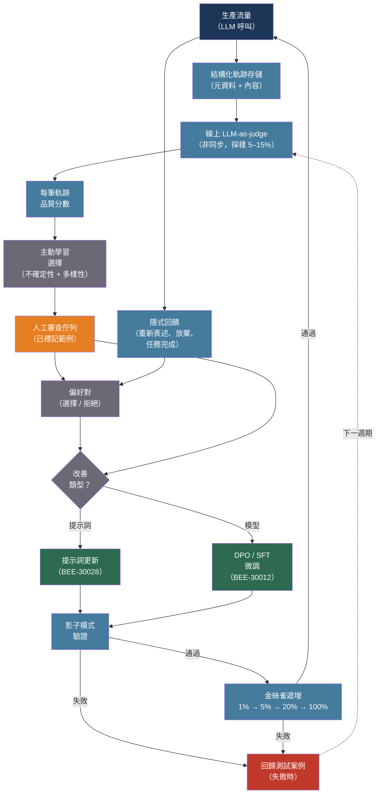

# [BEE-30038] LLM 資料飛輪與持續改善

:::info
資料飛輪是一個自我強化的迴圈：生產使用產生軌跡，軌跡餵入評估管線，評估揭露失敗，失敗驅動提示詞或模型改善，而改善提升品質——進而產生更高價值的未來軌跡。若不刻意關閉這個迴圈，已部署的 LLM 應用程式會在使用者行為與查詢分布演進時靜默劣化。
:::

## 背景

「資料飛輪」這個術語隨 Tesla Autopilot 資料引擎進入 AI 工程詞彙。在 Tesla 2019 年 Autonomy Day 期間，Andrej Karpathy 描述了一個可以「請求車隊為我們提供看起來像 [這個場景] 的範例」的系統——生產車輛持續提供已標記的駕駛場景，改善下一個模型，改善後的模型提升 Autopilot 品質，進而銷售更多車輛，產生更多駕駛資料。更多資料實現更快的迭代，後者又產生更多資料。迴圈是自我強化的。

LLM 應用程式在軟體規模上面臨相同的動態。Anthropic 的里程碑論文「Training a Helpful and Harmless Assistant with Reinforcement Learning from Human Feedback」（Bai 等人，arXiv:2204.05862，2022 年）建立了規範的資料收集方法論：161,000 個標注的多輪對話，人類評分者在兩個模型回應之間做出選擇。每一輪標注餵入獎勵模型訓練，後者餵入模型改善，後者改變對話分布，又需要新的標注。系統從未靜止。

生產部署中記錄的工程現實令人信服。NVIDIA 內部員工支援飛輪從 700 億參數模型開始。透過持續在生產軌跡上微調較小的 10–80 億模型（使用 700 億模型作為偽真實標籤評分），系統達到 94–96% 路由準確度，成本降低 98%，延遲降低 70 倍。複利來自改善週期的積累，而非單次訓練執行。Rafailov 等人（arXiv:2305.18290，2023 年）引入了直接偏好最佳化（DPO），以選擇/拒絕對上的單一分類損失取代兩階段 PPO RLHF 管線（訓練獎勵模型 → 用 RL 訓練策略）。DPO 使改善步驟對小型工程團隊變得可行——不需要獎勵模型，不需要 RL 訓練迴圈，只需偏好對和微調執行。

飛輪與監控儀表板的區別在於迴圈關閉。觸發無後續行動的指標不構成飛輪。當偵測到的失敗自動在改善管線中創建已標記範例時，迴圈關閉。

## 設計思考

飛輪有四個必須刻意工程化的階段：

**收集**：每次生產 LLM 互動都是潛在的訓練信號。問題是以何種保真度保留哪些信號。以全解析度儲存每個提示詞的每個 Token 成本高昂；什麼都不儲存使飛輪不可能。答案是具有採樣策略的結構化軌跡架構。

**評估**：線上評估以非同步方式在生產軌跡樣本上執行，產生品質分數。這不同於黃金資料集的離線評估（BEE-30004）——線上評估在真實使用者查詢、真實生產條件下運作，揭露精選資料集從未預期的失敗模式。

**選擇**：並非每個低分軌跡都同樣值得審查。主動學習選擇在標記後能為下一個改善週期提供最多資訊增益的軌跡。從失敗集隨機採樣是浪費；不確定性加權、保持多樣性的選擇更有效率。

**改善**：選定的軌跡餵入三種改善動作之一——提示詞更新（最快，可逆）、在偏好範例上的有監督微調（SFT），或在選擇/拒絕對上的偏好最佳化（DPO）。每個動作在部署前都需要自己的驗證步驟。

## 最佳實踐

### 以結構化架構記錄軌跡

**必須（MUST）** 以結構化架構記錄每次生產 LLM 呼叫，捕獲下游評估和訓練所需的輸入、輸出和元資料。非結構化日誌無法查詢；規模下的非結構化日誌無法恢復：

```python
import uuid
import time
import logging
from dataclasses import dataclass, field, asdict
from datetime import datetime, timezone

logger = logging.getLogger(__name__)

@dataclass
class LLMTrace:
    """
    單次 LLM 呼叫的結構化軌跡記錄。
    遵循 OpenInference 跨度屬性命名慣例。
    將提示詞內容存儲在事件欄位，而非頂層屬性，
    以便在索引之前在收集器層級過濾，確保 PII 合規。
    """
    trace_id: str = field(default_factory=lambda: str(uuid.uuid4()))
    session_id: str = ""
    user_id: str = ""                 # 匿名化；用於群組分析
    application: str = ""
    model: str = ""                   # 精確快照 ID
    prompt_tokens: int = 0
    completion_tokens: int = 0
    cached_tokens: int = 0
    ttfb_ms: float = 0.0              # 首位元組時間（毫秒）
    total_ms: float = 0.0
    finish_reason: str = ""
    timestamp_utc: str = field(
        default_factory=lambda: datetime.now(timezone.utc).isoformat()
    )
    tags: dict = field(default_factory=dict)

def traced_call(
    messages: list[dict],
    system: str,
    model: str,
    session_id: str,
    user_id: str,
    application: str,
    tags: dict = None,
) -> tuple[str, LLMTrace]:
    """進行 LLM 呼叫並回傳回應加上結構化軌跡。"""
    import anthropic
    client = anthropic.Anthropic()

    t0 = time.monotonic()
    response = client.messages.create(
        model=model, max_tokens=2048, system=system, messages=messages,
    )
    total_ms = (time.monotonic() - t0) * 1000

    trace = LLMTrace(
        session_id=session_id, user_id=user_id, application=application,
        model=model,
        prompt_tokens=response.usage.input_tokens,
        completion_tokens=response.usage.output_tokens,
        total_ms=total_ms,
        finish_reason=response.stop_reason or "",
        tags=tags or {},
    )
    logger.info("llm_trace", extra=asdict(trace))
    return response.content[0].text, trace
```

**應該（SHOULD）** 將提示詞和回應內容儲存在單獨的、存取受控的存儲中（不在應用程式日誌串流中）。內容存儲需要接受資料保留政策和 PII 處理，獨立於元資料軌跡。

### 在採樣的生產流量上執行非同步線上評估

**應該（SHOULD）** 使用 LLM-as-judge 自動評估生產軌跡樣本。評估以非同步方式執行（不在請求路徑中），以可配置的採樣率管理成本：

```python
import random
import json
import anthropic

eval_client = anthropic.Anthropic()

EVALUATORS = {
    "helpfulness": {
        "prompt": (
            "以 1–3 的分數評分此助理回應的有用性。\n"
            "1 = 無用（錯誤、無關或不完整）\n"
            "2 = 部分有用（正確但不完整或不清晰）\n"
            "3 = 完全有用（正確、完整且清晰）\n\n"
            "使用者問題：{user_message}\n"
            "助理回應：{assistant_response}\n\n"
            '回覆 JSON：{"score": <1|2|3>, "reason": "<一句話>"}'
        ),
        "model": "claude-haiku-4-5-20251001",
    },
}

def evaluate_trace_async(
    trace: "LLMTrace",
    content: "TraceContent",
    evaluator_names: list[str],
    sample_rate: float = 0.10,
) -> list[dict] | None:
    """
    在軌跡上執行已配置的評估器。若未被採樣則回傳 None。
    相對於使用者請求以非同步方式執行——排程在背景佇列中。
    """
    if random.random() > sample_rate:
        return None

    results = []
    for name in evaluator_names:
        evaluator = EVALUATORS.get(name)
        if not evaluator:
            continue
        user_message = content.user_messages[-1].get("content", "") if content.user_messages else ""
        prompt = evaluator["prompt"].format(
            user_message=user_message,
            assistant_response=content.assistant_response,
        )
        response = eval_client.messages.create(
            model=evaluator["model"], max_tokens=256, temperature=0,
            messages=[{"role": "user", "content": prompt}],
        )
        try:
            result = json.loads(response.content[0].text)
        except json.JSONDecodeError:
            result = {"error": "parse_failure"}
        results.append({"trace_id": trace.trace_id, "evaluator": name, **result})

    return results
```

**必須（MUST）** 使用與被評估模型不同系列的模型作為評估器。自我評估呈現自我偏好偏差——Claude 模型對 Claude 輸出評分更高（請見 BEE-30034 了解跨系列評審模式）。

**應該（SHOULD）** 使用低精度評分（1–3 分或布林值），而非細粒度李克特量表。LLM 評審在高精度下顯示高變異性；二元和三點量表在評估執行間產生更可重現的分數。

### 使用主動學習對人工審查佇列排定優先順序

**應該（SHOULD）** 使用資訊性標準而非純隨機採樣選擇需要人工審查的軌跡。從低分軌跡隨機採樣會揭露冗餘的失敗模式；主動學習選擇標記後對下一個改善週期最具資訊價值的失敗：

```python
import math
from dataclasses import dataclass

@dataclass
class EvalResult:
    trace_id: str
    helpfulness_score: float
    application: str
    embedding: list[float] | None

def uncertainty_score(helpfulness: float) -> float:
    """決策邊界附近（分數約 0.5）的輸出得分更高。"""
    return 1.0 - abs(helpfulness - 0.5) * 2

def cosine_distance(a: list[float], b: list[float]) -> float:
    dot = sum(x * y for x, y in zip(a, b))
    mag_a = math.sqrt(sum(x * x for x in a))
    mag_b = math.sqrt(sum(x * x for x in b))
    if mag_a == 0 or mag_b == 0:
        return 1.0
    return 1.0 - dot / (mag_a * mag_b)

def select_for_review(
    candidates: list[EvalResult],
    already_selected: list[EvalResult],
    budget: int = 50,
    uncertainty_weight: float = 0.6,
    diversity_weight: float = 0.4,
) -> list[EvalResult]:
    """
    混合主動學習：以不確定性 + 多樣性對每個候選評分。
    多樣性以與已選軌跡的最小餘弦距離衡量。
    """
    scored = []
    for candidate in candidates:
        u_score = uncertainty_score(candidate.helpfulness_score)
        if already_selected and candidate.embedding:
            min_dist = min(
                cosine_distance(candidate.embedding, sel.embedding)
                for sel in already_selected if sel.embedding
            ) if any(s.embedding for s in already_selected) else 1.0
        else:
            min_dist = 1.0
        combined = uncertainty_weight * u_score + diversity_weight * min_dist
        scored.append((combined, candidate))
    scored.sort(reverse=True)
    return [c for _, c in scored[:budget]]
```

**必須不（MUST NOT）** 直接使用原始使用者操作（複製、分享、點擊）作為訓練資料的真實標籤而不經人工審查。使用者操作引入選擇偏差——頻繁分享回應的進階使用者與一般使用者系統性地不同。建立由您自己團隊審查的黃金資料集，而非直接從使用者行為衍生。

### 收集明確和隱式偏好信號

**應該（SHOULD）** 在多個保真度層級對應用程式進行儀表化以收集偏好信號。明確評分稀疏（1–5% 的互動）；隱式行為信號對每次互動都可用：

```python
from enum import Enum
from dataclasses import dataclass
from datetime import datetime, timezone

class ExplicitFeedback(Enum):
    THUMBS_UP = "thumbs_up"
    THUMBS_DOWN = "thumbs_down"
    REGENERATE = "regenerate"

class ImplicitSignal(Enum):
    REPHRASE = "rephrase"              # 使用者立即重新表述相同問題
    COPY_WITHOUT_SUBMIT = "copy_no_submit"  # 複製文字但未繼續
    SESSION_ABANDONED = "session_abandoned"
    TASK_COMPLETED = "task_completed"
    FOLLOW_UP_CLARIFICATION = "clarification"

IMPLICIT_POLARITY: dict[ImplicitSignal, bool | None] = {
    ImplicitSignal.REPHRASE: False,
    ImplicitSignal.COPY_WITHOUT_SUBMIT: False,
    ImplicitSignal.SESSION_ABANDONED: False,
    ImplicitSignal.TASK_COMPLETED: True,
    ImplicitSignal.FOLLOW_UP_CLARIFICATION: None,
}

@dataclass
class FeedbackEvent:
    trace_id: str
    session_id: str
    signal_type: str
    is_positive: bool | None
    timestamp_utc: str = ""

    def __post_init__(self):
        if not self.timestamp_utc:
            self.timestamp_utc = datetime.now(timezone.utc).isoformat()
```

**應該（SHOULD）** 透過將點讚回應與相同提示詞的重新產生回應配對，為 DPO 訓練建立偏好對。DPO 目標需要 `(提示詞, 選擇, 拒絕)` 三元組；這些可以從記錄的軌跡和回饋事件中組裝：

```python
@dataclass
class PreferencePair:
    prompt_messages: list[dict]
    system: str
    chosen: str      # 更高品質的回應
    rejected: str    # 更低品質的回應
    source: str      # "explicit_feedback", "regenerate_pair", "human_correction"

def build_preference_pairs_from_feedback(
    feedback_store, content_store,
) -> list[PreferencePair]:
    """
    從回饋事件組裝 DPO 訓練對。
    點踩後接著重新產生創建選擇/拒絕對。
    """
    pairs = []
    thumbs_down_traces: dict[str, str] = {}

    for event in feedback_store.events:
        if event.signal_type == ExplicitFeedback.THUMBS_DOWN.value:
            thumbs_down_traces[event.session_id] = event.trace_id
        elif event.signal_type == ExplicitFeedback.THUMBS_UP.value:
            rejected_trace_id = thumbs_down_traces.pop(event.session_id, None)
            if rejected_trace_id:
                chosen_content = content_store.get(event.trace_id)
                rejected_content = content_store.get(rejected_trace_id)
                if chosen_content and rejected_content:
                    pairs.append(PreferencePair(
                        prompt_messages=chosen_content.user_messages,
                        system=chosen_content.system_prompt,
                        chosen=chosen_content.assistant_response,
                        rejected=rejected_content.assistant_response,
                        source="explicit_feedback",
                    ))

    return pairs
```

### 關閉迴圈：透過分段發佈部署改善

**必須（MUST）** 透過與任何生產變更相同的分段發佈流程部署所有改善——無論是提示詞更新還是微調後的模型權重：影子模式驗證後接金絲雀遞增（請見 BEE-30034）。飛輪的價值在於複利迭代；每次改善在下一個週期開始前必須經過驗證：

```python
from enum import Enum
from dataclasses import dataclass

class ImprovementType(Enum):
    PROMPT_UPDATE = "prompt_update"   # 最快；無需模型重訓練
    SFT = "sft"                       # 在偏好範例上微調
    DPO = "dpo"                       # 在對上進行偏好最佳化
    MODEL_MIGRATION = "model_migration"

@dataclass
class FlyWheelCycle:
    """追蹤飛輪中的一次完整改善迭代。"""
    cycle_id: str
    improvement_type: ImprovementType
    baseline_pass_rate: float
    shadow_pass_rate: float
    canary_pass_rate: float
    deployed: bool = False
    rollback_reason: str | None = None

SHADOW_THRESHOLD = 0.90
CANARY_THRESHOLD = 0.88

def evaluate_cycle_gate(cycle: FlyWheelCycle, stage: str) -> bool:
    """決定是否將改善推進到下一個部署階段。"""
    if stage == "shadow":
        improvement = cycle.shadow_pass_rate - cycle.baseline_pass_rate
        if improvement < 0.05:
            cycle.rollback_reason = f"影子改善 {improvement:.1%} < 5% 閾值"
            return False
        return True
    if stage == "canary":
        if cycle.canary_pass_rate < CANARY_THRESHOLD:
            cycle.rollback_reason = f"金絲雀通過率 {cycle.canary_pass_rate:.1%} < {CANARY_THRESHOLD:.0%}"
            return False
        return True
    return False
```

**應該（SHOULD）** 將每個觸發回滾的生產失敗作為離線評估套件中的新黃金測試案例捕獲。這就是飛輪回歸測試套件的成長方式——每次失敗的部署教導系統在下一個週期中不要回歸什麼。

## 視覺化



## 線上與離線評估

| 維度 | 離線（黃金資料集） | 線上（生產採樣） |
|---|---|---|
| 輸入來源 | 精選、固定、手動標記 | 真實使用者查詢，即時分布 |
| 執行時間 | 在開發期間按需執行 | 在生產中持續執行 |
| 偵測的失敗模式 | 已知、預期的失敗 | 新興、未預期的失敗 |
| 成本控制 | 每次評估執行固定 | 採樣率（預設 5–15%） |
| 偵測延遲 | 下次評估執行（天/週） | 以 10% 採樣率需數小時至數天 |
| 訓練信號 | 高品質（人工標記） | 可變（評審標記）；高價值案例需人工審查 |
| 最適用於 | 部署前驗證 | 分布漂移、新失敗模式發現 |

兩者都要使用：離線評估把關部署（BEE-30004）；線上評估驅動下一個改善週期。

## 相關 BEE

- [BEE-30004](evaluating-and-testing-llm-applications.md) -- 評估與測試 LLM 應用：把關部署的離線黃金資料集評估
- [BEE-30009](llm-observability-and-monitoring.md) -- LLM 可觀測性與監控：餵入飛輪的軌跡收集和指標基礎設施
- [BEE-30012](fine-tuning-and-peft-patterns.md) -- 微調與 PEFT 模式：飛輪驅動的 SFT 和 LoRA 機制
- [BEE-30022](human-in-the-loop-ai-patterns.md) -- 人機協作 AI 模式：標記選定軌跡的人工審查佇列
- [BEE-30028](prompt-management-and-versioning.md) -- 提示詞管理與版本控制：作為快速路徑改善動作的提示詞更新
- [BEE-30032](synthetic-data-generation-for-ai-systems.md) -- AI 系統的合成資料生成：可驗證領域的合成偏好對
- [BEE-30034](ai-experimentation-and-model-a-b-testing.md) -- AI 實驗與模型 A/B 測試：用於改善部署的影子模式和金絲雀遞增

## 參考資料

- [Bai et al. Training a Helpful and Harmless Assistant with RLHF — arXiv:2204.05862, Anthropic 2022](https://arxiv.org/abs/2204.05862)
- [Rafailov et al. Direct Preference Optimization: Your Language Model is Secretly a Reward Model — arXiv:2305.18290, Stanford 2023](https://arxiv.org/abs/2305.18290)
- [Survey: LLM-based Active Learning — arXiv:2502.11767, 2025](https://arxiv.org/html/2502.11767v1)
- [NVIDIA. Data Flywheel — nvidia.com](https://www.nvidia.com/en-us/glossary/data-flywheel/)
- [Arize + NVIDIA. Building the Data Flywheel for Smarter AI Systems — arize.com](https://arize.com/blog/building-the-data-flywheel-for-smarter-ai-systems-with-arize-ax-and-nvidia-nemo/)
- [ZenML. What 1,200 Production Deployments Reveal about LLMOps in 2025 — zenml.io](https://www.zenml.io/blog/what-1200-production-deployments-reveal-about-llmops-in-2025)
- [Lambert. RLHF Book, Chapter 11: Preference Data — rlhfbook.com](https://rlhfbook.com/c/11-preference-data)
- [OpenTelemetry. LLM Observability — opentelemetry.io, 2024](https://opentelemetry.io/blog/2024/llm-observability/)
