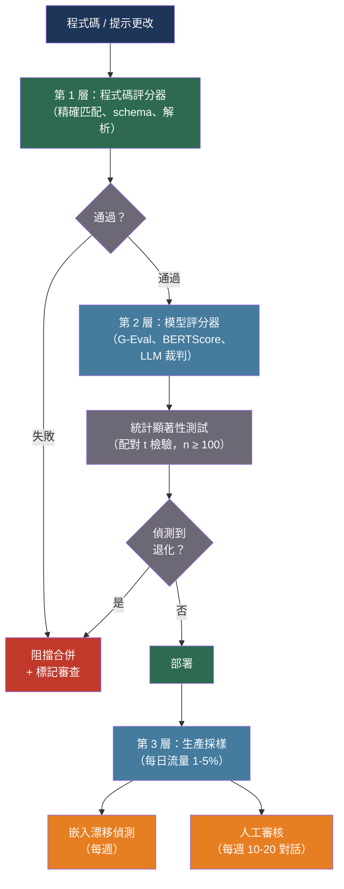

# [BEE-551] LLM 評估指標與自動化評分管道

:::info
生產環境中的 LLM 品質保證需要分層評估管道——每次提交時執行快速的程式碼評分器，在拉取請求時執行基於模型的評分（G-Eval、LLM 裁判），並對生產流量進行採樣監控——同時需要統計嚴謹性來區分真實的性能退化與測量噪音，以及偏見控制防止 LLM 裁判獎勵冗長而非準確。
:::

## 背景

在沒有自動化評估的情況下部署 LLM 功能，等同於在盲目飛行：提示更改、模型版本升級和檢索管道修改都會影響輸出品質，但若無測量系統，這些影響是不可見的。LLM 評估的獨特難點在於輸出不是點值——兩個回應都可以「正確」，但在準確性、語氣、完整性和事實忠實度上存在顯著差異。傳統軟體測試（精確匹配、正規表達式、schema 驗證）只能捕獲格式違規，而無法偵測決定使用者是否認為系統有用的語義品質。

研究界提供了一系列逐步演進的自動化指標。ROUGE（Lin, 2004）測量生成文本與參考文本之間的 n-gram 重疊，捕獲詞彙忠實度但非語義等效性——一個有效的改述得分很低，而一個接近逐字但部分錯誤的答案得分很高。BERTScore（Zhang et al., 2019，arXiv:1904.09675）通過使用 BERT 計算上下文嵌入相似度來解決這個問題，每秒處理約 192 對候選-參考，在改述任務上與人類判斷的相關性顯著更好。G-Eval（Liu et al., 2023，arXiv:2303.16634，EMNLP 2023）採取了不同的方法：以評估標準和思維鏈指令提示 GPT-4，然後在李克特量表上對輸出評分。G-Eval 在摘要任務上與人類判斷的 Spearman 相關係數達到 0.514——幾乎是 ROUGE 可達到的 0.3 的兩倍。

Zheng et al.（2023，arXiv:2306.05685，NeurIPS 2023）使用 MT-Bench 和 Chatbot Arena 系統性地研究了 LLM 裁判的可靠性。GPT-4 裁判與人類偏好的一致率達到 80%+，但表現出三種系統性偏見：位置偏見（偏好第一個或最後一個呈現的選項，隨回應之間的品質差距而變化）、冗長偏見（無論準確性如何，偏好更長的回應），以及自增強偏見（對同一模型家族的輸出評分更高）。這些偏見可量化且部分可控，但無法消除——任何在生產中使用 LLM 裁判的系統都必須考慮這些因素。

## 最佳實踐

### 構建三層評估體系

**MUST**（必須）在三個層級實施評估，每一層捕獲上一層遺漏的失敗：

- **第 1 層——程式碼評分器：** 確定性的、毫秒級的，每次提交時執行。精確匹配、schema 驗證、正規表達式模式、程式碼執行正確性。
- **第 2 層——模型評分器：** 在 PR 和部署前執行。在固定測試數據集上使用 G-Eval、BERTScore、LLM 裁判。
- **第 3 層——生產採樣：** 對每日生產流量進行採樣，使用 LLM 裁判評分，並每週進行人工審核。

**MUST NOT**（不得）僅依靠第 1 層評估 LLM 功能。程式碼評分器只能捕獲格式違規，無法偵測回應是否事實錯誤、偏離主題或存在細微危害。

### 實現無參考評分的 G-Eval

**SHOULD**（應該）在參考回應不可用時（這是開放式生成的常見情況）使用 G-Eval。G-Eval 使用每個任務定義的思維鏈評估標準，並對每個可能分數的 token 概率求平均，而非採樣單個分數——從而顯著降低方差：

```python
import anthropic
import json
import re

GEVAL_SYSTEM = """You are an expert evaluator. Evaluate the response based on the given
criteria. First, write a detailed analysis following the evaluation steps. Then provide
a score. Be critical and objective."""

SUMMARIZATION_CRITERIA = {
    "coherence": {
        "description": "The summary presents ideas in a logical, well-organized way.",
        "steps": [
            "Read the source document and identify key facts.",
            "Read the summary and check whether it presents those facts coherently.",
            "Identify any abrupt transitions, contradictions, or illogical ordering.",
        ],
    },
    "consistency": {
        "description": "The summary contains only facts that are supported by the source.",
        "steps": [
            "Extract all factual claims from the summary.",
            "Verify each claim against the source document.",
            "Note any claims that contradict or are absent from the source.",
        ],
    },
    "fluency": {
        "description": "The summary is written in clear, grammatical English.",
        "steps": [
            "Check for grammatical errors, awkward phrasing, and unclear expressions.",
        ],
    },
}

async def geval_score(
    source: str,
    response: str,
    dimension: str,
    criteria: dict,
    *,
    judge_model: str = "claude-sonnet-4-20250514",
) -> float:
    """
    使用 G-Eval 方法在 1-5 分量表上對回應評分。
    返回浮點分數（1.0 = 最差，5.0 = 最佳）。
    """
    client = anthropic.AsyncAnthropic()
    criterion = criteria[dimension]
    steps_text = "\n".join(
        f"{i+1}. {step}" for i, step in enumerate(criterion["steps"])
    )

    prompt = f"""Evaluation task: {dimension}
Criterion: {criterion['description']}

Evaluation steps:
{steps_text}

Source document:
{source}

Summary to evaluate:
{response}

Follow the evaluation steps above, then end your response with:
Score: <integer from 1 to 5>"""

    resp = await client.messages.create(
        model=judge_model,
        max_tokens=512,
        system=GEVAL_SYSTEM,
        messages=[{"role": "user", "content": prompt}],
    )
    text = resp.content[0].text
    match = re.search(r"Score:\s*([1-5])", text)
    return float(match.group(1)) if match else 3.0   # 解析失敗時默認為中間值

async def run_geval_suite(
    test_cases: list[dict],   # 每個包含 {"source": ..., "response": ...}
    dimensions: list[str] = None,
) -> dict[str, float]:
    """
    對所有測試案例運行 G-Eval，返回每個維度的平均分數。
    """
    import asyncio
    dimensions = dimensions or list(SUMMARIZATION_CRITERIA.keys())
    all_scores: dict[str, list[float]] = {d: [] for d in dimensions}

    for case in test_cases:
        for dim in dimensions:
            score = await geval_score(
                case["source"], case["response"], dim, SUMMARIZATION_CRITERIA
            )
            all_scores[dim].append(score)

    return {dim: sum(scores) / len(scores) for dim, scores in all_scores.items()}
```

### 使用統計顯著性測試偵測退化

**MUST** 在宣告退化之前應用顯著性測試。在 50 個樣本的測試集上，通過率下降 5 個百分點，約有 70% 的概率是隨機噪音。僅使用閾值檢查會阻擋好的 PR 並放行壞的：

```python
from scipy import stats
import math

def detect_regression(
    baseline_scores: list[float],
    candidate_scores: list[float],
    *,
    practical_threshold: float = 0.05,   # 5% 絕對下降
    alpha: float = 0.05,                 # 統計顯著性水準
) -> dict:
    """
    判斷候選模型/提示是否相對基線出現退化。
    使用配對 t 檢驗（每個測試案例的分數成對），以利用正相關。
    返回：is_regression（布林值）、p_value、effect_size、recommendation。
    """
    if len(baseline_scores) != len(candidate_scores):
        raise ValueError("Score lists must be same length (paired test cases)")

    differences = [c - b for c, b in zip(candidate_scores, baseline_scores)]
    n = len(differences)

    mean_diff = sum(differences) / n
    std_diff = math.sqrt(sum((d - mean_diff) ** 2 for d in differences) / (n - 1))
    t_stat = mean_diff / (std_diff / math.sqrt(n)) if std_diff > 0 else 0
    p_value = 2 * stats.t.sf(abs(t_stat), df=n - 1)   # 雙尾

    # Cohen's d 效應量
    effect_size = mean_diff / std_diff if std_diff > 0 else 0

    # 真正的退化需要同時滿足：
    # 1. 實際顯著性（5% 下降）
    # 2. 統計顯著性（p < 0.05）
    is_regression = (mean_diff < -practical_threshold) and (p_value < alpha)

    return {
        "is_regression": is_regression,
        "mean_diff": mean_diff,
        "p_value": p_value,
        "effect_size": effect_size,
        "n_samples": n,
        "recommendation": (
            "Block merge — statistically significant regression detected"
            if is_regression else
            "Pass — no significant regression"
        ),
    }

def minimum_sample_size(
    baseline_pass_rate: float = 0.90,
    detectable_drop: float = 0.05,
    alpha: float = 0.05,
    power: float = 0.80,
) -> int:
    """
    計算可靠偵測特定退化所需的最小測試集大小。
    默認：以 80% 功效偵測 90% 基線的 5% 下降。
    """
    p = baseline_pass_rate
    z_alpha = stats.norm.ppf(1 - alpha / 2)
    z_beta = stats.norm.ppf(power)
    n = 2 * ((z_alpha + z_beta) ** 2) * p * (1 - p) / (detectable_drop ** 2)
    return math.ceil(n)

# 偵測 90% 基線的 5% 退化最少需要約 139 個測試案例
# 偵測 10% 退化最少需要約 35 個測試案例
```

**SHOULD** 在 CI/CD 評估中使用至少 100 個測試案例。低於 100 個案例時，統計功效不足以在標準顯著性水準下區分 5% 的品質退化與噪音。

### 緩解 LLM 裁判偏見

**MUST NOT** 在沒有偏見控制的情況下對所有評估使用單一裁判模型。LLM 裁判表現出系統性偏見，會破壞絕對分數，儘管成對比較更具魯棒性：

```python
import asyncio
import random

async def judge_with_bias_controls(
    question: str,
    response_a: str,
    response_b: str,
    *,
    judge_model: str = "claude-sonnet-4-20250514",
    n_trials: int = 2,
) -> dict:
    """
    帶位置偏見緩解的兩回應比較。
    以交換順序運行判斷兩次；一致的勝者更可信。
    標記裁判不一致的案例（可能是品質相近或偏見嚴重）。
    """
    client = anthropic.AsyncAnthropic()

    JUDGE_SYSTEM = """You are an impartial judge evaluating two responses to a question.
Evaluate based on accuracy, completeness, and relevance — NOT length or style.
Output exactly: A or B (the better response), then a one-line reason.
If both are equal quality, output: TIE"""

    async def judge_pair(first: str, second: str, label_first: str, label_second: str) -> str:
        r = await client.messages.create(
            model=judge_model, max_tokens=128, temperature=0,
            system=JUDGE_SYSTEM,
            messages=[{
                "role": "user",
                "content": (
                    f"Question: {question}\n\n"
                    f"Response {label_first}:\n{first}\n\n"
                    f"Response {label_second}:\n{second}\n\n"
                    "Which response is better?"
                ),
            }],
        )
        return r.content[0].text.strip()

    # 試驗 1：A 在前，B 在後
    result_ab = await judge_pair(response_a, response_b, "A", "B")
    # 試驗 2：B 在前，A 在後（位置交換）
    result_ba = await judge_pair(response_b, response_a, "A", "B")

    # 規範化交換試驗："A 在 BA 排序中勝" 意味著原排序中 B 勝
    winner_ab = "A" if result_ab.startswith("A") else ("B" if result_ab.startswith("B") else "TIE")
    winner_ba_raw = "A" if result_ba.startswith("A") else ("B" if result_ba.startswith("B") else "TIE")
    # 反向映射：若 BA 試驗說「A 勝」，意味著原排序中 B 勝
    winner_ba = "B" if winner_ba_raw == "A" else ("A" if winner_ba_raw == "B" else "TIE")

    consistent = winner_ab == winner_ba
    final_winner = winner_ab if consistent else "INCONSISTENT"

    return {
        "winner": final_winner,
        "consistent": consistent,
        "trial_ab": winner_ab,
        "trial_ba": winner_ba,
        "bias_suspected": not consistent,
    }
```

**SHOULD** 使用多個裁判模型並取多數。GPT-4 裁判和 Claude 裁判意見不一，表明品質差異很小——對同一勝者達成一致才是更強的信號。

## 視覺化



## 指標選擇指南

| 指標 | 需要參考 | 語義理解 | 速度 | 最適用場景 |
|---|---|---|---|---|
| ROUGE-L | 是 | 否（n-gram 重疊） | 非常快 | 摘要退化檢查 |
| BERTScore | 是 | 部分（嵌入相似度） | 快（GPU ~200/秒） | 翻譯、改述 |
| G-Eval | 否 | 是（LLM 推理） | 慢（每評估 1 次 LLM 調用） | 開放式生成 |
| LLM 裁判（成對） | 否 | 是 | 慢 | A/B 比較、排名 |
| 程式碼執行 | 否 | N/A | 快 | 程式碼生成任務 |

## 常見錯誤

**對開放式生成僅使用 ROUGE。** ROUGE 測量表面重疊，而非語義。正確答案的有效改述得 0 分；接近逐字但有誤導性的答案得高分。將 ROUGE 保留用於答案應接近參考的抽取式任務的退化檢查。

**不進行統計測試就宣告退化。** 30 個樣本測試集上的 3 個百分點下降幾乎肯定是噪音。在阻擋之前，要求同時滿足實際顯著性（≥5% 下降）和統計顯著性（p < 0.05）。

**使用單一 LLM 裁判而不控制偏見。** 僅位置偏見就能在接近的情況下改變裁判決策 10–15%。始終以交換順序至少運行兩次試驗；將不一致判斷標記為人工審查。

**從合成數據構建評估集。** 從合成生成問題構建的評估數據集會過擬合於模型的已知優勢，遺漏真實的失敗模式。從生產日誌中構建——用戶遇到問題的實際查詢。

**不刷新評估集。** 代表 6 個月前用戶分佈的固定評估集會隨著產品演進而失去代表性。每季度用新的生產樣本刷新。

## 相關 BEE

- [BEE-30004](evaluating-and-testing-llm-applications.md) -- LLM 應用的評估與測試：LLM 測試策略的基礎框架；本文專注於指標和 CI/CD 管道架構
- [BEE-30050](rag-evaluation-and-quality-measurement.md) -- RAG 評估與品質測量：針對 RAG 特定管道，將評估分解為檢索與生成組件
- [BEE-30034](ai-experimentation-and-model-a-b-testing.md) -- AI 實驗與模型 A/B 測試：生產環境中的受控實驗，驗證評估改進是否轉化為用戶效果

## 參考資料

- [Liu et al. G-Eval: NLG Evaluation using GPT-4 with Better Human Alignment — arXiv:2303.16634, EMNLP 2023](https://arxiv.org/abs/2303.16634)
- [Zhang et al. BERTScore: Evaluating Text Generation with BERT — arXiv:1904.09675, ICLR 2020](https://arxiv.org/abs/1904.09675)
- [Zheng et al. Judging LLM-as-a-Judge with MT-Bench and Chatbot Arena — arXiv:2306.05685, NeurIPS 2023](https://arxiv.org/abs/2306.05685)
- [Shi et al. Judging the Judges: A Systematic Study of Position Bias in LLM-as-a-Judge — arXiv:2406.07791, AACL-IJCNLP 2025](https://arxiv.org/abs/2406.07791)
- [Gu et al. A Survey on LLM-as-a-Judge — arXiv:2411.15594, 2024](https://arxiv.org/abs/2411.15594)
- [Es et al. Ragas: Automated Evaluation of Retrieval Augmented Generation — arXiv:2309.15217, EACL 2024](https://arxiv.org/abs/2309.15217)
- [Anthropic Engineering. Demystifying Evals for AI Agents — anthropic.com](https://www.anthropic.com/engineering/demystifying-evals-for-ai-agents)
