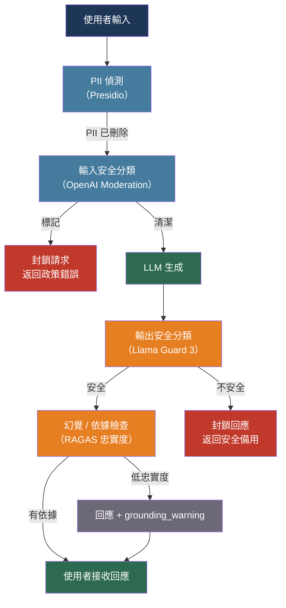

# [BEE-30020] LLM 護欄與內容安全

:::info
護欄是位於使用者和 LLM 生成內容之間的前後處理檢查——偵測有毒輸入、在到達模型前刪除 PII、對有害輸出進行分類，以及驗證事實依據——這些任務都是模型本身無法持續可靠執行的。
:::

## 背景

通過所有單元測試的 LLM 在生產環境中仍可能產生有害、虛構或侵犯隱私的輸出。這些失敗的根源不是惡意意圖（BEE-30008 已涵蓋），而是普通的模型行為：LLM 是統計預測器，偶爾會生成違反政策的內容、產生任何訓練集中都不存在的事實幻覺，或在意外地方反映使用者的 PII。

該領域圍繞兩個不同的問題整合。第一，內容安全：按毒性、騷擾和自我傷害等維度對輸入和輸出進行分類。Google 的 Perspective API（Jigsaw，2017）開創了生產規模的毒性評分。Meta 的 Llama Guard（Chi 等人，arXiv:2312.06674，2023）將安全分類重新框架為 LLM 任務本身——一個微調模型，能夠推理給定的提示-回應對是否違反危害分類法，現在符合 MLCommons 的 13 個危害類別標準。

第二，事實依據：偵測模型的輸出是否沒有得到所提供源文件的支持。Es 等人（arXiv:2309.15217，EACL 2024）引入了 RAGAS，這是一個無參考評估框架，將忠實度分解為針對檢索上下文驗證的語句級別聲明。Manakul 等人（arXiv:2303.08896，EMNLP 2023）展示，多次採樣同一模型並檢查一致性——SelfCheckGPT——可以在沒有任何外部知識庫的情況下偵測幻覺。

NIST AI 風險管理框架（AI RMF 1.0，2023 年 1 月）和 EU AI 法案將這些技術措施框架為風險管理義務，而非可選的品質改進。EU AI 法案下的高風險 AI 系統（第 16 條）必須實施護欄直接啟用的日誌記錄、可追溯性和人工監督機制。

## 設計思維

護欄管道有兩個位置：輸入（LLM 呼叫之前）和輸出（之後）。這些位置有不同的延遲和準確性權衡。

**輸入護欄**在任何 Token 發送給模型之前對使用者提供的內容運行。它們很快（專用分類器、正規表達式、NER 模型），如果發現違規則可以完全短路請求。它們不需要知道模型會說什麼。

**輸出護欄**在模型的回應到達使用者之前對其運行。它們可以更慢、更準確——使用另一個 LLM 來判斷回應——因為請求已經計費。它們可以捕獲輸入護欄無法預見的問題：虛假引用、幻覺事實、模型生成的（而非反映的）PII。

**失敗開放與失敗關閉**是關鍵的政策決定。失敗關閉在護欄無法完成時返回錯誤（網路故障、超時）。失敗開放讓內容通過。對於毒性和安全性，失敗關閉是更安全的預設值。對於幻覺評分等可選品質檢查，失敗開放避免在評分服務降級時影響可用性。

## 最佳實踐

### 在 LLM 呼叫前偵測並刪除 PII

**MUST**（必須）在 PII 進入上下文視窗之前掃描使用者提供的內容。一旦 PII 到達模型，它可能出現在回應中、日誌中，或者如果供應商使用輸入進行模型改進則出現在訓練資料中：

```python
from presidio_analyzer import AnalyzerEngine
from presidio_anonymizer import AnonymizerEngine
from presidio_anonymizer.entities import OperatorConfig

analyzer = AnalyzerEngine()
anonymizer = AnonymizerEngine()

def redact_pii(text: str) -> tuple[str, list]:
    """
    在發送給 LLM 之前將 PII 實體替換為類型佔位符。
    返回 (redacted_text, detected_entities) 用於稽核日誌。
    """
    results = analyzer.analyze(
        text=text,
        entities=["PERSON", "EMAIL_ADDRESS", "PHONE_NUMBER", "CREDIT_CARD", "US_SSN"],
        language="en",
    )
    anonymized = anonymizer.anonymize(
        text=text,
        analyzer_results=results,
        operators={
            "PERSON": OperatorConfig("replace", {"new_value": "<PERSON>"}),
            "EMAIL_ADDRESS": OperatorConfig("replace", {"new_value": "<EMAIL>"}),
            "PHONE_NUMBER": OperatorConfig("replace", {"new_value": "<PHONE>"}),
            "CREDIT_CARD": OperatorConfig("replace", {"new_value": "<CREDIT_CARD>"}),
            "US_SSN": OperatorConfig("replace", {"new_value": "<SSN>"}),
        },
    )
    return anonymized.text, results  # 記錄結果用於稽核；不記錄原始文字
```

**MUST** 記錄偵測到 PII 的事實（實體類型和數量），但不記錄 PII 值本身。稽核追蹤需要顯示系統正確運作，而不會產生新的暴露。

### 應用輸入安全分類

**SHOULD**（應該）在將使用者輸入傳遞給主要 LLM 之前對其呼叫內容安全分類器。OpenAI 審核端點是免費的、快速的，且涵蓋主要危害類別：

```python
from openai import OpenAI

moderation_client = OpenAI()

BLOCKED_CATEGORIES = {
    "hate", "hate/threatening", "harassment", "harassment/threatening",
    "self-harm", "self-harm/intent", "self-harm/instructions",
    "sexual/minors", "violence/graphic",
}

def check_input_safety(text: str) -> tuple[bool, str | None]:
    """
    返回 (is_safe, violated_category_or_None)。
    """
    response = moderation_client.moderations.create(
        model="omni-moderation-latest",
        input=text,
    )
    result = response.results[0]
    if result.flagged:
        categories = result.categories.model_dump()
        for category, flagged in categories.items():
            if flagged and category in BLOCKED_CATEGORIES:
                return False, category
        return False, "policy_violation"
    return True, None
```

**SHOULD** 區分封鎖請求的類別（CSAM、暴力/血腥）和可能只需要更溫和回應的類別（輕微粗話、離題內容）。並非所有政策違規都應得到相同的處理。

### 使用 Llama Guard 分類輸出

對於自託管或隱私敏感的部署，其中對輸出呼叫 OpenAI 審核 API 是不可接受的，Meta 的 Llama Guard 3 提供了一個開放權重的安全分類器，可在與主要模型相同的推論棧上運行：

```python
from transformers import AutoTokenizer, AutoModelForCausalLM
import torch

# 啟動時載入一次——8B 參數模型，需要 ~16GB VRAM（或 1B-INT4 用於較輕的部署）
tokenizer = AutoTokenizer.from_pretrained("meta-llama/Llama-Guard-3-8B")
guard_model = AutoModelForCausalLM.from_pretrained(
    "meta-llama/Llama-Guard-3-8B",
    torch_dtype=torch.bfloat16,
    device_map="auto",
)

def classify_with_llama_guard(user_message: str, assistant_response: str) -> dict:
    """
    返回 {"safe": bool, "violated_categories": list[str]}。
    Llama Guard 評估完整的對話輪次。
    """
    chat = [
        {"role": "user", "content": user_message},
        {"role": "assistant", "content": assistant_response},
    ]
    input_ids = tokenizer.apply_chat_template(chat, return_tensors="pt").to(guard_model.device)
    output = guard_model.generate(input_ids, max_new_tokens=20, pad_token_id=tokenizer.eos_token_id)
    result_text = tokenizer.decode(output[0][input_ids.shape[1]:], skip_special_tokens=True).strip()

    if result_text.startswith("safe"):
        return {"safe": True, "violated_categories": []}
    else:
        categories = result_text.replace("unsafe", "").strip().split("\n")
        return {"safe": False, "violated_categories": [c.strip() for c in categories if c.strip()]}
```

Llama Guard 3 的 13 個危害類別遵循 MLCommons 分類法：暴力犯罪、非暴力犯罪、性相關犯罪、兒童性剝削、誹謗、專業建議、隱私侵犯、知識產權、無差別武器、仇恨、自殺/自我傷害、性內容和選舉。

**SHOULD** 在延遲優先時，在回應發送給使用者後非同步運行 Llama Guard 分類。違規被記錄並觸發審核佇列，而非在實時阻塞使用者：

```python
import asyncio

async def generate_and_guard(user_message: str) -> str:
    """將回應串流給使用者；在背景分類輸出。"""
    response_text = await llm_generate(user_message)

    # 發射並遺忘安全分類
    asyncio.create_task(
        log_safety_result(
            user_message=user_message,
            response=response_text,
        )
    )
    return response_text

async def log_safety_result(user_message: str, response: str):
    result = classify_with_llama_guard(user_message, response)
    if not result["safe"]:
        await safety_incident_queue.publish({
            "categories": result["violated_categories"],
            "response_hash": hash(response),  # 不要在佇列中記錄回應文字
        })
```

### 通過忠實度評分偵測幻覺

在 RAG 應用程式中，模型的回應應該基於檢索到的文件。RAGAS 忠實度將回應分解為原子聲明，並針對源上下文驗證每個聲明：

```python
from ragas import evaluate
from ragas.metrics import faithfulness, answer_relevancy
from datasets import Dataset

def evaluate_rag_response(
    question: str,
    answer: str,
    contexts: list[str],
) -> dict:
    """
    返回忠實度分數（0–1）。分數 < 0.5 表示存在嚴重幻覺。
    需要：pip install ragas
    """
    data = {
        "question": [question],
        "answer": [answer],
        "contexts": [contexts],
    }
    result = evaluate(Dataset.from_dict(data), metrics=[faithfulness, answer_relevancy])
    return {
        "faithfulness": result["faithfulness"],
        "answer_relevancy": result["answer_relevancy"],
    }

FAITHFULNESS_THRESHOLD = 0.7  # 根據可接受的風險調整

async def rag_with_grounding_check(question: str, retrieved_docs: list[str]) -> dict:
    answer = await llm_generate_with_context(question, retrieved_docs)
    scores = evaluate_rag_response(question, answer, retrieved_docs)

    if scores["faithfulness"] < FAITHFULNESS_THRESHOLD:
        return {
            "answer": answer,
            "grounding_warning": True,
            "faithfulness_score": scores["faithfulness"],
        }
    return {"answer": answer, "faithfulness_score": scores["faithfulness"]}
```

**SHOULD** 將忠實度分數作為元資料提供給下游消費者，而非靜默地抑制低基準回應。警告欄位讓應用層決定是否顯示免責聲明或觸發人工審核。

對於不使用 RAGAS 的輕量級幻覺偵測，基於 NLI 的蘊含可以檢查回應中的單個句子是否被源文件所蘊含：

```python
from transformers import pipeline

# 更小的模型，比 RAGAS 更快，不需要採樣
nli_pipe = pipeline(
    "text-classification",
    model="cross-encoder/nli-deberta-v3-small",
    device=0,
)

def check_sentence_grounding(sentence: str, context: str) -> float:
    """返回蘊含概率（0–1）。低於 0.5 = 可能是幻覺。"""
    result = nli_pipe(f"{context} [SEP] {sentence}", top_k=None)
    entailment = next((r["score"] for r in result if r["label"] == "entailment"), 0.0)
    return entailment
```

### 構建護欄管道的結構

**SHOULD** 將護欄組織為具有一致介面的可組合中間件步驟，以便可以在不觸及應用邏輯的情況下添加、刪除或重新排序它們：

```python
from dataclasses import dataclass
from typing import Callable

@dataclass
class GuardrailResult:
    passed: bool
    reason: str | None = None
    metadata: dict | None = None

GuardrailFn = Callable[[str], GuardrailResult]

class GuardrailPipeline:
    def __init__(self, fail_open: bool = False):
        self._input_rails: list[GuardrailFn] = []
        self._output_rails: list[GuardrailFn] = []
        self.fail_open = fail_open

    def add_input_rail(self, fn: GuardrailFn):
        self._input_rails.append(fn)

    def add_output_rail(self, fn: GuardrailFn):
        self._output_rails.append(fn)

    def run_input(self, text: str) -> GuardrailResult:
        for rail in self._input_rails:
            try:
                result = rail(text)
                if not result.passed:
                    return result
            except Exception as e:
                if not self.fail_open:
                    return GuardrailResult(passed=False, reason=f"guardrail_error: {e}")
        return GuardrailResult(passed=True)

    def run_output(self, text: str) -> GuardrailResult:
        for rail in self._output_rails:
            try:
                result = rail(text)
                if not result.passed:
                    return result
            except Exception:
                if not self.fail_open:
                    return GuardrailResult(passed=False, reason="output_guardrail_error")
        return GuardrailResult(passed=True)
```

**MUST** 為每個護欄呼叫設置超時。緩慢的外部分類器不應無限期地阻塞使用者：

```python
import asyncio

async def with_timeout(coro, timeout_s: float, fail_open: bool):
    try:
        return await asyncio.wait_for(coro, timeout=timeout_s)
    except asyncio.TimeoutError:
        if fail_open:
            return GuardrailResult(passed=True, reason="timeout_fail_open")
        return GuardrailResult(passed=False, reason="guardrail_timeout")
```

## 視覺圖



## 相關 BEE

- [BEE-2017](../security-fundamentals/data-privacy-and-pii-handling.md) -- 資料隱私與 PII 處理：護欄層的 PII 刪除強制執行 BEE-2017 中定義的隱私原則；相同的實體，相同的敏感度分類
- [BEE-30007](rag-pipeline-architecture.md) -- RAG 管道架構：忠實度評分和依據檢查是 RAG 管道特有的品質關卡；檢索到的上下文是用於驗證模型聲明的依據
- [BEE-30008](llm-security-and-prompt-injection.md) -- LLM 安全性與提示注入：BEE-30008 涵蓋對抗性攻擊；BEE-30020 涵蓋非對抗性生產流量的內容安全——它們是互補的層次
- [BEE-30009](llm-observability-and-monitoring.md) -- LLM 可觀測性與監控：護欄違規率、忠實度分數分佈和 PII 偵測計數是屬於 LLM 可觀測性堆疊的運營指標
- [BEE-30011](ai-cost-optimization-and-model-routing.md) -- AI 成本優化與模型路由：在每個輸出上運行 Llama Guard 會增加推論成本；失敗開放/非同步模式在安全覆蓋與成本之間取得平衡

## 參考資料

- [Chi et al. Llama Guard：基於 LLM 的輸入輸出防護 — arXiv:2312.06674, 2023](https://arxiv.org/abs/2312.06674)
- [Es et al. RAGAS：檢索增強生成的自動評估 — arXiv:2309.15217, EACL 2024](https://arxiv.org/abs/2309.15217)
- [Manakul et al. SelfCheckGPT：零資源黑盒幻覺偵測 — arXiv:2303.08896, EMNLP 2023](https://arxiv.org/abs/2303.08896)
- [Liu et al. G-Eval：使用 GPT-4 的 NLG 評估 — arXiv:2303.16634, 2023](https://arxiv.org/abs/2303.16634)
- [Bai et al. Constitutional AI：來自 AI 反饋的無害性 — arXiv:2212.08073, Anthropic 2022](https://arxiv.org/abs/2212.08073)
- [NIST. AI 風險管理框架 1.0 — nvlpubs.nist.gov, 2023 年 1 月](https://nvlpubs.nist.gov/nistpubs/ai/nist.ai.100-1.pdf)
- [MLCommons. AI 安全 v0.5 分類法 — arXiv:2404.12241, 2024](https://arxiv.org/abs/2404.12241)
- [OpenAI. 審核 API — platform.openai.com](https://developers.openai.com/api/docs/guides/moderation)
- [Microsoft Presidio. PII 偵測 — microsoft.github.io/presidio](https://microsoft.github.io/presidio/)
- [NVIDIA. NeMo Guardrails — github.com/NVIDIA-NeMo/Guardrails](https://github.com/NVIDIA-NeMo/Guardrails)
