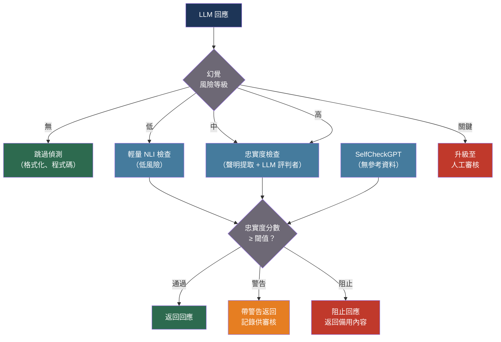

# [BEE-30043] LLM 幻覺偵測與事實依據

:::info
LLM 幻覺——虛構、不受支持或與來源材料矛盾的輸出——需要多層生產環境偵測管道：原子聲明分解、基於 NLI 或 LLM 的聲明與檢索上下文驗證，以及在無參考資料可用時以自我一致性採樣作為備用方案。
:::

## 背景

幻覺——生成看似合理但不忠實或事實錯誤的內容——是生產 LLM 部署中最關鍵的失效模式。這個術語由 Maynez 等人（2020 年）在抽象摘要研究中正式定義：LLM 可能產生**內在幻覺**（與來源文件矛盾的輸出）或**外在幻覺**（既不矛盾也無法從來源驗證的輸出——僅是無法核實）。Ji 等人（2023 年）將此分類法擴展到對話、問答、機器翻譯和 LLM，提供了迄今被超過 3,000 篇後續論文引用的調查。

TruthfulQA 基準測試（Lin 等人，2022 年）揭示了一個反直覺的發現：較大的模型並不更真實。這個涵蓋 38 個類別、817 個問題的基準測試——設計用來捕捉人類常持有錯誤信念的問題——顯示 GPT 模型的真實性僅達 58%，而人類表現為 94%。較大的模型更善於模仿其在預訓練資料中看到的自信謊言，使得單純的規模無法解決問題。

對於 RAG 系統，研究社群開發了 RAGAS（Saad-Falcon 等人，2023 年）——一個無需參考資料的評估框架，對忠實度（答案是否基於檢索上下文？）、答案相關性（是否解答了問題？）和上下文相關性（檢索上下文是否聚焦？）進行評分。Manakul 等人（2023 年）引入了 SelfCheckGPT：一種零資源方法，透過多次採樣相同提示詞來偵測幻覺——模型確實了解的事實在各樣本間一致出現，而幻覺事實則出現分歧。

HaluEval（Li 等人，2023 年）確立 ChatGPT 在問答、對話和摘要任務中生成幻覺內容的比例約為 19.5%。FActScore（Min 等人，2023 年）顯示即使 GPT-4 在開放域傳記生成中的原子事實精確度也僅達 58%。

## 最佳實踐

### 選擇偵測策略前先分類幻覺風險

**SHOULD**（應該）在應用偵測開銷前，按幻覺風險檔案對每次 LLM 呼叫進行分類。並非所有任務都具有相同風險：JSON 格式化任務不可能產生事實幻覺；無檢索上下文的傳記摘要沒有可驗證的參考資料；RAG 問答回應有可檢索的參考資料。將偵測機制與風險相匹配：

```python
from enum import Enum

class HallucinationRisk(Enum):
    NONE = "none"           # 格式化、翻譯、有測試套件的程式碼任務
    LOW = "low"             # 分類、所提供文字的摘要
    MEDIUM = "medium"       # 帶 RAG 的開放域問答
    HIGH = "high"           # 醫療、法律、金融事實聲明
    CRITICAL = "critical"   # 高風險決策；強制要求人工審核

DETECTION_STRATEGY = {
    HallucinationRisk.NONE: "skip",
    HallucinationRisk.LOW: "nli_lightweight",
    HallucinationRisk.MEDIUM: "faithfulness_check",
    HallucinationRisk.HIGH: "factscore_plus_human",
    HallucinationRisk.CRITICAL: "human_review",
}
```

### 對 RAG 回應實施忠實度檢查

在高風險情境中使用時，**MUST**（必須）驗證 RAG 回應中的每個聲明是否有檢索上下文的支持。RAGAS 忠實度指標將此操作化為原子聲明提取後的 NLI 分類：

```python
import anthropic
from dataclasses import dataclass

@dataclass
class Claim:
    text: str
    supported: bool        # True = 被檢索上下文所蘊含
    support_excerpt: str   # 支持（或矛盾）該聲明的摘錄

@dataclass
class FaithfulnessResult:
    claims: list[Claim]
    faithfulness_score: float   # 有上下文支持的聲明比例
    response_text: str

async def check_faithfulness(
    response: str,
    retrieved_context: list[str],
    *,
    model: str = "claude-haiku-4-5-20251001",   # 使用更廉價的模型進行聲明提取
) -> FaithfulnessResult:
    """
    將回應分解為原子聲明，然後使用 LLM 評判者
    對照檢索上下文驗證每個聲明。
    """
    client = anthropic.AsyncAnthropic()
    context_block = "\n\n".join(
        f"[來源 {i+1}]\n{doc}" for i, doc in enumerate(retrieved_context)
    )

    # 步驟 1：從回應中提取原子聲明
    extraction_response = await client.messages.create(
        model=model,
        max_tokens=1024,
        temperature=0,
        messages=[{
            "role": "user",
            "content": (
                f"以編號清單形式從以下回應中提取所有事實聲明。"
                f"每個聲明應為單一、自足的原子陳述。\n\n回應：\n{response}"
            ),
        }],
    )
    raw_claims = extraction_response.content[0].text

    # 步驟 2：對照上下文驗證每個聲明
    verification_response = await client.messages.create(
        model=model,
        max_tokens=2048,
        temperature=0,
        messages=[{
            "role": "user",
            "content": (
                f"對於以下每個聲明，判斷其是否有上下文支持。"
                f"輸出 JSON：[{{'claim': '...', 'supported': true/false, "
                f"'excerpt': '...'}}]\n\n"
                f"上下文：\n{context_block}\n\n"
                f"聲明：\n{raw_claims}"
            ),
        }],
    )

    import json, re
    raw = verification_response.content[0].text
    match = re.search(r"\[.*\]", raw, re.DOTALL)
    claims_data = json.loads(match.group(0)) if match else []

    claims = [
        Claim(
            text=c.get("claim", ""),
            supported=c.get("supported", False),
            support_excerpt=c.get("excerpt", ""),
        )
        for c in claims_data
    ]
    supported = [c for c in claims if c.supported]
    score = len(supported) / len(claims) if claims else 1.0

    return FaithfulnessResult(
        claims=claims,
        faithfulness_score=score,
        response_text=response,
    )
```

**MUST**（必須）設定忠實度閾值，低於此閾值的回應將被抑制、標記為需要人工審核或以更受約束的提示詞重新生成。閾值 0.85 表示最多 15% 的聲明可以未經驗證——正確的閾值取決於領域的風險檔案：

```python
FAITHFULNESS_THRESHOLDS = {
    HallucinationRisk.MEDIUM: 0.80,
    HallucinationRisk.HIGH: 0.95,
    HallucinationRisk.CRITICAL: 1.00,   # 零未驗證聲明
}

def disposition(result: FaithfulnessResult, risk: HallucinationRisk) -> str:
    threshold = FAITHFULNESS_THRESHOLDS.get(risk, 0.80)
    if result.faithfulness_score >= threshold:
        return "pass"
    elif result.faithfulness_score >= threshold - 0.10:
        return "warn"    # 帶警告返回，記錄供審核
    else:
        return "block"   # 抑制回應，返回備用內容
```

### 在無參考資料時使用 SelfCheckGPT 進行幻覺偵測

在無參考資料或檢索上下文可用時，**SHOULD**（應該）以自我一致性採樣作為無參考幻覺偵測器。模型確實了解的聲明在多個樣本間一致出現；幻覺事實只出現在部分樣本中：

```python
import asyncio

async def selfcheck_sentence(
    sentence: str,
    context_sentences: list[str],   # 同一提示詞的其他獨立樣本
    *,
    model: str = "claude-haiku-4-5-20251001",
) -> float:
    """
    使用 SelfCheckGPT 對單一句子的幻覺風險進行評分。
    返回 [0, 1] 的分數：1.0 = 肯定是幻覺，0.0 = 一致。
    每個上下文句子都來自同一提示詞的獨立樣本。
    """
    client = anthropic.AsyncAnthropic()

    async def check_one(other_sample: str) -> bool:
        """檢查 `sentence` 是否被 `other_sample` 所矛盾。"""
        r = await client.messages.create(
            model=model,
            max_tokens=64,
            temperature=0,
            messages=[{
                "role": "user",
                "content": (
                    f"以下陳述是否被下方段落所矛盾或未被提及？"
                    f"僅回答 YES 或 NO。\n\n"
                    f"陳述：{sentence}\n\n段落：{other_sample}"
                ),
            }],
        )
        return "YES" in r.content[0].text.upper()

    contradictions = await asyncio.gather(
        *[check_one(s) for s in context_sentences]
    )
    # 矛盾此句子的樣本比例
    return sum(contradictions) / len(context_sentences)

async def selfcheck_response(
    prompt: str,
    *,
    n_samples: int = 5,
    model: str = "claude-sonnet-4-20250514",
    checker_model: str = "claude-haiku-4-5-20251001",
) -> dict[str, float]:
    """
    採樣 `n_samples` 個補全，然後透過檢查各樣本間的一致性
    對每個句子進行幻覺評分。
    返回句子到幻覺分數的映射字典。
    """
    client = anthropic.AsyncAnthropic()

    async def sample() -> str:
        r = await client.messages.create(
            model=model, max_tokens=512, temperature=0.7,
            messages=[{"role": "user", "content": prompt}],
        )
        return r.content[0].text

    samples = await asyncio.gather(*[sample() for _ in range(n_samples)])

    # 對第一個樣本中的每個句子與其他樣本進行評分
    primary = samples[0]
    sentences = [s.strip() for s in primary.split(".") if s.strip()]
    others = samples[1:]

    scores = await asyncio.gather(
        *[selfcheck_sentence(sent, others, model=checker_model) for sent in sentences]
    )
    return {sent: score for sent, score in zip(sentences, scores)}
```

### 提示模型引用來源並自我驗證

在 RAG 模式下操作時，**SHOULD**（應該）指示模型對每個事實聲明引用特定的來源段落。這使模型的依據可被稽核，並在模型超出檢索上下文進行推斷時顯現出來：

```python
CITATION_SYSTEM_PROMPT = """你僅根據提供的文件回答問題。
對於回應中的每個事實聲明，在括號中引用來源文件編號：[1]、[2] 等。
如果某個聲明無法得到任何提供文件的支持，請明確說明：
「我在提供的來源中找不到此資訊。」
不要做出文件不支持的聲明。"""
```

**SHOULD**（應該）在生成後添加自我驗證步驟，要求模型審查其自身回應並撤回任何無法用特定引文支持的聲明。對於允許額外延遲的 CRITICAL 風險任務，此方法最為有效：

```python
SELF_VERIFICATION_PROMPT = """審查你之前的回應。
對於你做出的每個聲明：
1. 從來源中找到確切的支持引文
2. 如果找不到支持引文，撤回該聲明並說明

修訂後的回應（撤回不受支持的聲明）："""
```

### 在生產環境中監控幻覺率

**MUST**（必須）在生產環境中按模型、按提示詞範本和按文件類別追蹤忠實度分數。隨時間下降的忠實度分數表明檢索品質衰退（文件變得過時）、模型更新迴歸或提示詞漂移：

```python
import time
import logging

logger = logging.getLogger(__name__)

def log_hallucination_check(
    *,
    call_id: str,
    model: str,
    prompt_template: str,
    risk_level: HallucinationRisk,
    faithfulness_score: float,
    disposition: str,
    n_claims: int,
    n_supported: int,
) -> None:
    logger.info(
        "hallucination_check",
        extra={
            "call_id": call_id,
            "model": model,
            "prompt_template": prompt_template,
            "risk_level": risk_level.value,
            "faithfulness_score": round(faithfulness_score, 3),
            "disposition": disposition,
            "n_claims": n_claims,
            "n_supported": n_supported,
            "timestamp": time.time(),
        },
    )
```

當任何提示詞範本的 24 小時滾動平均忠實度分數降至 0.90 以下時發出告警——這是在使用者大規模遭遇不良輸出之前的早期預警信號。

## 流程圖



## 偵測方法比較

| 方法 | 是否需要參考資料 | 適用於 | 成本 | 最適情境 |
|---|---|---|---|---|
| 基於 NLI 的忠實度 | 檢索上下文 | RAG 問答 | 低（NLI 模型呼叫） | 高量 RAG |
| LLM 評判者忠實度 | 檢索上下文 | RAG 問答 | 中（每次檢查一次 LLM 呼叫） | 高風險 RAG |
| SelfCheckGPT | 無 | 任何開放式生成 | 高（N 個樣本） | 無檢索上下文 |
| FActScore | 知識庫（如 Wikipedia） | 傳記、事實類 | 高（聲明分解 + 知識庫查詢） | 離線評估 |
| 引用提示詞 | 提示詞層級 | RAG、文件問答 | 免費 | 第一道防線 |

## 相關 BEE

- [BEE-30007](rag-pipeline-architecture.md) -- RAG 管道架構：幻覺是 RAG 的主要失效模式；RAGAS 忠實度是主要的 RAG 品質指標
- [BEE-30041](llm-self-consistency-and-ensemble-sampling.md) -- LLM 自我一致性與集成採樣：SelfCheckGPT 使用自我一致性採樣在沒有參考資料的情況下偵測幻覺
- [BEE-30020](llm-guardrails-and-content-safety.md) -- LLM 防護欄與內容安全：防護欄攔截有害輸出；幻覺偵測攔截事實錯誤輸出——兩者都是必要的
- [BEE-30004](evaluating-and-testing-llm-applications.md) -- 評估與測試 LLM 應用程式：忠實度分數和幻覺率是知識密集型任務的主要離線評估指標

## 參考資料

- [Maynez et al. On Faithfulness and Factuality in Abstractive Summarization — ACL 2020](https://aclanthology.org/2020.acl-main.173/)
- [Ji et al. Survey of Hallucination in Natural Language Generation — arXiv:2202.03629, ACM Computing Surveys 2023](https://arxiv.org/abs/2202.03629)
- [Lin et al. TruthfulQA: Measuring How Models Mimic Human Falsehoods — arXiv:2109.07958, ACL 2022](https://arxiv.org/abs/2109.07958)
- [Min et al. FActScore: Fine-grained Atomic Evaluation of Factual Precision in Long Form Text Generation — arXiv:2305.14251, EMNLP 2023](https://arxiv.org/abs/2305.14251)
- [Li et al. HaluEval: A Large-Scale Hallucination Evaluation Benchmark for Large Language Models — arXiv:2305.11747, EMNLP 2023](https://arxiv.org/abs/2305.11747)
- [Saad-Falcon et al. RAGAS: Automated Evaluation of Retrieval Augmented Generation — arXiv:2309.15217, 2023](https://arxiv.org/abs/2309.15217)
- [Manakul et al. SelfCheckGPT: Zero-Resource Black-Box Hallucination Detection — arXiv:2303.08896, EMNLP 2023](https://arxiv.org/abs/2303.08896)
