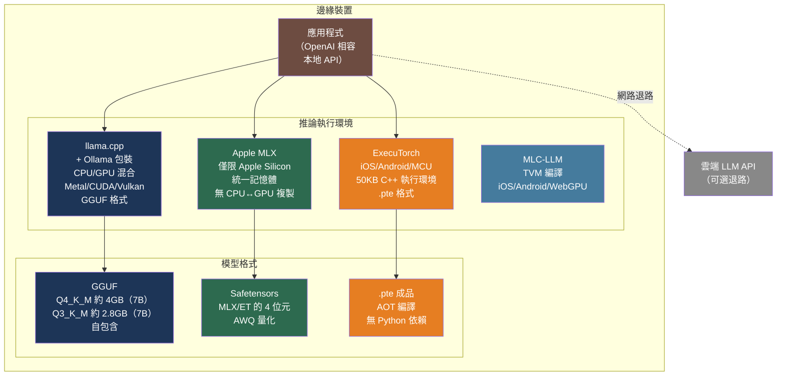

# [BEE-577] LLM 邊緣裝置與行動裝置上的推論

:::info
在裝置端執行 LLM 推論可消除雲端 API 的來回延遲、讓敏感資料不離開裝置，並支援離線運作——代價是量化（quantization）帶來的精確度損失，以及與伺服器端部署根本不同的熱節流（thermal throttling）限制。
:::

## 情境

主流的 LLM 部署模型——將提示送到雲端 API，接收生成結果——在三種條件下會失效：資料不能離開裝置（醫療、金融、個人資料）、裝置沒有可靠的網路連線（野外作業、偏遠地區、嵌入式系統），或 API 往返延遲無法接受（即時語音、遊戲對話、UI 補全）。裝置端 LLM 推論可同時解決這三個問題。

關鍵技術是量化：一個 70 億參數的模型以 FP16 精度需要約 14 GB 記憶體並需要 GPU 才能達到實用速度，但同一個模型以 4 位元精度（Q4_K_M）只需約 4 GB——在旗艦智慧型手機可用 RAM 範圍內——並在現代行動晶片上能達到 9–14 tokens/秒，足以應付大多數互動式應用。

**llama.cpp**（https://github.com/ggml-org/llama.cpp）由 Georgi Gerganov 於 2023 年 3 月開始開發，證明了以手寫 SIMD 核心高度最佳化的 C++ 執行環境可在包含 Apple Silicon、x86 CPU 和 ARM 的消費性硬體上執行量化 LLM。它在 2023 年 8 月引入 **GGUF** 檔案格式，作為量化模型權重與中繼資料的自描述容器，目前已成為邊緣部署 LLM 的主流發布格式。llama.cpp 周邊生態系——Ollama、LM Studio、Jan 等——讓本地 LLM 部署無需 ML 工程專業知識即可上手。

針對 Apple Silicon，Apple 的 **MLX** 框架（https://github.com/ml-explore/mlx）透過利用 M 系列晶片的統一記憶體架構（Unified Memory Architecture）提供更高效能：CPU 和 GPU 共享同一塊物理 DRAM，因此模型權重無需在處理器之間複製。對於跨平台行動端（iOS、Android、微控制器），Meta 的 **ExecuTorch**（https://github.com/pytorch/executorch）將 PyTorch 模型編譯為可在 50 KB 執行環境部署的成品，支援 13+ 種硬體後端，且不需要 Python 依賴。

## GGUF 格式與量化

GGUF 於 2023 年 8 月 21 日取代了早期的 GGML 格式。其核心設計特性是自包含性：單一 `.gguf` 檔案存放模型權重、分詞器詞彙表、特殊 token、位置編碼參數，以及重建模型所需的所有架構超參數，不需要額外的設定檔。

**檔案結構：** 4 位元組魔數（`0x47475546`）、版本號（目前為 3）、tensor 數量、中繼資料鍵值對，接著是 tensor 資料。Tensor 資料對齊排列以支援 `mmap` 載入——作業系統只分頁載入前向傳播實際存取的權重區塊，降低尖峰常駐記憶體。

**量化類型：** GGUF 同時定義了舊式整數類型和現代 K-quant 類型。K-quant 使用**每區塊量化（per-block quantization）**：權重被切分為 32–256 個元素的區塊，每個區塊有各自的學習尺度（scale）和最小值，而非整個 tensor 共用一個全局尺度。這大幅降低了局部幅值變化較大的權重的量化誤差：

| 類型 | 位元/權重（有效） | 7B 模型大小 | 說明 |
|---|---|---|---|
| FP16 | 16.0 | 約 14 GB | 全精度 |
| Q8_0 | 8.0 | 約 7 GB | 舊式，每區塊簡單尺度 |
| Q6_K | 6.5625 | 約 5.5 GB | 接近 FP16 品質 |
| Q5_K_M | 5.5 | 約 4.5 GB | 品質與大小的良好平衡 |
| Q4_K_M | 4.5 | 約 3.8–4.1 GB | **推薦預設值**：保留 FP16 約 97–99% 品質 |
| Q3_K_M | 3.4375 | 約 2.8 GB | 在複雜任務上有明顯退化 |
| Q2_K | 2.625 | 約 2.5 GB | 僅供實驗——品質損失顯著 |

`K_M` 後綴（「Medium」）採用混合精度：注意力層和嵌入層保持比前饋層略高的位元深度，捕捉到使用統一低精度的大部分品質差距。

**選擇量化精度：** Q4_K_M 是在 6–8 GB 可用記憶體裝置上使用 7B 模型的實用預設值。在僅有 4 GB 的裝置上（例如舊款 iPhone、低階 Android），需要 Q3_K_M 或更小的模型類別（3B、1.5B）。在權重記憶體之上，2048 token 上下文的 KV 快取還需要額外 2–4 GB。

## 執行環境

### llama.cpp

以 CPU 為主的邊緣推論參考實作。計算後端可插拔：Apple GPU 用 Metal、NVIDIA 用 CUDA、跨平台 GPU 用 Vulkan，以及 CPU 最佳化 BLAS。`--n-gpu-layers` 旗標可將指定數量的 transformer 層卸載到 GPU，其餘保留在 CPU，實現在模型超出 GPU VRAM 但能放入 CPU+GPU 合計記憶體的裝置上的混合推論：

```bash
# 拉取 Q4_K_M GGUF 模型並執行
./llama-cli \
  --model Llama-3.2-3B-Instruct-Q4_K_M.gguf \
  --n-gpu-layers 32 \      # 將全部 32 層卸載到 Metal/CUDA
  --ctx-size 4096 \        # 上下文窗口大小
  --threads 4 \            # CPU 執行緒數（用於混合或僅 CPU 推論）
  --prompt "用一句話解釋什麼是 GGUF。"
```

代表性硬體效能（Mistral/LLaMA 7B，Q4_0，社群基準測試）：

| 裝置 | 生成速度（t/s） |
|---|---|
| M2 Ultra（76 核 GPU，Metal） | 約 94 |
| M1（7 核 GPU，Metal） | 約 14 |
| iPhone 15 Pro（A17 Pro，Metal） | 約 9 |
| Raspberry Pi 5（ARM Cortex-A76） | 2–5 |

Apple M1 Max 搭配 Core ML Int4 區塊量化對 Llama-3.1-8B-Instruct 可達約 33 t/s。

### Apple MLX

MLX 是為 Apple Silicon 統一記憶體架構設計的陣列計算框架。與 llama.cpp 的 CPU/GPU 分離不同，MLX 操作的陣列存在於一個共享物理記憶體池中，消除了非 UMA 硬體上作為主要瓶頸的 CPU↔GPU 資料傳輸開銷：

```python
# mlx-lm：透過 pip install mlx-lm 安裝
from mlx_lm import load, generate

# 模型載入到 CPU+GPU 共享記憶體池——無傳輸開銷
model, tokenizer = load("mlx-community/Llama-3.2-3B-Instruct-4bit")

response = generate(
    model,
    tokenizer,
    prompt="用一句話解釋量化。",
    max_tokens=256,
    temp=0.0,
)
print(response)
```

MLX 使用惰性求值（lazy evaluation）：操作不會立即執行，直到結果被具體化，讓執行環境能夠融合操作並在 CPU 和 GPU 之間最佳排程。在比較基準測試中，MLX 在 Apple Silicon 上的 LLM 生成速度持續優於 Ollama（使用 llama.cpp）和 PyTorch MPS。

### ExecuTorch（Meta / PyTorch）

ExecuTorch 將 PyTorch 模型提前編譯為 `.pte` 成品，可在 50 KB 的 C++ 執行環境上運行，無需 Python 依賴。編譯流程在輸出目標特定二進位檔之前，將模型轉換通過多個中間表示：

```python
import torch
from executorch.exir import to_edge_transform_and_lower
from executorch.backends.xnnpack.partition.xnnpack_partitioner import XnnpackPartitioner

# 步驟 1：匯出模型計算圖
model = load_your_model()
example_args = (torch.randn(1, 512),)
exported = torch.export.export(model, example_args)

# 步驟 2：降低至 Edge 方言並分區到硬體後端
edge_program = to_edge_transform_and_lower(
    exported,
    partitioner=[XnnpackPartitioner()],  # 或 CoreMLPartitioner、VulkanPartitioner 等
)

# 步驟 3：序列化為 .pte——可部署至 iOS、Android 或嵌入式目標
with open("model.pte", "wb") as f:
    f.write(edge_program.to_executorch().buffer)
```

ExecuTorch 為 Meta 生產應用中的裝置端 AI 提供支援——Instagram、WhatsApp、Quest 3 和 Ray-Ban Meta 智慧眼鏡。它支援 13+ 種後端，包括 XNNPACK（最佳化 CPU）、Core ML、Apple MPS、Qualcomm AI Engine、MediaTek，以及用於微控制器的 ARM Cortex-M。

### Ollama

Ollama（https://ollama.com）包裝了 llama.cpp，提供單一命令的模型管理、自動量化選擇，以及在 `localhost:11434` 上的 OpenAI 相容 REST API。對於希望在不管理 GGUF 檔案或建置工具鏈的情況下部署本地 LLM 的團隊，這是最實用的入門方式：

```bash
# 安裝（macOS/Linux）
curl -fsSL https://ollama.com/install.sh | sh

# 拉取並執行模型（自動 GGUF 下載和 GPU 偵測）
ollama run llama3.2:3b "解釋什麼是 GGUF。"

# OpenAI 相容 REST API——可直接替換針對 OpenAI 的客戶端程式碼
curl http://localhost:11434/v1/chat/completions \
  -H "Content-Type: application/json" \
  -d '{"model": "llama3.2:3b", "messages": [{"role": "user", "content": "你好"}]}'
```

自訂模型設定使用 Modelfile——一種類似 Dockerfile 的宣告格式：

```dockerfile
FROM llama3.2:3b

# 為特定使用場景覆蓋系統提示
SYSTEM """您是簡潔的程式碼審查助手。審查程式碼片段，
僅識別關鍵缺陷和安全問題。跳過風格評論。"""

# 執行時參數
PARAMETER temperature 0.2
PARAMETER num_ctx 8192
PARAMETER top_p 0.9
```

## 最佳實踐

### 對消費性硬體上的 7B 模型以 Q4_K_M 作為預設量化

**SHOULD**（建議）對 6–8 GB 可用記憶體裝置上的 7B 級模型預設使用 Q4_K_M。以約 4 GB，它能放入旗艦智慧型手機的典型記憶體預算，同時在標準基準測試上保留 97–99% 的 FP16 品質。當品質比餘裕更重要時使用 Q5_K_M（4.5 GB）；只有在裝置在計入 OS 開銷和 KV 快取後確實無法放入 Q4_K_M 時才使用 Q3_K_M（2.8 GB）。

**MUST NOT**（不得）假設記憶體預算等於裝置總 RAM。在 iOS 上，如果使用超過裝置總 RAM 的 50–70%，系統可能會終止行程。在 Android 上，可用預算取決於其他正在執行的應用程式。在原始權重大小之上，KV 快取和激活記憶體務必保留 1.5–2 倍的安全餘量。

### 為持續工作負載設計熱節流應對機制

**MUST**（必須）在指定持續推論效能時考量熱節流（thermal throttling）。針對 iPhone 16 Pro 的研究顯示，其峰值為 40 t/s，但在連續兩次推論執行後節流至約 23 t/s（降低 44%），並在基準測試持續時間的 65% 中保持性能降級狀態。任何假設峰值基準效能的 SLA 或 UX 設計，對於超過 30–60 秒的工作負載都會在生產環境中失效：

```python
import time

def generate_with_pacing(
    model,
    prompts: list[str],
    pause_between_seconds: float = 2.0,  # 查詢間允許熱回復
) -> list[str]:
    """
    在推論呼叫之間插入短暫暫停，以減少行動裝置的熱積累。
    不間斷的持續生成會降低效能。
    """
    results = []
    for prompt in prompts:
        result = model.generate(prompt)
        results.append(result)
        time.sleep(pause_between_seconds)  # 短暫冷卻
    return results
```

### 根據裝置能力選擇模型大小，而非最大可用大小

**SHOULD** 根據目標裝置的實際記憶體預算和效能底線選擇模型大小，而非技術上能放入的最大模型。在 8 GB RAM 的裝置上（OS 和應用程式消耗 3.8 GB），7B Q4_K_M 模型（約 4 GB）幾乎沒有餘量。3B Q4_K_M 模型（約 2 GB）留有足夠緩衝供更大的上下文窗口使用，且對大多數互動任務能產生可接受的結果。主流行動端優先使用 3B–4B 模型；7B 保留給高端裝置（iPhone 15 Pro、M 系列 Mac、Galaxy S24+）。

### 分別在冷機和暖機狀態下進行基準測試

**SHOULD** 同時測量冷機（全新重開機或近期無推論）和暖機（持續推論 2+ 分鐘後）兩種狀態下的推論效能。由於熱節流，冷機基準測試會高估行動晶片的實際持續效能 30–50%。任何 SLA 承諾的生產效能基準必須使用暖機狀態的測量值。

### 在 Apple Silicon 上，吞吐量敏感的應用優先使用 MLX 而非 llama.cpp Metal

**SHOULD** 對需要在 M 系列 Mac 上最大化生成吞吐量的應用使用 mlx-lm，而非 Ollama。MLX 的統一記憶體模型消除了 llama.cpp 架構即使使用 Metal 也需要的 CPU↔GPU 緩衝區傳輸。對於開發和臨時使用，Ollama 的簡便性往往超過吞吐量差異；對於批次處理或高頻推論，MLX 的速度明顯更快。

### 透過 OpenAI 相容的本地 API 提升應用可攜性

**SHOULD** 提供具有 OpenAI 相容 API 介面的本地推論伺服器，讓應用程式程式碼不需要硬編碼特定執行環境。Ollama 的 `/v1/chat/completions` 端點是即插即用的替代方案。這允許在不更改應用程式的情況下切換底層執行環境（llama.cpp → MLX → ExecuTorch）：

```python
from openai import OpenAI

# 相同的客戶端程式碼可用於 Ollama（本地）、OpenAI（雲端）或任何其他
# OpenAI 相容端點——只需更改 base_url
client = OpenAI(
    base_url="http://localhost:11434/v1",
    api_key="ollama",  # Ollama 忽略此值，但客戶端要求非空值
)

response = client.chat.completions.create(
    model="llama3.2:3b",
    messages=[{"role": "user", "content": "用一句話解釋 GGUF。"}],
    max_tokens=256,
)
```

## 視覺化



## 常見錯誤

**以裝置總 RAM 作為可用記憶體預算。** iOS 可能終止消耗超過總 RAM 約 50–70% 的行程。Android 的限制因活躍應用程式而異。在 8 GB 裝置上「能放入」4 GB 的 7B Q4_K_M 模型，在生產環境中因 OS 記憶體壓力未被測量而頻繁觸發記憶體不足崩潰。行動裝置上務必保留至少 2 GB 餘量。

**以冷機基準數值作為 SLA 承諾依據。** 在裝置重開機後立即測量的 40 t/s 基準結果，對於超過一分鐘的工作階段不會維持。行動 Silicon 上的持續推論由於熱限制會節流至峰值吞吐量的 60% 甚至更低。請以代表性提示/補全長度進行 5 分鐘持續推論工作階段的測試。

**忽略上下文窗口的記憶體縮放。** KV 快取記憶體隨上下文長度線性增長。7B 模型在 2048 token 上下文需要約 2 GB KV 快取；在 8192 token 時變為約 8 GB——可能超過權重預算本身。將 `--ctx-size`（llama.cpp）或 `num_ctx`（Ollama）限制在應用實際使用模式所需的最小值。

**未設計優雅的雲端退路機制。** 當請求超過裝置上下文窗口、任務需要比模型訓練截止日期更新的知識，或裝置發生熱節流時，裝置端模型將會失效。應用程式設計必須包含明確的退路路徑：偵測失效或品質退化，並為使用者提供路由到雲端 API 的選項。

**對所有裝置層級使用相同量化精度。** Q4_K_M 7B 模型在 iPhone 15 Pro 上運行良好，但在 iPhone 12（4 GB RAM）上會觸發 OOM 終止。必須針對目標進行模型選擇：在執行時載入裝置能力，並為該特定裝置選擇適當的模型大小和量化等級。

## 相關 BEE

- [BEE-30061](llm-quantization-for-inference.md) -- LLM 推論量化：針對 GPU 叢集的伺服器端量化（GPTQ、AWQ、FP8）；邊緣量化使用相同技術，但必須在遠更嚴苛的記憶體預算內運作，且沒有 VRAM 可用
- [BEE-30021](llm-inference-optimization-and-self-hosting.md) -- LLM 推論最佳化與自架：以 vLLM、TensorRT-LLM 和連續批次處理進行的伺服器端推論最佳化；概念上相似但假設 GPU 叢集，而非行動硬體
- [BEE-30053](llm-multi-provider-resilience-and-api-fallback-patterns.md) -- LLM 多供應商韌性與 API 備援模式：裝置端推論失效或不足時的雲端退路模式
- [BEE-30010](llm-context-window-management.md) -- LLM 上下文窗口管理：在邊緣裝置上，上下文窗口限制更加嚴峻，因為 KV 快取記憶體直接與模型權重競爭同一塊有限 DRAM

## 參考資料

- [llama.cpp — github.com/ggml-org/llama.cpp](https://github.com/ggml-org/llama.cpp)
- [GGUF 格式規範 — github.com/ggml-org/ggml/blob/master/docs/gguf.md](https://github.com/ggml-org/ggml/blob/master/docs/gguf.md)
- [Hugging Face Hub 上的 GGUF — huggingface.co/docs/hub/gguf](https://huggingface.co/docs/hub/gguf)
- [Apple MLX — github.com/ml-explore/mlx](https://github.com/ml-explore/mlx)
- [MLX 統一記憶體 — ml-explore.github.io/mlx](https://ml-explore.github.io/mlx/build/html/usage/unified_memory.html)
- [Apple ML Research. Core ML 裝置端 Llama — machinelearning.apple.com](https://machinelearning.apple.com/research/core-ml-on-device-llama)
- [ExecuTorch — github.com/pytorch/executorch](https://github.com/pytorch/executorch)
- [Ollama — ollama.com](https://ollama.com/)
- [Ollama Modelfile 參考 — docs.ollama.com/modelfile](https://docs.ollama.com/modelfile)
- [MLC-LLM — github.com/mlc-ai/mlc-llm](https://github.com/mlc-ai/mlc-llm)
- [llama.cpp Apple Silicon 基準測試 — github.com/ggml-org/llama.cpp/discussions/4167](https://github.com/ggml-org/llama.cpp/discussions/4167)
- [llama.cpp iPhone 基準測試 — github.com/ggml-org/llama.cpp/discussions/4508](https://github.com/ggml-org/llama.cpp/discussions/4508)
- [行動裝置 LLM 熱節流 — arxiv.org/html/2603.23640](https://arxiv.org/html/2603.23640)
- [Raspberry Pi 5 上的 LLM 推論 — stratosphereips.org](https://www.stratosphereips.org/blog/2025/6/5/how-well-do-llms-perform-on-a-raspberry-pi-5)
