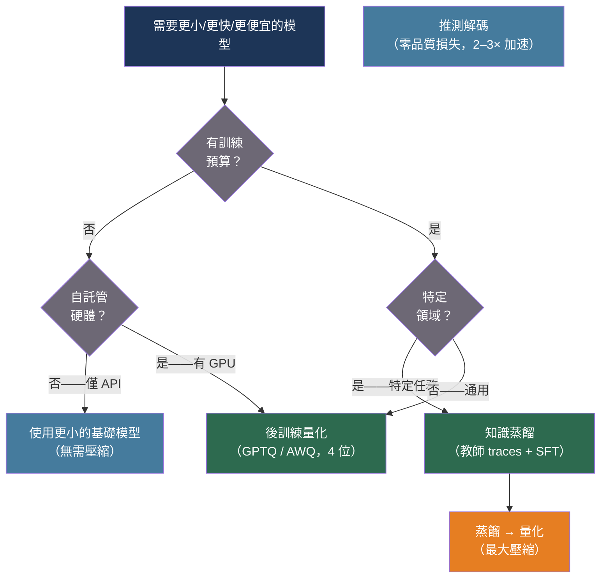

# [BEE-550] LLM 知識蒸餾與模型壓縮

:::info
在生產環境中部署前沿 LLM，意味著在按 token 計費的 API 成本與運行更小、更快、更廉價的壓縮模型之間做出選擇——知識蒸餾將教師模型的行為遷移至較小的學生模型，而後訓練量化則在不重新訓練的情況下降低權重精度，每種技術在壓縮比、準確率保留和基礎設施成本之間有不同的取捨。
:::

## 背景

前沿語言模型天生巨大：GPT-4、Claude 和 Llama 3 405B 之所以性能卓越，是因為規模定律獎勵更多的參數。但同樣的規模帶來了成本：服務 405B 模型需要多塊高端 GPU，引入與參數數量成正比的延遲，並帶有隨使用量增長的每 token API 費用。大多數生產任務——文件分類、實體提取、客服路由、程式碼審查反饋——並不需要前沿能力。它們需要的是在特定領域足夠出色、延遲符合 SLO、運行成本合理的模型。

Hinton、Vinyals 和 Dean（2015，arXiv:1503.02531）將知識蒸餾引入為通用框架：訓練更小的「學生」模型以模仿更大「教師」模型的輸出分佈，而非僅模仿其硬標籤。核心洞見在於：詞彙表上的軟概率分佈比獨熱正確答案包含更多資訊——它們編碼了教師認為哪些輸出是合理的，這對訓練提供了更豐富的信號。溫度 T > 1 的 softmax 放大了小概率之間的差異，使這種「暗知識（dark knowledge）」可被學生利用。

LLM 時代的蒸餾偏離了 Hinton 的原始方法，因為前沿模型過大，無法直接進行反向傳播。Mukherjee et al.（2023，arXiv:2306.02707）提出了 Orca：不匹配 token 分佈，而是在複雜任務上生成 GPT-4 的逐步推理過程（traces），然後在這些 traces 上微調 13B 的 Llama 模型。學生不僅學習教師回答了什麼，還學習教師如何思考。Orca-13B 在 BigBench Hard 上媲美甚至超越 ChatGPT，儘管其規模小 10–15 倍。Orca 2（arXiv:2311.11045）通過「提示擦除（Prompt Erasure）」進一步發展——在學生訓練中去除系統提示，使其學習推理策略而非表面模式。

量化採取了不同的方法：不改變模型的架構或訓練過程，而是降低現有權重的數值精度。Frantar et al.（2023，arXiv:2210.17323）提出了 GPTQ，一種使用 Hessian 感知捨入在不重新訓練的情況下將模型權重壓縮至 3–4 位的後訓練量化算法。一個在 fp16 下需要約 350 GB 的 175B GPT 模型，在 4 位 GPTQ 精度下約需 87 GB，推理速度提升 3.25–4.5 倍，大多數基準上的準確率損失可忽略不計。Lin et al.（2024，arXiv:2306.00978）提出了 AWQ（激活感知權重量化），榮獲 MLSys 2024 最佳論文：通過識別接收最大激活幅度的 1% 權重通道並保護這些通道免受激進量化，AWQ 在邊緣硬體上以更好的準確率實現了類似的壓縮。

## 最佳實踐

### 根據基礎設施和準確率約束選擇技術

**SHOULD**（應該）基於三個因素選擇壓縮技術：（a）是否有訓練預算（用於蒸餾的 GPU 時間），（b）準確率約束（可接受多少品質損失），（c）目標硬體：

| 情況 | 推薦方法 |
|---|---|
| API 託管模型，無 GPU，需降低成本 | 量化（通過供應商）或切換至更小的基礎模型 |
| 自託管，模型能放入顯存，需更快推理 | GPTQ 或 AWQ 量化（4 位，無需重訓） |
| 特定領域，有訓練數據，需縮小 10 倍 | 知識蒸餾（Orca 風格，在教師 traces 上微調） |
| 移動端或邊緣部署，極端尺寸約束 | AWQ + 結構化剪枝組合 |
| 需要零品質損失、2 倍加速 | 推測解碼（草稿模型 + 目標模型驗證） |

**MUST NOT**（不得）在以下情況應用蒸餾：（a）學生模型不足教師參數量的 5%；（b）任務需要分布外（OOD）泛化（數學、新領域）；（c）只能訪問學生自身的輸出（自蒸餾使 OOD 性能下降高達 40%，見 Fu et al., 2025，arXiv:2603.25562）。

### 對自託管模型應用後訓練量化

**SHOULD** 在運行自託管推理時，將 GPTQ 或 AWQ 量化作為第一個壓縮步驟。兩者都是後訓練技術，無需重新訓練——計算成本是一次性的離線量化過程：

```python
# 需要：pip install auto-gptq transformers accelerate
from transformers import AutoTokenizer
from auto_gptq import AutoGPTQForCausalLM, BaseQuantizeConfig

def quantize_to_gptq(
    model_name: str,
    output_dir: str,
    bits: int = 4,
    group_size: int = 128,
    calibration_texts: list[str] | None = None,
) -> None:
    """
    使用 Hessian 感知捨入進行一次性 GPTQ 量化。
    bits=4 實現 4 倍壓縮，大多數任務準確率損失可忽略。
    bits=3 實現 5.3 倍壓縮，但推理任務有可量化的退化。
    group_size=128 是每組量化的標準分組。
    """
    tokenizer = AutoTokenizer.from_pretrained(model_name, use_fast=True)

    quantize_config = BaseQuantizeConfig(
        bits=bits,
        group_size=group_size,
        desc_act=False,   # False 更快；True 在低位時更準確
    )

    # 校準數據：來自目標領域的 128 個樣本
    # 越特定領域的校準 = 該領域越好的準確率
    if calibration_texts is None:
        calibration_texts = [
            "The quick brown fox jumps over the lazy dog."
        ] * 128

    examples = [
        tokenizer(text, return_tensors="pt")
        for text in calibration_texts[:128]
    ]

    from auto_gptq import AutoGPTQForCausalLM
    model = AutoGPTQForCausalLM.from_pretrained(
        model_name,
        quantize_config=quantize_config,
    )
    model.quantize(examples)
    model.save_quantized(output_dir, use_safetensors=True)
    tokenizer.save_pretrained(output_dir)
    print(f"Quantized model saved to {output_dir}")


def load_quantized_for_inference(model_dir: str):
    """
    加載預量化的 GPTQ 模型進行推理。
    使用 4 位權重但 fp16 激活——推理時無準確率損失。
    """
    from auto_gptq import AutoGPTQForCausalLM
    from transformers import AutoTokenizer

    tokenizer = AutoTokenizer.from_pretrained(model_dir)
    model = AutoGPTQForCausalLM.from_quantized(
        model_dir,
        device_map="auto",
        use_safetensors=True,
    )
    return model, tokenizer
```

**SHOULD** 使用特定領域的校準數據而非通用文本。GPTQ 的 Hessian 近似是在校準集上計算的——使用實際生產流量樣本進行校準，比使用維基百科能為您的任務提供更好的量化效果和可量化的更低困惑度。

### 使用教師生成的推理 traces 進行蒸餾

**SHOULD** 採用 Orca 方法——在特定任務數據集上從教師模型生成豐富的逐步解釋，然後在這些 traces 上微調較小的學生模型——而非純粹的輸出模仿。僅對最終答案進行模仿只遷移了什麼，而非如何：

```python
import anthropic
import json

TEACHER_SYSTEM = """You are an expert reasoning assistant. When answering questions,
always:
1. Think through the problem step-by-step, showing your reasoning
2. Identify the key information and constraints
3. Arrive at a conclusion with explicit justification

Your response should model careful, systematic thinking that a student could learn from."""

async def generate_teacher_traces(
    questions: list[str],
    teacher_model: str = "claude-opus-4-6",
    output_path: str = "distillation_dataset.jsonl",
) -> None:
    """
    從教師模型生成 Orca 風格的推理 traces。
    生成的數據集用於微調較小的學生模型。
    成本估算：Opus 定價下每條 200-token 問題的 trace 約 $0.015。
    """
    client = anthropic.AsyncAnthropic()
    import asyncio

    async def trace_one(question: str) -> dict:
        resp = await client.messages.create(
            model=teacher_model,
            max_tokens=1024,
            system=TEACHER_SYSTEM,
            messages=[{"role": "user", "content": question}],
        )
        return {
            "question": question,
            "teacher_response": resp.content[0].text,
            "teacher_model": teacher_model,
        }

    # 分批處理，每批 10 個，以遵守速率限制
    results = []
    for i in range(0, len(questions), 10):
        batch = questions[i:i + 10]
        batch_results = await asyncio.gather(*[trace_one(q) for q in batch])
        results.extend(batch_results)

    with open(output_path, "w") as f:
        for record in results:
            f.write(json.dumps(record) + "\n")

    print(f"Generated {len(results)} traces → {output_path}")
```

生成 traces 後，使用教師 traces 作為目標，通過標準監督微調（SFT）微調較小的基礎模型（7B–13B）。Orca 2 論文發現，在 GPT-4 traces 上微調 13B Llama 模型，在 BigBench Hard 上達到了 ChatGPT 水準的性能。

**MUST NOT** 對每個樣本僅使用單一問答對進行蒸餾。Traces 必須包含中間推理步驟——只看到最終答案的模型無法學習教師系統性的問題分解方式。

### 使用量化感知加載快速上手

**SHOULD** 在需要在現有硬體上運行超大模型而無需離線量化步驟時，使用 BitsAndBytes 4 位加載（NF4 量化）：

```python
from transformers import AutoModelForCausalLM, AutoTokenizer, BitsAndBytesConfig
import torch

def load_with_4bit_quantization(model_name: str):
    """
    使用 BitsAndBytes 以 4 位 NF4 精度加載模型。
    NF4（正態浮點數 4）針對正態分佈的權重進行了優化。
    雙重量化進一步以每個參數約 0.37 位壓縮量化常數。
    可在 2× A100 40GB 而非 4× A100 80GB 上運行 70B 模型。
    """
    bnb_config = BitsAndBytesConfig(
        load_in_4bit=True,
        bnb_4bit_quant_type="nf4",              # NF4 vs fp4：NF4 更準確
        bnb_4bit_compute_dtype=torch.bfloat16,  # bf16 用於計算（非存儲）
        bnb_4bit_use_double_quant=True,         # 常數節省約 0.37 位/參數
    )

    tokenizer = AutoTokenizer.from_pretrained(model_name)
    model = AutoModelForCausalLM.from_pretrained(
        model_name,
        quantization_config=bnb_config,
        device_map="auto",
    )
    return model, tokenizer
```

## 視覺化



## 壓縮技術比較

| 技術 | 壓縮比 | 準確率保留 | 訓練成本 | 推理硬體 |
|---|---|---|---|---|
| GPTQ 4 位 | 4× | 大多數任務約 99% | 一次性離線量化 | 支持 CUDA 的 GPU |
| AWQ 4 位 | 4× | 邊緣硬體上略優於 GPTQ | 一次性離線量化 | GPU/移動 GPU |
| BitsAndBytes NF4 | 約 4× | 約 98% | 無（僅加載時） | 任意 CUDA GPU |
| Orca 蒸餾 | 參數量縮小 10–15 倍 | 特定領域約 100% | 高（在教師 traces 上 SFT） | 標準 GPU |
| Orca + GPTQ | 40–60× | 特定領域約 97% | 高 | 標準 GPU |

## 常見錯誤

**將蒸餾應用於不足教師 5% 規模的學生。** 7B 學生無法吸收 405B 教師的通用推理能力。蒸餾在學生有足夠容量表示任務時效果最佳。針對精心選擇的學生規模進行特定領域蒸餾，比對過小模型進行通用蒸餾更有效。

**使用自蒸餾來提升品質。** 從模型自身輸出進行蒸餾會消除多樣性並抑制自我修正。OOD 性能可能下降 40%（Fu et al., 2025）。始終使用更強的外部教師。

**使用通用文本為特定領域模型校準 GPTQ。** GPTQ 的量化決策取決於校準期間觀察到的激活模式。對法律文件模型使用維基百科校準，比使用法律文本校準產生更差的量化效果。

**量化後跳過準確率評估。** GPTQ 在 3 位及以下對推理任務產生可量化的準確率損失。在部署前，始終在有代表性的保留集上評估量化模型。

## 相關 BEE

- [BEE-30021](llm-inference-optimization-and-self-hosting.md) -- LLM 推理優化與自託管：用於高效服務量化模型的 vLLM、連續批處理和 KV 快取優化
- [BEE-30012](fine-tuning-and-peft-patterns.md) -- 微調與 PEFT 模式：用於在不完全重訓的情況下將量化模型適應特定任務的 LoRA 和 QLoRA
- [BEE-30011](ai-cost-optimization-and-model-routing.md) -- AI 成本優化與模型路由：將請求路由至最小可用模型是模型壓縮的運營補充

## 參考資料

- [Hinton et al. Distilling the Knowledge in a Neural Network — arXiv:1503.02531, 2015](https://arxiv.org/abs/1503.02531)
- [Frantar et al. GPTQ: Accurate Post-Training Quantization for Generative Pre-trained Transformers — arXiv:2210.17323, ICLR 2023](https://arxiv.org/abs/2210.17323)
- [Lin et al. AWQ: Activation-aware Weight Quantization for LLM Compression and Acceleration — arXiv:2306.00978, MLSys 2024 Best Paper](https://arxiv.org/abs/2306.00978)
- [Mukherjee et al. Orca: Progressive Learning from Complex Explanation Traces of GPT-4 — arXiv:2306.02707, 2023](https://arxiv.org/abs/2306.02707)
- [Mitra et al. Orca 2: Teaching Small Language Models How to Reason — arXiv:2311.11045, 2023](https://arxiv.org/abs/2311.11045)
- [Ko et al. DistiLLM: Towards Streamlined Distillation for Large Language Models — arXiv:2402.03898, ICML 2024](https://arxiv.org/abs/2402.03898)
- [Dettmers et al. QLoRA: Efficient Finetuning of Quantized LLMs — arXiv:2305.14314, NeurIPS 2023](https://arxiv.org/abs/2305.14314)
- [Fu et al. Revisiting On-Policy Distillation: Empirical Failure Modes and Simple Fixes — arXiv:2603.25562, 2025](https://arxiv.org/abs/2603.25562)
- [Hugging Face Transformers Quantization Guide — huggingface.co](https://huggingface.co/docs/transformers/main_classes/quantization)
