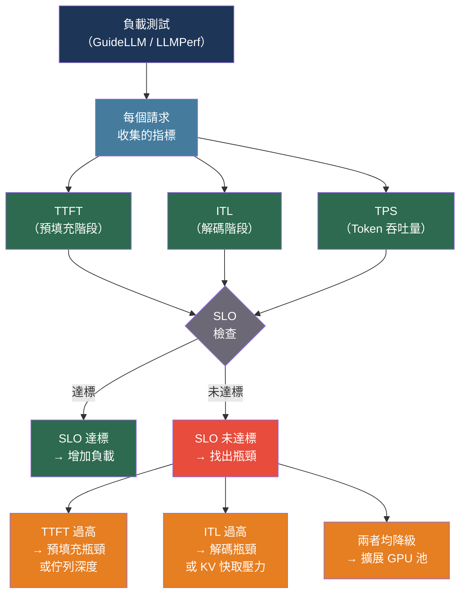

# [BEE-30058] LLM 負載測試與容量規劃

:::info
LLM 支援的服務打破了傳統負載測試的假設：回應依 token 數量而非請求數量計費和限速，串流回應需要將延遲分解為不同階段，而 GPU KV 快取記憶體（而非 CPU 執行緒）才是並發的關鍵限制。JMeter 和 Locust 等工具預設情況下測量的是錯誤的指標；容量規劃必須以 token 而非請求為單位進行。
:::

## 背景脈絡

傳統負載測試工具 — Apache JMeter、k6、Locust、Gatling — 是為毫秒延遲的 REST API 設計的，在這些 API 中，回應大小可預測，伺服器瓶頸是 CPU、執行緒或資料庫連接。LLM 推理打破了這三個假設。

回應延遲以秒而非毫秒計算，因為每個輸出 token 需要對完整注意力上下文進行順序前向傳遞。回應大小相差幾個數量級：問答請求可能返回 10 個 token；程式碼生成請求可能返回 2,000 個。關鍵資源不是 CPU 而是 GPU 高頻寬記憶體（HBM），由隨序列長度和批次大小增長的 KV 快取消耗。隨著並發增加，當 KV 快取填滿時，TTFT 可能從 400 毫秒跳升至 4,000 毫秒 — 這種非線性故障模式對只報告錯誤率的工具是不可見的。

Orca 服務系統（Yu 等人，OSDI 2022）引入了迭代級別排程 — 將每個解碼步驟視為可排程單元而非等待整個批次完成 — 並展示了比簡單批次處理提升 36.9 倍的吞吐量。Kwon 等人的 PagedAttention（vLLM，SOSP 2023，arXiv:2309.06180）將虛擬分頁應用於 KV 快取，將記憶體浪費減少到 4% 以下，實現 2-4 倍吞吐量提升。Agrawal 等人的 Sarathi-Serve（OSDI 2024，arXiv:2403.02310）發現預填充迭代（計算密集型，高 GPU 利用率）和解碼迭代（記憶體頻寬密集型，低 GPU 利用率）不應共享排程優先級，根據模型大小實現 2.6-5.6 倍更高的服務容量。Zhong 等人的 DistServe（OSDI 2024，arXiv:2401.09670）更進一步：將預填充和解碼物理分離到不同的 GPU 池消除了干擾，相比共置服務實現了 7.4 倍更多請求或 12.6 倍更嚴格的 SLO 合規。

對於在 Anthropic、OpenAI、AWS Bedrock 等託管 LLM API 之上執行應用程式的後端工程師來說，這些服務內部機制不能直接控制，但它們直接解釋了您觀察到的延遲分布以及您需要進行的容量規劃數學計算。

## 關鍵指標

LLM 基準測試定義了與傳統負載測試不同的指標詞彙：

| 指標 | 定義 | 瓶頸訊號 |
|---|---|---|
| **TTFT**（首個 Token 時間） | 從請求提交到第一個輸出 token 的時間 | 佇列深度；預填充吞吐量 |
| **ITL**（Token 間延遲） | 第一個 token 之後連續輸出 token 之間的平均時間 | 解碼吞吐量；KV 快取壓力 |
| **E2E**（端到端延遲） | 總時間：`TTFT + ITL × (輸出 token 數 - 1)` | 組合指標；掩蓋哪個階段降級 |
| **TPS**（每秒 Token 數） | 所有請求的每秒輸出 token 數總和 | 整體系統吞吐量 |
| **Goodput（有效吞吐量）** | 每秒滿足所有定義 SLO 的請求數 | 生產環境有意義的吞吐量 |

**TTFT** 是聊天和 Copilot 用例的主要響應性訊號。它隨輸入提示長度擴展，因為對長上下文的注意力預填充計算成本成比例增加。

**ITL**（也稱為 TPOT — 每個輸出 Token 的時間）決定了用戶感知的「打字速度」。在 50 毫秒/token 時，用戶觀察到約每秒 20 個 token，感覺流暢。GenAI-Perf 和 GuideLLM 排除 TTFT 計算 ITL：`(E2E - TTFT) / (輸出 token 數 - 1)`。LLMPerf 在 ITL 計算中包含 TTFT — 兩個數字不能直接比較。

**E2E 延遲** 混合了兩個操作上不同的訊號。分別報告 TTFT 和 ITL；單獨的 E2E 會掩蓋哪個階段降級了。

**Goodput** 定義為同時滿足所有 SLO 邊界的請求率。TTFT SLO 達標率 90% 和 ITL SLO 達標率 80% 的系統，其 goodput 等於同時滿足兩者的請求率，而非兩者的平均值。Wang 等人（arXiv:2410.14257）發現簡單的 goodput 定義允許系統通過主動拒絕邊緣情況請求來操控指標；「平滑 goodput」對此進行了修正。

**關鍵實證發現（Anyscale）：** 縮減輸出 token 在降低 E2E 延遲方面的效果約是縮短輸入的 100 倍。一個輸出 token 為 E2E 時間貢獻約 30-60 毫秒；一個輸入 token 貢獻約 0.3-0.7 毫秒。

## 最佳實踐

### 使用專用 LLM 基準測試工具

**不得**（MUST NOT）使用普通的 k6、JMeter 或 Locust 作為 LLM 性能測量的主要工具。它們的預設延遲指標只捕捉總請求持續時間 — 它們無法將 TTFT 與 ITL 分解，也無法測量 token 吞吐量。在串流回應期間，它們還會阻塞請求執行緒/協程，在高並發下產生測量偽影：

```bash
# GuideLLM：專用工具，積極維護，開源
# 安裝方式：pip install guidellm
# 支援：同步、並發、吞吐量、泊松、掃描模式

guidellm benchmark \
  --target "http://localhost:8000/v1" \    # OpenAI 相容端點
  --model "meta-llama/Llama-3.1-8B-Instruct" \
  --rate-type sweep \                      # 漸進式負載以找到飽和點
  --rate 1 10 \                            # 1 到 10 個請求/秒
  --num-prompts 500 \
  --data "dataset:sharegpt" \              # 真實提示分布
  --output-path ./benchmark-results/

# GuideLLM 輸出：
# - TTFT 百分位（p50、p90、p95、p99）
# - ITL 百分位（排除 TTFT，與 GenAI-Perf 慣例一致）
# - E2E 延遲百分位
# - Token 吞吐量（token/秒）
# - 請求吞吐量（請求/秒）
# - 完整 JSON/YAML/HTML 報告
```

**對於 OpenAI / Anthropic API 測試**（外部 API，非自行託管）：

```python
import asyncio
import time
from dataclasses import dataclass

@dataclass
class LLMBenchmarkResult:
    ttft_ms: float         # 首個 token 時間
    itl_ms: float          # Token 間延遲（平均，不含 TTFT）
    e2e_ms: float          # 總持續時間
    output_tokens: int
    input_tokens: int

async def benchmark_streaming_request(
    client,
    prompt: str,
    model: str,
) -> LLMBenchmarkResult:
    """
    分別測量串流 LLM 回應的 TTFT 和 ITL。
    TTFT = 到第一個內容增量的時間。
    ITL = 剩餘時間分佈在剩餘 token 上。
    """
    t_start = time.perf_counter()
    t_first_token = None
    token_times = []
    output_tokens = 0

    async with client.messages.stream(
        model=model,
        max_tokens=512,
        messages=[{"role": "user", "content": prompt}],
    ) as stream:
        async for event in stream:
            if hasattr(event, "type") and event.type == "content_block_delta":
                t_now = time.perf_counter()
                if t_first_token is None:
                    t_first_token = t_now
                token_times.append(t_now)
                output_tokens += 1

    t_end = time.perf_counter()
    ttft_ms = (t_first_token - t_start) * 1000 if t_first_token else 0
    e2e_ms = (t_end - t_start) * 1000

    itl_ms = 0.0
    if len(token_times) > 1:
        # 排除 TTFT：只測量第一個之後的 token 間隔
        intervals = [
            (token_times[i] - token_times[i-1]) * 1000
            for i in range(1, len(token_times))
        ]
        itl_ms = sum(intervals) / len(intervals)

    return LLMBenchmarkResult(
        ttft_ms=ttft_ms,
        itl_ms=itl_ms,
        e2e_ms=e2e_ms,
        output_tokens=output_tokens,
        input_tokens=0,  # 從 response.usage 填充
    )
```

### 使用開環（泊松）流量，而非固定並發

**應該**（SHOULD）使用泊松到達負載測試而非固定並發測試來測量 SLO 合規。固定並發維持恰好 N 個未完成請求，這限制了佇列積累。真實流量的到達與之前請求是否完成無關：

```python
import asyncio
import random

async def poisson_load_test(
    request_fn,                  # 非同步可調用：prompt -> result
    target_rps: float,           # 每秒請求數
    duration_seconds: int,
    prompt_corpus: list[str],
) -> list[LLMBenchmarkResult]:
    """
    開環負載測試：到達符合泊松分布。
    在飽和時，佇列積累 — 這揭示了固定並發測試
    所掩蓋的 SLO 失敗。
    """
    results = []
    tasks = []
    start = asyncio.get_event_loop().time()
    t = start

    while asyncio.get_event_loop().time() - start < duration_seconds:
        # 泊松到達間隔：均值為 1/rate 的指數分布
        sleep_duration = random.expovariate(target_rps)
        await asyncio.sleep(sleep_duration)
        t += sleep_duration

        prompt = random.choice(prompt_corpus)
        task = asyncio.create_task(request_fn(prompt))
        tasks.append(task)

    results = await asyncio.gather(*tasks, return_exceptions=True)
    return [r for r in results if isinstance(r, LLMBenchmarkResult)]
```

**應該**（SHOULD）報告 goodput（同時滿足所有 SLO 邊界的請求比例）而非原始吞吐量或錯誤率。系統可能有低錯誤率，而 30% 的請求靜默地超過 TTFT SLO。

### 使用真實的提示分布

**不得**（MUST NOT）使用單個固定提示進行基準測試。固定提示只探索 token 長度分布中的一個點，並啟用快取，從而誇大性能數字：

```python
from datasets import load_dataset

def load_sharegpt_prompts(n: int = 500) -> list[str]:
    """
    ShareGPT 是真實 LLM 基準測試的事實標準。
    被 vLLM CI、GuideLLM、LLMPerf 和大多數已發表的服務論文使用。
    提示長度的自然分布：均值約 550 個 token，標準差約 150。
    """
    dataset = load_dataset(
        "anon8231489123/ShareGPT_Vicuna_unfiltered",
        split="train",
    )
    prompts = [
        turn["value"]
        for row in dataset
        for turn in row.get("conversations", [])
        if turn.get("from") == "human"
    ]
    return prompts[:n]

# 當 ShareGPT 不可用時的合成替代：
# 從 Normal(均值=550, 標準差=150) 抽取輸入長度，截斷到 [50, 2000]
# 從 Normal(均值=150, 標準差=20) 抽取輸出長度，截斷到 [10, 500]
# 用真實文字（莎士比亞、維基百科）填充以避免分詞器捷徑
```

**應該**（SHOULD）通過在連續請求中維護對話歷史來包含多輪對話流量。當上下文跨輪次增長時，TTFT 增加，每個請求的 KV 快取消耗也增加。使用至少 3-5 輪對話進行測試，代表您應用程式的使用模式。

### 以 Token 而非請求規劃容量

**必須**（MUST）針對供應商 token 速率限制而非請求數量規劃 API 容量。Anthropic 的速率限制分別應用於輸入 token（ITPM）和輸出 token（OTPM）：

```python
from dataclasses import dataclass

@dataclass
class TokenCapacityPlan:
    """
    將應用程式需求轉換為供應商 API 容量需求。
    所有 Anthropic 速率限制基於 token（ITPM/OTPM），而非請求。
    快取 token 不計入 ITPM — 將此納入您的規劃。
    """
    avg_input_tokens: int     # 每個請求
    avg_output_tokens: int    # 每個請求
    target_rps: float         # 高峰時的請求/秒
    cache_hit_rate: float = 0.0  # 從快取提供的輸入 token 比例

    @property
    def peak_itpm_needed(self) -> int:
        """計入 ITPM 速率限制的輸入 token/分鐘。"""
        uncached_fraction = 1.0 - self.cache_hit_rate
        return int(self.avg_input_tokens * uncached_fraction * self.target_rps * 60)

    @property
    def peak_otpm_needed(self) -> int:
        """所需的輸出 token/分鐘。"""
        return int(self.avg_output_tokens * self.target_rps * 60)

# 範例：50 rps，每個請求 800 個輸入 token，200 個輸出 token，
# 60% 快取命中率（Anthropic 快取 token 不計入 ITPM）
plan = TokenCapacityPlan(
    avg_input_tokens=800,
    avg_output_tokens=200,
    target_rps=50,
    cache_hit_rate=0.60,
)
print(f"所需 ITPM：{plan.peak_itpm_needed:,}")   # 960,000
print(f"所需 OTPM：{plan.peak_otpm_needed:,}")   # 600,000
# 需要 Claude Sonnet 4 的 Anthropic 第 3 層+（2M ITPM、400K OTPM 限制）
# 快取 token 按基本費率的 10% 計費：每百萬輸入 token 額外節省約 $0.72
```

**Anthropic 層級參考**（claude-sonnet-4，截至 2025 年）：

| 層級 | RPM | ITPM | OTPM | 達到資格的月消費 |
|---|---|---|---|---|
| 1 | 50 | 30,000 | 8,000 | 付費方案 |
| 2 | 1,000 | 450,000 | 90,000 | $40+ |
| 3 | 2,000 | 800,000 | 160,000 | $200+ |
| 4 | 4,000 | 2,000,000 | 400,000 | $4,000+ |

**應該**（SHOULD）對於可預測容量和在高負載下更低延遲比只支付實際使用量更重要的應用，評估預配置吞吐量（Anthropic 的 Priority API、OpenAI 的 Scale Tier、AWS Bedrock MU）。預配置吞吐量消除了速率限制驅動的限流，但需要預先承諾。

### 分別為每個階段定義並監控 SLO

**不得**（MUST NOT）在 E2E 延遲上定義單一 SLO。聊天應用程式和批量處理作業對 TTFT 的容忍度根本不同，而且 TTFT 和 ITL 是獨立降級的：

```python
@dataclass
class LLMServiceSLO:
    """
    按延遲階段定義 SLO 目標。
    在每次基準測試運行和生產中檢查合規性。
    """
    ttft_p90_ms: float     # 例如：聊天 500ms，批量 2000ms
    itl_p90_ms: float      # 例如：聊天 100ms（可見串流）
    e2e_p95_ms: float      # 整體上限

    def check(self, results: list[LLMBenchmarkResult]) -> dict:
        ttfts = sorted(r.ttft_ms for r in results)
        itls = sorted(r.itl_ms for r in results if r.itl_ms > 0)
        e2es = sorted(r.e2e_ms for r in results)

        n = len(results)
        ttft_p90 = ttfts[int(n * 0.90)]
        itl_p90 = itls[int(len(itls) * 0.90)] if itls else 0
        e2e_p95 = e2es[int(n * 0.95)]

        return {
            "ttft_p90_ms": ttft_p90,
            "ttft_slo_met": ttft_p90 <= self.ttft_p90_ms,
            "itl_p90_ms": itl_p90,
            "itl_slo_met": itl_p90 <= self.itl_p90_ms,
            "e2e_p95_ms": e2e_p95,
            "e2e_slo_met": e2e_p95 <= self.e2e_p95_ms,
            "goodput": sum(
                1 for r in results
                if r.ttft_ms <= self.ttft_p90_ms
                and r.itl_ms <= self.itl_p90_ms
            ) / n,
        }
```

## 容量規劃參考

### KV 快取記憶體消耗

對於自行託管的部署，KV 快取記憶體是主要的並發限制：

```
KV_位元組 = 2 × 層數 × 頭維度 × 上下文長度 × 批次大小 × 每元素位元組數
```

Llama 3.1 70B（80 層，FP16）在完整上下文下：

| 上下文 | 批次 1 | 批次 8 | 批次 32 |
|---|---|---|---|
| 2K token | 2.5 GB | 20 GB | 80 GB |
| 8K token | 10 GB | 80 GB | 320 GB |
| 32K token | 40 GB | 320 GB | 1.28 TB |

在批次 32 和 8K 上下文下，KV 快取單獨消耗的 GPU 記憶體超過 70B 模型權重。在穩態下保持 GPU KV 快取利用率低於 85%；超過 95% 時，傳入請求會排隊，TTFT 急劇上升。

### 實例數量公式

```
實例數 = ceil(峰值 TPS 目標 / (飽和 TPS × 0.65))
```

應用 0.65 因子（留出比飽和點吞吐量高 35% 的餘量）以保留應對流量峰值和 KV 快取填充時非線性降級的餘量。

### 自行託管與託管 API 決策

| 每日 Token 量 | 建議 |
|---|---|
| < 50 萬 token/天 | 託管 API — 無基礎設施成本合理性 |
| 50-200 萬 token/天 | 帶預留容量的託管 API |
| 200-1000 萬 token/天 | 評估自行託管 7B-13B 模型 |
| > 1000 萬 token/天 | 自行託管；70B 生產叢集成本為每月 $12K-$19K |

## 視覺化



## 常見錯誤

**只測量 E2E 延遲。** E2E 混合了 TTFT（預填充、排隊）和 ITL（解碼、KV 快取壓力）。如果只報告 E2E 百分位數，高並發下 KV 快取飽和導致的 TTFT 峰值是不可見的。

**使用固定並發測試測量 SLO。** 固定並發測試限制佇列積累 — 因為測試在一個請求完成之前不發送下一個請求，所以系統無法落後。真實流量是獨立到達的。在測量 SLO 合規時，使用泊松到達（開環）測試。

**使用單個固定提示進行基準測試。** 固定提示啟用前綴快取，使基準測試只代表熱快取情況。使用 ShareGPT 或具有可變提示長度的真實分布。

**以每秒請求數而非每秒 token 數規劃容量。** 供應商速率限制基於 token。生成 2,000 個輸出 token 的請求比 10 個 token 的請求消耗 OTPM 預算快 200 倍。成本隨 token 擴展，而非隨請求擴展。

**不考慮提示快取節省。** Anthropic 的快取 token 不計入 ITPM 限制，費率為基本費率的 10%。對於在請求間重複使用長系統提示的應用，有效 ITPM 預算比名義限制高 5-10 倍。忽略這一點會導致顯著過度配置。

**對所有查詢類型設置單一 SLO 閾值。** 批量摘要可以容忍 5-10 秒的 TTFT；實時聊天無法容忍超過 500 毫秒。混合工作負載需要獨立的 SLO 設定檔；單一閾值要麼太嚴格（不必要的成本）要麼太寬鬆（糟糕的用戶體驗）。

## 相關 BEE

- [BEE-15004](../testing/load-testing-and-benchmarking.md) -- 負載測試與基準測試：本文擴展的一般負載測試方法論
- [BEE-14005](../observability/slos-and-error-budgets.md) -- SLO 與錯誤預算：此處應用於 LLM 每階段指標的 SLO 定義框架
- [BEE-30011](ai-cost-optimization-and-model-routing.md) -- AI 成本優化與模型路由：Token 預算成本優化策略
- [BEE-30039](llm-provider-rate-limiting-and-client-side-quota-management.md) -- LLM 供應商速率限制與客戶端配額管理：生產中管理速率限制耗盡

## 參考資料

- [Yu 等人 Orca：用於基於 Transformer 的生成模型的分散式服務系統 — OSDI 2022](https://www.usenix.org/conference/osdi22/presentation/yu)
- [Kwon 等人 使用 PagedAttention 的高效 LLM 服務記憶體管理（vLLM）— arXiv:2309.06180，SOSP 2023](https://arxiv.org/abs/2309.06180)
- [Agrawal 等人 使用 Sarathi-Serve 馴服吞吐量-延遲權衡 — arXiv:2403.02310，OSDI 2024](https://arxiv.org/abs/2403.02310)
- [Zhong 等人 DistServe：分離預填充和解碼以實現 Goodput 優化的 LLM 服務 — arXiv:2401.09670，OSDI 2024](https://arxiv.org/abs/2401.09670)
- [Wang 等人 重新審視 LLM 服務中的服務等級目標和系統級指標 — arXiv:2410.14257，2024](https://arxiv.org/abs/2410.14257)
- [GuideLLM — github.com/vllm-project/guidellm](https://github.com/vllm-project/guidellm)
- [Anyscale. LLM 推理的可重現性能指標 — anyscale.com](https://www.anyscale.com/blog/reproducible-performance-metrics-for-llm-inference)
- [Anthropic API 速率限制 — platform.claude.com](https://platform.claude.com/docs/en/api/rate-limits)
