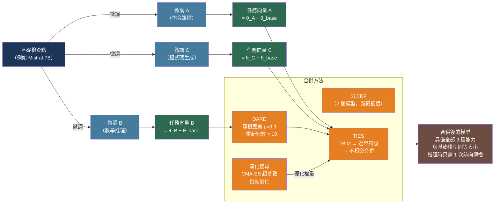

# [BEE-576] LLM 模型合併與權重空間組合

:::info
透過平均兩個微調模型的權重來合併它們，可以產生一個具備兩者能力的單一模型——且記憶體佔用和推理延遲與任一構成模型完全相同。與需要 N 次前向傳播的傳統集成不同，合併後的模型只需一次，使權重空間合併成為最具計算效率的多模型組合形式。
:::

## 背景

兩個共享同一預訓練檢查點的獨立微調模型，往往佔據損失景觀中相鄰的區域。這種幾何接近性使一個反直覺的操作成為可能：在其權重張量之間進行插值，可以產生在兩個目標任務上表現良好的模型。Wortsman 等人（「Model Soups」，arXiv:2203.05482，ICML 2022）將其形式化為**模型湯（model soup）**——對從同一檢查點以不同超參數微調的多個模型取平均，可提高準確率和分佈外穩健性，無需額外計算。ViT-G/14 CLIP 模型的貪婪湯在 ImageNet top-1 準確率上達到 90.94%，超過最佳單一構成模型（90.72%），同時未增加任何參數。

Ilharco 等人（「Editing Models with Task Arithmetic」，arXiv:2212.04089，ICLR 2023）以**任務向量（task vector）**明確了這種幾何：微調與預訓練權重之差 `τ = θ_ft − θ_pretrained` 將微調中獲得的知識編碼為權重空間中的一個方向。同時添加多個任務向量可將多種能力轉移到一個模型中；取反任務向量可在對無關行為影響最小的情況下選擇性地移除某種能力。

實踐中的挑戰是**權重干擾**：當多個微調模型將同一參數推向相反方向時，簡單平均會抵消兩者的貢獻。TIES-Merging（Yadav 等人，arXiv:2306.01708，NeurIPS 2023）和 DARE（Yu 等人，arXiv:2311.03099，ICML 2024）通過在合併前剪枝低幅度的變更並解決符號衝突來應對這一問題。這些方法與 SLERP 和演化搜尋一起，統一於 **mergekit**（Goddard 等人，arXiv:2403.13257）中——這個開源工具包已成為模型合併的標準基礎設施。

## 合併方法

### SLERP（球面線性插值）

沿單位超球面上的測地線在兩個模型之間插值，在整個插值過程中保持向量幅度——不同於線性平均，後者會在中間點縮小結果向量：

```
SLERP(θ_A, θ_B, t) = [sin((1-t)·Ω) / sin(Ω)] · θ_A + [sin(t·Ω) / sin(Ω)] · θ_B
```

其中 `Ω = arccos(θ_A · θ_B / (|θ_A| · |θ_B|))` 是權重張量之間的角度，`t ∈ [0,1]` 是插值因子。SLERP 限於兩個模型；合併三個或更多需要分層鏈接 SLERP 操作。

**適用場景：** 平滑融合來自同一基礎模型的兩個風格或行為相似的微調版本——例如，基於同一 Mistral-7B 檢查點的創意寫作模型和指令跟隨模型。

### 任務算術（Task Arithmetic）

構建任務向量（delta 參數）並將它們加到預訓練基礎上，用縮放係數 λ 控制貢獻強度：

```python
def task_arithmetic_merge(
    pretrained: dict,
    finetuned_models: list[dict],
    lam: float = 0.3,
) -> dict:
    """
    透過任務算術合併 N 個微調模型。
    所有模型必須共享同一基礎檢查點。
    """
    merged = {k: v.clone() for k, v in pretrained.items()}
    for ft_model in finetuned_models:
        for key in merged:
            task_vector = ft_model[key] - pretrained[key]
            merged[key] = merged[key] + lam * task_vector
    return merged
```

**取反**（移除能力）：減去任務向量而非加上。

**適用場景：** 向基礎模型添加特定能力（數學推理、程式碼風格、領域詞彙）；在對其他能力影響最小的情況下移除不需要的行為。

### TIES-Merging

通過三個步驟應用於每個參數位置來解決權重干擾：

1. **TRIM（修剪）：** 將每個模型的 delta 參數（θ_ft − θ_base）中絕對值低於前 k% 閾值的部分歸零。移除低幅度噪音。
2. **ELECT SIGN（選舉符號）：** 對每個參數，計算在所有模型中具有更大聚合幅度的符號。這是該位置的「選舉符號」。
3. **DISJOINT MERGE（不相交合併）：** 僅對與選舉符號一致的模型的參數取平均。符號相反的參數被排除在外。

```python
import torch

def ties_merge(
    base: dict[str, torch.Tensor],
    models: list[dict[str, torch.Tensor]],
    density: float = 0.5,      # 按幅度保留前 50% 的任務向量
    lam: float = 1.0,
) -> dict[str, torch.Tensor]:
    merged = {}
    for key in base:
        # 計算任務向量
        deltas = torch.stack([m[key].float() - base[key].float() for m in models])
        # TRIM：每個模型按幅度歸零小幅度參數
        k = max(1, int(density * deltas.shape[1]) if deltas.dim() > 1 else 1)
        if deltas.dim() > 1:
            threshold = deltas.abs().topk(k, dim=1).values.min(dim=1).values
            trimmed = deltas * (deltas.abs() >= threshold.unsqueeze(1))
        else:
            trimmed = deltas
        # ELECT SIGN：按聚合幅度的多數符號
        pos_mass = (trimmed * (trimmed > 0)).sum(dim=0)
        neg_mass = (trimmed * (trimmed < 0)).abs().sum(dim=0)
        elected_sign = torch.where(pos_mass >= neg_mass, torch.ones_like(pos_mass),
                                   -torch.ones_like(pos_mass))
        # DISJOINT MERGE：僅對一致的參數取平均
        agree_mask = (trimmed.sign() == elected_sign.unsqueeze(0)) | (trimmed == 0)
        agree_count = agree_mask.float().sum(dim=0).clamp(min=1)
        merged_delta = (trimmed * agree_mask).sum(dim=0) / agree_count
        merged[key] = base[key] + lam * merged_delta.to(base[key].dtype)
    return merged
```

**適用場景：** 合併三個或更多專業化模型（例如，程式碼模型、數學模型和多語言模型），其中符號衝突頻繁，簡單平均會降低所有能力。

### DARE（Drop And REscale，隨機丟棄並重新縮放）

通過隨機將比例 `p` 的參數歸零並以 `1/(1-p)` 重新縮放倖存者，來稀疏化每個模型的任務向量：

```python
def dare_sparsify(
    delta: torch.Tensor,
    drop_rate: float = 0.9,
    seed: int = 42,
) -> torch.Tensor:
    """
    對任務向量應用 DARE 稀疏化。
    drop_rate=0.9 歸零 90% 的參數，倖存者重新縮放 10 倍。
    """
    generator = torch.Generator().manual_seed(seed)
    mask = torch.bernoulli(
        torch.full(delta.shape, 1 - drop_rate),
        generator=generator,
    )
    return delta * mask / (1 - drop_rate)

# DARE 稀疏化後，任務向量是稀疏的，可以以最小干擾相加
def dare_ties_merge(base, models, drop_rate=0.9, density=0.5, lam=1.0):
    sparsified = [{k: v + dare_sparsify(v - base[k], drop_rate)
                   for k, v in m.items()} for m in models]
    return ties_merge(base, sparsified, density=density, lam=lam)
```

Yu 等人展示了 DARE 的實際威力：使用 DARE 合併 WizardLM-7B（指令跟隨，GSM8K 近 0%）和 WizardMath-7B 產生了一個在 **GSM8K 零樣本上得分 66.3%** 的合併模型——超過了 WizardMath 單獨的 64.2%，同時保留了 WizardLM 的指令跟隨能力。

## mergekit：生產工具

上述所有方法都在 **mergekit** 中實作（`pip install mergekit`，https://github.com/arcee-ai/mergekit）。它可在無 GPU 的 CPU 上運行，並生成與任何其他模型載入方式完全相同的標準 HuggingFace 格式檢查點：

```bash
# 安裝
pip install mergekit

# 透過 YAML 配置合併
mergekit-yaml merge_config.yaml ./output-model \
  --copy-tokenizer \
  --out-shard-size 1B \
  --lazy-unpickle    # 通過流式傳輸張量降低峰值 RAM
```

**DARE-TIES 配置（三個模型合為一個）：**

```yaml
# merge_config.yaml
models:
  - model: mistralai/Mistral-7B-v0.1      # 基礎模型（無 delta）
  - model: WizardLM/WizardLM-7B-V1.2
    parameters:
      density: 0.53      # 按幅度保留任務向量的 53%
      weight: 0.5        # 貢獻權重
  - model: WizardMath-7B-V1.1
    parameters:
      density: 0.53
      weight: 0.4
merge_method: dare_ties
base_model: mistralai/Mistral-7B-v0.1
parameters:
  normalize: true    # 按權重之和標準化合併後的任務向量
dtype: bfloat16
```

**服務合併後的模型**——無需特殊配置；輸出是普通的檢查點：

```python
from transformers import AutoModelForCausalLM, AutoTokenizer

# 與任何其他模型載入方式完全相同——vLLM、ollama 和 HuggingFace 均可正常使用
model = AutoModelForCausalLM.from_pretrained("./output-model", torch_dtype="bfloat16")
tokenizer = AutoTokenizer.from_pretrained("./output-model")
```

## 演化合併搜尋

手動選擇合併方法、密度和每層權重是憑猜測。Akiba 等人（「Evolutionary Optimization of Model Merging Recipes」，arXiv:2403.13187，Nature Machine Intelligence 2025）使用 CMA-ES（協方差矩陣自適應演化策略）自動化了這一過程，無需訓練資料或 GPU 計算即可搜尋最優合併配方。

他們的 EvoLLM-JP 模型（從日文和數學專業模型中演化出的 7–10B 參數模型）在 **MGSM-JA（日文數學）上達到 55.2%**，而各源模型單獨的表現為 9.6–30.0%，同時在 JP-LMEH 9 個任務的日文 NLP 基準上達到 70.5——以 1/10 的參數量超越了 70B 的 Japanese StableLM（68.3）。mergekit 通過 `mergekit-evolve` 支援演化搜尋。

## 最佳實踐

### 合併前確認所有模型共享同一基礎檢查點

**必須（MUST）** 確認所有被合併的模型都是從完全相同的基礎檢查點（同一修訂版、同一架構）微調而來。從不同基礎微調的模型位於不同的損失盆地；對其權重取平均會產生一個處於兩個模型訓練都未覆蓋區域的模型，各項能力均很差。在合併前始終驗證基礎模型的 SHA/修訂版本。

### 合併三個或更多模型時使用 DARE 或 TIES 而非簡單平均

**應當（SHOULD）** 在合併三個或更多模型時使用 DARE-TIES 而非普通平均或任務算術。將十個任務向量以相等權重相加，主導現象是抵消：半數模型想要增加、半數想要減少的參數平均趨近於零，消除了兩者的能力。DARE 的隨機稀疏化降低衝突概率；TIES 的符號選舉恢復一致方向。對任何涉及三個或更多模型的合併，使用 `dare_ties` 作為預設合併方法。

### 使用保留評估集調整 density 和 weight 參數

**應當（SHOULD）** 在部署前對合併後的模型進行目標任務提示的樣本評估。`density` 參數（保留每個任務向量的比例）和 `weight`（相對貢獻）對下游品質有顯著影響。在 [0.3, 0.5, 0.7] 的密度和權重組合上進行掃描，通常可在 10–20 次合併內找到最優配置。由於 mergekit 僅需 CPU 運行，每次合併需要幾分鐘而非幾小時。

### 測量與基礎模型的 L2 距離以檢測損失盆地偏離

**應當（SHOULD）** 計算合併權重與基礎權重之間的 L2 距離作為穩定性代理指標。研究表明，在 Llama-3B 和 Qwen-4B 模型上，與基礎檢查點 L2 距離超過約 100–300 的合併模型表現出一般能力退化，無論任務特定指標如何。這可在任何推理前計算：

```python
import torch
from transformers import AutoModelForCausalLM

def weight_distance(base_path: str, merged_path: str) -> float:
    """計算基礎模型與合併模型權重之間的 L2 距離。"""
    base = AutoModelForCausalLM.from_pretrained(base_path, torch_dtype=torch.float32)
    merged = AutoModelForCausalLM.from_pretrained(merged_path, torch_dtype=torch.float32)

    total_sq_diff = 0.0
    for (name, bp), (_, mp) in zip(base.named_parameters(), merged.named_parameters()):
        total_sq_diff += (bp - mp).pow(2).sum().item()

    del base, merged  # 釋放記憶體
    return total_sq_diff ** 0.5
```

## 視覺化



## 常見錯誤

**合併來自不同基礎檢查點的模型。** 即使兩個模型具有相同的架構和參數數量，如果它們從不同的基礎模型初始化，也無法有意義地合併。這些權重空間是不相關的——對它們取平均會產生一個在兩個模型訓練都未覆蓋的內部區域的模型，各項能力均差。在合併前始終驗證基礎模型的 SHA/修訂版本。

**對多個模型使用簡單平均而不處理符號衝突。** 將十個任務向量以相等權重相加，主導現象是抵消：半數模型想要增加、半數想要減少的參數平均趨近於零，消除了兩者的能力。對任何涉及三個或更多模型的合併使用 TIES 或 DARE-TIES。

**不評估就選擇合併參數。** 密度和權重參數與具體模型組合之間存在非線性交互。適用於兩個程式碼模型的 0.5 密度，當應用於包含指令跟隨模型的合併時可能破壞一般推理能力。在固定生產合併配方前，始終進行小規模評估掃描（10–20 種配置）。

**信任合併模型的公開排行榜結果。** 許多在公開基準上排名靠前的合併模型存在基準污染——其構成微調版的訓練資料與測試集重疊。應在自己的保留任務和生產工作負載上評估，而非依賴公開排名。

**忽略 L2 距離穩定性信號。** 激進的合併設定（高 λ、多個模型、高每模型權重）可能將合併後的模型推離基礎檢查點的損失盆地。在部署前檢查與基礎模型的 L2 距離；對於 7B 模型，超過約 200 的值是值得用能力探針調查的警告信號。

## 相關 BEE

- [BEE-30012](fine-tuning-and-peft-patterns.md) -- 微調與 PEFT 模式：LoRA 微調是模型合併最常見的輸入——mergekit 可以通過將 LoRA 適配器轉換為全秩任務向量後進行合併
- [BEE-30071](rlhf-and-alignment-training-infrastructure.md) -- RLHF 與對齊訓練基礎設施：取反任務向量（任務算術）可以減少有害行為；將安全微調模型與能力專業化模型合併是常見的對齊工作流程
- [BEE-30060](multi-lora-serving-and-adapter-management.md) -- Multi-LoRA 服務與適配器管理：模型合併是動態適配器切換的靜態替代方案——將適配器合併到一個檢查點消除了運行時開銷，代價是失去靈活性
- [BEE-30070](distributed-training-infrastructure-for-large-language-models.md) -- 大型語言模型的分散式訓練基礎設施：理解權重空間幾何（損失盆地、任務向量）說明了為什麼分散式訓練必須保留模型出處以備將來合併

## 參考資料

- [Wortsman et al. Model Soups: Averaging Weights of Multiple Fine-Tuned Models Improves Accuracy without Increasing Inference Time — arXiv:2203.05482, ICML 2022](https://arxiv.org/abs/2203.05482)
- [Ilharco et al. Editing Models with Task Arithmetic — arXiv:2212.04089, ICLR 2023](https://arxiv.org/abs/2212.04089)
- [Yadav et al. TIES-Merging: Resolving Interference When Merging Models — arXiv:2306.01708, NeurIPS 2023](https://arxiv.org/abs/2306.01708)
- [Yu et al. Language Models are Super Mario: Absorbing Abilities from Homologous Models as a Free Lunch（DARE）— arXiv:2311.03099, ICML 2024](https://arxiv.org/abs/2311.03099)
- [Akiba et al. Evolutionary Optimization of Model Merging Recipes — arXiv:2403.13187, Nature Machine Intelligence 2025](https://arxiv.org/abs/2403.13187)
- [Goddard et al. Arcee's MergeKit: A Toolkit for Merging Large Language Models — arXiv:2403.13257, 2024](https://arxiv.org/abs/2403.13257)
- [mergekit — github.com/arcee-ai/mergekit](https://github.com/arcee-ai/mergekit)
- [Labonne. Merge Large Language Models with mergekit — huggingface.co/blog/mlabonne/merge-models](https://huggingface.co/blog/mlabonne/merge-models)
- [NVIDIA. An Introduction to Model Merging for LLMs — developer.nvidia.com](https://developer.nvidia.com/blog/an-introduction-to-model-merging-for-llms/)
