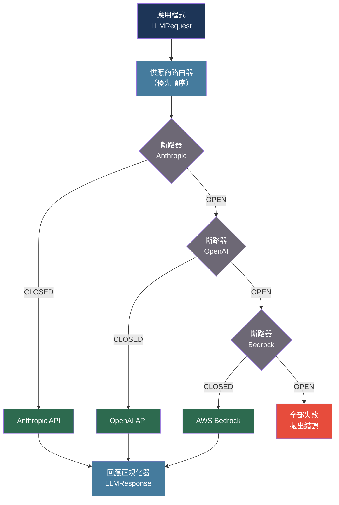

# [BEE-555] LLM 多供應商韌性與 API 備援模式

:::info
依賴單一 LLM 供應商會產生單點故障 — 服務中斷、速率限制耗盡和模型棄用會在毫無警告的情況下影響生產環境。帶有斷路器、供應商正規化客戶端和健康感知備援佇列的多供應商路由，將供應商風險從服務依賴關係轉換為路由決策。
:::

## 背景脈絡

LLM 供應商公布的可用性 SLA 為 99.5-99.9%，但在 API 層面實際體驗到的可用性因速率限制、區域路由故障和滾動模型棄用而更低。在中等流量下，每分鐘向單一供應商發送 1,000 個請求的後端服務每小時會觀察到多次超時和 429（請求過多）事件，每年會遇到幾次完整中斷。

LiteLLM 專案（github.com/BerriAI/litellm，Apache 2.0 授權）在 100 多個 LLM 供應商上提供統一介面，將不相容的 API 架構（Anthropic 的獨立輸入/輸出 token 計費、OpenAI 的合併使用欄位、Bedrock 的簽名請求模型）正規化為單一呼叫介面。LiteLLM 支援備援列表、供應商健康追蹤和成本正規化，使其成為截至 2024 年最廣泛部署的開源多供應商抽象層。

供應商 API 差異會在可用性之外帶來微妙的正確性風險。Anthropic 針對獨立的速率限制桶對輸入 token（ITPM）和輸出 token（OTPM）計費；OpenAI 將它們合併為單一 TPM 限制。Anthropic 要求系統提示在專用欄位中；OpenAI 將其作為 `{"role": "system"}` 訊息接受。模型參數名稱各不相同（較新 OpenAI 模型中的 `max_tokens` 與 `max_completion_tokens`）。不正規化請求而直接切換供應商的簡單備援會靜默地發送錯誤架構。

模型棄用是討論最少的可用性風險。供應商以 3-6 個月的通知期退役模型版本，但硬編碼 `gpt-4-0613` 或 `claude-2.0` 的服務將在棄用日期開始收到 404 錯誤，沒有優雅降級。版本固定必須與棄用監控策略配對。

## 最佳實踐

### 在統一客戶端後面正規化供應商介面

**必須**（MUST）在實現備援邏輯前抽象化供應商特定的 API 細節。架構不匹配的供應商之間的備援會產生靜默錯誤：

```python
from dataclasses import dataclass, field
from typing import Any
import anthropic
import openai

@dataclass
class LLMRequest:
    """映射到任何供應商架構的正規化請求。"""
    messages: list[dict]          # [{"role": "user"/"assistant", "content": str}]
    system: str = ""
    model: str = ""
    max_tokens: int = 1024
    temperature: float = 1.0
    extra: dict = field(default_factory=dict)

@dataclass
class LLMResponse:
    text: str
    input_tokens: int
    output_tokens: int
    model: str
    provider: str

async def call_anthropic(req: LLMRequest) -> LLMResponse:
    client = anthropic.AsyncAnthropic()
    resp = await client.messages.create(
        model=req.model or "claude-haiku-4-5-20251001",
        system=req.system,
        messages=req.messages,
        max_tokens=req.max_tokens,
        temperature=req.temperature,
    )
    return LLMResponse(
        text=resp.content[0].text,
        input_tokens=resp.usage.input_tokens,
        output_tokens=resp.usage.output_tokens,
        model=resp.model,
        provider="anthropic",
    )

async def call_openai(req: LLMRequest) -> LLMResponse:
    client = openai.AsyncOpenAI()
    # OpenAI：系統提示作為第一條訊息，而非獨立欄位
    messages = []
    if req.system:
        messages.append({"role": "system", "content": req.system})
    messages.extend(req.messages)

    resp = await client.chat.completions.create(
        model=req.model or "gpt-4o-mini",
        messages=messages,
        max_tokens=req.max_tokens,
        temperature=req.temperature,
    )
    usage = resp.usage
    return LLMResponse(
        text=resp.choices[0].message.content,
        input_tokens=usage.prompt_tokens,
        output_tokens=usage.completion_tokens,
        model=resp.model,
        provider="openai",
    )
```

### 實現帶有供應商健康追蹤的斷路器

**必須**（MUST）為每個供應商使用斷路器，而非對故障供應商不斷重試直到成功。返回 429 或 503 的供應商應暫時從輪換中移除：

```python
import asyncio
import time
from enum import Enum

class CircuitState(Enum):
    CLOSED = "closed"      # 正常：請求正常流通
    OPEN = "open"          # 故障：請求立即拒絕
    HALF_OPEN = "half_open"  # 恢復中：允許一個探測請求

@dataclass
class CircuitBreaker:
    provider: str
    failure_threshold: int = 5      # 開路前的故障次數
    recovery_timeout: float = 60.0  # 半開探測前的秒數
    success_threshold: int = 2      # 半開前關閉前的成功次數

    _state: CircuitState = CircuitState.CLOSED
    _failures: int = 0
    _last_failure_time: float = 0.0
    _half_open_successes: int = 0

    def record_success(self) -> None:
        if self._state == CircuitState.HALF_OPEN:
            self._half_open_successes += 1
            if self._half_open_successes >= self.success_threshold:
                self._state = CircuitState.CLOSED
                self._failures = 0
                self._half_open_successes = 0
        elif self._state == CircuitState.CLOSED:
            self._failures = 0

    def record_failure(self) -> None:
        self._failures += 1
        self._last_failure_time = time.monotonic()
        if self._failures >= self.failure_threshold:
            self._state = CircuitState.OPEN
        elif self._state == CircuitState.HALF_OPEN:
            self._state = CircuitState.OPEN
            self._half_open_successes = 0

    def is_available(self) -> bool:
        if self._state == CircuitState.CLOSED:
            return True
        if self._state == CircuitState.OPEN:
            elapsed = time.monotonic() - self._last_failure_time
            if elapsed >= self.recovery_timeout:
                self._state = CircuitState.HALF_OPEN
                return True  # 允許探測
            return False
        return True  # HALF_OPEN 允許一個請求

RETRYABLE_STATUS_CODES = {429, 500, 502, 503, 504}

async def call_with_fallback(
    req: LLMRequest,
    providers: list[tuple[str, callable, CircuitBreaker]],
    # providers: [(name, call_fn, circuit_breaker), ...]
) -> LLMResponse:
    """
    按順序嘗試供應商。跳過斷路器為 OPEN 的供應商。
    記錄成功/失敗以更新斷路器狀態。
    """
    last_error = None
    for name, call_fn, breaker in providers:
        if not breaker.is_available():
            continue
        try:
            response = await asyncio.wait_for(call_fn(req), timeout=30.0)
            breaker.record_success()
            return response
        except Exception as exc:
            breaker.record_failure()
            last_error = exc
            # 記錄：供應商失敗，嘗試下一個
    raise RuntimeError(f"所有供應商均失敗。最後錯誤：{last_error}")
```

### 在不中斷服務的情況下處理模型棄用

**不得**（MUST NOT）在應用程式代碼中硬編碼模型版本字串。使用帶有備援模型別名的設定層：

```python
MODEL_ALIASES = {
    # 規範別名 -> [(供應商, 模型), ...]（主要、備援1、備援2）
    "fast": [
        ("anthropic", "claude-haiku-4-5-20251001"),
        ("openai", "gpt-4o-mini"),
    ],
    "balanced": [
        ("anthropic", "claude-sonnet-4-20250514"),
        ("openai", "gpt-4o"),
    ],
    "powerful": [
        ("anthropic", "claude-opus-4-6"),
        ("openai", "gpt-4o"),
    ],
}

def resolve_model(alias: str, provider: str) -> str:
    """
    將能力別名解析為給定供應商的具體模型。
    在棄用時更新設定中的 MODEL_ALIASES — 無需更改代碼。
    """
    candidates = MODEL_ALIASES.get(alias, [])
    for prov, model in candidates:
        if prov == provider:
            return model
    raise ValueError(f"供應商 '{provider}' 無模型別名 '{alias}'")
```

**應該**（SHOULD）監控供應商的棄用公告，並在退役日期至少 30 天前更新 `MODEL_ALIASES`。添加一個整合測試，以最小提示調用每個配置的模型，以在生產流量遇到之前檢測 404 棄用錯誤。

## 視覺化



## 常見錯誤

**在 429 錯誤時重試同一供應商。** 對處於速率限制的供應商進行指數退避會佔用請求執行緒並延遲備援。在 3-5 次連續 429 後開啟斷路器，並立即切換到下一個供應商。

**不正規化系統提示欄位。** Anthropic 將 `system` 作為頂級參數。OpenAI 將其作為 `{"role": "system"}` 訊息。向 Anthropic 發送空白系統欄位或向 OpenAI 發送額外的系統訊息會產生微妙的錯誤行為而不會引發錯誤。

**硬編碼模型版本字串。** `claude-2.0`、`gpt-4-0613` 和其他固定版本將在棄用日期收到 404 錯誤。使用能力別名並通過設定（而非代碼）更新它們。

**在不記錄供應商身分的情況下記錄供應商錯誤。** 當備援級聯觸發時，日誌必須記錄哪個供應商失敗以及原因。將每個供應商的錯誤率與總錯誤率分開聚合，是在斷路器啟動前識別降級供應商的唯一方法。

**將所有錯誤視為暫時性。** 來自供應商的 400（錯誤請求）意味著請求架構有誤 — 重試或備援將從每個供應商產生相同的錯誤。只對 429、5xx 和超時錯誤進行重試或備援。

## 相關 BEE

- [BEE-12001](../resilience/circuit-breaker-pattern.md) -- 斷路器模式：本文應用於 LLM 供應商的三狀態機
- [BEE-12002](../resilience/retry-strategies-and-exponential-backoff.md) -- 重試策略與指數退避：每個供應商的重試設定
- [BEE-30011](ai-cost-optimization-and-model-routing.md) -- AI 成本優化與模型路由：跨供應商的成本感知路由

## 參考資料

- [LiteLLM：使用 OpenAI 格式呼叫 100+ 個 LLM — github.com/BerriAI/litellm](https://github.com/BerriAI/litellm)
- [Anthropic API 速率限制 — docs.anthropic.com](https://docs.anthropic.com/en/api/rate-limits)
- [OpenAI API 速率限制 — platform.openai.com](https://platform.openai.com/docs/guides/rate-limits)
- [PortKey AI 閘道器 — portkey.ai](https://portkey.ai)
- [Martin Fowler：斷路器模式 — martinfowler.com](https://martinfowler.com/bliki/CircuitBreaker.html)
