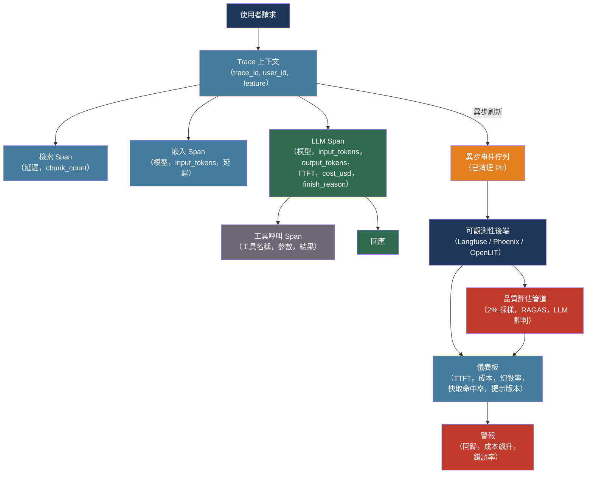

# [BEE-30009] LLM 可觀測性與監控

:::info
HTTP 200 OK 代表網路呼叫成功——它對模型是否產生幻覺、選擇了錯誤的工具或消耗了十倍預期 Token 數什麼都沒說。LLM 可觀測性需要第二層儀器化，用以追蹤品質、成本和模型特定的延遲，這些是傳統監控已捕獲的操作信號之外的指標。
:::

## 背景

傳統可觀測性（BEE-14001）基於這樣的前提：良好行為的系統是回應迅速且無錯誤的系統。LLM 整合系統打破了這個前提：同一個提示提交兩次會產生不同的輸出；兩次都可能是 200 OK，一次事實正確，一次則否。「靜默失敗」問題對概率性系統來說是獨特的——一個代理可以在 1.2 秒內返回一個幻覺答案，通過內容長度檢查，然後在錯誤浮現之前在下游觸發昂貴的重試。

業界在兩個互補的指標類別上達成了共識。操作指標——TTFT（首個 Token 的時間）、Token 間延遲、錯誤率、Token 計數——告訴你系統是如何運行的。品質指標——忠實度、幻覺率、相關性、使用者更正信號——告訴你系統是否在產生價值。一個操作上健康的系統可能是品質退化的：模型更新改變了某個行為，提示回歸增加了幻覺率，RAG 管道開始檢索過時的 Chunk。這兩個信號單獨都不足夠。

OpenTelemetry 在 2024 年透過 GenAI 語義慣例（opentelemetry.io/docs/specs/semconv/gen-ai/）解決了儀器化差距，這是 LLM Span 的標準化屬性詞彙。`gen_ai.system`、`gen_ai.request.model`、`gen_ai.usage.input_tokens`、`gen_ai.usage.output_tokens` 和 `gen_ai.response.finish_reason` 等屬性為可觀測性後端提供了一致的 LLM Trace 資料模型，無論提供商或框架如何。該規範處於實驗階段，但在平台生態系統中已被廣泛採用。

## 設計思維

LLM 可觀測性與傳統服務可觀測性有兩個結構性差異。

首先，工作單位是 Token 流，而非請求-回應對。單個使用者操作可能產生 RAG 檢索 Span、嵌入 Span、LLM 生成 Span 以及多個工具呼叫 Span——全都嵌套在一個父 Trace 下。整體操作的成本和品質無法不分解這些組件而理解。

其次，品質無法同步測量。回應是否忠實、相關且事實正確，需要參考答案（離線評估）或對採樣的生產流量異步運行的 LLM 評判評分器。線上評估以 1–5% 採樣是覆蓋率和成本之間的實際妥協。

由此形成的架構：同步儀器化捕獲操作信號並異步緩衝它們；背景評估管道對 Trace 進行採樣並按品質維度評分；儀表板以時間對齊的疊加方式彙總兩種信號類型，使回歸在兩個平面上都表現為相關性下降。

## 最佳實踐

### 捕獲 LLM 特定的延遲分解

標準延遲指標低估了 LLM 呼叫對 UX 的影響，因為總往返時間掩蓋了等待回應第一個位元組的等待時間。

**MUST（必須）** 將 **TTFT（首個 Token 的時間）** 與總延遲分開追蹤。TTFT——從請求提交到第一個輸出 Token 的間隔——決定了流式應用程式的感知回應速度。一個總時間 8 秒但在 400ms 內交付第一個 Token 的回應，感覺比 4 秒靜默後再開始流式傳輸的回應更快。對於互動式應用程式，目標 P95 TTFT 在 1 秒以內。

**SHOULD（應該）** 追蹤流式使用案例的 **Token 間延遲**（Token/秒）。低於 15 Token/秒的吞吐量在對話介面中感覺卡頓。

```python
import time

def call_with_latency_metrics(client, messages, model, metadata: dict):
    start = time.monotonic()
    first_token_time = None
    tokens = []

    with client.messages.stream(model=model, messages=messages, max_tokens=1024) as stream:
        for chunk in stream:
            if first_token_time is None and chunk.type == "content_block_delta":
                first_token_time = time.monotonic()
                # TTFT = first_token_time - start
                record_metric("llm.ttft_seconds", first_token_time - start, metadata)
            tokens.append(chunk)

    total = time.monotonic() - start
    record_metric("llm.total_latency_seconds", total, metadata)
    # Token 間延遲從使用情況回應衍生
```

### 使用 OpenTelemetry GenAI 慣例進行儀器化

**SHOULD（應該）** 使用 OpenTelemetry GenAI 語義慣例作為 LLM Span 的標準屬性詞彙。標準化的屬性名稱使 Trace 在可觀測性後端之間可移植，並在無需每平台映射的情況下實現跨團隊儀表板。

每個 LLM Span 上的必需屬性：
- `gen_ai.system`：提供商系列（`"openai"`、`"anthropic"`、`"aws.bedrock"`）
- `gen_ai.request.model`：精確的模型名稱（`"gpt-4o"`、`"claude-sonnet-4-6"`）
- `gen_ai.usage.input_tokens`：提示 Token 計數
- `gen_ai.usage.output_tokens`：補全 Token 計數
- `gen_ai.response.finish_reason`：生成停止的原因（`"stop"`、`"length"`、`"content_filter"`）

對於多步驟管道，以層次方式嵌套 Span：父 Span 是面向使用者的操作；子 Span 是檢索步驟、嵌入步驟和 LLM 生成步驟。這揭示了哪個階段主導延遲——檢索緩慢、嵌入昂貴、生成意外簡短。

**SHOULD（應該）** 使用自動處理 OpenTelemetry 配線的函式庫，而非在每個呼叫點手動進行儀器化。OpenLIT（`pip install openlit`）透過一次初始化呼叫對 OpenAI、Anthropic、LiteLLM 和 50+ 個提供商進行儀器化：

```python
import openlit

openlit.init(
    otlp_endpoint="http://otel-collector:4318",
    application_name="order-assistant",
    environment="production",
)
# 後續所有 LLM 呼叫都會自動被追蹤
```

### 將每次呼叫歸因到成本中心

Token 成本會悄然累積。在開發中每次請求消耗 3,000 個 Token 的功能不引人注意；每天 100,000 次請求時，這是一個重大成本項目。沒有歸因，成本飆升就沒有負責人。

**MUST（必須）** 至少以 `user_id`、`feature` 和 `environment` 標記每個 LLM API 呼叫。大多數提供商接受元數據標頭或請求參數，這些會傳遞到計費儀表板和可觀測性平台。

**SHOULD（應該）** 在儀器化時計算每次請求的成本，而非事後追溯：

```python
PRICING = {
    "gpt-4o": {"input": 2.50, "output": 10.00},        # 每百萬 Token 的美元
    "gpt-4o-mini": {"input": 0.15, "output": 0.60},
    "claude-sonnet-4-6": {"input": 3.00, "output": 15.00},
}

def compute_cost(model: str, input_tokens: int, output_tokens: int) -> float:
    p = PRICING.get(model, {"input": 0, "output": 0})
    return (input_tokens * p["input"] + output_tokens * p["output"]) / 1_000_000
```

將 `cost_usd` 作為 Span 屬性與 Token 計數一起記錄。按 `feature` 和 `user_id` 在儀表板中查看，以識別主要成本驅動因素並偵測異常（使用者突然消耗其典型 Token 的 10 倍，要麼是錯誤要麼是濫用）。

**SHOULD（應該）** 為每個租戶或使用者設定軟成本預算，並在每日累計支出接近閾值時發出警報。硬性限制需要拒絕請求的中介軟體或提供商端的支出限制。

### 對採樣的生產流量運行品質評估

**MUST NOT（不得）** 將操作成功（200 OK，延遲在 SLO 內）視為輸出品質的代理。靜默失敗——語法正確但事實錯誤的回應——不會出現在錯誤率儀表板中。

**SHOULD（應該）** 對 1–5% 的生產流量異步運行品質評分。對 100% 的流量評分很昂貴；以 2% 採樣在每小時處理 10,000 次請求的系統上，每小時評估 200 次互動——足以進行趨勢偵測。

對於 RAG 系統，在採樣的 Trace 上運行 RAGAS 指標（BEE-30004）：忠實度、上下文召回率和答案相關性分別診斷不同的失敗模式。

**SHOULD（應該）** 收集使用者反饋信號並與評估分數對齊。踩贊點擊、更正訊息和會話放棄是品質退化的領先指標，它們在結構化指標趕上之前就會出現。

**SHOULD（應該）** 對照滾動 7 天基準對品質指標回歸發出警報。在模型更新後 24 小時內忠實度從 0.94 下降到 0.87，這是回滾信號，而非等待觀望的資料點。

### 版本化提示並偵測回歸

**MUST（必須）** 在每個 Trace 中儲存提示範本版本。提示更改是部署事件；將其視為無版本追蹤的配置編輯，使品質回歸無法診斷。

**SHOULD（應該）** 為提示範本分配語義版本（`order-extractor@v2.3`），並將版本記錄為 Span 屬性。按提示版本分割儀表板視圖，以比較更改前後的品質：

```
按提示版本劃分的幻覺率：
  order-extractor@v2.2  →  1.8%
  order-extractor@v2.3  →  4.1%   ← 回歸，回滾
```

**SHOULD（應該）** 透過金絲雀發布對提示更改進行閘控：將 5% 的流量發送到新提示版本 24 小時，將品質指標與對照組進行比較，然後根據測量結果進行推廣或回滾。這是 LLM 等效的分階段部署（BEE-16002）。

### 異步記錄並在發送前清理 PII

**MUST（必須）** 異步緩衝和刷新 Trace 資料。同步記錄為每個 LLM 呼叫增加了延遲；在 P99 時，這可能完全超過 TTFT 預算。所有主要的可觀測性平台（Langfuse、OpenLIT、Helicone）在進程內排隊事件，並在後台線程中刷新。

**MUST（必須）** 在發送到第三方可觀測性平台之前，清理或雜湊提示和補全文字中的 PII。系統提示通常包含不應離開信任邊界的使用者名稱、電子郵件或帳號詳情。

```python
import hashlib
import re

PII_PATTERNS = [
    (r'\b[A-Za-z0-9._%+-]+@[A-Za-z0-9.-]+\.[A-Z|a-z]{2,}\b', '<EMAIL>'),
    (r'\b\d{3}[-.]?\d{3}[-.]?\d{4}\b', '<PHONE>'),
]

def scrub_pii(text: str) -> str:
    for pattern, replacement in PII_PATTERNS:
        text = re.sub(pattern, replacement, text)
    return text

def hash_for_dedup(text: str) -> str:
    # 保留雜湊用於去重，不儲存原始內容
    return hashlib.sha256(text.encode()).hexdigest()[:16]
```

**SHOULD（應該）** 為提示儲存實施分層採樣：對錯誤 Trace（100% 保留）儲存完整的提示文字，對成功 Trace（1–10% 全文保留）僅儲存雜湊和 Token 計數。這在保留除錯能力的同時，限制了儲存成本和資料洩露。

## 工具概覽

| 平台 | 類型 | 最適合 |
|------|------|--------|
| [Langfuse](https://langfuse.com) | 開源，可自託管 | 全端：追蹤、評估、提示管理、成本——OTEL 原生 |
| [Phoenix (Arize)](https://github.com/Arize-ai/phoenix) | 開源，可自託管 | 基於 OTEL 的 Trace + 評估；供應商無關；強 LlamaIndex/LangChain 支援 |
| [OpenLIT](https://github.com/openlit/openlit) | 開源，Apache-2.0 | 一行 OTEL 儀器化，支援 50+ 提供商；包含 GPU 監控 |
| [Helicone](https://www.helicone.ai) | 托管（代理式） | 透過代理零程式碼儀器化；使用者級成本歸因 |
| [LangSmith](https://www.langchain.com/langsmith-platform) | 托管（LangChain） | 深度 LangChain/LangGraph 整合；A/B 提示測試 |

**SHOULD（應該）** 對能夠自託管的團隊從 Langfuse 或 OpenLIT 開始：兩者都採用 Apache 授權、OTEL 原生，避免將提示資料發送到第三方 SaaS。當團隊規模或合規要求證明成本合理時，添加托管平台（LangSmith、Helicone）。

## 視覺化



## 相關 BEE

- [BEE-14001](../observability/three-pillars-logs-metrics-traces.md) -- 三大支柱：日誌、指標、追蹤：LLM 可觀測性以第四個維度——品質——擴展了三支柱模型，這需要單獨的儀器化
- [BEE-30004](evaluating-and-testing-llm-applications.md) -- 評估與測試 LLM 應用程式：離線評估中使用的 RAGAS 指標和 LLM 評判評分同樣適用於此處描述的線上評估管道
- [BEE-14005](../observability/slos-and-error-budgets.md) -- SLO 與錯誤預算：品質指標（忠實度 > 0.90，幻覺率 < 2%）可以正式化為 SLO；錯誤預算決定在回滾之前可以接受多少品質退化
- [BEE-30001](llm-api-integration-patterns.md) -- LLM API 整合模式：語義快取同時降低了成本和快取未命中率——可觀測性所呈現的快取命中率指標為快取調優決策提供依據
- [BEE-16002](../cicd-devops/deployment-strategies.md) -- 部署策略：金絲雀提示發布遵循與軟體金絲雀部署相同的流量分割和回滾機制

## 參考資料

- [OpenTelemetry. GenAI 語義慣例 — opentelemetry.io](https://opentelemetry.io/docs/specs/semconv/gen-ai/)
- [OpenTelemetry. GenAI Span 規範 — opentelemetry.io](https://opentelemetry.io/docs/specs/semconv/gen-ai/gen-ai-spans/)
- [OpenTelemetry. LLM 可觀測性部落格文章 — opentelemetry.io, 2024](https://opentelemetry.io/blog/2024/llm-observability/)
- [NVIDIA. NIM LLM 基準測試指標（TTFT、ITL）— docs.nvidia.com](https://docs.nvidia.com/nim/benchmarking/llm/latest/metrics.html)
- [Langfuse. 開源 LLM 可觀測性 — langfuse.com](https://langfuse.com)
- [Phoenix (Arize). 開源 LLM 可觀測性 — github.com/Arize-ai/phoenix](https://github.com/Arize-ai/phoenix)
- [OpenLIT. OpenTelemetry 原生 LLM 可觀測性 — github.com/openlit/openlit](https://github.com/openlit/openlit)
- [Helicone. LLM 可觀測性平台 — helicone.ai](https://www.helicone.ai)
- [LangSmith. AI Agent 可觀測性平台 — langchain.com](https://www.langchain.com/langsmith-platform)
