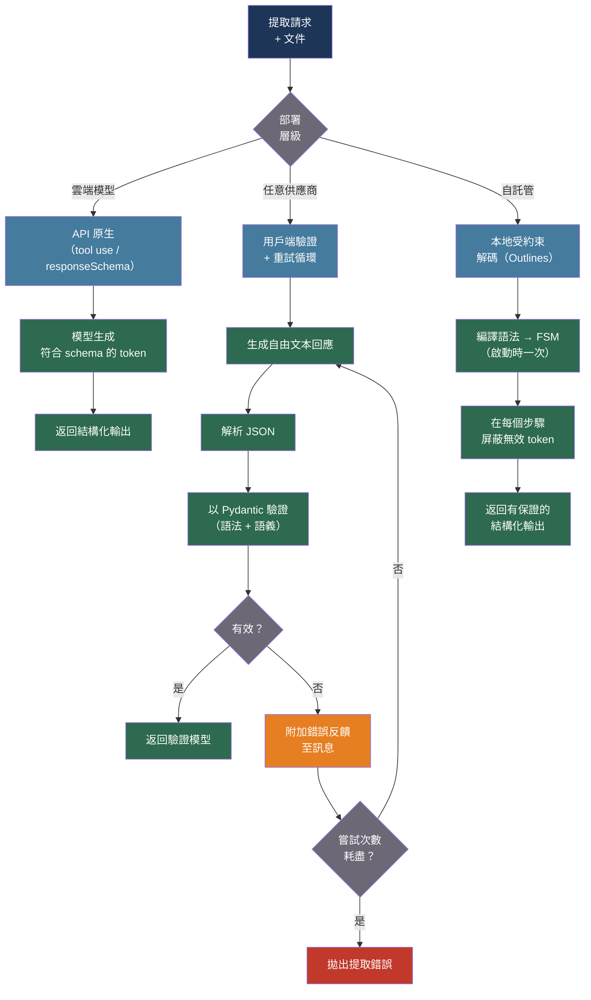

# [BEE-30046] LLM 輸出解析與結構化提取可靠性

:::info
將 LLM 自由文本轉換為符合 schema 的結構化資料，需要分層可靠性策略：以原生 API 約束提供硬性保證、以用戶端驗證加重試循環實現概率性執行、以本地受約束解碼處理自託管模型——再搭配語義驗證器覆蓋 token 級約束無法表達的領域邏輯。
:::

## 背景

消費 LLM 輸出的後端系統需要可預測的結構：具有特定欄位的 JSON 物件、型別化的值、列舉成員。若模型返回「Here is the extracted order: `{...}`」而非裸 JSON 物件，或生成缺少必要欄位的語法合法 JSON，下游解析器即會中斷，將 AI 功能變成生產事故。

研究量化了問題規模。LLMStructBench（arXiv:2602.14743，2025）在五種提示策略下測試了 22 個模型，發現對於複雜 schema 的樸素「提示為 JSON」方式，解析失敗率為 8–15%；GPT-4 在超過三層嵌套的 schema 上，無效回應率達 11.97%。失敗模式並非隨機：它們集中於 schema 複雜度、輸出 token 限制在結構中途觸頂，以及模型幻覺出目標 schema 中不存在的欄位名稱。

目前存在三種互補的可靠性機制。在供應商層面，OpenAI Structured Outputs、Anthropic 帶嚴格 schema 的 tool use，以及 Gemini `responseSchema` 在 token 生成期間強制執行 JSON schema 合規性——模型在物理上無法生成無效 token，提供硬性保證，但帶來供應商鎖定，且不覆蓋語義約束。在用戶端層面，Instructor（每月下載量超 3M）等函式庫生成非結構化輸出，以 Pydantic 模型驗證，並將驗證錯誤作為修正提示送回模型重試——與供應商無關，支援任意語義驗證器，但每次失敗增加往返成本。在推理層面，受約束解碼引擎（Outlines、llama.cpp GBNF）將目標語法編譯為有限狀態機（FSM），在每個生成步驟屏蔽無效 token——硬性保證且無重試開銷，但需要自託管基礎設施。

Willard 和 Louf（arXiv:2307.09702，2023）奠定了基於 FSM 的受約束解碼理論基礎：在初始化時將正則或上下文無關語法編譯為有限自動機，然後在每個生成步驟計算使 FSM 保持有效狀態的 token 集合，並將所有其他 token 的 logit 設為 −∞。這使無效輸出在結構上不可能產生，而無需改變模型的推理方式。

## 最佳實踐

### 依部署情境分層構建可靠性架構

**SHOULD**（應該）根據基礎設施和 schema 需求選擇適當的可靠性層級。不要將三個層級全部應用於每個請求——各層級有不同的成本結構和運維依賴：

| 層級 | 機制 | 保證類型 | 適用場景 |
|---|---|---|---|
| API 原生 | 供應商在 token 生成期間強制執行 schema | 硬性 | 雲端模型，嚴格 schema 需求 |
| 用戶端驗證 + 重試 | 解析 → 驗證 → 帶錯誤反饋重試 | 概率性 | 任意供應商，需要語義驗證 |
| 本地受約束解碼 | FSM 在生成期間屏蔽無效 token | 硬性 | 自託管模型，批次處理 |

對於雲端模型，使用帶 JSON Schema 定義的 Anthropic tool use，以獲得硬性 schema 強制執行而無需用戶端重試開銷：

```python
import anthropic
import json
from typing import Any

ORDER_SCHEMA = {
    "type": "object",
    "properties": {
        "order_id": {"type": "string"},
        "customer_email": {"type": "string", "format": "email"},
        "items": {
            "type": "array",
            "items": {
                "type": "object",
                "properties": {
                    "sku": {"type": "string"},
                    "quantity": {"type": "integer", "minimum": 1},
                    "unit_price_cents": {"type": "integer", "minimum": 0},
                },
                "required": ["sku", "quantity", "unit_price_cents"],
            },
        },
        "shipping_address": {"type": "string"},
    },
    "required": ["order_id", "customer_email", "items", "shipping_address"],
}

async def extract_order_native(document: str) -> dict[str, Any]:
    """
    使用 Anthropic tool use 提取訂單資料，獲得硬性 schema 強制執行。
    模型無法返回不符合 ORDER_SCHEMA 的回應。
    """
    client = anthropic.AsyncAnthropic()
    response = await client.messages.create(
        model="claude-sonnet-4-20250514",
        max_tokens=1024,
        tools=[{
            "name": "extract_order",
            "description": "Extract the structured order data from the document.",
            "input_schema": ORDER_SCHEMA,
        }],
        tool_choice={"type": "tool", "name": "extract_order"},
        messages=[{
            "role": "user",
            "content": f"Extract the order information from this document:\n\n{document}",
        }],
    )
    for block in response.content:
        if block.type == "tool_use" and block.name == "extract_order":
            return block.input
    raise ValueError("Model did not call extract_order tool")
```

### 實現帶重試反饋的用戶端驗證

**MUST**（必須）在重試提示中包含驗證錯誤反饋——而非裸重試。不告知模型失敗原因而重試，只會以更高的成本產生相同的錯誤：

```python
from pydantic import BaseModel, EmailStr, field_validator
from datetime import datetime
import asyncio

class OrderItem(BaseModel):
    sku: str
    quantity: int
    unit_price_cents: int

    @field_validator("quantity")
    @classmethod
    def quantity_positive(cls, v: int) -> int:
        if v < 1:
            raise ValueError(f"quantity must be at least 1, got {v}")
        return v

    @field_validator("unit_price_cents")
    @classmethod
    def price_non_negative(cls, v: int) -> int:
        if v < 0:
            raise ValueError(f"unit_price_cents must be non-negative, got {v}")
        return v

class Order(BaseModel):
    order_id: str
    customer_email: EmailStr
    items: list[OrderItem]
    shipping_address: str

async def extract_with_retry(
    document: str,
    *,
    model: str = "claude-sonnet-4-20250514",
    max_attempts: int = 3,
) -> Order:
    """
    帶驗證與重試循環的結構化資料提取。
    驗證失敗時，錯誤資訊會反饋給模型讓其自我修正。
    """
    client = anthropic.AsyncAnthropic()
    messages = [{
        "role": "user",
        "content": (
            "Extract the order information from this document as JSON "
            "matching the Order schema. Return only the JSON object, no prose.\n\n"
            f"Document:\n{document}"
        ),
    }]

    last_error: Exception | None = None
    for attempt in range(max_attempts):
        response = await client.messages.create(
            model=model, max_tokens=1024,
            messages=messages,
        )
        raw = response.content[0].text.strip()

        # 若存在 Markdown 程式碼圍欄則去除
        if raw.startswith("```"):
            raw = raw.split("```")[1]
            if raw.startswith("json"):
                raw = raw[4:]
            raw = raw.strip()

        try:
            data = json.loads(raw)
            order = Order.model_validate(data)
            return order
        except (json.JSONDecodeError, ValueError) as e:
            last_error = e
            # 將錯誤反饋作為使用者訊息附加
            messages.append({"role": "assistant", "content": response.content[0].text})
            messages.append({
                "role": "user",
                "content": (
                    f"Your response failed validation with this error:\n{e}\n\n"
                    "Please correct the JSON and return only the fixed JSON object."
                ),
            })

    raise ValueError(
        f"Failed to extract valid Order after {max_attempts} attempts. "
        f"Last error: {last_error}"
    )
```

**SHOULD** 監控每個 schema 的錯誤率。若某 schema 在生產環境中的錯誤率超過 20%，重試並非解決方案——該 schema 過於複雜，必須簡化或將部署層級升級為受約束解碼。

### 將語法保證與語義驗證分離

**MUST NOT**（不得）僅依賴 token 級約束來確保領域正確性。JSON Schema 可以強制 `start_date` 是格式為日期的字串，但無法強制 `start_date` 早於 `end_date`。Pydantic 模型驗證器覆蓋語法無法表達的語義規則：

```python
from pydantic import BaseModel, model_validator
from datetime import date

class Reservation(BaseModel):
    reservation_id: str
    start_date: date
    end_date: date
    room_type: str
    guest_count: int

    @model_validator(mode="after")
    def end_after_start(self) -> "Reservation":
        if self.end_date <= self.start_date:
            raise ValueError(
                f"end_date ({self.end_date}) must be after start_date ({self.start_date})"
            )
        return self

    @model_validator(mode="after")
    def guest_count_reasonable(self) -> "Reservation":
        max_guests = {"single": 1, "double": 2, "suite": 4}.get(self.room_type, 2)
        if self.guest_count > max_guests:
            raise ValueError(
                f"guest_count {self.guest_count} exceeds maximum {max_guests} "
                f"for room_type '{self.room_type}'"
            )
        return self
```

**SHOULD** 結合兩個層級：使用供應商原生 schema 強制執行（或受約束解碼）處理語法，使用 Pydantic 驗證器處理語義。這消除了由語法錯誤引起的重試循環，同時捕獲語法無法表達的領域違規。

### 對自託管模型應用受約束解碼

**SHOULD** 在運行本地推理時使用 Outlines 或相容的受約束解碼引擎。基於 FSM 的約束在初始化時一次性編譯目標語法，對於簡單 schema 僅增加 5–15% 的延遲開銷——遠少於一次重試：

```python
# Outlines 受約束解碼（需要自託管推理）
import outlines
import outlines.models as models
from pydantic import BaseModel

class ExtractedEntity(BaseModel):
    name: str
    entity_type: str
    confidence: float

def build_extraction_generator(model_path: str):
    """
    在啟動時一次性將 Pydantic schema 編譯為 FSM。
    後續每次生成調用都保證返回有效的 ExtractedEntity JSON。
    """
    model = models.transformers(model_path)
    generator = outlines.generate.json(model, ExtractedEntity)
    return generator

def extract_entity(generator, text: str) -> ExtractedEntity:
    """
    受約束生成：FSM 確保輸出始終符合 ExtractedEntity。
    無需重試；無後置 JSON 解析錯誤。
    """
    result = generator(
        f"Extract the primary named entity from: {text}"
    )
    return result  # 已是經驗證的 ExtractedEntity 實例
```

### 防止在 Token 限制處截斷

**MUST** 保留足夠的輸出 token 以完成目標結構。即使每個已生成 token 都有效，在欄位中途截斷的 JSON 物件仍會解析失敗：

```python
import tiktoken

def estimate_output_tokens(schema: dict, multiplier: float = 2.5) -> int:
    """
    估算生成目標 schema 的 JSON 回應所需最大 token 數。
    2.5 倍系數考慮了字串值通常長於欄位名稱的情況。
    """
    schema_str = json.dumps(schema)
    enc = tiktoken.get_encoding("cl100k_base")
    schema_tokens = len(enc.encode(schema_str))
    return int(schema_tokens * multiplier)

MAX_OUTPUT_RESERVE = 512   # 任何結構化輸出調用的最小保留量

def safe_max_tokens(schema: dict, context_limit: int = 200_000) -> int:
    estimated = estimate_output_tokens(schema)
    return max(estimated, MAX_OUTPUT_RESERVE)
```

## 視覺化



## 可靠性層級比較

| 層級 | Schema 保證 | 語義驗證 | 供應商鎖定 | 重試開銷 | 基礎設施 |
|---|---|---|---|---|---|
| API 原生（tool use） | 硬性 | 否 | 是 | 無 | 僅雲端 |
| 用戶端 + Pydantic 重試 | 概率性 | 是 | 否 | 每次失敗 1–3 倍 | 任意 |
| Outlines（FSM） | 硬性 | 否 | 否 | 無 | 自託管 GPU |
| 組合（FSM + Pydantic） | 硬性 | 是 | 否 | 無 | 自託管 GPU |

## 常見錯誤

**不帶錯誤反饋地重試。** 裸重試向模型發送相同提示，以雙倍成本獲得相同錯誤。重試提示必須包含失敗的輸出和具體的驗證錯誤。

**在 schema 中使用深層嵌套。** 嵌套超過三層的 schema 與更高的解析失敗率顯著相關。扁平化至兩層，並在應用程式程式碼中提取後再轉換為嵌套結構。

**將語法有效性等同於語義正確性。** 生成 `{"quantity": -5}` 的模型能通過 JSON 解析，但會違反領域邏輯。Pydantic 欄位驗證器是捕獲此類問題的機制；對於生產系統來說它們不是可選的。

**未保留輸出 token。** 將 `max_tokens` 設為上下文限制允許模型開始一個無法完成的 JSON 結構。至少為輸出欄位保留估計 schema token 數的 2 倍。

**混合每個請求的可靠性層級。** 若部分請求使用 API 原生強制執行，部分使用重試，監控將變得混亂——錯誤率不具可比性。對每種 schema 類型統一採用一個層級。

## 相關 BEE

- [BEE-30006](structured-output-and-constrained-decoding.md) -- 結構化輸出與受約束解碼：本文受約束解碼層的底層 token 級語法強制機制
- [BEE-30018](llm-tool-use-and-function-calling-patterns.md) -- LLM 工具使用與函數調用模式：Anthropic tool use 是提供原生硬性 schema 強制執行的機制
- [BEE-30043](llm-hallucination-detection-and-factual-grounding.md) -- LLM 幻覺偵測與事實接地：幻覺偵測與結構化提取互補；經驗證的 schema 不保證提取值的事實正確性
- [BEE-30035](ai-agent-safety-and-reliability-patterns.md) -- AI 智能體安全與可靠性模式：提取管道的重試預算和熔斷器遵循與智能體可靠性控制相同的模式

## 參考資料

- [Willard and Louf. Efficient Guided Generation for Large Language Models — arXiv:2307.09702, 2023](https://arxiv.org/abs/2307.09702)
- [LLMStructBench: Benchmarking Large Language Model Structured Data Extraction — arXiv:2602.14743, 2025](https://arxiv.org/abs/2602.14743)
- [Generating Structured Outputs from Language Models: Benchmark and Studies — arXiv:2501.10868, 2025](https://arxiv.org/html/2501.10868v1)
- [PARSE: LLM Driven Schema Optimization for Reliable Entity Extraction — arXiv:2510.08623, 2024](https://arxiv.org/abs/2510.08623)
- [Instructor: Structured Outputs for LLMs — python.useinstructor.com](https://python.useinstructor.com/)
- [Outlines: Structured Generation by dottxt-ai — github.com/dottxt-ai/outlines](https://github.com/dottxt-ai/outlines)
