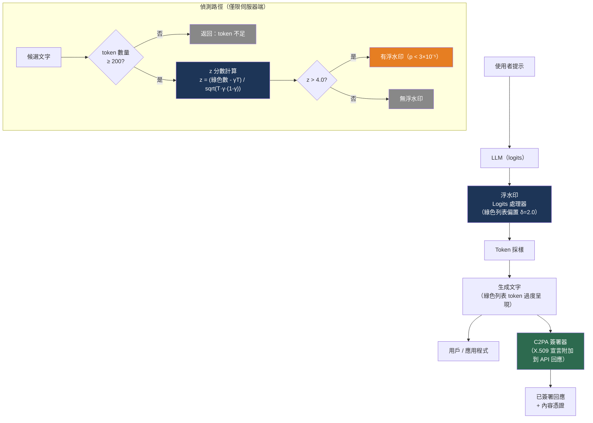

# [BEE-579] LLM 輸出浮水印與 AI 內容溯源

:::info
LLM 浮水印在推論時將統計可偵測的信號嵌入生成文字，無需修改模型或降低輸出品質。它使提供者能夠驗證特定文字是否由其系統生成——以及在不是時加以證明。該信號對讀者不可見，但對持有密鑰的偵測器可測量。根本限制：有決心的攻擊者若能重複查詢生成 API，可在 50 美元以內的 API 成本內重建密鑰。
:::

## 情境

當 LLM 生成文字時，該文字從外觀上與人類撰寫的內容無法區分。這造成了後端工程師必須應對的幾個問題：學術誠信執行、在使用者生成內容平台追蹤 AI 生成的內容、AI 生成錯誤資訊的法律責任，以及符合新興法規（歐盟 AI 法案要求在特定閾值以上揭露 AI 生成內容）。

兩種根本不同的方法應對 AI 內容溯源。**統計浮水印（Statistical watermarking）**在推論時修改 token 採樣分佈，嵌入可在輸出文字中持續存在的可偵測偏差。**加密溯源（C2PA）**將簽名的中繼資料宣言附加到文件，記錄其 AI 來源，而不改變文字本身。這兩種方法是互補的：浮水印即使在中繼資料被去除後仍能識別 AI 來源，而 C2PA 無需白盒模型訪問即可提供可驗證的監管鏈。

開創性的浮水印論文是 Kirchenbauer 等人的「大型語言模型的浮水印」（arXiv:2301.10226，ICML 2023），它介紹了一種實用的、模型無關的方法，無需重新訓練且幾乎不增加推論延遲。Google DeepMind 獨立開發了 SynthID 文字浮水印（Dathathri 等人，Nature 2024），已部署於 Gemini 並可在 HuggingFace Transformers 中使用。OpenAI 在內部開發了類似方案，但以可用性問題和魯棒性限制為由決定不部署。

## 統計浮水印

### 綠/紅列表演算法（Kirchenbauer 等人）

核心洞察：在每個 token 生成步驟，模型為詞彙表中的所有 token 分配概率。如果我們確定性地將概率分佈偏向詞彙表的偽隨機選定子集（「綠色列表」），這些 token 將在輸出中被過度呈現。知道種子和分割規則的偵測器可以統計性地測量這種偏差。

**浮水印步驟（位置 t 的每個 token）：**

1. 用密鑰對前一個 token（或前幾個 token 的窗口）進行雜湊，生成確定性種子。
2. 使用種子將詞彙表分割為**綠色列表**（γ 比例，通常 0.25–0.5）和**紅色列表**（剩餘部分）。
3. 在 softmax 採樣前，為每個綠色列表 token 的對數概率添加常數 δ（對數偏置）。紅色列表 token 仍然可用，但被降低優先級。

以 γ = 0.5 和 δ = 2.0（推薦的品質/可偵測性平衡預設值），輸出文字將以異常高的比率包含綠色列表 token，同時保持自然流暢——被提升的 token 仍然由模型自身的概率估計選擇，只是始終有一點人為干預。

**偵測（z 分數檢定）：**

給定包含 T 個已計分 token 且觀測到 |s|_G 個綠色列表 token 的候選文字，計算：

```
z = (|s|_G − γ × T) / sqrt(T × γ × (1 − γ))
```

在虛無假設下（無浮水印，人類撰寫的文字），綠色 token 以機率 γ 出現，因此 z ~ N(0,1)。高 z 分數表示在生成過程中系統性地應用了綠色列表偏差。在 z > 4 時，單尾 p 值約為 3 × 10⁻⁵——由機率引起的可能性極低。

**驗證效能（γ = 0.5，δ = 2.0，T ≈ 200 token，多項式採樣）：**

| 指標 | 數值 |
|---|---|
| 假陽性率（未加浮水印的文字被標記） | z > 4 時約 3 × 10⁻⁵ |
| 真陽性率（加浮水印的文字被偵測） | 約 98.4% |
| 可靠偵測所需的最少 token | 約 200（軟變體） |
| 每個 token 的延遲開銷 | < 1 毫秒（一次雜湊 + 詞彙分割） |

**HuggingFace 整合：**

```python
from transformers import AutoModelForCausalLM, AutoTokenizer
# pip install lm-watermarking 或使用研究版本庫
from watermark_processor import WatermarkLogitsProcessor, WatermarkDetector

model = AutoModelForCausalLM.from_pretrained("meta-llama/Llama-3.2-3B-Instruct")
tokenizer = AutoTokenizer.from_pretrained("meta-llama/Llama-3.2-3B-Instruct")

watermark_processor = WatermarkLogitsProcessor(
    vocab=list(tokenizer.get_vocab().values()),
    gamma=0.25,              # 綠色列表 = 詞彙表的 25%
    delta=2.0,               # 綠色 token 的對數偏置
    seeding_scheme="simple_1",  # 前一個 token 的雜湊作為分割種子
)

inputs = tokenizer("解釋什麼是 GGUF。", return_tensors="pt")
output_ids = model.generate(
    **inputs,
    logits_processor=[watermark_processor],
    max_new_tokens=200,
)
output_text = tokenizer.decode(output_ids[0], skip_special_tokens=True)

# 偵測——在伺服器端執行，永遠不向客戶端暴露密鑰材料
detector = WatermarkDetector(
    vocab=list(tokenizer.get_vocab().values()),
    gamma=0.25,
    seeding_scheme="simple_1",
    device="cpu",
    tokenizer=tokenizer,
    z_threshold=4.0,
)
result = detector.detect(output_text)
# {"prediction": True, "z_score": 6.3, "p_value": 1.5e-10, "num_tokens_scored": 198}
```

### SynthID 文字浮水印（Google DeepMind，Nature 2024）

SynthID 通過錦標賽採樣（tournament sampling）將離散的二元詞彙分割替換為連續的偽隨機對數偏置。SynthID 定義了一個 **g 函數**，將 n-gram 上下文（預設值：前 5 個 token）與 20–30 個秘密整數密鑰中的每一個進行雜湊，為每個 token、每個密鑰生成分數。g 值較高的 token 在消除輪次中系統性地更可能勝出，引入平滑變化的偏差，而非二元的偏差。

錦標賽方法使偏差比 Kirchenbauer 方案的顯式分割更難通過檢查偵測，也更難通過 API 查詢重建。SynthID 提供三種偵測器：加權平均偵測器（無需訓練）、基本平均偵測器，以及貝葉斯分類器（需要在加浮水印/未加浮水印的樣本對上進行訓練；輸出三種狀態：「有浮水印」、「無浮水印」或「不確定」）。

**HuggingFace 整合（Transformers v4.46.0+）：**

```python
from transformers import AutoModelForCausalLM, AutoTokenizer, SynthIDTextWatermarkingConfig

model = AutoModelForCausalLM.from_pretrained("google/gemma-2-9b-it")
tokenizer = AutoTokenizer.from_pretrained("google/gemma-2-9b-it")

# 密鑰必須保密——通過密鑰管理器定期輪換
watermarking_config = SynthIDTextWatermarkingConfig(
    keys=[654, 400, 836, 123, 340, 717, 982, 234, 567, 891,
          112, 443, 776, 209, 538, 871, 304, 637, 970, 403],
    ngram_len=5,      # 前 5 個 token 的雜湊窗口
)

outputs = model.generate(
    input_ids,
    watermarking_config=watermarking_config,
    max_new_tokens=512,
)
```

SynthID 在乾淨條件下的偵測 AUC ≈ 1.00。在 70% 同義詞替換下，AUC 仍保持在 0.94 以上。

## 加密溯源：C2PA

C2PA（Content Provenance and Authenticity 聯盟，https://spec.c2pa.org/）是一個開放標準（ISO 提交待審，目前為 v2.2），它將加密簽名的中繼資料宣言附加到媒體文件。與統計浮水印不同，C2PA 不修改內容本身——它在文件的中繼資料中記錄來源和編輯歷史。

C2PA **內容憑證**包含：
- 資產來源宣告（相機拍攝、AI 生成、人工編輯）
- AI 模型或工具身份
- 帶時間戳和主體身份的編輯歷史
- 訓練資料溯源聲明
- 啟用監管鏈驗證的 X.509 憑證鏈

**採用情況：** OpenAI 於 2024 年 5 月加入 C2PA 指導委員會。Amazon 和 Meta 於 2024 年 9 月加入。Google 在 Google Images、Lens 和 Circle to Search 中整合 C2PA 中繼資料。

**對 LLM 文字的主要限制：** C2PA 宣言中繼資料可通過複製貼上或截圖被去除，破壞監管鏈。對於通過其他管道共享的任意文字片段，C2PA 無法提供保證。C2PA 最適合在 API 回應層面使用（在 API 回應標頭或結構化文件中嵌入中繼資料），而不是作為文字片段的保證。

## 攻擊向量

### 浮水印竊取

Jovanović、Staab 和 Vechev 證明，具有黑盒 API 訪問的攻擊者可以通過系統性查詢重建秘密綠/紅分割——**API 成本不到 50 美元**（ICML 2024，arXiv:2402.19361）。攻擊策略：

1. 為精心設計的提示採樣大量補全
2. 觀察哪些 token 在補全中頻繁出現——這些可能是綠色列表 token
3. 建立分割的近似模型

一旦知道近似分割：
- **欺騙**（使人類文字看起來像有浮水印）：成功率 > 80%
- **去除**（使有浮水印的文字逃避偵測）：成功率 > 80%

該攻擊針對偵測 API 和生成 API。暴露偵測端點本身就是一個漏洞。

### 改述攻擊

強改述攻擊降低可偵測性，但不能消除它。在適中強度的 DIPPER 改述後，Kirchenbauer 軟浮水印在約 800 個以上 token 的文字中仍然可偵測。SynthID 的錦標賽機制對同義詞替換更具魯棒性（70% 同義詞替換率下 AUC > 0.94），但獨立研究發現即使沒有密鑰竊取攻擊，去除成功率也超過 90%。

### 魯棒性–安全性取捨

更強的統計信號更容易可靠偵測——也更容易從 API 查詢中學習。更弱的信號更難竊取，但也更難偵測。NeurIPS 2024（「LLM 浮水印中沒有免費午餐」）將此形式化為基本的資訊論約束，而非工程限制。

## 最佳實踐

### 將浮水印密鑰嚴格保留在伺服器端並限制偵測速率

**MUST**（必須）將浮水印密鑰（Kirchenbauer 種子 / SynthID 密鑰列表）存儲在密鑰管理器中（AWS Secrets Manager、HashiCorp Vault），絕不向客戶端程式碼暴露。Jovanović 等人的攻擊需要多次 API 查詢來重建密鑰。對偵測端點進行速率限制，防止系統性探測：對任何揭示浮水印分數的端點執行每用戶、每 IP 和每會話的查詢限制：

```python
from functools import lru_cache

@lru_cache(maxsize=None)
def get_watermark_keys() -> list[int]:
    """從密鑰管理器載入，不從設定檔或環境變數載入。"""
    import boto3
    client = boto3.client("secretsmanager", region_name="us-east-1")
    secret = client.get_secret_value(SecretId="prod/llm/watermark-keys")
    return json.loads(secret["SecretString"])["keys"]
```

### 在報告偵測結果前強制執行最小 token 閾值

**MUST NOT**（不得）對少於 200 個 token（Kirchenbauer）或 100 個 token（SynthID 貝葉斯偵測器）的文字報告浮水印偵測結果。z 分數分佈在短序列上不可靠：假陽性率顯著增加，且統計檢定的獨立性假設更可能被違反。對短輸入返回「文字不足」而非偵測結果：

```python
def detect_watermark(text: str, tokenizer, detector) -> dict:
    tokens = tokenizer.encode(text)
    if len(tokens) < 200:
        return {"prediction": None, "reason": "insufficient_tokens", "token_count": len(tokens)}
    return detector.detect(text)
```

### 將統計浮水印和 C2PA 作為互補層使用

**SHOULD**（建議）對高風險應用同時部署統計浮水印（用於文字內容識別）和 C2PA 憑證嵌入（用於 API 回應溯源）。C2PA 通過加密憑證鏈在回應層面提供即時、機器可驗證的溯源；統計浮水印提供即使 C2PA 中繼資料從文字中被去除後仍持續存在的信號。兩者單獨使用都不足夠：

- 無浮水印的 C2PA：一旦中繼資料被去除就無法偵測
- 無 C2PA 的浮水印：對去除攻擊有抵抗力，但易受密鑰竊取影響

### 不要在當前浮水印技術上建立面向用戶的偵測產品

**MUST NOT** 向用戶承諾偵測結果是 AI 生成的確定性證明。Kirchenbauer 的當前假陽性率（3 × 10⁻⁵）意味著在 33,000 份人類撰寫的文字語料庫中，統計上有一份會被標記為 AI 生成。對抗性攻擊可以進一步在兩個方向操縱分數。偵測結果是概率性證據，而非法醫證明，將其如此呈現會產生責任和傷害潛力。內部濫用偵測和內容政策執行是適當的使用場景；公開指控抄襲則不是。

### 定期輪換浮水印密鑰

**SHOULD** 按定期排程（季度或年度）輪換浮水印密鑰，並維護將密鑰版本映射到其活躍時間窗口的密鑰登錄。這限制了密鑰竊取攻擊的損害：重建的密鑰在輪換後變得無效。密鑰登錄使歷史偵測成為可能（輪換前生成的文字仍可對照當時使用的密鑰進行檢查）：

```python
@dataclass
class WatermarkKeyRecord:
    key_version: str
    keys: list[int]
    active_from: datetime
    active_until: datetime | None  # None = 目前活躍

def detect_with_key_history(
    text: str,
    key_registry: list[WatermarkKeyRecord],
    detector_factory,
) -> dict:
    """嘗試所有歷史密鑰，偵測任何時期的浮水印。"""
    for record in sorted(key_registry, key=lambda r: r.active_from, reverse=True):
        detector = detector_factory(record.keys)
        result = detector.detect(text)
        if result["prediction"]:
            return {**result, "key_version": record.key_version, "generated_period": record.active_from}
    return {"prediction": False, "key_version": None}
```

## 視覺化



## 常見錯誤

**在不限速的情況下暴露公開的浮水印偵測 API。** 提供一個每次 API 呼叫都報告 z 分數或「有浮水印/無浮水印」的端點，是密鑰重建的主要攻擊面。Jovanović 等人的攻擊需要系統性採樣回應來重建分割。如果必須暴露偵測，請將其限制為經過身份驗證、有速率限制的用戶，並監控異常的查詢模式。

**在生產中使用硬浮水印（紅色列表 logits 設為 -inf）。** 硬變體導致某些 token 的概率為零，這在任何自然繼續到紅色列表 token 的提示上都會造成困惑度峰值。這產生可偵測的成品（加浮水印的文字與基線相比困惑度升高），可在不訪問密鑰的情況下被利用進行偵測。軟變體（δ 偏置）避免了這個問題，同時保持統計可偵測性。

**將浮水印應用於受限生成任務。** 程式碼生成、SQL 生成、結構化 JSON 輸出和正則表達式約束的補全具有狹窄的有效詞彙。將詞彙表的固定 25–50% 偏向綠色 token 會大幅減少有效輸出空間並引入正確性回歸。對受限生成任務禁用浮水印，或使用 n-gram 種子變體使分割適應受限上下文。

**僅依賴浮水印偵測所有 AI 生成的內容。** 浮水印只能偵測由您自己的系統使用您自己的密鑰生成的內容。由其他提供者的模型、本地部署的開源模型或改述的 AI 內容生成的文字不會被標記。偵測覆蓋率永遠不是 100%，任何基於浮水印建立的內容政策都必須考慮到它無法偵測的內容。

## 相關 BEE

- [BEE-30008](llm-security-and-prompt-injection.md) -- LLM 安全性與提示注入：試圖操縱模型輸出的對抗性輸入也可用於探測浮水印系統；兩者的安全態勢有重疊
- [BEE-30020](llm-guardrails-and-content-safety.md) -- LLM 護欄與內容安全：浮水印識別 AI 來源；護欄控制 AI 內容——它們解決不同的問題，通常一起部署
- [BEE-30028](prompt-management-and-versioning.md) -- 提示管理與版本控制：浮水印中使用的秘密密鑰和 gamma/delta 參數是必須像提示一樣進行版本管理和管理的設定
- [BEE-30042](ai-red-teaming-and-adversarial-testing.md) -- AI 紅隊測試與對抗性測試：浮水印規避（改述、回譯、特殊字符插入）是 AI 內容政策系統的標準紅隊場景

## 參考資料

- [Kirchenbauer 等人，「大型語言模型的浮水印」— arXiv:2301.10226](https://arxiv.org/abs/2301.10226)
- [Kirchenbauer 等人，ICML 2023 論文集 — proceedings.mlr.press/v202/kirchenbauer23a.html](https://proceedings.mlr.press/v202/kirchenbauer23a.html)
- [lm-watermarking 參考實作 — github.com/jwkirchenbauer/lm-watermarking](https://github.com/jwkirchenbauer/lm-watermarking)
- [Dathathri 等人，「可擴展的識別大型語言模型輸出的浮水印」— Nature 634, 2024](https://www.nature.com/articles/s41586-024-08025-4)
- [HuggingFace：介紹 SynthID-Text — huggingface.co/blog/synthid-text](https://huggingface.co/blog/synthid-text)
- [Google DeepMind SynthID 實作 — github.com/google-deepmind/synthid-text](https://github.com/google-deepmind/synthid-text)
- [Google AI 開發者文件 — SynthID — ai.google.dev/responsible/docs/safeguards/synthid](https://ai.google.dev/responsible/docs/safeguards/synthid)
- [Jovanović、Staab、Vechev，「大型語言模型中的浮水印竊取」（ICML 2024）— arXiv:2402.19361](https://arxiv.org/abs/2402.19361)
- [浮水印竊取專案網站 — watermark-stealing.org](https://watermark-stealing.org)
- [Zhao 等人，「LLM 浮水印的可靠性」— arXiv:2306.04634](https://arxiv.org/abs/2306.04634)
- [C2PA 規範 — spec.c2pa.org](https://spec.c2pa.org/)
- [NeurIPS 2024 — LLM 浮水印中沒有免費午餐](https://proceedings.neurips.cc/paper_files/paper/2024/file/fa86a9c7b9f341716ccb679d1aeb9afa-Paper-Conference.pdf)
- [MarkLLM：開源浮水印工具包（EMNLP 2024）— arXiv:2405.10051](https://arxiv.org/abs/2405.10051)
- [MarkLLM GitHub — github.com/THU-BPM/MarkLLM](https://github.com/THU-BPM/MarkLLM)
- [SRI Lab：探測 SynthID-Text 浮水印 — sri.inf.ethz.ch/blog/probingsynthid](https://www.sri.inf.ethz.ch/blog/probingsynthid)
