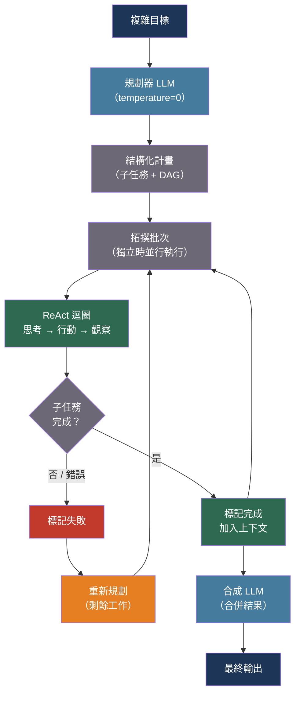

# [BEE-30044] LLM 規劃與任務分解

:::info
複雜的多步驟任務需要 LLM 在行動前明確規劃——將工作分解為原子子任務、以有向無環圖（DAG）表示依賴關係，並在子任務失敗時重新規劃——而非嘗試在單次前向傳遞中完成長任務，那樣的話錯誤會悄無聲息地累積。
:::

## 背景

以自迴歸模式運作的語言模型本身沒有回溯、重新考慮或修改先前輸出的能力。要求模型一次性完成複雜的多步驟任務——「研究、比較並撰寫關於 X 的報告」——會導致錯誤不可見地傳播：模型默默跳過困難的步驟、混淆子任務，或自信地幻覺出中間結果，而後續步驟又在此基礎上繼續建構。

2022 至 2023 年間的研究建立了一套提示詞和代理架構，透過將規劃與執行分離來解決這個問題。Yao 等人（2022 年）在 ICLR 2023 引入了 ReAct（推理+行動）：模型在推理追蹤（明確的思考步驟）和行動（帶有可觀察結果的工具呼叫）之間交替的迴圈，在每一步根據觀察到的結果更新計畫。ReAct 在 ALFWorld 上比模仿學習基準線提升了 34%，在 Fever 事實核查上也有顯著改善——原因在於模型能夠觀察到工具未返回結果，並據此重新規劃。

Zhou 等人（2022 年）在 ICLR 2023 引入了最少到最多提示詞（Least-to-Most）：不直接要求模型解決複雜問題，而是先讓它將問題分解為更簡單的子問題，然後依序解決每個問題並將先前答案作為上下文。這使 GPT-3 能夠泛化到比任何上下文示例更難的組合性問題——這是線性思維鏈所缺乏的能力。

Wang 等人（2023 年）顯示，明確要求模型先建立計畫——計畫與解決提示詞——可以減少零樣本思維鏈中的三類系統性錯誤：計算錯誤、遺漏步驟錯誤和對任務的語義誤解。Yao 等人（2023 年）以思維樹（NeurIPS 2023）進一步擴展了這一方法：將多個部分計畫探索為樹狀結構，用模型自身評估每個節點，並使用廣度優先搜尋或深度優先搜尋找到最佳完整計畫。思維樹的成本遠高於線性規劃，但在需要前瞻和回溯的任務上達到最先進的水準。

## 設計思維

在以下情況下，任務分解是合適的：（a）任務需要超過 3–4 個順序步驟；（b）後續步驟開始前需要驗證中間結果；（c）部分子任務可並行執行；（d）任務需要異質能力（搜尋、程式碼執行、寫作），這些能力適合由專門的子代理處理。

關鍵的設計決策是計畫的表示形式。對於順序任務，扁平步驟清單已足夠。當子任務有依賴關係且部分可並行執行時，需要有向無環圖（DAG）。只有在第一步的正確性真正模糊且探索成本低於回溯成本時，才需要帶節點評估的樹狀結構（思維樹）。

## 最佳實踐

### 執行子任務前必須明確規劃

當任務有超過三個順序子任務時，**MUST**（必須）將規劃步驟與執行步驟分離。要求模型在同一個提示詞中同時規劃和執行，會使計畫偏向模型易於執行的部分，默默跳過困難的子任務：

```python
import anthropic
import json

PLANNER_SYSTEM = """你是任務規劃者。給定複雜的目標，以 JSON 格式生成結構化執行計畫。

輸出格式：
{
  "goal": "<重述的目標>",
  "subtasks": [
    {
      "id": "t1",
      "description": "<要做什麼>",
      "depends_on": [],          // 必須先完成的子任務 ID
      "tool": "<tool_name>",     // 使用哪個工具，或 "llm" 表示推理
      "parallel": false          // true 表示可與兄弟任務並行執行
    }
  ]
}

規則：
- 每個子任務必須是原子性的（一次工具呼叫或一個推理步驟）
- 可以並行執行的子任務必須聲明
- 不要跳過困難步驟——如果不知道如何執行某步驟，將其聲明為需要人工輸入"""

async def plan_task(goal: str, available_tools: list[str]) -> dict:
    """
    為複雜目標生成結構化執行計畫。
    返回帶有子任務依賴關係的 JSON 計畫。
    """
    client = anthropic.AsyncAnthropic()
    response = await client.messages.create(
        model="claude-sonnet-4-20250514",
        max_tokens=2048,
        temperature=0,   # 確定性規劃
        system=PLANNER_SYSTEM,
        messages=[{
            "role": "user",
            "content": (
                f"目標：{goal}\n\n"
                f"可用工具：{', '.join(available_tools)}\n\n"
                "請生成執行計畫。"
            ),
        }],
    )
    raw = response.content[0].text
    import re
    match = re.search(r"\{.*\}", raw, re.DOTALL)
    return json.loads(match.group(0)) if match else {"goal": goal, "subtasks": []}
```

**SHOULD**（應該）在規劃步驟使用 temperature=0，在執行步驟使用較高溫度。規劃是確定性推理任務；執行涉及工具呼叫，可能需要適應意外結果。

### 使用 ReAct 迴圈按依賴順序執行子任務

**SHOULD**（應該）使用 ReAct（思考 → 行動 → 觀察）迴圈執行每個子任務，而非要求模型在不觀察中間結果的情況下直接產生完整答案。每一步的觀察允許模型偵測失敗並重新規劃：

```python
from dataclasses import dataclass, field
from enum import Enum

class SubtaskStatus(Enum):
    PENDING = "pending"
    RUNNING = "running"
    DONE = "done"
    FAILED = "failed"
    SKIPPED = "skipped"

@dataclass
class SubtaskResult:
    subtask_id: str
    status: SubtaskStatus
    output: str
    error: str | None = None

async def execute_react_subtask(
    subtask: dict,
    prior_results: dict[str, SubtaskResult],
    tools: dict,   # 名稱 → 可呼叫物件
) -> SubtaskResult:
    """
    使用 ReAct 迴圈執行單一子任務。
    提供先前子任務結果作為上下文，使模型能夠串聯輸出。
    """
    client = anthropic.AsyncAnthropic()

    context = "\n".join(
        f"[{sid}] {r.output}" for sid, r in prior_results.items()
        if r.status == SubtaskStatus.DONE
    )

    react_prompt = f"""你正在執行子任務 {subtask['id']}：{subtask['description']}

先前結果：
{context if context else '（無）'}

逐步思考（思考），然後呼叫適當的工具（行動）。
看到工具結果（觀察）後，判斷子任務是否完成。
如果完成，輸出：RESULT: <你的結論>
如果需要再次呼叫工具，請發出請求。"""

    messages = [{"role": "user", "content": react_prompt}]
    max_iterations = 5

    for _ in range(max_iterations):
        response = await client.messages.create(
            model="claude-sonnet-4-20250514",
            max_tokens=1024,
            temperature=0.3,
            messages=messages,
        )
        reply = response.content[0].text
        messages.append({"role": "assistant", "content": reply})

        if "RESULT:" in reply:
            output = reply.split("RESULT:", 1)[1].strip()
            return SubtaskResult(subtask["id"], SubtaskStatus.DONE, output)

        # 偵測回覆中的工具呼叫並執行
        tool_name = subtask.get("tool")
        if tool_name and tool_name in tools:
            try:
                observation = tools[tool_name](reply)
                messages.append({
                    "role": "user",
                    "content": f"觀察：{observation}",
                })
            except Exception as exc:
                messages.append({
                    "role": "user",
                    "content": f"觀察：工具錯誤——{exc}。請考慮重新規劃。",
                })

    return SubtaskResult(
        subtask["id"], SubtaskStatus.FAILED, "",
        error="達到最大迭代次數，子任務未完成",
    )
```

### 並行執行獨立子任務

**SHOULD**（應該）識別無未滿足依賴的子任務並並發執行它們。需要搜尋三個獨立資料庫然後合成結果的研究任務，透過並行執行三次搜尋可將掛鐘時間縮短 3 倍：

```python
import asyncio

def topological_batches(subtasks: list[dict]) -> list[list[dict]]:
    """
    產生可並行執行的子任務批次。
    每個批次僅依賴更早批次中的子任務。
    """
    id_to_task = {t["id"]: t for t in subtasks}
    remaining = set(t["id"] for t in subtasks)
    completed = set()
    batches = []

    while remaining:
        # 所有依賴都已完成的子任務
        ready = [
            id_to_task[tid] for tid in remaining
            if all(dep in completed for dep in id_to_task[tid].get("depends_on", []))
        ]
        if not ready:
            raise ValueError(f"在子任務中偵測到循環依賴：{remaining}")
        batches.append(ready)
        for t in ready:
            remaining.remove(t["id"])
            completed.add(t["id"])

    return batches

async def execute_plan(plan: dict, tools: dict) -> dict[str, SubtaskResult]:
    """按依賴順序執行所有子任務，在可能的情況下並行化。"""
    results: dict[str, SubtaskResult] = {}
    batches = topological_batches(plan["subtasks"])

    for batch in batches:
        batch_results = await asyncio.gather(*[
            execute_react_subtask(task, results, tools)
            for task in batch
        ])
        for result in batch_results:
            results[result.subtask_id] = result

        # 如果此批次中的任何子任務失敗，觸發重新規劃
        failed = [r for r in batch_results if r.status == SubtaskStatus.FAILED]
        if failed:
            for f in failed:
                print(f"子任務 {f.subtask_id} 失敗：{f.error}")

    return results
```

### 子任務失敗或輸出意外時必須重新規劃

當子任務失敗或其輸出偏離計畫預期時，**SHOULD**（應該）觸發重新規劃。重新規劃將當前狀態（已完成的子任務及其輸出，以及失敗情況）回饋給規劃器，並請求對剩餘工作生成修訂計畫：

```python
async def replan(
    original_goal: str,
    completed: dict[str, SubtaskResult],
    failed_subtask: dict,
    failure_reason: str,
    available_tools: list[str],
) -> dict:
    """
    在子任務失敗的情況下，請求對剩餘工作生成修訂計畫。
    """
    client = anthropic.AsyncAnthropic()
    completed_summary = "\n".join(
        f"[{sid}] {r.output[:200]}" for sid, r in completed.items()
        if r.status == SubtaskStatus.DONE
    )

    response = await client.messages.create(
        model="claude-sonnet-4-20250514",
        max_tokens=2048,
        temperature=0,
        system=PLANNER_SYSTEM,
        messages=[{
            "role": "user",
            "content": (
                f"目標：{original_goal}\n\n"
                f"已完成的部分：\n{completed_summary}\n\n"
                f"失敗的子任務：{failed_subtask['description']}\n"
                f"失敗原因：{failure_reason}\n\n"
                f"可用工具：{', '.join(available_tools)}\n\n"
                "請僅針對剩餘工作生成修訂計畫。"
            ),
        }],
    )
    raw = response.content[0].text
    import re
    match = re.search(r"\{.*\}", raw, re.DOTALL)
    return json.loads(match.group(0)) if match else {}
```

### 僅對第一步模糊的任務使用思維樹

思維樹（探索多個候選第一步並在決定之前用模型評估它們）只在以下情況才值得使用：（a）正確的第一步行動真正模糊；（b）首步錯誤的恢復成本很高；（c）有可用的探索預算。**SHOULD NOT**（不應）將思維樹應用於第一步明確的順序任務——探索開銷是不合理的，且成本增加 N 倍（候選分支數 × 深度）：

```python
EVAL_PROMPT = """評估以下部分計畫實現目標的程度。
評分 1–10（10 = 優秀），然後用一句話解釋。

目標：{goal}
部分計畫：{plan}

輸出：SCORE: <數字>\nREASON: <一句話>"""

async def evaluate_partial_plan(goal: str, partial_plan: str) -> float:
    """思維樹節點評分的 LLM 自我評估器。"""
    client = anthropic.AsyncAnthropic()
    r = await client.messages.create(
        model="claude-haiku-4-5-20251001",   # 使用更廉價的評估器
        max_tokens=128,
        temperature=0,
        messages=[{"role": "user", "content": EVAL_PROMPT.format(
            goal=goal, plan=partial_plan,
        )}],
    )
    import re
    match = re.search(r"SCORE:\s*(\d+)", r.content[0].text)
    return float(match.group(1)) / 10.0 if match else 0.5
```

## 流程圖



## 規劃模式比較

| 模式 | 規劃方式 | 回溯 | 成本 | 最適情境 |
|---|---|---|---|---|
| ReAct | 每步內聯 | 透過觀察 | 低 | 順序工具使用任務 |
| 計畫與解決 | 預先清單 | 無（線性） | 低 | 數學和推理任務 |
| 最少到最多 | 順序子問題 | 無 | 低 | 組合性問題解決 |
| 計畫 → DAG 執行 | 預先 DAG | 透過重新規劃 | 中 | 多工具並行工作流 |
| 思維樹 | BFS/DFS 探索 | 完整回溯 | 高 | 第一步模糊的任務 |

## 常見錯誤

**在同一提示詞中同時進行規劃和執行。** 模型會將計畫偏向已開始執行的部分。分離不僅是一種模式——它是計畫能夠如實反映困難程度的因果必要條件。

**不建立子任務依賴模型。** 將五步任務視為五個獨立提示詞，導致每個提示詞都要重新推導先前步驟已產生的上下文。應明確傳遞先前結果。

**對每個任務都應用思維樹。** ToT 的成本為 O(分支數 × 深度) 次 LLM 呼叫。僅在第一步模糊且首步錯誤恢復成本高時才應用。

**默默吞嚥子任務失敗。** 返回錯誤的子任務悄然繼續進入合成步驟，模型在沒有實際輸出的情況下幻覺出結果。應明確偵測失敗，並要麼重新規劃，要麼帶有清晰錯誤地中止。

## 相關 BEE

- [BEE-30002](ai-agent-architecture-patterns.md) -- AI 代理架構模式：規劃與任務分解運作其中的代理架構
- [BEE-30018](llm-tool-use-and-function-calling-patterns.md) -- LLM 工具使用與函式呼叫模式：ReAct 行動呼叫工具的機制
- [BEE-30035](ai-agent-safety-and-reliability-patterns.md) -- AI 代理安全與可靠性模式：代理預算上限和熔斷器限制規劃迴圈的執行時間
- [BEE-30027](ai-workflow-orchestration.md) -- AI 工作流程協調：用於確定性工作流程的 DAG 協調是 LLM 生成的動態計畫的補充
- [BEE-30023](chain-of-thought-and-extended-thinking-patterns.md) -- 思維鏈與延伸思考模式：思維鏈是每個子任務的推理；規劃是跨子任務的結構

## 參考資料

- [Yao et al. ReAct: Synergizing Reasoning and Acting in Language Models — arXiv:2210.03629, ICLR 2023](https://arxiv.org/abs/2210.03629)
- [Wang et al. Plan-and-Solve Prompting: Improving Zero-Shot Chain-of-Thought — arXiv:2305.04091, ACL 2023](https://arxiv.org/abs/2305.04091)
- [Zhou et al. Least-to-Most Prompting Enables Complex Reasoning in Large Language Models — arXiv:2205.10625, ICLR 2023](https://arxiv.org/abs/2205.10625)
- [Yao et al. Tree of Thoughts: Deliberate Problem Solving with Large Language Models — arXiv:2305.10601, NeurIPS 2023](https://arxiv.org/abs/2305.10601)
- [Shen et al. HuggingGPT: Solving AI Tasks with ChatGPT and its Friends in Hugging Face — arXiv:2303.17580, 2023](https://arxiv.org/abs/2303.17580)
- [Valmeekam et al. LLMs Still Can't Plan — arXiv:2402.01817, 2024](https://arxiv.org/abs/2402.01817)
- [LangGraph Documentation — langchain.com](https://www.langchain.com/langgraph)
