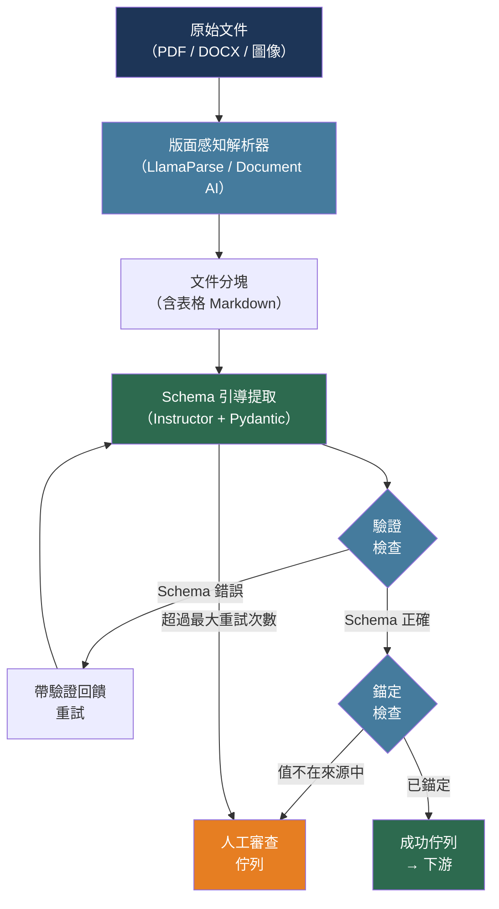

# [BEE-30030] LLM 文件處理與資訊提取

:::info
LLM 驅動的資訊提取將非結構化文件——發票、合約、表單、研究論文——轉化為結構化記錄；關鍵的工程決策在於如何定義輸出 Schema、如何驗證並修正提取欄位，以及如何在生產工作負載所需的規模下進行流水線處理。
:::

## 背景

傳統文件處理依賴嚴格的規則式解析器、正規表示式和模板匹配。每當新供應商採用稍微不同的發票格式，或合約條款被改寫，這些方法就會失效。LLM 改變了工作單元：從「為每個模板撰寫解析器」轉變為「定義一次 Schema，讓模型處理格式差異」。

Li 等人（arXiv:2312.17617，2023）的綜合調查記錄了這種轉變。核心洞察是：LLM 不只是應用規則——它對文件內容進行語意推理，即使格式不一致、欄位隱含，或值跨越多個句子，也能推斷出欄位值。

兩種提取失敗模式在生產部署中最為常見。第一，幻覺（hallucination）：模型自信地返回文件中並不存在的欄位值。第二，Schema 漂移（schema drift）：模型在正確的欄位中返回格式錯誤的值（如日期為「January 3」而非「2026-01-03」），導致下游解析失敗。兩者都需要在 Schema 定義和驗證層面明確加以緩解。

Xu 等人（arXiv:2309.10952，EMNLP 2023）引入了 LMDX——基於語言模型的文件資訊提取與定位——證明將模型輸出錨定到文件片段（強制模型引用所提取的來源段落）可大幅降低幻覺率，相較於自由格式生成效果顯著。

## 設計思維

生產文件提取流程有四個階段：

1. **文件解析**——將原始位元組（PDF、DOCX、圖像）轉換為可處理的文字或標記流，同時保留版面元資料（邊界框、頁碼、表格結構）
2. **分塊與上下文管理**——將解析後的文件拆分為符合 LLM 上下文視窗的片段，同時保留語意邊界
3. **Schema 引導提取**——以分塊和明確的輸出 Schema 呼叫 LLM，使用函數呼叫或結構化輸出來限制回應格式
4. **驗證與修正**——根據 Schema 解析模型輸出，評估信心度，重試或升級失敗的提取

關鍵取捨在於文件層級提取與分塊層級提取之間的選擇。使用長上下文模型進行文件層級提取更簡單，但會引入位置偏差——LLM 在長輸入中注意力分布不均，在上下文開頭和結尾表現較好。分塊層級提取避免了這個問題，但需要跨分塊合併結果，並在同一欄位出現於多個分塊時解決衝突。

## 最佳實踐

### 在撰寫提示詞之前定義 Pydantic Schema

**MUST**（必須）在撰寫任何提示詞之前，將提取 Schema 定義為有型別的 Pydantic 模型。Schema 是文件處理系統與下游消費者之間的契約。使用 Instructor 函式庫將 Schema 直接繫結到 LLM 呼叫：

```python
from pydantic import BaseModel, Field
from datetime import date
from typing import Optional
import instructor
import anthropic

class LineItem(BaseModel):
    description: str
    quantity: float
    unit_price: float
    total: float

class Invoice(BaseModel):
    invoice_number: str = Field(description="Unique invoice identifier, e.g. INV-2024-001")
    invoice_date: date = Field(description="Invoice issue date in ISO 8601 format")
    vendor_name: str
    vendor_address: Optional[str] = None
    total_amount: float = Field(description="Total amount due including tax")
    currency: str = Field(default="USD", description="ISO 4217 currency code")
    line_items: list[LineItem] = Field(default_factory=list)

# Instructor 為 Anthropic 客戶端打補丁以強制執行 Schema 合規性
client = instructor.from_anthropic(anthropic.Anthropic())

def extract_invoice(document_text: str) -> Invoice:
    return client.messages.create(
        model="claude-sonnet-4-6",
        max_tokens=1024,
        messages=[{
            "role": "user",
            "content": (
                "Extract the invoice information from the following document. "
                "Return only fields that are explicitly present in the document.\n\n"
                f"<document>\n{document_text}\n</document>"
            ),
        }],
        response_model=Invoice,
    )
```

**SHOULD** 為名稱模糊或格式必須受限的欄位（日期、貨幣代碼、識別碼）添加 `description` 標註。模型使用欄位描述作為提取指引。

**MUST NOT** 以自由格式 JSON 字串解析作為主要提取路徑。`json.loads(response.content)` 在格式錯誤的輸出上會靜默失敗；Pydantic 驗證會拋出結構化例外，可用於驅動重試邏輯。

### 建構兩階段驗證迴圈

**SHOULD** 實作驗證迴圈，在結果到達下游消費者之前捕捉兩種主要失敗模式——幻覺和格式漂移：

```python
from pydantic import ValidationError
import instructor
from instructor.exceptions import InstructorRetryException

def extract_with_retry(document_text: str, schema: type, max_retries: int = 3):
    """
    Instructor 在驗證失敗時自動重試，將
    驗證錯誤作為修正上下文回饋給模型。
    """
    client = instructor.from_anthropic(
        anthropic.Anthropic(),
        mode=instructor.Mode.ANTHROPIC_TOOLS,
    )
    try:
        return client.messages.create(
            model="claude-sonnet-4-6",
            max_tokens=1024,
            max_retries=max_retries,  # Instructor 管理帶回饋的重試
            messages=[{
                "role": "user",
                "content": f"Extract structured data:\n\n{document_text}",
            }],
            response_model=schema,
        )
    except InstructorRetryException as e:
        # 所有重試均已耗盡：記錄以供人工審查
        raise ExtractionError(
            f"Extraction failed after {max_retries} attempts",
            last_error=str(e),
            document_preview=document_text[:200],
        ) from e
```

**SHOULD** 為高風險欄位添加錨定（grounding）檢查。提取後，驗證提取值是否逐字（或以正規化形式）出現在來源文件中：

```python
def grounding_check(extracted_value: str, source_text: str) -> bool:
    """
    驗證提取值是否錨定於來源文件。
    防止幻覺值進入下游系統。
    """
    normalized_source = source_text.lower().replace(",", "").replace("$", "")
    normalized_value = str(extracted_value).lower().replace(",", "").replace("$", "")
    return normalized_value in normalized_source

def validate_extraction(invoice: Invoice, source_text: str) -> list[str]:
    warnings = []
    if not grounding_check(invoice.invoice_number, source_text):
        warnings.append(f"invoice_number '{invoice.invoice_number}' not found in source")
    if not grounding_check(str(invoice.total_amount), source_text):
        warnings.append(f"total_amount '{invoice.total_amount}' not found in source")
    return warnings
```

### 分塊長文件以避免位置偏差

**SHOULD** 將超過約 4,000 個標記的文件拆分為重疊分塊，並按分塊提取欄位值，而非一次性饋入整份文件。LLM 在長輸入中注意力分布不均——位於長上下文中間的值遺漏率更高：

```python
def chunk_document(text: str, chunk_size: int = 3000, overlap: int = 300) -> list[str]:
    """
    將文件文字拆分為重疊分塊。
    重疊部分保留了跨分塊邊界的上下文（例如，
    出現在一頁的表格標題和出現在下一頁的資料）。
    """
    words = text.split()
    chunks = []
    start = 0
    while start < len(words):
        end = min(start + chunk_size, len(words))
        chunks.append(" ".join(words[start:end]))
        if end == len(words):
            break
        start += chunk_size - overlap
    return chunks

def extract_from_long_document(text: str, schema: type) -> dict:
    """
    從每個分塊提取欄位，然後透過取每個欄位的
    第一個非空值來合併。對於列表欄位（明細項目），則串接。
    """
    chunks = chunk_document(text)
    results = []
    for chunk in chunks:
        try:
            result = extract_with_retry(chunk, schema)
            results.append(result.model_dump())
        except ExtractionError:
            continue  # 跳過失敗的分塊；記錄以供審查

    # 合併：純量欄位取第一個非 None 值
    merged = {}
    for key in schema.model_fields:
        field_info = schema.model_fields[key]
        is_list = hasattr(field_info.annotation, "__origin__") and field_info.annotation.__origin__ is list
        if is_list:
            merged[key] = [item for r in results for item in (r.get(key) or [])]
        else:
            merged[key] = next((r[key] for r in results if r.get(key) is not None), None)
    return merged
```

**SHOULD** 在分塊之前，對 PDF 和掃描文件使用版面感知解析器（LlamaParse、Google Document AI、Azure Document Intelligence）。原始 PDF 文字提取會丟失表格結構和閱讀順序；版面感知解析器以 Markdown 或結構化 JSON 的形式保留這些內容。

### 提取時保留表格結構

**SHOULD** 在傳遞給 LLM 之前，將表格轉換為保留儲存格關係的文字格式。從 PDF 進行原始文字提取會將表格儲存格壓縮成扁平流，導致模型錯誤分配值：

```python
def table_to_markdown(headers: list[str], rows: list[list[str]]) -> str:
    """
    將已解析的表格（例如來自 pdfplumber 或 Document AI）轉換為
    Markdown 格式。LLM 能可靠地解析以管道符號分隔的 Markdown 表格。
    """
    separator = "| " + " | ".join(["---"] * len(headers)) + " |"
    header_row = "| " + " | ".join(headers) + " |"
    data_rows = ["| " + " | ".join(str(cell) for cell in row) + " |" for row in rows]
    return "\n".join([header_row, separator] + data_rows)

# 使用 pdfplumber 解析 PDF 後：
# table = page.extract_table()
# headers, *rows = table
# markdown_table = table_to_markdown(headers, rows)
# 將 markdown_table 傳遞給提取提示詞，而非原始文字
```

對於標題只出現在第一頁的複雜多頁表格，應在每個繼續該表格的後續分塊開頭加上標題列。

### 低信心時路由至人工審查

**MUST** 在驗證失敗或信心度低時，將提取結果路由至人工審查，而非靜默地將劣質資料傳遞給下游：

```python
from enum import Enum
from dataclasses import dataclass

class ExtractionStatus(Enum):
    SUCCESS = "success"
    LOW_CONFIDENCE = "low_confidence"
    FAILED = "failed"

@dataclass
class ExtractionResult:
    status: ExtractionStatus
    data: dict | None
    warnings: list[str]
    document_id: str

def process_document(document_id: str, text: str, schema: type) -> ExtractionResult:
    try:
        extracted = extract_with_retry(text, schema)
        warnings = validate_extraction(extracted, text)

        if warnings:
            return ExtractionResult(
                status=ExtractionStatus.LOW_CONFIDENCE,
                data=extracted.model_dump(),
                warnings=warnings,
                document_id=document_id,
            )
        return ExtractionResult(
            status=ExtractionStatus.SUCCESS,
            data=extracted.model_dump(),
            warnings=[],
            document_id=document_id,
        )
    except ExtractionError as e:
        return ExtractionResult(
            status=ExtractionStatus.FAILED,
            data=None,
            warnings=[str(e)],
            document_id=document_id,
        )

def dispatch_result(result: ExtractionResult, queue_client):
    if result.status == ExtractionStatus.SUCCESS:
        queue_client.send("extraction.success", result.data)
    else:
        # 路由至人工審查佇列，並附帶審查員所需的上下文
        queue_client.send("extraction.review", {
            "document_id": result.document_id,
            "status": result.status.value,
            "partial_data": result.data,
            "warnings": result.warnings,
        })
```

## 視覺圖



## 提取模式比較

| 模式 | 幻覺風險 | 版面處理 | 最適合 |
|---|---|---|---|
| 直接 LLM（自由格式 JSON） | 高 | 差 | 僅限原型開發 |
| Schema 引導（Instructor） | 中 | 差 | 結構良好的純文字文件 |
| Schema + 錨定檢查 | 低 | 差 | 高風險的純量欄位 |
| 版面解析器 + Schema | 低 | 好 | 含表格和欄的 PDF |
| 分塊 + 合併 + 錨定 | 低 | 好 | 長篇多頁文件 |

## 相關 BEE

- [BEE-30006](structured-output-and-constrained-decoding.md) -- 結構化輸出與受限解碼：在標記層面強制執行 Schema 合規性的解碼層機制（語法約束、函數呼叫）
- [BEE-30007](rag-pipeline-architecture.md) -- RAG 流程架構：本文的文件解析與分塊直接饋入 RAG 流程的索引階段
- [BEE-30025](llm-batch-processing-patterns.md) -- LLM 批次處理模式：OpenAI 和 Anthropic 的批次 API 可直接應用於大量文件提取工作負載
- [BEE-30022](human-in-the-loop-ai-patterns.md) -- 人工介入 AI 模式：本文的人工審查路由模式是 BEE-30022 中信心度閘控人工審查模式的一個實例

## 參考資料

- [Li et al. Large Language Models for Generative Information Extraction: A Survey — arXiv:2312.17617, 2023](https://arxiv.org/abs/2312.17617)
- [Xu et al. LMDX: Language Model-based Document Information Extraction and Localization — arXiv:2309.10952, EMNLP 2023](https://arxiv.org/abs/2309.10952)
- [Instructor. Structured outputs for LLMs — python.useinstructor.com](https://python.useinstructor.com/)
- [LlamaIndex. LlamaParse — llamaindex.ai/llamaparse](https://www.llamaindex.ai/llamaparse)
- [Google Cloud. Document AI — cloud.google.com/document-ai](https://cloud.google.com/document-ai)
- [Azure. Document Intelligence — azure.microsoft.com](https://azure.microsoft.com/en-us/products/ai-foundry/tools/document-intelligence)
