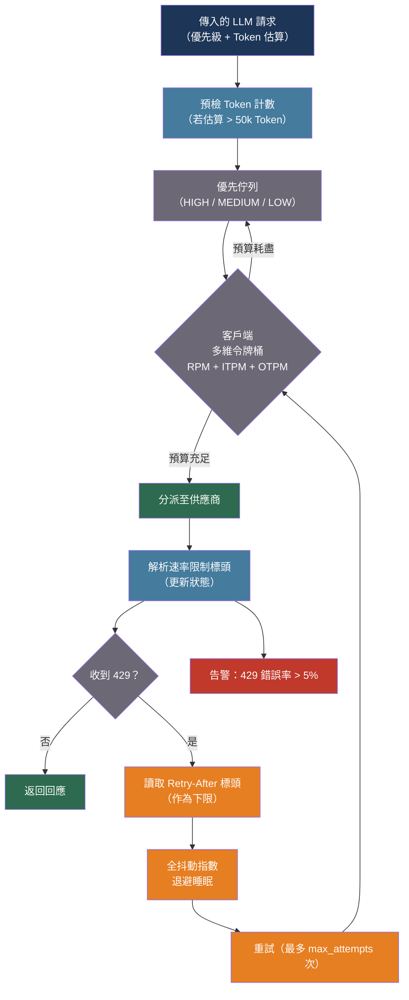

# [BEE-541] LLM 供應商速率限制與客戶端配額管理

:::info
LLM 供應商採用多維速率限制（每分鐘請求數、每分鐘輸入 Token 數、每分鐘輸出 Token 數），以令牌桶（token bucket）演算法懲罰突發流量而非平均流量——有效管理這些限制需要預檢 Token 估算、基於供應商標頭的全抖動退避重試（full-jitter backoff）、與供應商執行策略相映射的客戶端令牌桶，以及同時對所有限制維度設卡的優先佇列。
:::

## 背景

傳統 HTTP 速率限制是單一維度的：每秒請求數。通用重試函式庫在收到 429 後以固定延遲重試即可。LLM API 的速率限制本質上不同，需要專門設計的管理策略。

Anthropic 針對每個模型等級強制執行三個獨立維度：每分鐘輸入 Token（ITPM）、每分鐘輸出 Token（OTPM）與每分鐘請求數（RPM）。單一請求可在任一維度獨立觸發 429——批次作業每分鐘消耗 180 萬輸入 Token，可能在 RPM 範圍內仍耗盡 ITPM。OpenAI 另外增加每日維度（RPD、TPD）；Google Vertex AI 除 Token 限制外還執行並發數限制。各供應商內部均使用令牌桶演算法，採連續補充而非固定時鐘間隔重置。若 60 RPM 以每秒一個請求的方式執行，在 00:00 瞬間送出四個並發請求仍會產生三個 429，即使整分鐘尚未結束。

在 LLM 應用中，429 錯誤的代價遠高於 REST API 的 429。LLM 請求耗時 2–60 秒；串流回應在整個生命週期內持續佔用令牌桶容量。即使不再發送新請求，一組長時間串流的請求仍可耗盡 OTPM。此外，供應商還會施加加速限制——Anthropic 明確警告，即使每分鐘總量在限制內，流量急速攀升也會觸發 429，批次工作負載必須逐步暖身（warm-up）。

供應商透過回應標頭揭露速率限制狀態（Anthropic：`anthropic-ratelimit-input-tokens-remaining`、`anthropic-ratelimit-tokens-reset` 等；OpenAI：`x-ratelimit-remaining-requests`、`x-ratelimit-remaining-tokens`）。完善的客戶端在每次回應時讀取這些標頭，用於主動節流（proactive throttling），而非僅在被動重試時使用。

## 最佳實踐

### 每次回應都必須讀取供應商速率限制標頭

**MUST**（必須）在每次 API 回應時檢查供應商速率限制標頭，而非僅在收到 429 時才檢查。剩餘 Token 數與重置時間戳標頭可在配額耗盡前進行主動節流：

```python
from dataclasses import dataclass, field
from datetime import datetime, timezone
import anthropic
import logging

logger = logging.getLogger(__name__)

@dataclass
class RateLimitState:
    """追蹤從供應商回應標頭觀察到的當前速率限制狀態。"""
    requests_limit: int = 0
    requests_remaining: int = 0
    requests_reset: datetime | None = None
    input_tokens_limit: int = 0
    input_tokens_remaining: int = 0
    input_tokens_reset: datetime | None = None
    output_tokens_limit: int = 0
    output_tokens_remaining: int = 0
    output_tokens_reset: datetime | None = None

    def utilization_pct(self) -> dict:
        """各維度已消耗比例，用於主動節流決策。"""
        def frac(remaining, limit):
            return 1.0 - (remaining / limit) if limit > 0 else 1.0
        return {
            "requests": frac(self.requests_remaining, self.requests_limit),
            "input_tokens": frac(self.input_tokens_remaining, self.input_tokens_limit),
            "output_tokens": frac(self.output_tokens_remaining, self.output_tokens_limit),
        }

def parse_anthropic_headers(headers: dict) -> RateLimitState:
    """
    從回應中解析 Anthropic 速率限制標頭。
    Anthropic 返回 RFC 3339 格式的重置時間戳。
    """
    def parse_ts(v: str | None) -> datetime | None:
        if not v:
            return None
        try:
            return datetime.fromisoformat(v.replace("Z", "+00:00"))
        except ValueError:
            return None

    return RateLimitState(
        requests_limit=int(headers.get("anthropic-ratelimit-requests-limit", 0)),
        requests_remaining=int(headers.get("anthropic-ratelimit-requests-remaining", 0)),
        requests_reset=parse_ts(headers.get("anthropic-ratelimit-requests-reset")),
        input_tokens_limit=int(headers.get("anthropic-ratelimit-input-tokens-limit", 0)),
        input_tokens_remaining=int(headers.get("anthropic-ratelimit-input-tokens-remaining", 0)),
        input_tokens_reset=parse_ts(headers.get("anthropic-ratelimit-input-tokens-reset")),
        output_tokens_limit=int(headers.get("anthropic-ratelimit-output-tokens-limit", 0)),
        output_tokens_remaining=int(headers.get("anthropic-ratelimit-output-tokens-remaining", 0)),
        output_tokens_reset=parse_ts(headers.get("anthropic-ratelimit-output-tokens-reset")),
    )

# 跨應用程式共享的執行緒安全狀態
_rate_state = RateLimitState()

def call_with_header_tracking(
    messages: list[dict],
    system: str,
    model: str = "claude-sonnet-4-20250514",
    max_tokens: int = 1024,
) -> str:
    """發出 API 呼叫，並從回應標頭更新共享速率限制狀態。"""
    global _rate_state
    client = anthropic.Anthropic()

    response = client.messages.create(
        model=model, max_tokens=max_tokens, system=system, messages=messages,
    )
    # Anthropic Python SDK 透過 response.http_response.headers 揭露原始標頭
    if hasattr(response, "http_response") and response.http_response:
        _rate_state = parse_anthropic_headers(dict(response.http_response.headers))
        util = _rate_state.utilization_pct()
        logger.info("ratelimit_state", extra={
            "requests_util": round(util["requests"], 3),
            "input_tokens_util": round(util["input_tokens"], 3),
            "output_tokens_util": round(util["output_tokens"], 3),
        })
        # 主動警告：任一維度超過 80% 消耗時記錄警告
        if any(v > 0.80 for v in util.values()):
            logger.warning("ratelimit_approaching_threshold", extra=util)

    return response.content[0].text
```

收到 429 時，**MUST**（必須）將 `retry-after` 標頭值作為最短等待時間下限，不得用更短的計算退避覆蓋——供應商的值反映了實際的令牌桶狀態：

```python
import time

def wait_for_retry_after(headers: dict) -> None:
    """在重試前等待供應商指定的時間。"""
    retry_after = headers.get("retry-after")
    if retry_after:
        try:
            wait = float(retry_after)
            logger.info("respecting_retry_after", extra={"wait_seconds": wait})
            time.sleep(wait)
        except ValueError:
            pass
```

### 大型請求分派前應預估 Token 數量

在接近 ITPM 限制時，**SHOULD**（應該）在分派前預檢計算 Token 數。此舉可讓調度器延遲超大請求，而非在傳輸中途消耗配額並導致串流中斷：

```python
def count_tokens_preflight(
    messages: list[dict],
    system: str,
    model: str = "claude-sonnet-4-20250514",
    tools: list[dict] | None = None,
) -> int:
    """
    在分派前呼叫 Token 計數端點。
    此端點有獨立的 RPM 限制（第 4 層：8,000 RPM）。
    工具 Schema 和系統提示都計入總數。
    適用於估算超過 50,000 Token 的請求。
    """
    client = anthropic.Anthropic()
    payload = {
        "model": model,
        "system": system,
        "messages": messages,
    }
    if tools:
        payload["tools"] = tools

    result = client.messages.count_tokens(**payload)
    return result.input_tokens

def should_defer_request(estimated_tokens: int, state: RateLimitState) -> bool:
    """
    主動延遲：若發送此請求會在重置時間戳前耗盡輸入 Token 桶，
    則暫緩請求。
    """
    if state.input_tokens_limit == 0:
        return False   # 尚無狀態資料；允許通過
    safe_threshold = state.input_tokens_limit * 0.05  # 保留 5% 緩衝
    return estimated_tokens > (state.input_tokens_remaining - safe_threshold)
```

在呼叫計數 API 之前，**SHOULD**（應該）用字元長度啟發式估算進行低成本預篩——英文散文約每 Token 4 個字元。僅對啟發式估算標記為可能超大的請求才呼叫計數 API：

```python
def estimate_tokens_heuristic(text: str) -> int:
    """
    快速離線估算：英文散文約每 Token 4 個位元組。
    準確度：±15%，依內容類型而異。
    用於判斷是否值得申請精確計數。
    """
    return len(text.encode("utf-8")) // 4

def needs_precise_count(messages: list[dict], system: str, threshold: int = 50_000) -> bool:
    total_chars = len(system)
    for m in messages:
        content = m.get("content", "")
        total_chars += len(content) if isinstance(content, str) else sum(
            len(block.get("text", "")) for block in content if isinstance(block, dict)
        )
    return estimate_tokens_heuristic(" " * total_chars) > threshold
```

### 實作客戶端令牌桶

**SHOULD**（應該）維護與供應商執行策略相映射的客戶端令牌桶，實現平滑的主動節流，避免 429 而非從 429 中恢復：

```python
import threading
import time

class TokenBucket:
    """
    與供應商端執行策略相映射的執行緒安全令牌桶。
    為每個速率限制維度（RPM、ITPM、OTPM）提供獨立的桶。
    採連續補充（而非固定間隔），與 Anthropic 的行為一致。
    """

    def __init__(self, capacity: int, refill_rate: float):
        """
        capacity: 桶的最大容量（每分鐘限制）
        refill_rate: 每秒新增的 Token 數（= capacity / 60）
        """
        self.capacity = capacity
        self.refill_rate = refill_rate
        self._tokens = float(capacity)
        self._last_refill = time.monotonic()
        self._lock = threading.Lock()

    def _refill(self) -> None:
        now = time.monotonic()
        elapsed = now - self._last_refill
        self._tokens = min(self.capacity, self._tokens + elapsed * self.refill_rate)
        self._last_refill = now

    def acquire(self, amount: int, block: bool = True, timeout: float = 60.0) -> bool:
        """
        取得 `amount` 個 Token。block=True 時等待直到有足夠 Token。
        超時返回 False。
        """
        deadline = time.monotonic() + timeout
        while True:
            with self._lock:
                self._refill()
                if self._tokens >= amount:
                    self._tokens -= amount
                    return True
            if not block or time.monotonic() >= deadline:
                return False
            # 依赤字大小等比等待後重試
            with self._lock:
                deficit = amount - self._tokens
            wait = max(0.01, deficit / self.refill_rate)
            time.sleep(min(wait, deadline - time.monotonic()))

    def available(self) -> float:
        with self._lock:
            self._refill()
            return self._tokens

class MultiDimensionalBucket:
    """
    同時對 RPM、ITPM 和 OTPM 設卡。
    三個維度都有容量時才分派請求。
    """
    def __init__(self, rpm: int, itpm: int, otpm: int):
        self.requests = TokenBucket(capacity=rpm,  refill_rate=rpm / 60)
        self.input_tokens = TokenBucket(capacity=itpm, refill_rate=itpm / 60)
        self.output_tokens = TokenBucket(capacity=otpm, refill_rate=otpm / 60)

    def acquire(self, estimated_input_tokens: int, estimated_output_tokens: int) -> bool:
        """
        以原子方式從三個桶中取得配額。
        若任一桶拒絕，則不消耗任何桶的 Token。
        """
        # 先非阻塞式檢查三個桶
        if (self.requests.available() >= 1
                and self.input_tokens.available() >= estimated_input_tokens
                and self.output_tokens.available() >= estimated_output_tokens):
            # 從三個桶中同時扣除
            self.requests.acquire(1, block=False)
            self.input_tokens.acquire(estimated_input_tokens, block=False)
            self.output_tokens.acquire(estimated_output_tokens, block=False)
            return True
        return False   # 呼叫方應將請求加入佇列後重試

# Anthropic 第 4 層 / claude-sonnet-4-20250514 的初始化範例
sonnet_bucket = MultiDimensionalBucket(rpm=4_000, itpm=2_000_000, otpm=400_000)
```

### 以全抖動指數退避重試 429 錯誤

**MUST**（必須）在重試 429 時使用全抖動指數退避（full-jitter exponential backoff）。AWS 2015 年的重試策略研究發現，全抖動——`sleep = random(0, min(cap, base × 2^attempt))`——能最小化所有重試客戶端的總工作量，並消除無抖動退避產生的雷群（thundering herd）同步問題：

```python
import random
import time
import anthropic
from anthropic import RateLimitError

def call_with_backoff(
    messages: list[dict],
    system: str,
    model: str = "claude-sonnet-4-20250514",
    max_tokens: int = 1024,
    max_attempts: int = 6,
    base_delay: float = 1.0,
    cap_delay: float = 60.0,
) -> str:
    """
    全抖動指數退避，以 Retry-After 標頭為下限。
    第 0 次：等待 0–1 秒；第 1 次：0–2 秒；第 2 次：0–4 秒……上限 60 秒。
    """
    client = anthropic.Anthropic()
    last_error = None

    for attempt in range(max_attempts):
        try:
            response = client.messages.create(
                model=model, max_tokens=max_tokens, system=system, messages=messages,
            )
            return response.content[0].text

        except RateLimitError as exc:
            last_error = exc
            # 遵守供應商的 Retry-After；絕不更早重試
            retry_after = getattr(exc, "response", None)
            retry_after_value = None
            if retry_after and hasattr(retry_after, "headers"):
                retry_after_value = retry_after.headers.get("retry-after")

            if retry_after_value:
                floor = float(retry_after_value)
            else:
                floor = 0.0

            # 全抖動：在 [0, min(cap, base * 2^attempt)] 範圍內隨機
            jitter_ceiling = min(cap_delay, base_delay * (2 ** attempt))
            computed = random.uniform(0, jitter_ceiling)
            sleep_duration = max(floor, computed)

            if attempt < max_attempts - 1:
                logger.warning(
                    "rate_limit_retry",
                    extra={"attempt": attempt + 1, "sleep": round(sleep_duration, 2)},
                )
                time.sleep(sleep_duration)

    raise RuntimeError(f"Failed after {max_attempts} attempts") from last_error
```

**MUST NOT**（絕對不能）在收到 429 後立即重試。在速率限制壓力下立即重試會產生雷群突發，使情況更加惡化。即使只等待 100ms 也能消除大部分同步效應。

**SHOULD**（應該）從供應商錯誤回應本體中區分 RPM 觸發的 429 與 TPM 觸發的 429。TPM 耗盡通常需要更長的等待——若 ITPM 桶耗盡，等待時間必須跨越補充間隔，而非僅等待單一請求槽開放：

```python
import json

def classify_rate_limit_error(exc: RateLimitError) -> str:
    """
    Anthropic 錯誤本體包含 `type` 和 `error.message`，描述超限的維度。
    區分「請求數超限」與「Token 數超限」以套用適當的退避下限。
    """
    try:
        body = json.loads(exc.response.text) if exc.response else {}
        message = body.get("error", {}).get("message", "").lower()
        if "token" in message:
            return "token_limit"
        if "request" in message:
            return "request_limit"
    except Exception:
        pass
    return "unknown"
```

### 透過集中式閘道隔離並設定優先順序

**SHOULD**（應該）將所有內部 LLM 呼叫路由至擁有所有供應商憑證、並在組織層級執行配額的集中式閘道服務。分散式金鑰——每個微服務各自持有——導致每個服務只能看到部分配額消耗；第一個耗盡共享配額的服務會讓其他所有服務收到 429，卻無從得知原因：

```python
import heapq
from dataclasses import dataclass, field
from enum import IntEnum
from threading import Lock, Event
from typing import Callable

class Priority(IntEnum):
    HIGH = 0    # 面向使用者的互動請求
    MEDIUM = 1  # 近即時後端作業
    LOW = 2     # 背景批次擴充

@dataclass(order=True)
class QueuedRequest:
    priority: Priority
    sequence: int                    # 同優先級內的 FIFO 次序
    estimated_input_tokens: int = field(compare=False)
    estimated_output_tokens: int = field(compare=False)
    fn: Callable = field(compare=False)  # 執行請求的可呼叫物件
    ready: Event = field(default_factory=Event, compare=False)
    result: str | None = field(default=None, compare=False)
    error: Exception | None = field(default=None, compare=False)

class PriorityLLMQueue:
    """
    由多維桶控管的 LLM 請求優先佇列。
    HIGH 優先級請求優先於 LOW 優先級分派。
    接近配額時，LOW 優先級的工作會先被延遲。
    """
    def __init__(self, bucket: MultiDimensionalBucket):
        self.bucket = bucket
        self._heap: list[QueuedRequest] = []
        self._lock = Lock()
        self._seq = 0

    def submit(
        self,
        fn: Callable,
        estimated_input_tokens: int,
        estimated_output_tokens: int,
        priority: Priority = Priority.MEDIUM,
    ) -> QueuedRequest:
        """將請求提交至佇列並返回請求物件供等待使用。"""
        with self._lock:
            req = QueuedRequest(
                priority=priority,
                sequence=self._seq,
                estimated_input_tokens=estimated_input_tokens,
                estimated_output_tokens=estimated_output_tokens,
                fn=fn,
            )
            self._seq += 1
            heapq.heappush(self._heap, req)
        return req

    def dispatch_one(self) -> bool:
        """
        出佇列並執行最高優先級且符合預算的請求。
        成功分派返回 True；預算不足返回 False。
        """
        with self._lock:
            if not self._heap:
                return False
            candidate = self._heap[0]
            acquired = self.bucket.acquire(
                candidate.estimated_input_tokens,
                candidate.estimated_output_tokens,
            )
            if not acquired:
                return False  # 預算耗盡；呼叫方應等待後重試
            heapq.heappop(self._heap)

        try:
            candidate.result = candidate.fn()
        except Exception as exc:
            candidate.error = exc
        finally:
            candidate.ready.set()

        return True
```

**SHOULD**（應該）在 429 錯誤率超過請求總數 5% 時發出告警。持續的 429 錯誤率表示客戶端令牌桶配置錯誤，或實際流量超過已佈建的等級限制：

```python
from collections import deque

class RateLimitMonitor:
    """滑動窗口 429 錯誤率監控器。"""
    def __init__(self, window_size: int = 100):
        self.calls = deque(maxlen=window_size)

    def record(self, was_rate_limited: bool) -> None:
        self.calls.append(1 if was_rate_limited else 0)

    def error_rate(self) -> float:
        if not self.calls:
            return 0.0
        return sum(self.calls) / len(self.calls)

    def should_alert(self, threshold: float = 0.05) -> bool:
        return self.error_rate() > threshold
```

## 流程圖



## 退避策略比較

| 策略 | 睡眠公式 | 雷群風險 | 建議使用情境 |
|---|---|---|---|
| 無抖動 | `min(cap, base × 2^n)` | 高——所有客戶端同時重試 | 絕不使用 |
| 全抖動 | `random(0, min(cap, base × 2^n))` | 最低——AWS 研究：最小化總工作量 | 預設選擇 |
| 等量抖動 | `cap/2 + random(0, cap/2)` | 低——保證最短等待下限 | 極短等待不可接受時 |
| 去相關抖動 | `random(base, min(cap, prev × 3))` | 低——類似全抖動 | 全抖動的替代選項 |

## 相關 BEE

- [BEE-12002](../resilience/retry-strategies-and-exponential-backoff.md) -- 重試策略與指數退避：LLM 特定退避擴展的通用重試模式
- [BEE-12007](../resilience/rate-limiting-and-throttling.md) -- 速率限制與節流：為自己的 API 實施伺服器端速率限制（與客戶端供應商配額管理互補）
- [BEE-30011](ai-cost-optimization-and-model-routing.md) -- AI 成本最佳化與模型路由：路由至較便宜的模型是降低 Token 消耗的互補策略
- [BEE-30024](llm-caching-strategies.md) -- LLM 快取策略：語意快取減少 Token 消耗，直接緩解 ITPM 壓力
- [BEE-30025](llm-batch-processing-patterns.md) -- LLM 批次處理模式：批次 API 繞過即時速率限制，是高量非互動工作負載的正確選擇

## 參考資料

- [Anthropic. API Rate Limits — platform.claude.com](https://platform.claude.com/docs/en/api/rate-limits)
- [Anthropic. Token Counting — platform.claude.com](https://platform.claude.com/docs/en/build-with-claude/token-counting)
- [AWS. Exponential Backoff and Jitter — aws.amazon.com, 2015](https://aws.amazon.com/blogs/architecture/exponential-backoff-and-jitter/)
- [OpenAI. Handling Rate Limits — Cookbook — cookbook.openai.com](https://github.com/openai/openai-cookbook/blob/main/examples/How_to_handle_rate_limits.ipynb)
- [OpenAI. tiktoken — github.com](https://github.com/openai/tiktoken)
- [LiteLLM. Load Balancing — docs.litellm.ai](https://docs.litellm.ai/docs/proxy/load_balancing)
