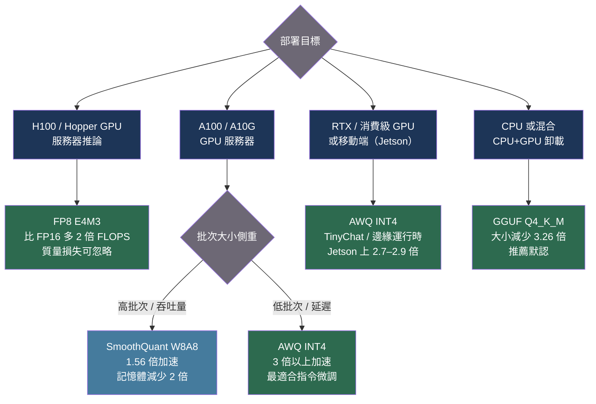

# [BEE-563] LLM 推論量化

:::info
量化將模型權重精度從 16 位浮點數降低到 4–8 位，將記憶體佔用減少 2–4 倍，在 GPU 上的推論延遲最高降低 4.5 倍——大多數 Llama 規模模型的困惑度（perplexity）退化不超過一個單位。選擇正確的量化方法取決於硬件、激活值是否與權重一起量化，以及部署目標是 GPU 服務器還是消費級 CPU。
:::

## 背景

BF16 格式的 Llama-3.1-70B 模型佔用 140 GB 的 GPU VRAM，需要兩張 H100 80 GB 才能提供服務。標準自回歸解碼受記憶體頻寬瓶頸限制（見 BEE-561）：GPU 每次前向傳遞的大部分時間花在從 HBM 加載權重，而非計算。降低權重精度直接減少每個 token 加載的字節數，從而減少每個 token 的時間。

2022–2024 年間，隨著模型超過單 GPU 容量，量化研究加速發展。三個不同的方法族應運而生，各自解決不同的約束：

**純權重量化（W4A16）：** 權重以 INT4 存儲；激活值保持 FP16。反量化在融合 CUDA 核心中實時進行。加速完全來自降低的記憶體頻寬。GPTQ（Frantar 等人，arXiv:2210.17323，ICLR 2023）將最優腦量化（OBQ）框架的二階 Hessian 信息應用於壓縮，可在單個 A100 上四個 GPU 小時內將 175B 模型壓縮到 INT4，推論速度提升 3.25 倍。AWQ（Lin 等人，arXiv:2306.00978，MLSys 2024 最佳論文）觀察到只有約 1% 的權重是「顯著的」——由輸入激活量級決定，而非權重量級——並開發了一種激活感知的按通道縮放方法，無需梯度計算即可保護這些權重。AWQ 在指令微調和多模態模型上的泛化性優於 GPTQ。

**權重和激活值量化（W8A8）：** 權重和激活值都量化為 INT8，可使用比 FP16 單元更快的硬件 INT8 GEMM 單元。挑戰在於 LLM 激活值在特定通道中包含大量異常值，超出 INT8 範圍。SmoothQuant（Xiao 等人，arXiv:2211.10438，ICML 2023）通過數學等價的離線變換解決了這一問題：將每個激活通道除以平滑因子 s，將對應的權重通道乘以 s。異常值量級從激活值（難以量化）遷移到權重（易於量化）。SmoothQuant 在 Llama-2-7B 上實現 W8A8，困惑度差值僅 +0.04，同時提供最高 1.56 倍的加速和 2 倍的記憶體降低。

**FP8：** NVIDIA H100 Tensor Core 原生支持 FP8 矩陣乘法（Micikevicius 等人，arXiv:2209.05433，2022）。E4M3 格式（4 位指數、3 位尾數，最大 ±448）用於前向傳遞中的權重和激活值；E5M2（更寬的動態範圍）用於訓練梯度。FP8 在 H100 上提供比 FP16/BF16 理論上多 2 倍的 FLOPS。與 INT8 不同，FP8 保留了浮點動態範圍，使每張量校準更簡單。

**CPU 和邊緣部署（GGUF）：** llama.cpp（Gerganov 等人，github.com/ggml-org/llama.cpp）引入了 k-quants——一種超級塊結構，其中每組權重都有自己的高精度縮放和最小值，以 6 位精度存儲。Q4_K_M 格式以 GGUF 容器存儲帶有 6 位縮放的 4 位權重，Llama-3.1-8B 的大小減少 3.26 倍（4.58 GiB 對比 FP16 的 14.96 GiB），困惑度接近原始水平。llama.cpp CPU 推論可在消費級硬件上部署，無需 CUDA GPU。

## 比較

| 方法 | 位數（W/A） | 對比 FP16 記憶體 | 典型加速倍數 | 困惑度差值（Llama-2-7B，WikiText-2） | 最適合 |
|---|---|---|---|---|---|
| FP16（基準） | 16/16 | 1x | 1x | 0（基準：5.474） | 默認 |
| SmoothQuant W8A8 | 8/8 | 減少 2 倍 | 1.56x | +0.04 | GPU 服務器，實際 INT8 GEMM |
| FP8 E4M3 | 8/8 | 減少 2 倍 | 最高 2x | 可忽略 | H100 生產推論 |
| GPTQ INT4 | 4/16 | 減少 4 倍 | 3.25x（A100） | 小幅增加 | GPU，延遲敏感 |
| AWQ INT4 | 4/16 | 減少 4 倍 | 3x 以上 | 略優於 GPTQ | GPU，指令微調模型 |
| GGUF Q4_K_M | 4.89/FP32 計算 | 減少 3.26 倍 | CPU 優化 | 小幅增加 | CPU/邊緣 |
| GGUF Q8_0 | 8.5/FP32 計算 | 減少 1.9 倍 | 中等 | 極小 | CPU，高質量要求 |

GPTQ 和 AWQ 是純權重量化：激活值保持 FP16，權重實時反量化。加速來自減少的記憶體頻寬。SmoothQuant 和 FP8 是真正的 W8A8：兩個操作數都被量化，可使用更快的硬件單元。GGUF 格式使用 FP32 計算和量化存儲，針對 CPU 吞吐量優化，而非 GPU FLOPS。

## 最佳實踐

### 根據部署目標選擇量化方法

**應該（SHOULD）** 在選擇量化格式前遵循以下決策樹：

1. **H100 GPU 服務器（生產）：** 使用 FP8。比 FP16 多 2 倍 FLOPS，質量損失可忽略，原生硬件支持。vLLM 的 `--quantization fp8` 配合 `--kv-cache-dtype fp8` 在 H100 上使用。
2. **A100/A10G GPU 服務器（舊硬件）：** 對記憶體瓶頸的單用戶延遲使用 AWQ INT4 或 GPTQ INT4。在 INT8 GEMM 吞吐量比單個請求速度更重要的大批次場景下使用 SmoothQuant W8A8。
3. **消費級 GPU（RTX 系列）或移動 GPU：** 使用 AWQ INT4。AWQ 在 RTX 4090 上比 HF FP16 快 3 倍以上，並支持邊緣部署（NVIDIA Jetson Orin），是首選。
4. **CPU 或混合 CPU+GPU 卸載：** 使用 GGUF Q4_K_M（推薦默認）。當質量是優先考慮時使用 Q5_K_M 或 Q6_K。VRAM 允許時使用 Q8_0 進行接近無損的 CPU 推論。

**不得（MUST NOT）** 在非 H100 硬件上應用 FP8 量化並期望加速——FP8 在 pre-Hopper GPU 上需要軟件模擬，比 INT8 更慢。

### 使用 vLLM 進行量化模型的 GPU 服務

**應該（SHOULD）** 為所有帶量化模型的 GPU 服務使用 vLLM。vLLM 原生支持 AWQ、GPTQ、FP8 和 bitsandbytes：

```python
from vllm import LLM, SamplingParams

# AWQ INT4——純權重量化，適合 A100/A10G 和消費級 GPU
llm = LLM(
    model="meta-llama/Llama-3.1-8B-Instruct-AWQ",  # 或本地 AWQ 檢查點
    quantization="awq",
    dtype="auto",
)

# 通過 GPTQModel 後端的 GPTQ INT4
llm = LLM(
    model="meta-llama/Llama-3.1-8B-Instruct-GPTQ-4bit",
    quantization="gptq",
    dtype="auto",
)

# H100 上的 FP8——權重和 KV 快取都在 FP8 中
llm = LLM(
    model="meta-llama/Llama-3.1-8B-Instruct",
    quantization="fp8",
    kv_cache_dtype="fp8",          # FP8 KV 快取也將 KV 記憶體減半
    dtype="bfloat16",              # 非量化操作保持 BF16
)

params = SamplingParams(temperature=0.0, max_tokens=256)
outputs = llm.generate(["用一段話解釋量化。"], params)
```

### 使用 AutoAWQ 或 GPTQModel 在本地量化模型

**應該（SHOULD）** 在使用尚未提供預量化版本的模型時，使用 GPTQModel（AutoGPTQ 的繼任者）進行 GPTQ 量化，使用 AutoAWQ 進行 AWQ 量化：

```python
# 使用 AutoAWQ 進行 AWQ 量化
from awq import AutoAWQForCausalLM
from transformers import AutoTokenizer

model_path = "meta-llama/Llama-3.1-8B-Instruct"
quant_path = "./Llama-3.1-8B-Instruct-AWQ"

tokenizer = AutoTokenizer.from_pretrained(model_path)
model = AutoAWQForCausalLM.from_pretrained(model_path, device_map="auto")

quant_config = {
    "zero_point": True,       # 非對稱量化——質量更好
    "q_group_size": 128,      # 每個量化組的權重數；越小質量越好，但開銷越大
    "w_bit": 4,               # 權重位數
    "version": "GEMM",        # GEMM 核心（用於批次推論）vs GEMV（單 token 解碼）
}

# 校準使用 Pile 中的 128 個隨機樣本——無需標籤
model.quantize(tokenizer, quant_config=quant_config)
model.save_quantized(quant_path)
tokenizer.save_pretrained(quant_path)
```

```python
# 使用 GPTQModel 進行 GPTQ 量化
from gptqmodel import GPTQModel, QuantizeConfig

model_path = "meta-llama/Llama-3.1-8B-Instruct"
quant_path = "./Llama-3.1-8B-Instruct-GPTQ-4bit"

quantize_config = QuantizeConfig(
    bits=4,
    group_size=128,     # 組大小越小質量越好；70B+ 模型建議 32 或 64
    desc_act=False,     # 激活順序；True 提升質量但減慢量化速度
)

model = GPTQModel.load(model_path, quantize_config=quantize_config)
# 校準數據集：WikiText-2、C4 或您的領域數據（128–512 個樣本）
model.quantize(calibration_dataset)
model.save(quant_path)
```

**組大小指南：** `group_size=128` 是標準默認值。對於記憶體緊張的 70B+ 模型，`group_size=64` 或 `group_size=32` 可以在增加約 5–10% 權重存儲的代價下顯著提升質量。對於 13B 以下的模型，`group_size=128` 通常足夠。

### 為 CPU 和邊緣推論部署 GGUF 模型

**應該（SHOULD）** 對 CPU 和混合設備部署使用 llama.cpp 或 Ollama。Q4_K_M 是推薦的默認格式；只有在困惑度測試顯示任務有明顯退化時才提升到 Q5_K_M 或 Q6_K：

```bash
# 從 HuggingFace 下載 GGUF 並使用 llama.cpp 運行
./llama-cli \
  -m ./Llama-3.1-8B-Instruct-Q4_K_M.gguf \
  -n 256 \
  -ngl 99 \        # 如果有 GPU，卸載 99 層到 GPU
  --temp 0.0 \
  -p "用一段話解釋量化。"

# 自行將本地 FP16 GGUF 量化為 Q4_K_M
./llama-quantize ./Llama-3.1-8B-Instruct-F16.gguf \
                 ./Llama-3.1-8B-Instruct-Q4_K_M.gguf \
                 Q4_K_M
```

**應該（SHOULD）** 在為新任務領域選擇 GGUF 量化級別前評估困惑度：

```bash
# llama.cpp 內置困惑度評估（WikiText-2）
./llama-perplexity \
  -m ./Llama-3.1-8B-Instruct-Q4_K_M.gguf \
  -f wikitext-2-raw/wiki.test.raw \
  --ctx-size 512 \
  --chunks 50

# 與 Q5_K_M 和 Q6_K 比較，決定質量提升是否值得增加的大小
```

### 部署前在您的任務上驗證量化模型質量

**必須（MUST）** 在代表性的生產查詢樣本上評估量化模型，而不僅僅是 WikiText-2 困惑度。困惑度衡量的是通用語言建模能力；指令遵循、代碼生成和領域特定任務可能出現不成比例的退化。

```python
def evaluate_quantization_quality(
    full_model_outputs: list[str],
    quantized_model_outputs: list[str],
    prompts: list[str],
) -> dict:
    """
    在任務特定提示上比較全精度與量化輸出。
    根據任務類型使用 LLM 作為評判者或精確匹配。
    """
    exact_matches = sum(
        f.strip() == q.strip()
        for f, q in zip(full_model_outputs, quantized_model_outputs)
    )
    return {
        "exact_match_rate": exact_matches / len(prompts),
        "n_prompts": len(prompts),
    }

# 經驗法則：如果精確匹配率相對全精度降低 15% 以上，
# 在部署前考慮更高的位寬或更大的組大小。
```

## 圖解



## 常見錯誤

**假設所有 INT4 方法等同。** GPTQ 基於 Hessian，校準每層重建誤差；在有足夠校準數據的情況下，對基礎模型可能更精確。AWQ 基於激活，對指令微調模型的泛化性更好，因為它不會過擬合校準集的 token 分布。兩者在所有設置下都沒有絕對優劣；應在您的具體模型和任務上分別測試。

**在 A100 或更舊 GPU 上應用 FP8 量化。** A100 沒有原生 FP8 GEMM 硬件。vLLM 在 pre-Hopper GPU 上會回退到 FP16 計算配合 FP8 存儲，提供記憶體節省但沒有速度提升。改用 INT4（GPTQ 或 AWQ）。

**在新工作中使用 AutoGPTQ。** AutoGPTQ 已於 2025 年 4 月歸檔。其繼任者 GPTQModel（github.com/ModelCloud/GPTQModel）是截至 2025 年與 HuggingFace Transformers 兼容的活躍維護工具。類似地，AutoAWQ 已於 2025 年 5 月棄用，維護工作轉移到 vLLM 項目。

**完全跳過校準並使用隨機數據。** GPTQ 和 AWQ 都需要少量校準集（128–512 個樣本）來確定量化參數。使用隨機噪聲作為校準數據會產生最小化隨機分布誤差的量化，而非您實際輸入分布的誤差。使用代表生產查詢的樣本，或至少使用 WikiText-2 / C4。

**對所有模型大小設置 `group_size=128`。** 組大小是質量-存儲的權衡：更大的組（更少的縮放因子）節省記憶體但積累更多量化誤差。對於已經很大的 70B+ 模型，`group_size=32` 或 `group_size=64` 可以以略微增加存儲（幾個百分點）的代價顯著改善困惑度。對於 7–13B 模型，`group_size=128` 通常足夠。

**在未測試的情況下將量化與投機解碼結合。** 基於 EAGLE 的投機解碼（BEE-561）使用在基礎模型隱藏狀態上訓練的草稿頭。如果目標模型被量化（特別是 AWQ 或 GPTQ），隱藏狀態分布會發生偏移。啟用量化後始終測試接受率（BEE-561 的 `SpecDecMetrics`）；如果接受率降至 0.6 以下，可能需要在量化模型上重新訓練草稿頭。

## 相關 BEE

- [BEE-30021](llm-inference-optimization-and-self-hosting.md) -- LLM 推論優化與自托管：量化所屬的更廣泛優化領域
- [BEE-30059](speculative-decoding-for-llm-inference.md) -- LLM 推論的投機解碼：與量化隱藏狀態交互；量化後需驗證接受率
- [BEE-30060](multi-lora-serving-and-adapter-management.md) -- Multi-LoRA 服務與適配器管理：FP16 訓練的 LoRA 適配器必須反量化以匹配適配器原始精度；vLLM 自動處理此問題

## 參考資料

- [Frantar et al. GPTQ: Accurate Post-Training Quantization for Generative Pre-trained Transformers — arXiv:2210.17323, ICLR 2023](https://arxiv.org/abs/2210.17323)
- [Lin et al. AWQ: Activation-aware Weight Quantization for LLM Compression and Acceleration — arXiv:2306.00978, MLSys 2024](https://arxiv.org/abs/2306.00978)
- [Xiao et al. SmoothQuant: Accurate and Efficient Post-Training Quantization for Large Language Models — arXiv:2211.10438, ICML 2023](https://arxiv.org/abs/2211.10438)
- [Micikevicius et al. FP8 Formats for Deep Learning — arXiv:2209.05433, 2022](https://arxiv.org/abs/2209.05433)
- [Gerganov et al. llama.cpp — github.com/ggml-org/llama.cpp](https://github.com/ggml-org/llama.cpp)
- [casper-hansen. AutoAWQ — github.com/casper-hansen/AutoAWQ](https://github.com/casper-hansen/AutoAWQ)
- [ModelCloud. GPTQModel（AutoGPTQ 繼任者）— github.com/ModelCloud/GPTQModel](https://github.com/ModelCloud/GPTQModel)
- [HuggingFace. GGUF 格式文檔 — huggingface.co/docs/hub/en/gguf](https://huggingface.co/docs/hub/en/gguf)
