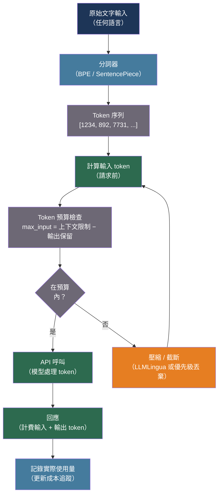

# [BEE-30051] LLM 分詞內部機制與 Token 預算管理

:::info
每次 LLM API 呼叫都以 token 計費，而非字元或詞彙 — 了解分詞器如何將文字轉換為整數序列、為何中日韓語言的費用是英文的 2-3 倍，以及如何在發送請求前計算 token 數，可防止預算超支、上下文視窗溢位和靜默截斷錯誤。
:::

## 背景脈絡

Token（詞元）是語言模型計算的原子單位：模型讀取 token、生成 token，並按 token 計費。Token 不是詞彙、字元或位元組 — 它是頻繁字元序列的學習壓縮表示。從文字到 token 的映射由分詞器決定，這是與語言模型本身分開訓練的元件。

Sennrich、Haddow 和 Birch（2016，arXiv:1508.07909，ACL 2016）將字節對編碼（BPE，Byte-Pair Encoding）引入為神經機器翻譯的主流分詞演算法。BPE 從字元詞彙表開始，反覆合併最頻繁的相鄰 token 對，建立子詞單元詞彙表。擁有 50,000 次合併的 BPE 詞彙表幾乎可以高效涵蓋所有英文文字：常見詞彙成為單一 token（「hello」），罕見詞彙被拆分為子詞（「tokenization」→「token」+「ization」），未知字元則回退到位元組。

Kudo 和 Richardson（2018，arXiv:1808.06226，EMNLP 2018）引入了 SentencePiece，直接對原始未分段文字應用 BPE（或 Unigram 語言模型），無需空格預分詞。這對無詞界的語言至關重要：中文、日文和韓文（CJK）書寫時詞語之間沒有空格，對個別字元應用 BPE 而不使用語言感知預分詞器會產生效率極低的分詞結果。GPT-4 的 `cl100k_base` 詞彙表有約 100,000 個槽位；僅 CJK 統一表意文字區塊就包含 97,000 多個字元，迫使大多數 CJK 字元消耗多個 token。結果：一個傳達相同含義的中文句子比英文句子多花費 1.7-2.4 倍的 token。

對後端工程師而言，這有直接的運營後果。假設 token 與字元比例均勻的多語言應用程式將低估非拉丁文字輸入的成本並溢出上下文視窗。計算英文字元數除以四（常被引用的 4 字元/token 啟發式方法）對程式碼（更高的特殊字元密度）、JSON（括號和引號開銷）以及任何非拉丁文字都是錯誤的。唯一安全的做法是在發送請求前使用 API 使用的同一分詞器計算 token。

## 最佳實踐

### 在每次 API 呼叫前使用模型自身的分詞器計算 Token

**必須**（MUST）使用實際分詞器計算 token，而非從字元數估算，適用於任何對上下文敏感的應用程式。4 字元/token 啟發式方法對英文有約 25% 的誤差，對 CJK 內容可超過 200% 的誤差：

```python
import anthropic
import tiktoken
from functools import lru_cache

# --- Anthropic：透過 API 計算（精確，考慮工具和圖片）---

async def count_tokens_anthropic(
    messages: list[dict],
    system: str,
    model: str = "claude-sonnet-4-20250514",
    tools: list[dict] | None = None,
) -> int:
    """
    在發送真實請求前使用 Anthropic 的 token 計算端點。
    這是獲取精確計數的唯一方式，包含工具定義
    和 API 內部注入的特殊 token。
    計算端點是免費的，並有其自己的（寬鬆的）速率限制。
    """
    client = anthropic.AsyncAnthropic()
    params = {
        "model": model,
        "system": system,
        "messages": messages,
        "max_tokens": 1,   # 必填欄位，計算時值無關緊要
    }
    if tools:
        params["tools"] = tools

    result = await client.messages.count_tokens(**params)
    return result.input_tokens

# --- OpenAI：透過 tiktoken 計算（本地，無需 API 呼叫）---

@lru_cache(maxsize=4)
def get_encoding(model: str):
    """快取編碼物件 — 它們的構建成本很高。"""
    try:
        return tiktoken.encoding_for_model(model)
    except KeyError:
        return tiktoken.get_encoding("cl100k_base")

def count_tokens_openai(
    messages: list[dict],
    model: str = "gpt-4o",
) -> int:
    """
    使用 tiktoken 計算 OpenAI 聊天訊息的 token 數。
    每條訊息有 3 個固定開銷 token（角色 + 內容分隔符）。
    每個回覆額外預備 3 個 token。
    """
    enc = get_encoding(model)
    n_tokens = 3   # 回覆預備
    for message in messages:
        n_tokens += 3  # 每條訊息開銷
        for key, value in message.items():
            if isinstance(value, str):
                n_tokens += len(enc.encode(value))
            if key == "name":
                n_tokens += 1  # 根據 OpenAI 規格，name 欄位有 -1 偏移
    return n_tokens
```

**應該**（SHOULD）在相同的提示元件重複發送時快取 token 計算結果。不在請求間變動的系統提示和工具定義可以在啟動時計算一次。

### 保留輸出預算並強制執行嚴格的輸入限制

**不得**（MUST NOT）將整個上下文視窗分配給輸入，不為模型生成完整回應留空間。在句子中途達到 `max_tokens` 的模型會產生截斷的回應，這通常比沒有回應更令人困惑：

```python
from dataclasses import dataclass, field

CONTEXT_LIMITS = {
    "claude-sonnet-4-20250514": 200_000,
    "claude-haiku-4-5-20251001": 200_000,
    "gpt-4o": 128_000,
    "gpt-4o-mini": 128_000,
}

@dataclass
class TokenBudget:
    model: str
    max_output: int = 4_096

    @property
    def total(self) -> int:
        return CONTEXT_LIMITS.get(self.model, 128_000)

    @property
    def max_input(self) -> int:
        return self.total - self.max_output

    def check(self, input_tokens: int) -> None:
        if input_tokens > self.max_input:
            raise ValueError(
                f"輸入（{input_tokens} tokens）超過預算 "
                f"（{self.max_input} = {self.total} − {self.max_output} 保留給輸出）"
            )

    def remaining(self, input_tokens: int) -> int:
        return max(0, self.max_input - input_tokens)
```

### 處理特定語言的 Token 膨脹

**應該**（SHOULD）在估算多語言內容的 token 預算時應用語言感知成本乘數。使用實際 token 計數以求精確，但這些乘數對容量規劃有用：

```python
# 相對於英文基準的每字元 token 比率（經驗值）
# 源自 OpenAI cl100k_base 分詞器對典型散文的分析
LANGUAGE_TOKEN_MULTIPLIERS = {
    "en": 1.0,         # ~4 字元/token
    "es": 1.4,         # 西班牙文：重音符號導致每個詞更多 token
    "ru": 2.1,         # 俄文西里爾字母：~2 字元/token
    "he": 2.3,         # 希伯來文
    "zh": 1.8,         # 普通話中文：大多數字元需要 2-3 個 token
    "ja": 2.1,         # 日文（漢字、假名、羅馬字混合）
    "ko": 2.4,         # 韓文諺文
    "ar": 2.0,         # 阿拉伯文
}

def estimate_tokens(text: str, language: str = "en") -> int:
    """
    使用字元數和語言乘數進行粗略估算。
    使用分詞器 API 以求精確；使用此方法進行容量規劃。
    英文：~4 字元/token。CJK：~1.5-2 字元/token（更高的 token 密度）。
    """
    chars = len(text)
    multiplier = LANGUAGE_TOKEN_MULTIPLIERS.get(language, 1.5)
    base_estimate = chars / 4   # 英文基準
    return int(base_estimate * multiplier)

def warn_if_expensive(text: str, language: str, budget_tokens: int) -> None:
    estimate = estimate_tokens(text, language)
    if estimate > budget_tokens * 0.8:
        ratio = LANGUAGE_TOKEN_MULTIPLIERS.get(language, 1.5)
        print(
            f"警告：{language} 內容估計為 {estimate} tokens "
            f"（英文的 {ratio:.1f} 倍）。"
            f"考慮在發送前壓縮。"
        )
```

**應該**（SHOULD）記錄 API 回應中的實際 token 計數，並將其與預發送估算進行比較。系統性低估（>20% 誤差）表明估算模型需要針對該內容類型或語言重新校準。

### 在生產環境中防範分詞邊緣情況

**不得**（MUST NOT）假設相同字串在不同模型或供應商間產生相同的 token 計數。Token 詞彙表有所不同：

```python
def token_count_audit(
    text: str,
    models: list[tuple[str, str]] = None,   # [(model_name, encoding_name)]
) -> dict[str, int]:
    """
    比較相同文字在不同編碼間的 token 計數。
    在部署到新模型前審計提示時很有用。
    顯著差異表明提示需要重新計算預算。
    """
    if models is None:
        models = [
            ("gpt-3.5 (cl100k)", "cl100k_base"),
            ("gpt-4o (o200k)", "o200k_base"),
        ]

    results = {}
    for name, encoding_name in models:
        enc = tiktoken.get_encoding(encoding_name)
        results[name] = len(enc.encode(text))
    return results

# 在 CI 中測試的已知邊緣情況：
TOKENIZATION_EDGE_CASES = [
    "Hello, world!",        # 基本英文
    "你好，世界！",            # 中文 — 預期為英文計數的 3-4 倍
    "SELECT * FROM users WHERE id = 1;",   # SQL — 特殊字元膨脹
    "https://example.com/very/long/url?param=value&other=thing",  # URL
    '{"key": "value", "nested": {"array": [1, 2, 3]}}',           # JSON
    "    " * 10,             # 空白：BPE 可能以非預期方式處理
]
```

## 視覺化



## 分詞器比較

| 分詞器 | 演算法 | 使用者 | CJK 效率 | 來源 |
|---|---|---|---|---|
| cl100k_base | BPE（字節級） | GPT-3.5、GPT-4 | 差（3× 英文） | tiktoken |
| o200k_base | BPE（字節級，更大詞彙表） | GPT-4o | 略有改善 | tiktoken |
| Anthropic（專有） | BPE 變體 | Claude 模型 | 與 cl100k 類似 | API 計算端點 |
| SentencePiece（Llama） | 對原始文字的 BPE | Llama、Gemma | 優於 cl100k | HuggingFace |
| WordPiece | 最大似然 | BERT 系列 | 差 | HuggingFace |

## 常見錯誤

**使用字元數除以四作為 token 預算。** 這個啟發式方法對 CJK 內容誤差達 200-300%，對程式碼和 JSON 誤差達 30-50%。請始終使用分詞器。

**不保留輸出 token。** 有 200,000 token 上下文視窗但輸入 199,500 token，只剩 500 個輸出 token — 模型無法產生完整回應。至少保留 1 倍的預期輸出長度。

**假設 token 計數在模型版本間穩定。** OpenAI 隨 GPT-4o 引入了 `o200k_base`，相對於 `cl100k_base` 改變了某些輸入的計數。適合 GPT-4 上下文的提示在新模型中可能不適合（如果編碼改變）。

**不記錄 API 回應中的實際 token 使用量。** 每個回應都包含使用的精確輸入和輸出 token 計數。將實際值與估算值比較是在上下文溢位發生前檢測系統性分詞器差異的唯一方法。

## 相關 BEE

- [BEE-30047](llm-prompt-compression-and-token-efficiency.md) -- LLM 提示壓縮與 Token 效率：當 token 計數超過預算時應用的壓縮技術
- [BEE-30010](llm-context-window-management.md) -- LLM 上下文視窗管理：長對話的滑動視窗和記憶策略
- [BEE-30011](ai-cost-optimization-and-model-routing.md) -- AI 成本優化與模型路由：將請求路由到較小模型以降低 token 成本

## 參考資料

- [Sennrich 等人 用子詞單元進行罕見詞彙的神經機器翻譯 — arXiv:1508.07909，ACL 2016](https://arxiv.org/abs/1508.07909)
- [Kudo 和 Richardson。SentencePiece：簡單且語言無關的子詞分詞器 — arXiv:1808.06226，EMNLP 2018](https://arxiv.org/abs/1808.06226)
- [OpenAI tiktoken — github.com/openai/tiktoken](https://github.com/openai/tiktoken)
- [Anthropic Token 計算 API — platform.claude.com](https://platform.claude.com/docs/en/api/messages-count-tokens)
- [HuggingFace 分詞器摘要 — huggingface.co](https://huggingface.co/docs/transformers/tokenizer_summary)
