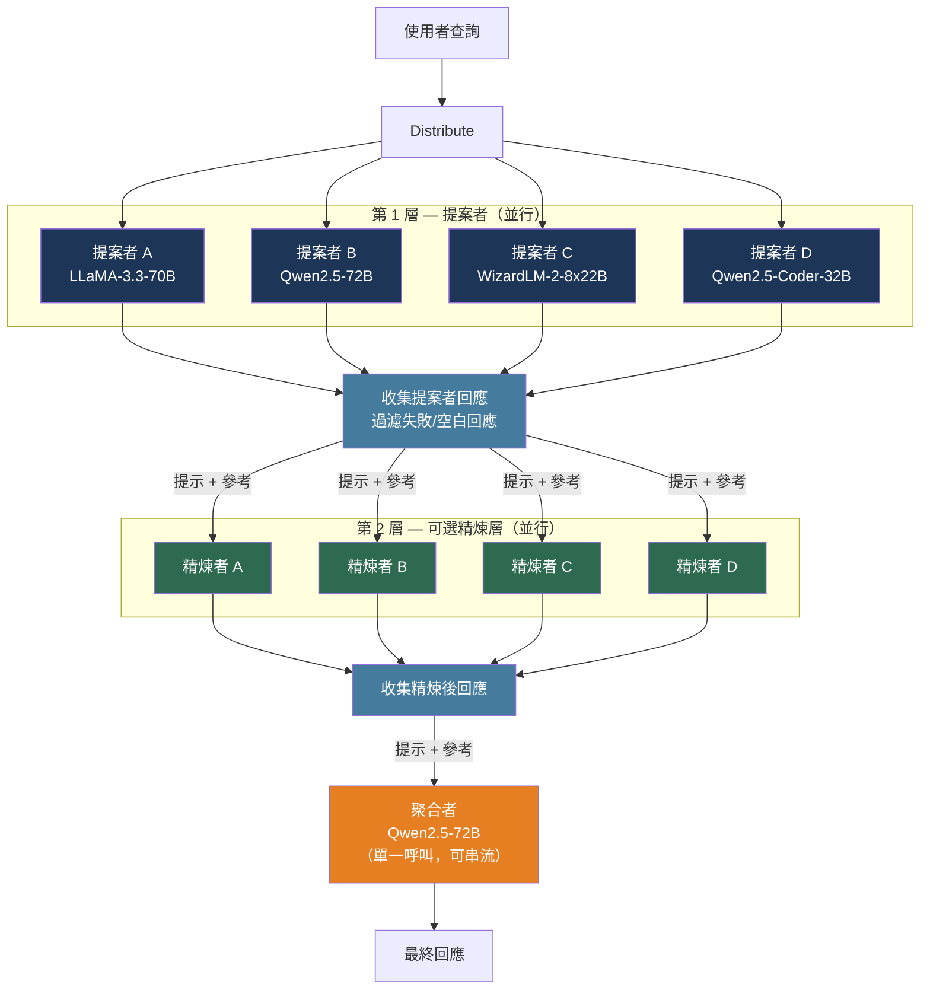

# [BEE-30076] 混合代理人架構（Mixture of Agents）

:::info
混合代理人（Mixture of Agents，MoA）將單一使用者查詢並行路由到多個 LLM，再由最終模型將這些回應合成為一個答案。藉由利用「LLM 在看到其他模型的回應後能產生更高品質輸出」的實證觀察，MoA 實現了超越設定中任何單一模型的品質——代價是更高的延遲與等比例增加的 API 呼叫次數。
:::

## 情境

多代理人辯論、集成採樣和排序選擇各自探索了結合 LLM 輸出的一個狹窄面向。Wang 等人（arXiv:2406.04692，Together AI，2024 年 6 月）提出的混合代理人建立在一個更根本的實證發現上：**LLM 的協作性（collaborative nature）**。當呈現其他模型的回應時——即使是較弱的模型——LLM 可靠地生成比只接收原始提示更高品質的回應。這個效應在所有被測試的模型中都成立，且並非模型只是選出最佳輸入；受控分析確認聚合者（aggregator）執行的是真正的合成，而非選擇。

實際結果是：一組廉價開源模型的協作流程可以集體超越單個昂貴的專有模型。論文的核心結果：僅使用開源模型的 MoA 在 AlpacaEval 2.0 上達到 65.1% 的長度控制勝率，而 GPT-4o 單獨使用僅有 57.5%——7.6 個百分點的絕對提升。在 MT-Bench 上，以 GPT-4o 作為最終聚合者的 MoA 得分 9.40，而單獨使用 GPT-4o 為 9.19。

MoA 在工程上的獨特挑戰不在品質——結果已很明確——而在延遲：系統在最後一個聚合層完成之前無法輸出第一個 token。這使 MoA 適合批次、非同步或高價值的單輪任務，而不適合首字元延遲（time-to-first-token）主導使用者體驗的即時互動式對話。

## 架構

### 角色：提案者與聚合者

MoA 定義了兩種功能上截然不同的角色：

**提案者（Proposers）**為原始提示生成初始回應。良好的提案者能貢獻多元視角和詳細內容；它不需要有最高的單獨品質。論文中 WizardLM 被列為出色的提案者，正是因為它能產生全面、豐富的回應，為聚合者提供豐富的合成素材，即使它作為聚合者表現不佳。關鍵特性是**多樣性**：以高溫度多次執行同一模型所帶來的效益，遠不如使用不同模型。

**聚合者（Aggregators）**接收原始提示加上所有提案者的回應，並將其合成為一個更高品質的輸出。聚合者在面對低品質或錯誤的輸入時必須保持穩定——它必須批判性地評估，而非照抄錯誤資訊。論文將 GPT-4o、Qwen1.5-110B-Chat 和 LLaMA-3-70B-Instruct 列為強大的聚合者。

模型可以在不同層中同時承擔提案者和聚合者的角色。論文的消融研究顯示，提案者模型的多樣性比其個別品質更重要。

### 層次結構

MoA 將代理人組織成多層：

- **第 1 層**：`n` 個提案者模型各自接收原始提示並生成獨立回應（全部並行）
- **第 2 至 l−1 層**（可選的精煉層）：每個代理人接收原始提示加上前一層的所有回應；生成精煉後的回應
- **最終層**：單一聚合者接收原始提示加上前一層的所有回應，生成最終輸出

論文中的參考配置：
- **MoA**（最高品質）：3 層，每層 6 個提案者，Qwen1.5-110B-Chat 作為最終聚合者
- **MoA w/ GPT-4o aggregator**：相同結構，GPT-4o 作為最終聚合者（AlpacaEval 2.0 達 65.7%）
- **MoA-Lite**（成本最佳化，2 層）：6 個提案者，Qwen1.5-72B-Chat 聚合者（59.3%，在相當於 GPT-4o 成本的情況下提升 1.8 個百分點）

### 聚合提示

聚合提示作為系統訊息插入對話開頭。參考實作中使用的確切文字（翻譯供參考）：

```
您收到了各種開源模型針對最新使用者查詢的一組回應。您的任務是將這些回應合成
為一個高品質的回應。關鍵在於批判性地評估這些回應中提供的資訊，認識到其中一
些可能存在偏差或不正確。您的回應不應僅僅複製給定的答案，而應提供一個精煉、
準確且全面的回覆。確保您的回應結構良好、連貫，並符合最高的準確性和可靠性標準。

模型的回應：
1. {提案者回應_1}
2. {提案者回應_2}
...
n. {提案者回應_n}
```

## 實作

### 單層 MoA 與並行提案者

核心實作：並行觸發所有提案者呼叫，收集結果，然後進行單一聚合呼叫：

```python
import asyncio
from openai import AsyncOpenAI

PROPOSER_MODELS = [
    "meta-llama/Llama-3.3-70B-Instruct-Turbo",
    "Qwen/Qwen2.5-72B-Instruct-Turbo",
    "Qwen/Qwen2.5-Coder-32B-Instruct",
    "microsoft/WizardLM-2-8x22B",
]
AGGREGATOR_MODEL = "Qwen/Qwen2.5-72B-Instruct-Turbo"

AGGREGATION_SYSTEM = """您收到了各種模型針對最新使用者查詢的一組回應。您的任務是將這些回應合成為 \
一個高品質的回應。批判性地評估所提供的資訊——其中一些可能存在偏差或不正確。 \
不要簡單地複製給定的答案；提供一個精煉、準確且全面的回覆。

模型的回應：
{references}"""

async def call_proposer(
    client: AsyncOpenAI,
    model: str,
    messages: list[dict],
) -> str:
    for attempt in range(3):
        try:
            response = await client.chat.completions.create(
                model=model,
                messages=messages,
                temperature=0.7,
                max_tokens=512,
            )
            return response.choices[0].message.content or ""
        except Exception:
            if attempt == 2:
                return ""  # 所有重試失敗則從聚合中排除
            await asyncio.sleep(2 ** attempt)
    return ""

def build_aggregation_messages(
    original_messages: list[dict],
    proposer_responses: list[str],
) -> list[dict]:
    """將提案者回應以編號列表形式注入系統訊息。"""
    valid_responses = [r for r in proposer_responses if r]
    references = "\n".join(
        f"{i + 1}. {resp}" for i, resp in enumerate(valid_responses)
    )
    aggregation_system = AGGREGATION_SYSTEM.format(references=references)

    existing_system = next(
        (m["content"] for m in original_messages if m["role"] == "system"), None
    )
    new_system = (
        f"{existing_system}\n\n{aggregation_system}"
        if existing_system
        else aggregation_system
    )

    non_system = [m for m in original_messages if m["role"] != "system"]
    return [{"role": "system", "content": new_system}] + non_system

async def moa_generate(
    client: AsyncOpenAI,
    messages: list[dict],
    num_rounds: int = 1,  # 最終聚合前的精煉層數
) -> str:
    """
    以 `num_rounds` 個精煉層加上最終聚合通道執行 MoA。
    總層數 = num_rounds + 1。預設（num_rounds=1）相當於 MoA-Lite。
    """
    current_messages = messages

    for _ in range(num_rounds):
        # 每層所有提案者並行執行
        proposer_tasks = [
            call_proposer(client, model, current_messages)
            for model in PROPOSER_MODELS
        ]
        proposer_responses = await asyncio.gather(*proposer_tasks)

        # 將提案者輸出注入下一層的聚合提示
        current_messages = build_aggregation_messages(messages, list(proposer_responses))

    # 最終聚合呼叫（同步，可啟用串流以改善 UX）
    final_response = await client.chat.completions.create(
        model=AGGREGATOR_MODEL,
        messages=current_messages,
        temperature=0.7,
        max_tokens=2048,
        stream=False,
    )
    return final_response.choices[0].message.content or ""
```

### 延遲模型

每層延遲等於最慢提案者的延遲（因為提案者是並行的），而非總和：

```
總延遲 ≈ (層數 × 每層最大提案者延遲) + 聚合者延遲
```

對於 2 層 MoA，4 個提案者，每個提案者呼叫需 3–6 秒，聚合者需 5 秒，預期總牆鐘時間約為：

```
牆鐘時間 ≈ max(3, 4, 5, 3) 秒   # 第 1 層提案者並行
          + max(3, 4, 5, 3) 秒   # 第 2 層提案者並行
          + 5 秒                  # 最終聚合
          ≈ 15–17 秒
```

相比之下，單一 GPT-4o 呼叫約需 3–8 秒。MoA-Lite 以 2–3 倍的延遲換取品質提升。

### 上下文窗口預算

每個提案者回應（最多 512 個 token）會將聚合者的輸入擴大 512 個 token。6 個提案者下，聚合提示每層增加約 3,000 個 token：

```python
def estimate_aggregator_context(
    original_prompt_tokens: int,
    num_proposers: int,
    proposer_max_tokens: int = 512,
    num_layers: int = 2,
) -> int:
    """
    估算聚合者輸入上下文大小，用於上下文限制檢查。
    每層將 proposer_max_tokens × num_proposers 加入提示。
    """
    proposer_overhead = num_proposers * proposer_max_tokens * num_layers
    return original_prompt_tokens + proposer_overhead

# 範例：6 個提案者，每個 512 token，3 層，500 token 提示
# = 500 + (6 × 512 × 3) = 500 + 9,216 ≈ 9,700 個 token 輸入給聚合者
```

選擇上下文窗口至少與此估算值一樣大的聚合者。對於使用 6 個提案者的 3 層 MoA 和長篇問題，聚合者上下文例行地超過 10,000 個 token。

## 最佳實踐

### 使用多樣化的模型，而非同一模型的多個採樣

**MUST**（必須）使用真正不同的模型作為提案者。論文的消融研究顯示，6 個多樣化提案者在 AlpacaEval 2.0 上達到 61.3%，而同一模型的 6 個採樣僅達到 56.7%——4.6 個百分點的差距，幾乎抵消了增加提案者數量的大部分效益。模型多樣性（不同架構、訓練資料、微調目標）提供聚合者能合成為更優於任何個體的互補視角。以不同溫度使用相同模型是一種效果較差的替代方案。

### 根據查詢複雜度選擇性地路由到 MoA

**SHOULD**（建議）僅對能夠證明延遲和成本開銷合理的查詢應用 MoA。簡單的事實查詢、分類任務和短格式補全不太可能從六個模型的合成中獲得有意義的收益。候選路由信號：

- 查詢需要深度推理、多步驟分析或長篇生成
- 風險很高（法律、醫療、財務決策）
- 任務是非同步且對延遲不敏感的（批次文件處理、報告生成）
- 已記錄的單一模型輸出與所需品質之間的歷史品質差距

**SHOULD NOT**（不建議）對首字元延遲必須低於 2–3 秒的即時互動 UX 應用 MoA。MoA 不可避免的延遲（多個序列 API 呼叫）無法滿足此限制。

### 從聚合中排除失敗的提案者回應

**MUST** 在建立聚合提示之前，過濾掉空的、截斷的或錯誤的提案者回應。將錯誤訊息或空字串傳遞給聚合者會污染合成上下文。在將提案者呼叫視為失敗之前，實作指數退避重試邏輯（1、2、4 秒）：

```python
def filter_valid_responses(responses: list[str]) -> list[str]:
    """移除空白或非常短的回應，這些通常表示失敗。"""
    return [r for r in responses if r and len(r.strip()) > 20]
```

只要至少有兩個提案者提供有效回應，即使部分提案者失敗也繼續進行聚合。提供每個模型失敗率的指標以監控基礎設施健康狀況。

### 將聚合提示與使用者提示分離

**SHOULD** 將聚合系統提示維護為獨立於面向使用者的系統提示的版本化成品。聚合指令獨立於應用程式行為而變化：您可能需要針對簡潔性、領域特殊性或引用格式進行調整，而無需修改應用程式邏輯。將其存儲在提示登錄中（參見 [BEE-30028](prompt-management-and-versioning.md)）並獨立進行版本控制。

### 監控輸出的冗長退化

**SHOULD** 分別追蹤輸出長度和簡潔性指標，與品質指標分開。論文自身的評估顯示，MoA 在簡潔性上的得分低於單一模型輸出——合成答案傾向於融入多個提案者的內容，因此更長。如果應用程式需要簡潔的輸出，請在聚合提示中添加明確的長度限制，或在聚合後應用壓縮步驟。

## 視覺化



## 常見錯誤

**以同一模型的多個實例作為提案者。** 以不同溫度執行同一模型的四個實例，所帶來的效益遠不如四個真正不同的模型。品質提升來自合成多樣視角，而非集成方差。如果只能訪問一個模型，具多數投票的自一致性（BEE-30041）是更簡單的替代方案。

**將 MoA 應用於延遲敏感的互動 UX。** 具有 4 個提案者的 2 層 MoA 的首字元延遲通常為 10–20 秒——至少兩輪並行 API 呼叫的總和。這對於文件處理流水線和批次作業是可以接受的；對於使用者期望在 2–3 秒內開始串流的聊天 UI 則不可接受。互動式場景路由到單一模型；在離線或背景佇列中使用 MoA。

**忽略上下文窗口增長。** 每個提案者為聚合者的系統提示添加最多 512 個 token。有 6 個提案者和 3 層時，聚合者在原始提示之上接收約 9,200 個 token 的參考內容。如果在流水線設計時未進行預算規劃，這可能導致上下文限制溢出的 `invalid_request_error`。選擇上下文窗口能夠輕鬆容納計算開銷的聚合者。

**將 AlpacaEval 2.0 數字視為普遍品質主張。** AlpacaEval 2.0 使用 GPT-4 作為評估者，這可能偏向風格上類似於 GPT-4 自身輸出的結果。MoA 基準測試來自 2024 年 6 月；此後，許多模型（Claude 3.5 Sonnet、Gemini 2.0、Llama 3.3）已縮小或逆轉了使 MoA 成為必要的單一模型差距。請針對您的目標任務領域對 MoA 進行基準測試，而非僅依賴聚合排行榜分數。

**將聚合錯誤傳遞給下游系統。** 當聚合者的上下文限制被超過或 API 失敗時，流水線必須優雅地降級——退回到最佳的單一提案者回應，而非將錯誤或空字串作為 MoA 輸出向下傳遞。

## 相關 BEE

- [BEE-30041](llm-self-consistency-and-ensemble-sampling.md) -- LLM 自一致性與集成採樣：從單一模型生成多個採樣並以多數投票聚合；概念上更簡單，但缺乏使 MoA 有效的跨模型多樣性
- [BEE-30045](multi-agent-debate-and-critique-patterns.md) -- 多代理人辯論與批判模式：代理人進行迭代對抗式回合（「針鋒相對」）以達成共識；與 MoA 的建設性合成方法互補——辯論揭示分歧，MoA 整合視角
- [BEE-30011](ai-cost-optimization-and-model-routing.md) -- AI 成本最佳化與模型路由：將個別查詢路由到能夠回答的最廉價模型（級聯/FrugalGPT 方法）；MoA 和路由是互補的——使用路由決定 MoA 是否合理，當品質比成本更重要時再使用 MoA
- [BEE-30028](prompt-management-and-versioning.md) -- 提示管理與版本控制：聚合提示是需要獨立版本控制的一等成品；將其視為提示登錄條目，而非行內程式碼
- [BEE-30002](ai-agent-architecture-patterns.md) -- AI 代理人架構模式：MoA 是一種特定的、狹義的多代理人拓撲；代理人通訊、記憶體和工具使用的更廣泛設計空間在此處涵蓋

## 參考資料

- [Wang 等人，「Mixture-of-Agents 增強大型語言模型能力」— arXiv:2406.04692](https://arxiv.org/abs/2406.04692)
- [MoA 論文（HTML 全文）— arxiv.org/html/2406.04692](https://arxiv.org/html/2406.04692)
- [Together AI MoA 參考實作 — github.com/togethercomputer/MoA](https://github.com/togethercomputer/MoA)
- [Together AI 部落格：Mixture of Agents — together.ai/blog/together-moa](https://together.ai/blog/together-moa)
- [Jiang 等人，LLM-Blender：以配對排序和生成式融合集成 LLM（ACL 2023）— arXiv:2306.02561](https://arxiv.org/abs/2306.02561)
- [LLM-Blender ACL 論文集 — aclanthology.org/2023.acl-long.792](https://aclanthology.org/2023.acl-long.792)
- [Chen 等人，FrugalGPT：級聯 LLM 以達到成本/品質取捨 — arXiv:2305.05176](https://arxiv.org/abs/2305.05176)
- [Liang 等人，多代理人辯論促進發散思維（EMNLP 2024）— arXiv:2305.19118](https://arxiv.org/abs/2305.19118)
- [Du 等人，透過多代理人辯論提高事實性 — arXiv:2305.14325](https://arxiv.org/abs/2305.14325)
