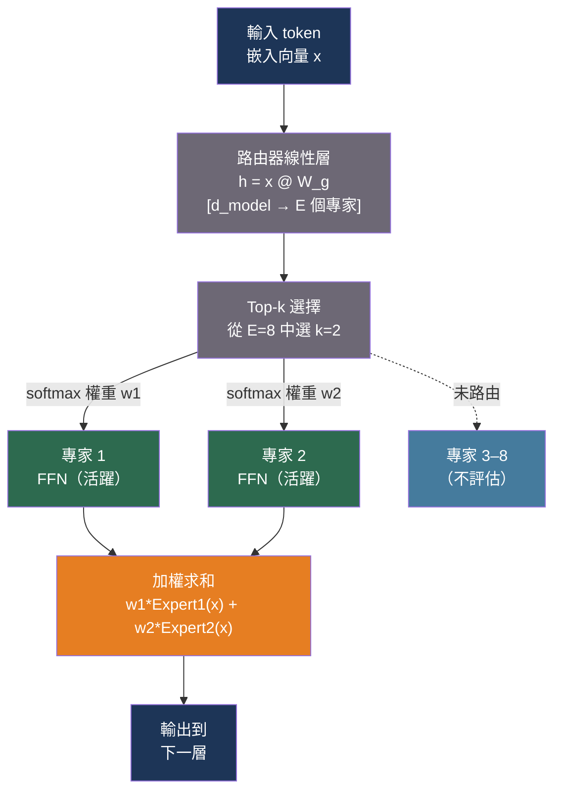

# [BEE-30064] 混合專家架構與服務

:::info
混合專家（Mixture of Experts，MoE）將密集前饋層替換為一組專門子網絡（專家）和一個路由器，路由器每個 token 只選擇其中一小部分。結果是一個總參數量龐大但每次前向傳遞激活參數量很少的模型——以推論計算量的一小部分實現密集模型的質量。
:::

## 背景

密集 Transformer 模型為每個 token 激活所有參數。一個 700 億參數的模型在訓練過程中的每個 token 以及每個推論 token 上都執行 700 億參數規模的計算。隨著模型向萬億參數增長，密集擴展的計算成本變得難以承受。

混合專家通過使前饋計算稀疏來解決這一問題。每個 FFN 層被替換為 E 個專家 FFN 加上一個輕量級路由器。路由器將每個 token 分配給 E 個專家中的 k 個（通常 k=1 或 k=2）；其他 E−k 個專家不被評估。總參數量隨 E 增長，但每個 token 的活躍計算隨 k 增長，而非 E。

**Switch Transformer**（Fedus、Zoph 和 Shazeer，arXiv:2101.03961，JMLR 2022）是第一個大規模稀疏 MoE LLM。它使用 top-1 路由（每個 token 到恰好一個專家），在等效計算下比 T5-XXL 預訓練快 4 倍。它引入了兩個關鍵機制：容量因子（限制每批次任何一個專家處理的 token 數，超出的 token 被丟棄）和輔助負載均衡損失（懲罰不均衡的專家路由）。沒有輔助損失，專家會崩潰：反饋迴路使路由器偏愛少數幾個專家，這些專家訓練更快，被進一步偏愛，最終其他專家停止學習。

**Mixtral 8x7B**（Jiang 等人，arXiv:2401.04088，2024）使 MoE 在開源服務中變得實用。其架構：每個 FFN 層 8 個專家，top-2 路由（每個 token 在每層由 8 個專家中的 2 個處理），總計 467 億參數，但每個 token 只有 129 億活躍參數。Mixtral 在 MMLU（70.6 對 68.9）和 HumanEval（40.2 對 37.5）上超過 LLaMA-2-70B，同時每個 token 使用的活躍參數約少 5 倍，使推論速度比同等質量的密集模型快約 6 倍。

**DeepSeek-V2**（arXiv:2405.04434，2024）通過細粒度專家分割進一步推進 MoE：每層 160 個路由專家加 2 個常駐共享專家，top-6 路由，236B 總參數，21B 活躍參數。它還引入了多頭潛在注意力（MLA），將 KV 快取壓縮為低秩潛在表示，實現 93.3% 的 KV 快取減少和 5.76 倍的吞吐量提升。**DeepSeek-V3**（arXiv:2412.19437，2024）擴展到 671B 總 / 37B 活躍參數，並用路由器 logits 的偏置項調整取代了輔助負載均衡損失。

## 專家路由工作原理

每個 MoE 層的路由機制：

```
1. 路由器線性層：h = x @ W_g    # x: [batch, seq, d_model], W_g: [d_model, E]
2. Top-k 選擇：  scores, indices = topk(h, k)
3. Softmax：     weights = softmax(scores)          # 只在選中的 k 個上歸一化
4. 分發：        for each expert i in indices: o_i = Expert_i(x)
5. 聚合：        output = sum(weights_i * o_i for i in range(k))
```

路由器是一個無偏置的單線性層。它通過輔助損失在訓練期間學習使專家專門化，輔助損失懲罰實際路由分數和預測路由概率的乘積：

```python
# 輔助負載均衡損失（Switch Transformer 公式）
# 最小化此損失鼓勵均勻的專家利用率
def load_balance_loss(router_logits, num_experts: int, alpha: float = 1e-2) -> float:
    """
    router_logits: [num_tokens, num_experts]
    f_i: 分發到專家 i 的 token 比例（來自 argmax 路由）
    P_i: 分配給專家 i 的路由概率比例（來自 softmax）
    """
    import torch
    probs = torch.softmax(router_logits, dim=-1)          # 每個 token 的 P_i
    routing = torch.zeros_like(probs)
    top1 = router_logits.argmax(dim=-1)
    routing.scatter_(1, top1.unsqueeze(1), 1.0)           # f_i：one-hot 分發

    # 在 token 上取均值
    f = routing.mean(dim=0)    # 每個專家的分發比例
    P = probs.mean(dim=0)      # 每個專家的平均 softmax 概率

    return alpha * num_experts * (f * P).sum()
```

## 最佳實踐

### 根據批次大小在專家並行和張量並行之間選擇

**應該（SHOULD）** 在大規模服務 MoE 模型時使用專家並行（EP），但需理解其權衡：EP 需要 AllToAll 通信（將 token 路由到持有每個專家的 GPU），而張量並行對每次專家計算使用 AllReduce。

- **EP 在高批次大小時更好**，此時 AllToAll 通信成本可以分攤到許多 token 上。EP 允許每個 GPU 專注於一個專家子集，消除冗餘計算。
- **TP 在批次大小很小時更好**（互動延遲），此時每次前向傳遞的 AllToAll 開銷佔主導。

```python
# vLLM：專家並行加張量並行
from vllm import LLM

# 4 個 GPU：TP=2，EP=2——每個 GPU 分片持有 2 個完整專家（共 8 個）
llm = LLM(
    model="mistralai/Mixtral-8x7B-Instruct-v0.1",
    tensor_parallel_size=2,
    enable_expert_parallel=True,
    # 專家並行負載均衡器在 EP 等級間重新分配專家
    # 以在運行時均衡各 GPU 的計算量
    enable_eplb=True,
)
```

對於服務 DeepSeek-V2/V3（MLA + 多專家），vLLM 建議：

```bash
# 高並發：DP=8 + EP（MLA 的 KV 快取分區至關重要）
vllm serve deepseek-ai/DeepSeek-V2 \
  --data-parallel-size 8 \
  --enable-expert-parallel \
  --tensor-parallel-size 1
```

### 量化 MoE 模型以降低記憶體壓力

**必須（MUST）** 對 Mixtral 8x7B 進行量化以適應實際的 GPU 數量。在 FP16 下，模型佔用約 90 GB，至少需要 2× A100 80GB。4 位量化將此降至約 28 GB：

```bash
# 在單個 A100 80GB 上以 4 位 GPTQ 運行 Mixtral 8x7B
vllm serve mistralai/Mixtral-8x7B-Instruct-v0.1-GPTQ \
  --quantization gptq \
  --dtype half \
  --gpu-memory-utilization 0.90
```

對於消費級硬件（單個 16 GB GPU），專家卸載可以以降低的吞吐量提供 Mixtral 服務：

```bash
# 專家卸載：每個 token 每層只有 2 個活躍專家留在 GPU 上
# 其餘 6 個專家駐留在 CPU RAM 中
# 使用 LRU 快取利用順序 token 的局部性
git clone https://github.com/dvmazur/mixtral-offloading
python mixtral_offloading/generate.py \
  --model-path mistralai/Mixtral-8x7B-Instruct-v0.1 \
  --offload-per-layer 6   # 每層卸載 8 個專家中的多少個
```

**不應（SHOULD NOT）** 在生產流量中使用專家卸載。PCIe 頻寬（每層每次前向傳遞的 CPU→GPU 傳輸）使生成速度比全 GPU 推論慢約 5–10 倍。專家卸載僅適用於個人或開發者使用。

### 監控專家利用率以檢測路由不平衡

**應該（SHOULD）** 在生產中追蹤每個專家的路由頻率，以檢測可能降低模型質量的專家崩潰或偏斜利用率：

```python
from collections import defaultdict
import torch

class ExpertLoadMonitor:
    """
    追蹤專家間的路由分布。
    插入路由器的前向鉤子。
    """

    def __init__(self, num_experts: int) -> None:
        self.counts: dict[int, int] = defaultdict(int)
        self.num_experts = num_experts
        self.total = 0

    def record(self, routing_indices: torch.Tensor) -> None:
        """routing_indices: [num_tokens, top_k]——每個 token 選擇的專家索引。"""
        for idx in routing_indices.flatten().tolist():
            self.counts[int(idx)] += 1
            self.total += 1

    def utilization(self) -> dict[int, float]:
        """返回每個專家的路由決策比例。"""
        return {e: self.counts[e] / max(self.total, 1) for e in range(self.num_experts)}

    def imbalance_ratio(self) -> float:
        """max_expert_load / ideal_load——>2.0 表明存在問題性崩潰。"""
        u = self.utilization()
        ideal = 1.0 / self.num_experts
        return max(u.values()) / ideal if u else 0.0

# 如果任何專家處理超過其公平份額 3 倍的 token，則發出警報
monitor = ExpertLoadMonitor(num_experts=8)
# ... 注冊為路由器前向鉤子 ...
if monitor.imbalance_ratio() > 3.0:
    print(f"檢測到專家不平衡：{monitor.utilization()}")
```

### 吞吐量受限工作負載使用 MoE，記憶體受限工作負載使用密集模型

**應該（SHOULD）** 使用以下決策標準：

| 場景 | 建議 |
|---|---|
| 固定訓練預算，最大化質量 | MoE（每 FLOP 更多參數） |
| GPU 集群可用，優化推論吞吐量 | MoE（每個 token 更少活躍 FLOP） |
| 單 GPU 或嚴格記憶體限制 | 密集（MoE 需要完整的專家存儲） |
| 超低延遲（p99 < 500ms），小批次 | 密集（小批次時 AllToAll 開銷） |
| 長上下文和大 KV 快取（>32K token） | MoE + MLA（DeepSeek 風格的 KV 壓縮） |

## 圖解



## 常見錯誤

**混淆總參數和活躍參數來估算計算量。** Mixtral 8x7B 有 467 億總參數，但每個 token 只有 129 億活躍。記憶體需求隨總參數擴展；推論計算隨活躍參數擴展。服務器必須在 VRAM 中持有所有 467 億，但每次前向傳遞以約 129 億參數密度計算。

**在微調 MoE 模型時忘記輔助負載均衡損失。** 在窄域上微調預訓練 MoE 時，分布偏移通常會導致專家路由崩潰——模型學會將所有領域特定 token 發送到一兩個專家。微調期間始終保持 `aux_loss_alpha` 活躍，即使相對預訓練降低了它。

**在批次大小很小時應用專家並行。** AllToAll 通信（將 token 路由到持有專家的 GPU）有固定的每批次延遲成本。在批次大小 1–4 時，這個開銷通常超過專家專門化的計算節省。對於具有小批次的互動延遲敏感型服務，所有 GPU 聯合計算每個專家的純張量並行更快。

**在生產中運行專家卸載。** 專家卸載（非活躍專家在 CPU RAM 中駐留）每次前向傳遞步驟在每層每個活躍專家產生一次 CPU→GPU 傳輸。在 32 層和每層 2 個活躍專家的情況下，每次生成步驟有 64 次 PCIe 傳輸。PCIe 帶寬（峰值約 64 GB/s）無法維持生產流量；GPU 記憶體必須持有所有專家以用於生產服務。

**對 MoE 使用與密集模型相同的 GPU 配置。** 具有大量專家的 MoE 模型需要不同的並行策略。對於 4 個 GPU 上的 Mixtral 8x7B：純 TP-4 是有效的，但 EP-2/TP-2 在大批次大小下可能提供更高的吞吐量。在確定配置之前，請在您的特定工作負載上對兩種配置進行性能測試。

## 相關 BEE

- [BEE-30021](llm-inference-optimization-and-self-hosting.md) -- LLM 推論優化與自托管：更廣泛的推論優化領域
- [BEE-30060](multi-lora-serving-and-adapter-management.md) -- Multi-LoRA 服務與適配器管理：密集和 MoE 模型的互補適配器技術
- [BEE-30061](llm-quantization-for-inference.md) -- LLM 推論量化：量化對於將 MoE 總參數適配到實際 GPU 數量至關重要

## 參考資料

- [Fedus, Zoph, Shazeer. Switch Transformers: Scaling to Trillion Parameter Models with Simple and Efficient Sparsity — arXiv:2101.03961, JMLR 2022](https://arxiv.org/abs/2101.03961)
- [Jiang et al. Mixtral of Experts — arXiv:2401.04088, 2024](https://arxiv.org/abs/2401.04088)
- [Dai et al. DeepSeekMoE: Towards Ultimate Expert Specialization in Mixture-of-Experts Language Models — arXiv:2401.06066, 2024](https://arxiv.org/abs/2401.06066)
- [DeepSeek-AI. DeepSeek-V2: A Strong, Economical, and Efficient Mixture-of-Experts Language Model — arXiv:2405.04434, 2024](https://arxiv.org/abs/2405.04434)
- [DeepSeek-AI. DeepSeek-V3 Technical Report — arXiv:2412.19437, 2024](https://arxiv.org/abs/2412.19437)
- [Eliseev and Mazur. Fast Inference of Mixture-of-Experts Language Models with Offloading — arXiv:2312.17238, 2023](https://arxiv.org/abs/2312.17238)
- [vLLM. Expert Parallel Deployment — docs.vllm.ai](https://docs.vllm.ai/en/latest/serving/expert_parallel_deployment/)
- [NVIDIA TensorRT-LLM. Expert Parallelism — nvidia.github.io](https://nvidia.github.io/TensorRT-LLM/advanced/expert-parallelism.html)
- [dvmazur. mixtral-offloading — github.com](https://github.com/dvmazur/mixtral-offloading)
