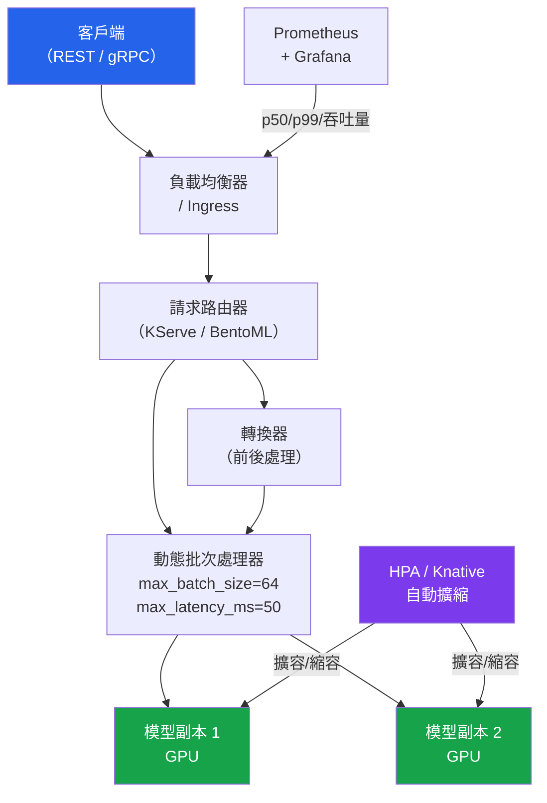

# [BEE-30088] ML 模型服務基礎設施

:::info
模型服務基礎設施將訓練好的模型製品轉化為能夠在定義的延遲 SLO 下處理並發推論請求的生產服務。服務化並不僅僅是將模型包裝在 Flask 處理器中——它涉及最大化 GPU 利用率的動態批次處理、gRPC vs REST 協議選擇、縮放至零部署的冷啟動緩解，以及多副本請求路由層。處理不當會導致 GPU 容量浪費（批次不足）或違反延遲預算（過度批次、冷啟動）。
:::

## 背景

從一個可用的模型到生產服務系統之間存在實質差距。在保留測試集上達到 94% AUC 的批次訓練模型，如果出現以下情況仍然可能在生產環境中失敗：

- 因為每次請求都從磁碟加載模型，單個請求需要 800ms 評分
- 因為請求逐個到達且沒有批次處理，GPU 利用率為 3%
- 因為映像在第一次請求時拉取 4 GB 模型，縮放至零的冷啟動需要 30 秒
- 因為執行緒在模型推論上阻塞，服務在負載下崩潰

生態系統已圍繞四種互補工具整合：**BentoML**（Python 優先、框架無關）、**KServe**（帶有 InferenceService CRD 的 Kubernetes 原生）、**NVIDIA Triton**（GPU 最佳化批次推論）和 **Ray Serve**（多模型管道的分散式推論）。它們在複雜性與控制能力的光譜上針對不同位置。

## 動態批次處理

動態批次（dynamic batching）將並發請求組合成單個 GPU 核心調用，在 N 個輸入之間分攤 GPU 記憶體傳輸和核心啟動的固定開銷。在 GPU 上，32 個請求的批次可能與 1 個請求的批次在相同的掛鐘時間內完成，產生 32 倍的吞吐量提升而不增加延遲——直到批次溢出 L2 快取或超過記憶體頻寬為止。

代價：批次中的第一個請求等待最多 `max_latency_ms` 讓批次填滿。如果批次在該視窗內未填滿，則使用已到達的請求數量刷新。最佳配置：

```
max_latency_ms = 目標 p99 延遲 - 滿批次時的模型推論時間
```

對於在批次大小 32 下推論耗時 20ms、p99 SLO 為 100ms 的模型，`max_latency_ms = 80ms`。低流量時批次很少填滿，因此有效延遲為 `max_latency_ms + 推論時間 ≈ 100ms`。高流量時批次填充更快，p99 得到改善。

## BentoML：Python 優先的服務化

BentoML（8.5k stars，github.com/bentoml/BentoML）是從訓練模型到容器化服務的阻力最小路徑。它不需要 Kubernetes 知識，並自動處理容器化、動態批次、健康檢查和 Prometheus 指標。

```python
import bentoml
import numpy as np
from bentoml.io import NumpyNdarray

# 將訓練好的模型儲存到 BentoML 的模型存儲
bentoml.sklearn.save_model("fraud_classifier", trained_model)

@bentoml.service(
    resources={"cpu": "2", "memory": "4Gi"},
    traffic={"timeout": 10},
)
class FraudClassifierService:
    model_ref = bentoml.models.get("fraud_classifier:latest")

    def __init__(self):
        self.model = self.model_ref.load_model()  # 啟動時加載一次

    @bentoml.api(
        batchable=True,
        max_batch_size=64,
        max_latency_ms=50,        # 即使未填滿也在 50ms 後刷新批次
        input_spec=NumpyNdarray(dtype="float32", shape=(-1, 30)),
        output_spec=NumpyNdarray(dtype="float32"),
    )
    def predict(self, inputs: np.ndarray) -> np.ndarray:
        # inputs：(batch_size, 30)——BentoML 自動打包並發請求
        return self.model.predict_proba(inputs)[:, 1]
```

```bash
bentoml build                   # 將服務 + 模型打包成 Bento
bentoml containerize fraud_classifier_service:latest  # 構建 Docker 映像
bentoml serve fraud_classifier_service:latest --port 3000
```

`batchable=True` 裝飾器是關鍵指令——BentoML 將對 `predict()` 的並發呼叫累積成單個陣列並一起分發，然後將結果分回各個呼叫者。呼叫者不知道批次處理的存在。

## KServe：Kubernetes 原生服務化

KServe（5.3k stars，github.com/kserve/kserve）使用 `InferenceService` CRD 將模型部署為 Kubernetes 自定義資源。它與 Knative 整合以實現縮放至零，實現開放推論協議（v2）以實現互操作性，並支持轉換器/預測器/解釋器組合。

```yaml
# infservice.yaml
apiVersion: serving.kserve.io/v1beta1
kind: InferenceService
metadata:
  name: fraud-classifier
  namespace: ml-serving
spec:
  predictor:
    minReplicas: 1      # 防止延遲敏感模型的縮放至零冷啟動
    maxReplicas: 10
    scaleTarget: 100    # 擴容前每個副本的目標並發請求數
    sklearn:
      storageUri: s3://ml-models/fraud-classifier/v3/
      resources:
        requests:
          cpu: "1"
          memory: 2Gi
        limits:
          cpu: "2"
          memory: 4Gi
  transformer:
    containers:
      - name: transformer
        image: my-registry/fraud-transformer:v2
        env:
          - name: PREDICTOR_HOST
            value: fraud-classifier-predictor.ml-serving.svc.cluster.local
```

```bash
kubectl apply -f infservice.yaml
kubectl get inferenceservice fraud-classifier

# v2 推論協議
curl -X POST \
  http://fraud-classifier.ml-serving.example.com/v2/models/fraud-classifier/infer \
  -H "Content-Type: application/json" \
  -d '{
    "inputs": [{
      "name": "features",
      "shape": [1, 30],
      "datatype": "FP32",
      "data": [0.1, 0.2, ...]
    }]
  }'
```

位於 https://kserve.github.io/website/docs/concepts/architecture/data-plane/v2-protocol 的開放推論協議（v2）規範，標準化了 KServe、Triton 和 Seldon 之間的健康、元資料和推論端點——實現服務執行時的可移植性。

## gRPC vs REST

| 維度 | gRPC | REST/HTTP |
|---|---|---|
| 序列化 | Protocol Buffers（二進位） | JSON（文字） |
| 典型 p50 延遲 | ~4 毫秒 | ~12 毫秒 |
| 吞吐量 | ~50,000 req/s | ~20,000 req/s |
| 瀏覽器/CLI 可存取 | 否（需要 grpc-web 代理） | 是 |
| 串流 | 雙向 | 僅 SSE/分塊 |

對內部服務間推論呼叫（模型服務器 ↔ 應用後端）使用 gRPC。對公開 API 和瀏覽器客戶端使用 REST。KServe 和 Triton 在開放推論協議規範下同時實現兩者——選擇是基於每個客戶端的，而非基於服務器的。

```python
import grpc
from tritonclient.grpc import service_pb2, service_pb2_grpc
import numpy as np

channel = grpc.insecure_channel("triton-server:8001")
stub = service_pb2_grpc.GRPCInferenceServiceStub(channel)

# 準備輸入張量
input_tensor = service_pb2.ModelInferRequest.InferInputTensor(
    name="features",
    datatype="FP32",
    shape=[1, 30],
)
request = service_pb2.ModelInferRequest(
    model_name="fraud_classifier",
    model_version="3",
    inputs=[input_tensor],
)
# 設定原始內容位元組
request.raw_input_contents.append(
    np.array([[0.1, 0.2, ...]], dtype=np.float32).tobytes()
)

response = stub.ModelInfer(request)
```

## 冷啟動緩解

縮放至零（Knative 預設）消除了空閒 GPU 成本，但在第一次請求時引入了冷啟動延遲。冷啟動序列：節點配置 → 容器初始化 → 映像拉取 → 模型反序列化 → GPU 記憶體分配 → 核心編譯。對於 2 GB 的 scikit-learn 模型，這需要 5–15 秒。對於 7B 參數的 LLM，可能超過 60 秒。

緩解策略：

```yaml
# 對延遲敏感模型設定 minReplicas=1
spec:
  predictor:
    minReplicas: 1   # 始終保持一個溫熱副本；縮放至零已停用

# 模型映像快取：將模型權重嵌入容器映像
# 消除啟動時的 S3 拉取（以映像大小換取冷啟動時間）
```

```python
# 預熱：在啟動時發送虛擬請求以編譯 CUDA 核心
# 並觸發任何懶惰初始化
import httpx
import asyncio

async def warm_up_model(endpoint: str, n_warmup: int = 10) -> None:
    """在服務即時流量之前發送虛擬請求以預編譯 GPU 核心。"""
    dummy_input = {"inputs": [{"name": "features", "shape": [1, 30],
                                "datatype": "FP32", "data": [0.0] * 30}]}
    async with httpx.AsyncClient() as client:
        for _ in range(n_warmup):
            await client.post(f"{endpoint}/v2/models/fraud_classifier/infer",
                              json=dummy_input, timeout=30.0)
```

Kubernetes `readinessProbe` 延遲流量路由直到預熱完成：

```yaml
readinessProbe:
  httpGet:
    path: /v2/health/ready
    port: 8080
  initialDelaySeconds: 30    # 在第一次檢查前等待模型加載
  periodSeconds: 5
  failureThreshold: 6        # 30 秒寬限期，之後視為失敗
```

## SLO 和容量規劃

同步模型服務的標準延遲目標：

| 流量模式 | p50 目標 | p99 目標 | 備注 |
|---|---|---|---|
| 即時詐騙評分 | < 20 毫秒 | < 100 毫秒 | 同步，阻塞付款 |
| 產品推薦 | < 50 毫秒 | < 200 毫秒 | 面向用戶，同步 |
| 批次特徵評分 | 吞吐量 | — | 離線，最大化 GPU 利用率 |
| LLM 推論（TTFT） | — | < 200 毫秒 | 首個 token 時間 |

GPU 服務的容量規劃公式：

```
副本數 = ceil(
    (每秒請求數 × 模型推論延遲（秒）)
    / (目標 GPU 利用率 × 批次大小)
)
```

在 1000 req/s、20ms 推論延遲、80% 目標 GPU 利用率和批次大小 32 時：
```
副本數 = ceil((1000 × 0.020) / (0.80 × 32)) = ceil(20 / 25.6) = ceil(0.78) = 1
```

為突發流量增加餘量：計劃 2 倍峰值以避免流量激增時的 p99 退化。



## 常見錯誤

**每次請求都加載模型。** 每次反序列化呼叫（pickle.load、torch.load）都從磁碟讀取並初始化模型狀態。200 MB 的 sklearn 模型加載需要約 300ms——每次請求都這樣做是不可接受的。在服務啟動時加載模型一次，並儲存在模組級別或類別級別的變量中。

**不進行性能分析就設定 max_batch_size。** 批次大小 256 聽起來比 32 好，但可能超出 GPU 記憶體，導致部分批次並產生比較小批次更高的延遲。在提交配置之前，使用 `perf_analyzer`（Triton）或 `ab`/`wrk2` 在每個批次大小下進行性能分析。

**沒有逾時就暴露模型端點。** 模型推論可能因資源競爭而停滯。沒有逾時，卡住的請求會消耗工作執行緒，並級聯成完整的服務中斷。在客戶端（`httpx.timeout`、`grpc.timeout_in_seconds`）和服務層（BentoML 中的 `traffic.timeout`、KServe 中的 `spec.predictor.timeout`）都設定逾時。

**對延遲敏感模型使用縮放至零。** 縮放至零消除空閒成本，但在第一次請求時產生 5–60+ 秒的冷啟動。對於 p99 SLO < 500ms 的任何模型，設定 `minReplicas: 1`。僅對沒有延遲要求的批次評分端點使用縮放至零。

**忽略輸出序列化成本。** 序列化為 JSON 的 4096 維嵌入向量每個響應約 40 KB。在 1000 req/s 時，這是 40 MB/s 的序列化 CPU。對高維輸出使用 Protocol Buffers 或 float32 二進位格式。

## 相關 BEE

- [BEE-30082 ML 模型的影子模式與金絲雀部署](/zh-tw/ai-backend-patterns/shadow-mode-and-canary-deployment-for-ml-models) — 在服務基礎設施中安全升級新模型版本
- [BEE-30083 ML 監控與漂移偵測](/zh-tw/ai-backend-patterns/ml-monitoring-and-drift-detection) — 對服務層進行儀器化以偵測預測分佈移位
- [BEE-30021 LLM 推論最佳化與自我託管](/zh-tw/ai-backend-patterns/llm-inference-optimization-and-self-hosting) — 具有不同批次語義的 LLM 特定服務（vLLM、TGI）
- [BEE-13003 連線池與資源管理](/zh-tw/performance-scalability/connection-pooling-and-resource-management) — 適用於模型服務客戶端的連線管理原則

## 參考資料

- KServe 文件. https://kserve.github.io/website/
- KServe 開放推論協議 v2. https://kserve.github.io/website/docs/concepts/architecture/data-plane/v2-protocol
- 開放推論協議規範存儲庫. https://github.com/kserve/open-inference-protocol
- BentoML 文件. https://docs.bentoml.com/
- BentoML 服務指南. https://docs.bentoml.com/en/latest/build-with-bentoml/services.html
- NVIDIA Triton 推論服務器，動態批次處理文件. https://docs.nvidia.com/deeplearning/triton-inference-server/user-guide/docs/user_guide/batcher.html
- Ray Serve 文件. https://docs.ray.io/en/latest/serve/index.html
- Ray Serve 動態請求批次處理. https://docs.ray.io/en/latest/serve/advanced-guides/dyn-req-batch.html
- Baseten，AI 推論的連續批次 vs 動態批次. https://www.baseten.co/blog/continuous-vs-dynamic-batching-for-ai-inference/
- Moritz, P., et al. (2018). Ray: A Distributed Framework for Emerging AI Applications. OSDI 2018. https://www.usenix.org/system/files/osdi18-moritz.pdf
