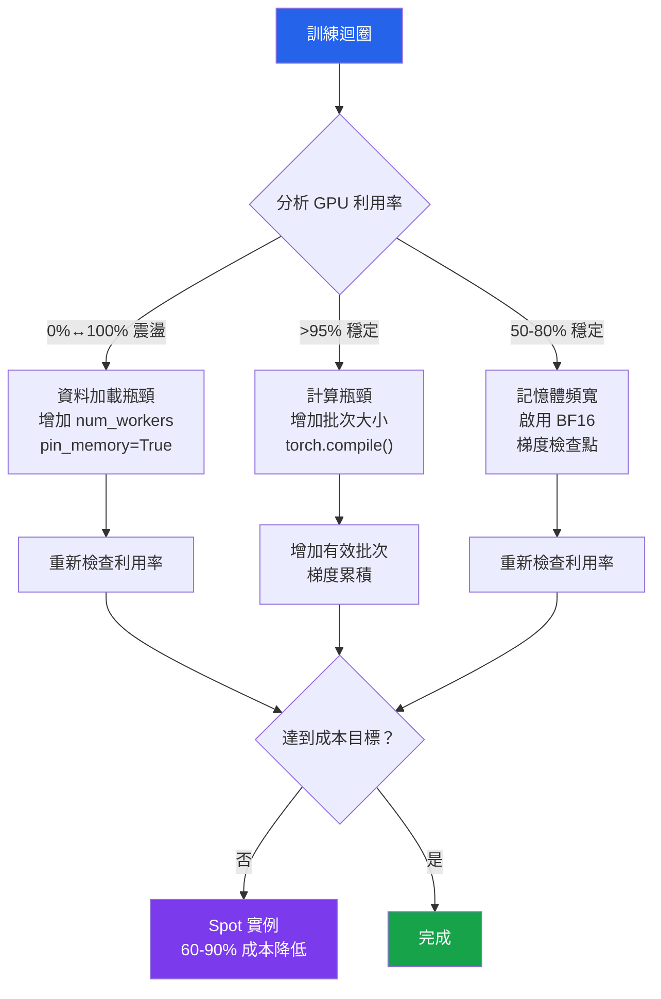

# [BEE-30091] ML 訓練成本最佳化

:::info
ML 訓練成本最佳化通過混合精度、梯度檢查點、高效資料加載和 Spot 實例檢查點策略來最大化 GPU 利用率，從而減少 GPU 時數和雲端費用——這些技術可在不降低模型品質的情況下將訓練成本削減 60–90%。
:::

## 背景

GPU 計算是 ML 訓練中的主要成本。AWS 上單個 A100 實例按需計費為 $3.21/小時；一個實驗運行 72 小時的費用在不考慮儲存和資料傳輸的情況下就達到 $231。每週在多個實例上運行數十個實驗的團隊，每月在計算上的支出通常高達 50,000–200,000 美元。

這些支出大部分是可以避免的。生產 ML 工作負載的 GPU 利用率基準測試通常顯示 30–50% 的有效利用率——GPU 要麼在等待資料（DataLoader 瓶頸），要麼阻塞在主機-設備傳輸上（未啟用鎖頁記憶體），要麼在 FP32 下運行，而硬體在 BF16 下能以兩倍的吞吐量完成相同的工作。修復這些是工程問題，而非研究問題。

最佳化格局按影響分為三個層次：

1. **記憶體效率** — 混合精度、梯度檢查點、梯度累積：在現有硬體上允許更大的有效批次大小，直接降低每樣本計算成本
2. **硬體效率** — DataLoader 調優、`torch.compile()`、批次大小縮放：最大化 GPU 進行有效計算的時間比例
3. **基礎設施效率** — Spot 實例、檢查點-恢復、S3 生命週期策略：降低每小時費率並消除浪費的支出

## 混合精度訓練

FP32 以 4 個位元組儲存每個值。BF16 以 2 個位元組儲存相同的值，並具有與 FP32 相同的指數範圍（8 個指數位 vs FP32 的 8 個），但尾數位數更少。硬體結果：A100/H100 上的 BF16 矩陣乘法運行速度約為 FP32 的 2 倍。

`torch.amp.autocast` 將 BF16 應用於前向傳播中數值精度不關鍵的操作（線性層、卷積），同時保持 FP32 用於累積和數值敏感的操作（softmax、損失計算）：

```python
import torch
from torch.amp import autocast, GradScaler

model = MyModel().to("cuda")
optimizer = torch.optim.AdamW(model.parameters(), lr=1e-4)

# GradScaler 僅在 FP16 時需要（BF16 不需要——BF16 不會下溢）
scaler = GradScaler("cuda", enabled=(dtype == torch.float16))

for batch in dataloader:
    optimizer.zero_grad(set_to_none=True)  # set_to_none=True 比歸零更快

    with autocast("cuda", dtype=torch.bfloat16):
        output = model(batch["input"])
        loss = criterion(output, batch["label"])

    scaler.scale(loss).backward()
    scaler.unscale_(optimizer)

    # 在 scaler.step 之前裁剪梯度以避免 NaN 傳播
    torch.nn.utils.clip_grad_norm_(model.parameters(), max_norm=1.0)

    scaler.step(optimizer)
    scaler.update()
```

**BF16 vs FP16**：在 Ampere+（A100、H100、RTX 30xx/40xx）上使用 BF16。BF16 與 FP32 具有相同的指數範圍，因此梯度不需要損失縮放就不會溢出。FP16 的指數範圍較窄，需要 `GradScaler` 來防止下溢。在較舊的硬體（V100、T4）上，使用帶有 `GradScaler` 的 FP16。

記憶體節省是立竿見影的：10 億參數的 FP32 模型僅參數就需要約 4 GB。在 BF16 中需要約 2 GB，在不改變 GPU 預算的情況下為更大的批次大小或更深的架構釋放了容量。

## 梯度檢查點

反向傳播需要儲存前向傳播的所有中間激活值。對於有 L 層的 Transformer，這是 O(L × batch × sequence) 記憶體。梯度檢查點用計算換記憶體：在前向傳播時捨棄激活值，在反向傳播時重新計算它們。代價是約 30% 更多的計算；節省是約 70% 的激活記憶體。

```python
from torch.utils.checkpoint import checkpoint

class CheckpointedTransformerLayer(torch.nn.Module):
    def __init__(self, layer):
        super().__init__()
        self.layer = layer

    def forward(self, x):
        # checkpoint 在反向傳播時重新計算 layer(x) 而非儲存激活值
        return checkpoint(
            self.layer,
            x,
            use_reentrant=False,  # 非可重入版本是新程式碼的推薦選擇
        )

# 每隔一層應用檢查點，以約 15% 的計算開銷減半記憶體
# （每層都應用檢查點會使計算成本翻倍）
for i, layer in enumerate(model.transformer_layers):
    if i % 2 == 0:
        model.transformer_layers[i] = CheckpointedTransformerLayer(layer)
```

梯度檢查點最有價值的情況：(a) 在所需批次大小下記憶體不足（OOM），或 (b) 想要在不升級硬體的情況下將批次大小翻倍。它**不應該**（SHOULD NOT）均勻地應用於每一層——每隔一層進行檢查點以約 15% 的計算開銷（而非每層都進行的 30%）捕捉了大部分記憶體節省。

## 梯度累積

梯度累積在不分配完整批次記憶體的情況下模擬更大的有效批次大小。來自 N 個微批次的梯度在一次權重更新之前被累積：

```python
ACCUMULATION_STEPS = 8  # 有效批次 = batch_size × 8
optimizer.zero_grad(set_to_none=True)

for step, batch in enumerate(dataloader):
    with autocast("cuda", dtype=torch.bfloat16):
        output = model(batch["input"])
        # 按累積步數規範化損失，使其幅度與全批次損失匹配
        loss = criterion(output, batch["label"]) / ACCUMULATION_STEPS

    scaler.scale(loss).backward()

    if (step + 1) % ACCUMULATION_STEPS == 0:
        scaler.unscale_(optimizer)
        torch.nn.utils.clip_grad_norm_(model.parameters(), max_norm=1.0)
        scaler.step(optimizer)
        scaler.update()
        optimizer.zero_grad(set_to_none=True)
```

在 `.backward()` 之前將損失除以 `ACCUMULATION_STEPS` 以規範化梯度幅度——否則梯度會像損失函數是 `N × loss` 一樣累積，產生過大的權重更新。

增加有效批次大小時應用**線性縮放規則**（Goyal et al. 2017，arXiv:1706.02677）：按比例縮放學習率。有效批次大小翻倍 → 學習率翻倍。在應用完整縮放學習率之前添加 5 個 epoch 的線性預熱，以防止早期發散。

## 高效 DataLoader 配置

最常見的 GPU 利用率不足原因是餓飢的 DataLoader：GPU 完成一個批次後等待 CPU 準備下一個。使用 `nvidia-smi dmon -s u` 進行性能分析——如果 GPU SM 利用率在 0% 和 100% 之間震盪，資料加載就是瓶頸。

```python
from torch.utils.data import DataLoader

dataloader = DataLoader(
    dataset,
    batch_size=256,
    num_workers=8,           # 經驗法則：min(CPU 核心數, 8)；性能分析是決定性的
    pin_memory=True,         # 在鎖頁（非可換頁）區域分配主機記憶體
                             # → GPU DMA 引擎直接傳輸，繞過 OS 複製
    prefetch_factor=4,       # 每個 worker 提前預取 4 個批次（需要 num_workers > 0）
    persistent_workers=True, # 在 epoch 之間保持 worker 存活；消除 worker 重啟成本
    drop_last=True,          # 捨棄不完整的最後批次；避免可變批次形狀
)
```

`pin_memory=True` 是影響最高的單個參數。使用可換頁的主機記憶體時，每次 GPU 傳輸都需要先進行 OS 複製到暫存緩衝區。鎖頁記憶體允許 DMA 引擎直接傳輸。在 A100 的 80 GB 頻寬下，這為中大型批次節省了 10–30% 的傳輸時間。

`persistent_workers=True` 消除了 epoch 之間的 worker 進程啟動成本——每個 worker 在訓練運行期間只被 fork 一次，而非每個 epoch 一次。在 worker 持有文件句柄或資料庫連接的資料集上，這也消除了重新連接的成本。

## Spot 實例訓練

AWS EC2 Spot 實例和 GCP Spot VM 相比按需定價提供高達 90% 的折扣，並有 2 分鐘的驅逐警告。工程約束是訓練**必須**（MUST）能夠進行檢查點並可以恢復。

```python
import signal
import boto3
import torch

s3 = boto3.client("s3")
CHECKPOINT_BUCKET = "ml-training-checkpoints"
CHECKPOINT_KEY = "experiment-42/checkpoint-latest.pt"

def save_checkpoint(model, optimizer, scheduler, step, loss):
    state = {
        "step": step,
        "model_state_dict": model.state_dict(),
        "optimizer_state_dict": optimizer.state_dict(),
        "scheduler_state_dict": scheduler.state_dict() if scheduler else None,
        "loss": loss,
    }
    # 先寫入本地，然後上傳以避免 S3 部分上傳
    torch.save(state, "/tmp/checkpoint.pt")
    s3.upload_file("/tmp/checkpoint.pt", CHECKPOINT_BUCKET, CHECKPOINT_KEY)

def load_checkpoint(model, optimizer, scheduler):
    try:
        s3.download_file(CHECKPOINT_BUCKET, CHECKPOINT_KEY, "/tmp/checkpoint.pt")
        state = torch.load("/tmp/checkpoint.pt", map_location="cuda")
        model.load_state_dict(state["model_state_dict"])
        optimizer.load_state_dict(state["optimizer_state_dict"])
        if scheduler and state["scheduler_state_dict"]:
            scheduler.load_state_dict(state["scheduler_state_dict"])
        return state["step"], state["loss"]
    except Exception:
        return 0, float("inf")   # 沒有檢查點；從步驟 0 開始

CHECKPOINT_INTERVAL = 500  # 每 500 步保存一次，將最大丟失工作量限制在幾分鐘內

start_step, _ = load_checkpoint(model, optimizer, scheduler)

for step, batch in enumerate(dataloader, start=start_step):
    # ... 訓練迴圈 ...
    if step % CHECKPOINT_INTERVAL == 0:
        save_checkpoint(model, optimizer, scheduler, step, loss.item())
```

使用 S3 智慧分層或生命週期策略，自動將 7 天以上的舊檢查點轉移到 Glacier——超過一週的檢查點幾乎從不需要用於恢復，但可能積累大量儲存成本。

## torch.compile()

PyTorch 2.0+ 的 `torch.compile()` 編譯模型的計算圖，消除 Python 解釋器開銷並融合 GPU 核心啟動：

```python
import torch

model = MyModel().to("cuda")

# 編譯模型：TorchDynamo 追蹤並最佳化計算圖
# mode="reduce-overhead"：最大化 GPU 利用率（推薦用於訓練）
# mode="max-autotune"：編譯較慢，可能執行更快（長時間運行）
compiled_model = torch.compile(model, mode="reduce-overhead")

# 用法與未編譯的模型完全相同
output = compiled_model(input_tensor)
```

典型的訓練吞吐量提升：Transformer 架構上 20–50%。編譯在第一次前向傳播時懶惰地發生，需要 1–5 分鐘。在計時或基準測試之前，添加一個使用虛擬批次的預熱步驟。

## GPU 性能分析

在最佳化之前進行性能分析。三種常見瓶頸有不同的特徵：

```python
import torch
from torch.profiler import profile, ProfilerActivity, tensorboard_trace_handler

with profile(
    activities=[ProfilerActivity.CPU, ProfilerActivity.CUDA],
    schedule=torch.profiler.schedule(wait=1, warmup=1, active=5),
    on_trace_ready=tensorboard_trace_handler("./profiler_logs"),
    record_shapes=True,
    profile_memory=True,
    with_flops=True,
) as prof:
    for step, batch in enumerate(dataloader):
        train_step(model, batch, optimizer)
        prof.step()

print(prof.key_averages().table(sort_by="cuda_time_total", row_limit=20))
```

| 瓶頸 | 特徵 | 修復方法 |
|---|---|---|
| 資料加載 | GPU SM 利用率在 0%/100% 之間震盪 | 增加 `num_workers`，啟用 `pin_memory` |
| 記憶體頻寬 | GPU 利用率 ~100% 但吞吐量低 | 啟用 BF16；縮小批次以適應 L2 快取 |
| 計算瓶頸 | GPU SM 利用率持續 >95% | 這是理想狀態；增加批次大小 |



## 常見錯誤

**在 BF16 可用時使用 FP16。** FP16 需要 `GradScaler` 來防止梯度下溢，增加了實現複雜性，且對於大梯度值仍會溢出。在任何 Ampere+ GPU（A100、H100、RTX 30xx+）上，BF16 在不需要損失縮放的情況下提供與 FP32 相同的指數範圍，具有相同的記憶體縮減效果。預設使用 BF16，只有在針對較舊硬體（V100、T4）時才使用 FP16。

**按慣例而非性能分析設定 `num_workers`。** `num_workers=4` 是一個常見的預設值，對大多數機器來說是錯誤的。在 8 核實例上，4 個 worker 可能很好；在 96 核實例上，4 個 worker 是嚴重瓶頸。分析 GPU SM 利用率：如果它震盪，增加 worker。如果它是穩定的，worker 不是瓶頸。過多的 worker 會造成記憶體壓力（每個 worker 持有資料集快取的一個副本）。

**在梯度累積中不規範化損失。** 在不將損失除以 8 的情況下跨 8 個微批次累積梯度，會將有效學習率縮放 8 倍。這會產生梯度爆炸，而原因被歸咎於錯誤的地方。在呼叫 `.backward()` 之前**必須**（MUST）始終將損失除以 `ACCUMULATION_STEPS`。

**在按需 GPU 儲存而非 S3 上保存檢查點。** 將檢查點保存到實例的本地 NVMe 磁碟上，在 Spot 終止時會丟失所有檢查點。檢查點**必須**（MUST）在訓練步驟完成之前寫入 S3 或 GCS。先本地寫入，然後非同步上傳以避免阻塞訓練迴圈。

**在修復資料加載瓶頸之前應用 `torch.compile()`。** `torch.compile()` 將 GPU 計算效率提高 20–50%，但如果由於資料加載導致 GPU 利用率已經很低，編譯模型沒有任何效果。**始終先修復管道最慢的部分**：資料 → 記憶體 → 計算。

## 相關 BEE

- [BEE-30088 ML 模型服務基礎設施](/zh-tw/ai-backend-patterns/ml-model-serving-infrastructure) — 具有動態批次的推論成本最佳化與訓練成本最佳化互補
- [BEE-30084 ML 實驗追蹤與模型登錄庫](/zh-tw/ai-backend-patterns/ml-experiment-tracking-and-model-registry) — 將每次運行的成本指標與模型品質一起記錄到 MLflow，進行成本/準確率權衡分析
- [BEE-30070 大型語言模型的分散式訓練基礎設施](/zh-tw/ai-backend-patterns/distributed-training-infrastructure-for-large-language-models) — LLM 規模訓練成本的 DeepSpeed ZeRO 和張量並行
- [BEE-13004 性能分析與瓶頸識別](/zh-tw/performance-scalability/profiling-and-bottleneck-identification) — 適用於 GPU 訓練性能分析的一般性能分析原則

## 參考資料

- PyTorch, Automatic Mixed Precision. https://docs.pytorch.org/docs/stable/amp.html
- PyTorch, 梯度檢查點（`torch.utils.checkpoint`）. https://docs.pytorch.org/docs/stable/checkpoint.html
- PyTorch, DataLoader 文件. https://docs.pytorch.org/docs/stable/data.html
- PyTorch, `torch.compile` 教程. https://docs.pytorch.org/tutorials/intermediate/torch_compile_tutorial.html
- PyTorch, Profiler. https://docs.pytorch.org/docs/stable/profiler.html
- Goyal, P., et al. (2017). Accurate, large minibatch SGD: Training ImageNet in 1 hour. arXiv:1706.02677. https://arxiv.org/abs/1706.02677
- Rajbhandari, S., et al. (2020). ZeRO: Memory optimizations toward training trillion parameter models. arXiv:1910.02054. https://arxiv.org/abs/1910.02054
- DeepSpeed, GitHub 存儲庫. https://github.com/deepspeedai/DeepSpeed
- AWS EC2 Spot 實例. https://aws.amazon.com/ec2/spot/
- GCP Spot VM 文件. https://docs.cloud.google.com/compute/docs/instances/spot
- NVIDIA Data Center GPU Manager (DCGM). https://developer.nvidia.com/dcgm
- AWS S3 物件生命週期管理. https://docs.aws.amazon.com/AmazonS3/latest/userguide/object-lifecycle-mgmt.html
