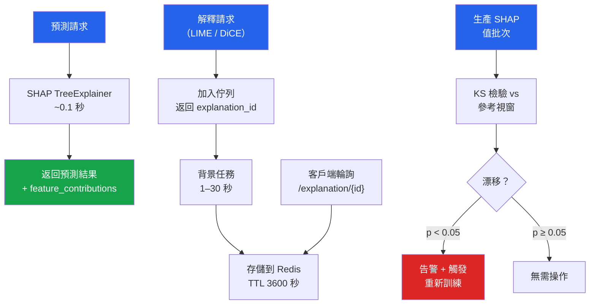

# [BEE-30086] 生產環境中的模型可解釋性

:::info
模型可解釋性將訓練模型的內部決策邏輯轉換為人類可讀的歸因分數，回答「模型為何對此輸入做出此預測？」這一問題。生產環境中的可解釋性有兩個相互衝突的要求：解釋必須足夠準確以滿足法規審計（歐盟 AI 法案、GDPR 第 22 條），同時必須足夠快速以置於服務路徑中而不超過延遲預算。天真的實現方式兩者都無法滿足。
:::

## 背景

GDPR（一般資料保護規範）第 22 條賦予個人對產生法律效果或類似重大影響的自動化決策，獲得「關於所涉邏輯的有意義資訊」的權利。歐盟 AI 法案第 13 條要求高風險 AI 系統具有透明度，第 86 條賦予對 AI 系統決策的解釋權。這些要求並非可有可無——GDPR 違規最高罰款為全球營業額的 4%，歐盟 AI 法案最高罰款為 3000 萬歐元。

工具生態系統圍繞三種互補方法整合：**SHAP**（基於 Lundberg & Lee NeurIPS 2017, arXiv:1705.07874 的統一理論框架）用於歸因分數，**LIME**（局部線性近似，適用於模型存取受限時），以及 **DiCE**（反事實解釋，回答「需要改變什麼才能翻轉結果？」）。每種方法都有不同的延遲特性，決定了它是否可以在服務路徑中同步運行或必須延遲處理。

## 延遲特性比較

| 方法 | 典型延遲 | 服務模式 |
|---|---|---|
| SHAP TreeExplainer | ~0.1 秒/樣本 | 同步（可接受） |
| SHAP LinearExplainer | <1 毫秒 | 同步 |
| SHAP KernelExplainer | ~12 秒 | 僅限非同步 |
| LIME LimeTabularExplainer | 1–5 秒（5000 個樣本） | 僅限非同步 |
| DiCE 反事實解釋 | 1–30 秒 | 僅限非同步 |

TreeExplainer 比同一模型的 KernelExplainer 快 133 倍。差異在結構上：TreeExplainer 利用決策樹的條件獨立結構，以 O(TLD²) 的複雜度（T 為樹的數量，L 為最大葉節點數，D 為最大深度）計算精確的 Shapley 值。KernelExplainer 通過取樣排列來估計 Shapley 值——精確但與模型無關。

## SHAP：生產環境歸因

```python
import shap
import numpy as np
from fastapi import FastAPI
from contextlib import asynccontextmanager

# 模組級別的解釋器——初始化一次，跨請求重複使用
_explainer: shap.TreeExplainer | None = None

@asynccontextmanager
async def lifespan(app: FastAPI):
    global _explainer
    model = load_model()                          # 載入訓練好的模型
    _explainer = shap.TreeExplainer(
        model,
        feature_perturbation="tree_path_dependent",  # 不需要背景樣本
    )
    yield

app = FastAPI(lifespan=lifespan)

@app.post("/predict-with-explanation")
async def predict_with_explanation(features: dict) -> dict:
    X = np.array([[features[f] for f in FEATURE_NAMES]])
    prediction = float(_explainer.model.predict_proba(X)[0, 1])

    # shap_values 形狀：二元分類為 (n_samples, n_features)
    shap_values = _explainer.shap_values(X)
    values = shap_values[1][0] if isinstance(shap_values, list) else shap_values[0]

    feature_contributions = {
        name: round(float(val), 6)
        for name, val in zip(FEATURE_NAMES, values)
    }

    return {
        "prediction": prediction,
        "base_value": float(_explainer.expected_value[1]
                           if isinstance(_explainer.expected_value, list)
                           else _explainer.expected_value),
        "feature_contributions": feature_contributions,
    }
```

`feature_perturbation="tree_path_dependent"` 通過隱式以訓練分佈為條件，消除了背景資料集的需求。對於非樹狀模型，使用 `shap.LinearExplainer`（線性模型，<1 毫秒）或 `shap.Explainer`（自 v0.42+ 起自動選擇，必要時回退到 KernelExplainer，後者**必須**使用非同步模式）。

## 非同步解釋模式

LIME 和 DiCE 運行需要數秒——絕對不能在同步服務路徑中使用。模式：接受請求，將解釋生成加入佇列，返回 `explanation_id`，讓客戶端輪詢。

```python
import asyncio
import uuid
import redis.asyncio as redis
from fastapi import BackgroundTasks
import json
import lime.lime_tabular

redis_client = redis.Redis(host="localhost", port=6379, decode_responses=True)

async def _generate_lime_explanation(
    explanation_id: str, features: dict
) -> None:
    """背景任務——將結果存儲在 Redis 中，TTL 為 1 小時。"""
    explainer = lime.lime_tabular.LimeTabularExplainer(
        training_data=X_train_sample,
        feature_names=FEATURE_NAMES,
        mode="classification",
    )
    X = np.array([[features[f] for f in FEATURE_NAMES]])
    exp = explainer.explain_instance(
        X[0],
        predict_fn,
        num_features=10,
        num_samples=5000,   # 較少 → 更快但穩定性較低；5000 是推薦預設值
    )
    result = {
        "explanation_id": explanation_id,
        "status": "ready",
        "local_weights": dict(exp.as_list()),
        "intercept": exp.intercept[1],
    }
    await redis_client.setex(
        f"explanation:{explanation_id}", 3600, json.dumps(result)
    )

@app.post("/explain/lime")
async def request_lime_explanation(
    features: dict, background_tasks: BackgroundTasks
) -> dict:
    explanation_id = str(uuid.uuid4())
    await redis_client.setex(
        f"explanation:{explanation_id}", 3600,
        json.dumps({"status": "pending"})
    )
    background_tasks.add_task(_generate_lime_explanation, explanation_id, features)
    return {"explanation_id": explanation_id, "status": "pending"}

@app.get("/explanation/{explanation_id}")
async def get_explanation(explanation_id: str) -> dict:
    raw = await redis_client.get(f"explanation:{explanation_id}")
    if raw is None:
        return {"status": "not_found"}
    return json.loads(raw)
```

## DiCE：反事實解釋

反事實解釋回答了法規友好的問題：「此輸入需要最小幅度的哪些改變才能翻轉決策？」這是對最終用戶最具可操作性的解釋，直接滿足 GDPR 附則 71 關於「有意義資訊」的標準。

```python
import dice_ml

def generate_counterfactuals(
    instance: dict,
    features_to_vary: list[str],
    permitted_range: dict | None = None,
    num_cfs: int = 3,
) -> list[dict]:
    """
    features_to_vary：用戶實際可以改變的特徵。
    permitted_range：{"income": [20000, 200000]} 用於限制搜尋範圍。
    """
    d = dice_ml.Data(
        dataframe=training_df,
        continuous_features=CONTINUOUS_FEATURES,
        outcome_name="label",
    )
    m = dice_ml.Model(model=trained_model, backend="sklearn")
    exp = dice_ml.Dice(d, m, method="random")

    query = pd.DataFrame([instance])
    cfs = exp.generate_counterfactuals(
        query,
        total_CFs=num_cfs,
        desired_class="opposite",
        features_to_vary=features_to_vary,
        permitted_range=permitted_range or {},
    )
    return cfs.cf_examples_list[0].final_cfs_df.to_dict(orient="records")
```

`method="random"`（Wachter et al., 2017, arXiv:1711.00399）速度快但生成的反事實多樣性不足。`method="genetic"`（Mothilal et al., FAT* 2020, arXiv:1905.07697）同時優化接近性、多樣性和可操作性——面向用戶的解釋必須使用此方法。DiCE 必須始終通過上述非同步模式在背景任務中運行。

## 解釋漂移偵測

SHAP 值可兼作漂移信號。如果特徵歸因的分佈發生變化，模型的決策邏輯已經改變，即使預測準確率保持穩定。這比基於準確率的監控更早捕捉到靜默的模型退化。

```python
from scipy import stats

def detect_explanation_drift(
    reference_shap: np.ndarray,   # 形狀：(n_reference, n_features)
    current_shap: np.ndarray,     # 形狀：(n_current, n_features)
    feature_names: list[str],
    alpha: float = 0.05,
) -> dict:
    """
    對每個特徵的 SHAP 值分佈進行 KS 檢驗。
    返回發生漂移的特徵及其 p 值。
    """
    drifted = {}
    for i, name in enumerate(feature_names):
        stat, p_value = stats.ks_2samp(
            reference_shap[:, i], current_shap[:, i]
        )
        if p_value < alpha:
            drifted[name] = {"ks_statistic": float(stat), "p_value": float(p_value)}
    return drifted
```



## 常見錯誤

**每次請求都初始化解釋器。** `shap.TreeExplainer` 在構建時載入模型內部結構。每次請求都這樣做會增加數百毫秒的延遲並造成不必要的 GC 壓力。應在服務啟動時初始化一次並跨請求共享實例。

**同步運行 LIME。** 使用 `num_samples=5000` 的 LIME 需要 1–5 秒。在 p50 負載下這會導致 HTTP 逾時。任何耗時超過 ~200 毫秒的解釋方法都**必須**使用非同步模式。

**解釋錯誤的模型。** 解釋描述的是模型，而非真相。如果模型存在偏差，解釋會如實描述有偏差的模型。解釋 ≠ 正確性。應將可解釋性與公平性審計配合使用，切勿混淆兩者。

**忽略解釋的過期問題。** 快取中存儲的 SHAP 值在模型重新訓練後會過期。快取條目**必須**以模型版本而非僅以輸入哈希作為鍵。每次模型升級時都需要清除解釋快取。

**對相關特徵使用 `feature_perturbation="interventional"`。** 干預型 Shapley 值假設特徵獨立。當特徵相關聯時（例如 `income` 和 `age`），會產生不可靠的歸因。對樹狀模型使用 `tree_path_dependent`（預設值）。

## 相關 BEE

- [BEE-30083 ML 監控與漂移偵測](/zh-tw/ai-backend-patterns/ml-monitoring-and-drift-detection) — 群體級別的漂移監控與逐預測解釋漂移互補
- [BEE-30082 ML 模型的影子模式與金絲雀部署](/zh-tw/ai-backend-patterns/shadow-mode-and-canary-deployment-for-ml-models) — 冠軍/挑戰者比較應包含解釋比較
- [BEE-30084 ML 實驗追蹤與模型登錄庫](/zh-tw/ai-backend-patterns/ml-experiment-tracking-and-model-registry) — 通過 `mlflow.log_artifact()` 將解釋製品連結到 MLflow 運行
- [BEE-30004 評估和測試 LLM 應用程式](/zh-tw/ai-backend-patterns/evaluating-and-testing-llm-applications) — LLM 特定評估模式，與傳統 ML 可解釋性不同

## 參考資料

- Lundberg, S. M., & Lee, S.-I. (2017). A unified approach to interpreting model predictions. NeurIPS 2017. arXiv:1705.07874. https://papers.nips.cc/paper/7062-a-unified-approach-to-interpreting-model-predictions
- Ribeiro, M. T., Singh, S., & Guestrin, C. (2016). "Why should I trust you?": Explaining the predictions of any classifier. KDD 2016. arXiv:1602.04938. https://dl.acm.org/doi/10.1145/2939672.2939778
- Mothilal, R. K., Sharma, A., & Tan, C. (2020). Explaining machine learning classifiers through diverse counterfactual explanations. FAT* 2020. arXiv:1905.07697. https://dl.acm.org/doi/10.1145/3351095.3372850
- Wachter, S., Mittelstadt, B., & Russell, C. (2017). Counterfactual explanations without opening the black box. arXiv:1711.00399. https://arxiv.org/abs/1711.00399
- EU AI Act, Article 13 (Transparency and provision of information to deployers). https://artificialintelligenceact.eu/article/13/
- EU AI Act, Article 86 (Right to explanation of individual decision-making). https://artificialintelligenceact.eu/article/86/
- GDPR, Article 22 (Automated individual decision-making). https://gdpr-info.eu/art-22-gdpr/
- SHAP 文件. https://shap.readthedocs.io/en/latest/
- DiCE（多樣化反事實解釋）GitHub 存儲庫. https://github.com/interpretml/DiCE
- LIME GitHub 存儲庫. https://github.com/marcotcr/lime
