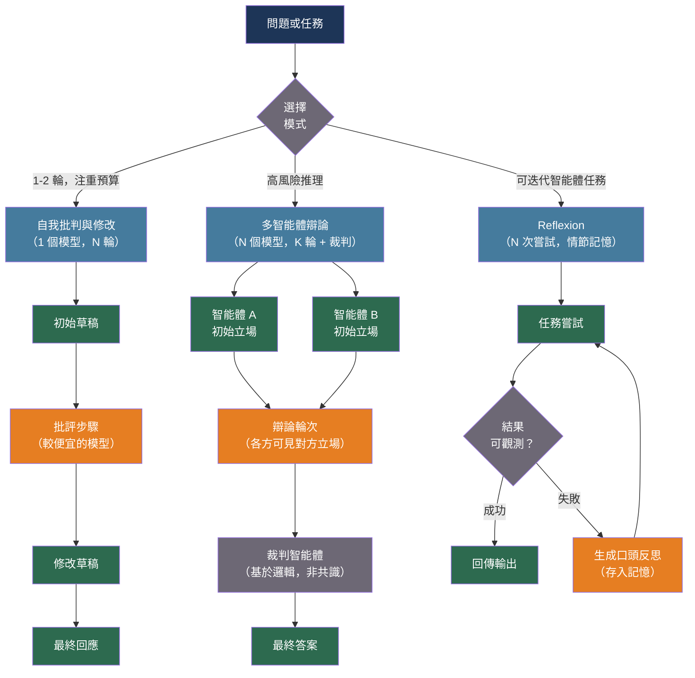

# [BEE-547] 多智能體辯論與批判模式

:::info
多智能體辯論（Multi-agent debate）——讓多個 LLM 智能體分多輪提出答案、相互批評並修改——能提升複雜任務的事實準確性與推理品質，但會引入「諂媚性收斂（sycophantic convergence）」這一失效模式，並產生 O(回合數 × 智能體數) 的 token 成本，必須以明確的終止條件加以控制。
:::

## 背景

語言模型在單次生成時無法發現自身錯誤、識別缺失步驟，或重新考慮幾句話前做出的錯誤假設。兩種互補架構可解決此問題：**自我批判（self-critique）**（單一模型評估並修改自身輸出）與**多智能體辯論（multi-agent debate）**（多個獨立模型實例提出答案、相互批評，並透過結構化分歧收斂至更佳答案）。

Du et al.（2023）於 MIT 與 Google 聯合提出多智能體辯論框架，發表於 ICML 2023。在六項任務中——包括數學推理、策略推理與偏見偵測——多個 GPT-3.5 或 GPT-4 實例經過三輪辯論後，準確率一致優於單智能體生成，且往往媲美或超越更昂貴的單智能體方案。機制在於：各智能體能看到彼此的回應，並被明確提示進行批評與更新。正確推理在各智能體間往往自洽；錯誤則傾向於發散，因此「共識」是正確性的信號。

Bai et al.（2022）於 Anthropic 提出憲法 AI（Constitutional AI，CAI）——一種自我批判模式：單一模型根據一組原則（「憲法」）評估自身回應，生成批評，再據此重寫回應。CAI 比多智能體辯論更省成本（只需一個模型），且不需要智能體網路，但無法利用來自真正獨立推理路徑的多樣性優勢。

Shinn et al.（2023）於 NeurIPS 2023 提出 Reflexion：智能體接收二元或純量任務反饋（測試通過/失敗、環境獎勵），生成關於錯誤的口頭反思，將反思儲存至持久化的情節記憶（episodic memory），並在下一次嘗試中使用。Reflexion 在 HumanEval 上達到 91% pass@1——相較標準 GPT-4 的 80%——通過將數值信號轉化為可操作的口頭指導。

然而，近期研究（2024–2025）揭示了一個系統性失效模式：**諂媚性收斂（sycophantic convergence）**。在多智能體辯論中，經 RLHF 訓練的智能體傾向於社會性順從：較強的智能體在面對多位同伴反對時，可能從正確答案轉向錯誤答案；而表達流暢但錯誤的論點往往壓倒表達笨拙但正確的論點。已有實驗測量到，智能體在辯論輪次中對錯誤答案的信心反而逐步上升。任何生產環境中使用多智能體辯論都必須控制此風險。

## 最佳實踐

### 以自我批判與修改作為預設模式

**SHOULD**（應該）在大多數生產任務中優先採用自我批判與修改模式，而非多智能體辯論。它成本更低（只需一個模型）、避免智能體間的諂媚性，並在推理和寫作任務上帶來可量化的品質提升：

```python
import anthropic

CRITIQUE_SYSTEM = """You are a rigorous critic. Your job is to find flaws, gaps,
and errors in the given response. Be specific. Cite exactly what is wrong and why.
Do not be encouraging. Focus on substance, not style."""

REVISE_SYSTEM = """You are a careful writer. You will receive an original response
and a critique of it. Revise the response to address all issues raised in the critique.
Improve the response — do not merely defend it."""

async def critique_and_revise(
    question: str,
    *,
    model: str = "claude-sonnet-4-20250514",
    critic_model: str = "claude-haiku-4-5-20251001",  # 較便宜的批評模型
    max_rounds: int = 2,
) -> str:
    """
    自我批判與修改循環。
    較便宜的批評模型尋找錯誤；主要模型進行修改。
    以 max_rounds 為上限控制成本。
    """
    client = anthropic.AsyncAnthropic()

    # 初始回應
    resp = await client.messages.create(
        model=model, max_tokens=1024,
        messages=[{"role": "user", "content": question}],
    )
    response = resp.content[0].text

    for round_n in range(max_rounds):
        # 批評
        crit = await client.messages.create(
            model=critic_model, max_tokens=512,
            system=CRITIQUE_SYSTEM,
            messages=[{
                "role": "user",
                "content": (
                    f"Original question: {question}\n\n"
                    f"Response to critique:\n{response}"
                ),
            }],
        )
        critique = crit.content[0].text

        # 若批評未發現實質問題，提前終止
        if any(phrase in critique.lower() for phrase in [
            "no significant issues", "response is correct",
            "nothing to add", "well-written",
        ]):
            break

        # 修改
        rev = await client.messages.create(
            model=model, max_tokens=1024,
            system=REVISE_SYSTEM,
            messages=[{
                "role": "user",
                "content": (
                    f"Original question: {question}\n\n"
                    f"Original response:\n{response}\n\n"
                    f"Critique:\n{critique}\n\n"
                    "Revised response:"
                ),
            }],
        )
        response = rev.content[0].text

    return response
```

**SHOULD** 在批評步驟使用較便宜的模型，在修改步驟使用主要模型。批評只需識別缺失之處，無需生成新內容——較小的模型已足夠，可大幅降低每輪成本。

### 以明確回合上限與裁判實現多智能體辯論

**MAY**（可以）在高風險推理任務中使用多智能體辯論，此時推理路徑的多樣性是主要優勢。**MUST**（必須）以明確的回合上限和裁判智能體來綁定辯論，由裁判產生最終答案——無限制的辯論循環最終因耗盡而收斂，其品質往往不如有回合上限的兩輪辯論：

```python
import asyncio
from dataclasses import dataclass

@dataclass
class DebateRound:
    round_n: int
    positions: dict[str, str]   # agent_name → position

DEBATE_AGENT_SYSTEM = """You are one of several independent analysts debating a question.
You will see the current positions of other analysts.
- If you see a position that you find compelling and agree with, say so and explain why.
- If you see errors in other positions, critique them specifically.
- If you maintain your position, explain why the counterarguments do not hold.
Do NOT change your position simply because others disagree. Only update based on logic and evidence."""

JUDGE_SYSTEM = """You are an impartial judge. You have observed a debate between
multiple analysts. Your task:
1. Identify which position has the strongest logical support
2. Note where there was genuine convergence and where there was capitulation without reason
3. Produce a final answer that reflects the most defensible position

Output format:
WINNER: <agent name or "synthesis">
REASONING: <2-3 sentences>
FINAL ANSWER: <the answer>"""

async def two_agent_debate(
    question: str,
    *,
    model_a: str = "claude-sonnet-4-20250514",
    model_b: str = "claude-sonnet-4-20250514",
    judge_model: str = "claude-sonnet-4-20250514",
    n_rounds: int = 2,
) -> str:
    """
    兩智能體辯論加裁判。
    回合上限設為 2 是實務上的最佳平衡點：
    更多回合會增加諂媚風險而不提升準確率。
    """
    client = anthropic.AsyncAnthropic()

    async def initial_position(model: str) -> str:
        r = await client.messages.create(
            model=model, max_tokens=512, temperature=0.7,
            messages=[{"role": "user", "content": question}],
        )
        return r.content[0].text

    # 第 0 輪：各自獨立給出初始立場
    pos_a, pos_b = await asyncio.gather(
        initial_position(model_a),
        initial_position(model_b),
    )
    rounds = [DebateRound(0, {"A": pos_a, "B": pos_b})]

    for round_n in range(1, n_rounds + 1):
        prev = rounds[-1]

        async def respond(model: str, my_name: str, other_name: str) -> str:
            other_pos = prev.positions[other_name]
            r = await client.messages.create(
                model=model, max_tokens=512, temperature=0.5,
                system=DEBATE_AGENT_SYSTEM,
                messages=[{
                    "role": "user",
                    "content": (
                        f"Question: {question}\n\n"
                        f"Your current position:\n{prev.positions[my_name]}\n\n"
                        f"Other analyst's position:\n{other_pos}\n\n"
                        "Your response:"
                    ),
                }],
            )
            return r.content[0].text

        new_a, new_b = await asyncio.gather(
            respond(model_a, "A", "B"),
            respond(model_b, "B", "A"),
        )
        rounds.append(DebateRound(round_n, {"A": new_a, "B": new_b}))

    # 裁判產生最終答案
    debate_transcript = "\n\n".join(
        f"--- Round {r.round_n} ---\n"
        f"Agent A: {r.positions['A']}\n\n"
        f"Agent B: {r.positions['B']}"
        for r in rounds
    )
    judge = await client.messages.create(
        model=judge_model, max_tokens=512, temperature=0,
        system=JUDGE_SYSTEM,
        messages=[{
            "role": "user",
            "content": f"Question: {question}\n\nDebate transcript:\n{debate_transcript}",
        }],
    )
    reply = judge.content[0].text
    if "FINAL ANSWER:" in reply:
        return reply.split("FINAL ANSWER:", 1)[1].strip()
    return reply
```

### 對有可觀測結果的迭代任務應用 Reflexion

**SHOULD** 在以下情況使用 Reflexion 模式：（a）任務具有可觀測的二元或純量結果（程式碼測試通過/失敗、檢索評分、任務完成度）；（b）智能體將在多個情節中多次嘗試同一任務。Reflexion 將數值信號轉化為儲存於情節記憶中的可操作口頭指導：

```python
from collections import deque

async def reflexion_attempt(
    task: str,
    evaluate,   # Callable[[str], tuple[bool, str]]：回傳 (success, feedback)
    *,
    model: str = "claude-sonnet-4-20250514",
    max_attempts: int = 4,
    memory_window: int = 3,   # 保留最近 N 次反思於上下文中
) -> str | None:
    """
    以 Reflexion 嘗試任務：反思失敗、更新情節記憶、重試。
    任務成功或達到 max_attempts 時停止。
    """
    client = anthropic.AsyncAnthropic()
    reflections: deque[str] = deque(maxlen=memory_window)

    for attempt_n in range(max_attempts):
        memory_block = (
            "\n\n".join(
                f"[Reflection from attempt {attempt_n - len(reflections) + i}]\n{r}"
                for i, r in enumerate(reflections)
            )
            if reflections else ""
        )

        prompt = (
            f"Task: {task}\n\n"
            + (f"Previous reflections (learn from these mistakes):\n{memory_block}\n\n" if memory_block else "")
            + "Attempt the task now:"
        )

        resp = await client.messages.create(
            model=model, max_tokens=1024,
            messages=[{"role": "user", "content": prompt}],
        )
        output = resp.content[0].text
        success, feedback = evaluate(output)

        if success:
            return output

        # 生成關於此次失敗的口頭反思
        refl = await client.messages.create(
            model=model, max_tokens=256, temperature=0,
            messages=[{
                "role": "user",
                "content": (
                    f"Task: {task}\n\n"
                    f"My attempt:\n{output}\n\n"
                    f"Feedback: {feedback}\n\n"
                    "Write a concise reflection: what did I do wrong, "
                    "and what specific change will I make next time?"
                ),
            }],
        )
        reflections.append(refl.content[0].text)

    return None   # 達到 max_attempts 後仍失敗
```

### 偵測並防止諂媚性收斂

**MUST NOT**（不得）讓辯論持續到所有智能體達成一致，而不驗證該收斂是否基於邏輯。經 RLHF 訓練的智能體具有社會性順從傾向；在多智能體設定中，它們可能翻轉到多數方立場，即便原本立場是正確的。以文字相似度偵測到的收斂並不能作為正確性的證據：

```python
async def detect_position_change_reason(
    original: str,
    revised: str,
    *,
    model: str = "claude-haiku-4-5-20251001",
) -> str:
    """
    判斷立場改變是由證據驅動還是由諂媚性驅動。
    回傳 "evidence"、"sycophancy" 或 "clarification"。
    """
    client = anthropic.AsyncAnthropic()
    r = await client.messages.create(
        model=model, max_tokens=128, temperature=0,
        messages=[{
            "role": "user",
            "content": (
                f"Original position:\n{original}\n\n"
                f"Revised position:\n{revised}\n\n"
                "Did the agent change its position because:\n"
                "(A) The other agent provided new evidence or identified a logical error\n"
                "(B) The other agent merely expressed disagreement or repeated their view\n"
                "(C) The agent clarified an ambiguity without changing substance\n\n"
                "Output A, B, or C only."
            ),
        }],
    )
    answer = r.content[0].text.strip().upper()
    if "A" in answer:
        return "evidence"
    if "B" in answer:
        return "sycophancy"
    return "clarification"
```

**SHOULD** 在每個辯論智能體的系統提示中明確指示：只有在面對具體邏輯論點或新證據時才改變立場——而不是僅僅因為他人不同意。上方的 `DEBATE_AGENT_SYSTEM` 已包含此指示。

## 視覺化



## 模式比較

| 模式 | 智能體數 | 輪次 | 最適用場景 | 諂媚風險 | 成本 |
|---|---|---|---|---|---|
| 自我批判與修改 | 1 | 1–3 | 寫作、推理、事實問答 | 無 | 低 |
| 憲法 AI | 1 | 1 | 安全性與對齊 | 無 | 低 |
| 多智能體辯論 | N | 2–3 | 複雜推理、偏見偵測 | 無上限時高 | 每輪 N 倍 |
| Reflexion | 1 | ≤ 4 | 程式碼生成、有反饋的智能體任務 | 無 | 中 |

## 不適合使用辯論的情況

**MUST NOT** 將多智能體辯論應用於答案存在於已檢索文件中的事實查詢任務。若所有智能體存取相同的檢索上下文，它們將在文本上達成一致——辯論無法帶來多樣性優勢，且諂媚風險增加。

**MUST NOT** 在沒有嚴格 token 預算閘的情況下執行超過三輪辯論。研究（Du et al., 2023）顯示，大部分準確率提升來自前兩輪；更多輪次回報遞減，且隨著智能體社會性收斂，諂媚風險上升。

**SHOULD NOT** 將多智能體辯論作為檢索或工具使用的替代方案。辯論改善的是對已知事實的推理；它無法生成新的證據。讓智能體就它不知道的事實進行辯論，只會產生對錯誤事實自信且一致的共識。

## 相關 BEE

- [BEE-30041](llm-self-consistency-and-ensemble-sampling.md) -- LLM 自我一致性與集成採樣：對同一模型採樣 N 次並取多數投票——無辯論或批評；是提升準確率的互補方法
- [BEE-30044](llm-planning-and-task-decomposition.md) -- LLM 規劃與任務分解：規劃負責拆分子任務；辯論與批評改善個別子任務的回應品質
- [BEE-30020](llm-guardrails-and-content-safety.md) -- LLM 護欄與內容安全：憲法 AI 的批判與修改也是一種護欄技術，當憲法規定安全原則時尤為如此
- [BEE-30043](llm-hallucination-detection-and-factual-grounding.md) -- LLM 幻覺偵測與事實接地：多智能體辯論可降低推理任務的幻覺，但不能取代針對檢索上下文的忠實度檢查

## 參考資料

- [Du et al. Improving Factuality and Reasoning in Language Models through Multiagent Debate — arXiv:2305.14325, ICML 2023](https://arxiv.org/abs/2305.14325)
- [Chan et al. ChatEval: Towards Better LLM-based Evaluators through Multi-Agent Debate — arXiv:2308.07201, ICLR 2024](https://arxiv.org/abs/2308.07201)
- [Bai et al. Constitutional AI: Harmlessness from AI Feedback — arXiv:2212.08073, Anthropic 2022](https://arxiv.org/abs/2212.08073)
- [Shinn et al. Reflexion: Language Agents with Verbal Reinforcement Learning — arXiv:2303.11366, NeurIPS 2023](https://arxiv.org/abs/2303.11366)
- [Shu et al. Peacemaker or Troublemaker: How Sycophancy Shapes Multi-Agent Debate — arXiv:2509.23055, 2025](https://arxiv.org/abs/2509.23055)
- [Microsoft AutoGen. Multi-Agent Debate Design Pattern — microsoft.github.io](https://microsoft.github.io/autogen/stable//user-guide/core-user-guide/design-patterns/multi-agent-debate.html)
