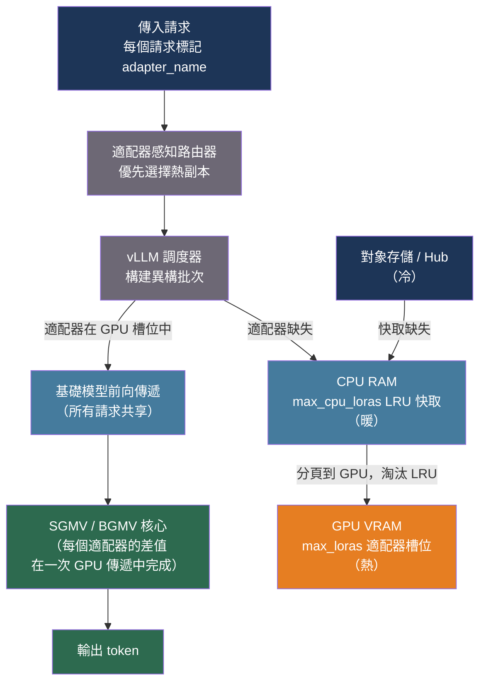

# [BEE-30060] Multi-LoRA 服務與適配器管理

:::info
LoRA 微調產生緊湊的適配器權重（10–100 MB），使基礎模型能夠針對特定領域或租戶進行專門化。將每個適配器作為獨立模型副本部署在規模化場景下不可行。專用的 Multi-LoRA 服務系統在數千個並發適配器之間共享基礎模型，使用自定義 GPU 核心跨異構適配器批量計算，並通過 GPU/CPU/磁盤快取層級分頁管理適配器權重——吞吐量可達到單模型服務器的 90% 以上。
:::

## 背景

低秩適應（LoRA），由 Hu 等人（arXiv:2106.09685，ICLR 2022）提出，通過向選定的權重矩陣添加低秩矩陣對 A 和 B 來微調模型，更新表示為 ΔW = B·A。只有 A 和 B 被訓練；基礎模型保持凍結。對於形狀為 (d_in, d_out)、秩為 r 的權重矩陣，適配器存儲 r·(d_in + d_out) 個參數——通常每個適配器為 10–100 MB，而 bf16 格式的 Llama-7B 達 14 GB。這使得按租戶或按用途的微調在經濟上可行。

服務問題在於，樸素的多適配器部署將每個適配器合並到基礎模型的獨立副本中，N 個適配器需要 N 份完整的 GPU 記憶體分配。在五個適配器時，A100 80 GB 在 Llama-7B 下便耗盡記憶體。MLSys 2024 的兩項互補研究解決了這一問題：

**Punica**（Chen 等人，arXiv:2310.18547，MLSys 2024）解決了計算問題。在標準 LLM 推論中，批次中的所有請求共享同一個基礎模型權重矩陣，因此一次批量 GEMM 涵蓋整個批次。LoRA 添加了每個請求的差值 y_i += x_i · A_i · B_i，其中 A_i、B_i 因請求而異。Punica 引入了 SGMV（分段聚集矩陣向量乘法）CUDA 核心，按適配器身份分組請求，並在預填充階段使用 Tensor Core 執行分組 GEMM。對於單 token 解碼，更簡單的 BGMV（批量聚集矩陣向量乘法）處理記憶體瓶頸場景。在實踐中，批次內的適配器異質性增加的延遲可忽略不計：批次大小為 64、全異構適配器的 SGMV 耗時 116 µs，而全同類適配器僅需 37 µs——這 3 倍開銷遠低於基礎模型注意力計算。核心結果：Punica 比最先進的多 LoRA 基準實現了 12 倍的高吞吐量，並達到僅基礎模型 vLLM 服務器的 88–92%（Llama-7B 在 A100 上為 1,044 對 1,140 tokens/s）。

**S-LoRA**（Sheng 等人，arXiv:2311.03285，MLSys 2024）解決了記憶體問題。它將 PagedAttention 的分頁記憶體管理器擴展到在同一統一池中同時處理 KV 快取張量和 LoRA 適配器權重。由於 LoRA 矩陣具有等於模型隱藏尺寸 d 的維度，將頁面大小設置為 d 意味著兩種張量類型都以統一的 d 向量頁面管理，無碎片化。當前未使用的適配器駐留在 CPU RAM 中，按需分頁到 GPU；S-LoRA 在單個 A100 80 GB 上測試了 2,000 個並發適配器，而 vLLM-packed 在 5 個適配器後耗盡記憶體，在相同負載下吞吐量高出 4 倍。

**dLoRA**（Wu 等人，USENIX OSDI 2024）增加了動態適配器管理：每次批次時，調度器決定是將適配器合並到基礎模型權重中（當一個適配器主導批次時更高效），還是保持適配器獨立並使用 SGMV 風格批處理（對異構工作負載更高效）。dLoRA 的基於積分的調度器比普通 vLLM 實現高達 57.9 倍的吞吐量，比 S-LoRA 在混合工作負載下低 1.8 倍的平均延遲。

## 最佳實踐

### 在設置服務參數前了解適配器記憶體

**必須（MUST）** 計算預期的適配器記憶體以正確配置 CPU 快取大小。對於隱藏維度為 d、在 L 個 Transformer 層上以秩 r 適配的 bf16 模型：

```
adapter_bytes = 2 * r * d * L * 2   # 係數 2：A 矩陣 + B 矩陣；bf16 每個參數 2 字節

# Llama-3.1-8B：d=4096，L=32，r=16，僅適配 q_proj + v_proj（每層 2 個矩陣）
# = 2 * 16 * 4096 * 32 * 2 * 2 = 33,554,432 字節 ≈ 32 MB 每個適配器
# CPU RAM 中 1,000 個適配器：~32 GB（現代服務器節點可行）
```

常見模型在 bf16 格式、適配 q、k、v、o 投影（每層 4 個矩陣）時的具體大小：

| 模型 | 秩 | 適配器大小 |
|---|---|---|
| Llama-3.1-8B (d=4096, L=32) | 8 | 32 MB |
| Llama-3.1-8B | 16 | 64 MB |
| Llama-3.1-8B | 64 | 256 MB |
| Llama-3.1-70B (d=8192, L=80) | 16 | 512 MB |
| Llama-3.1-70B | 64 | 2,048 MB |

**不得（MUST NOT）** 將 `--max-lora-rank` 設置得高於任何適配器實際使用的最大秩。vLLM 為此秩在所有活動適配器槽位預分配 GPU 記憶體；過度配置浪費了本可用於服務請求的 GPU 記憶體。

### 為生產環境配置 vLLM 的 Multi-LoRA 引擎

**應該（SHOULD）** 使用 vLLM 內置的 Multi-LoRA 支持，而非運行多個服務器實例。關鍵參數：

```python
from vllm import LLM, SamplingParams
from vllm.lora.request import LoRARequest

llm = LLM(
    model="meta-llama/Llama-3.1-8B-Instruct",
    enable_lora=True,
    max_loras=4,           # 單批次中同時駐留 GPU 的適配器數量
    max_cpu_loras=32,      # CPU LRU 快取大小；必須 >= max_loras
    max_lora_rank=16,      # 為此秩預分配 GPU 記憶體
)

# 每個請求通過名稱和路徑指定其適配器
outputs = llm.generate(
    ["請摘要以下合約：..."],
    SamplingParams(temperature=0.0, max_tokens=256),
    lora_request=LoRARequest(
        lora_name="legal-summarizer",          # 用於路由的邏輯名稱
        lora_int_id=1,                         # 用於批次追蹤的整數 ID
        lora_path="s3://adapters/legal-v2/",  # HuggingFace Hub、S3 或本地路徑
    ),
)
```

對於 OpenAI 兼容 HTTP API，在 `model` 字段中指定適配器：

```bash
# 啟動時用 --lora-modules legal-summarizer=s3://adapters/legal-v2 預注冊適配器
curl http://localhost:8000/v1/completions \
  -H "Content-Type: application/json" \
  -d '{
    "model": "legal-summarizer",
    "prompt": "請摘要以下合約條款：",
    "max_tokens": 256
  }'
```

**運行時動態載入**（添加新適配器時避免服務器重啟）：

```bash
# 啟用動態載入
export VLLM_ALLOW_RUNTIME_LORA_UPDATING=True

# 不重啟即可載入新適配器
curl -X POST http://localhost:8000/v1/load_lora_adapter \
  -H "Content-Type: application/json" \
  -d '{"lora_name": "medical-coder", "lora_path": "s3://adapters/medical-v1/"}'

# 原地熱重載更新的適配器權重（例如 RL 訓練步驟後）
curl -X POST http://localhost:8000/v1/load_lora_adapter \
  -H "Content-Type: application/json" \
  -d '{"lora_name": "policy-v3", "lora_path": "s3://adapters/policy-v3/", "load_inplace": true}'

# 卸載適配器以釋放其 CPU 快取槽位
curl -X DELETE http://localhost:8000/v1/unload_lora_adapter \
  -H "Content-Type: application/json" \
  -d '{"lora_name": "deprecated-adapter"}'
```

### 將請求路由到已持有適配器的副本

**應該（SHOULD）** 在負載均衡器層實現適配器感知路由，以最小化代價高昂的 GPU↔CPU 交換。已將請求適配器駐留在 GPU 的副本可以全速處理請求；路由到冷副本則強制進行適配器載入（64 MB 適配器需 2 ms），使批次停滯。

```python
from collections import defaultdict
from typing import Optional
import random

class AdapterAwareRouter:
    """
    將請求路由到最可能已將適配器駐留在 GPU 的副本。
    當沒有熱副本存在時，回退到隨機分配。
    """

    def __init__(self, replicas: list[str]) -> None:
        self.replicas = replicas
        # 追蹤每個副本哪些適配器已駐留 GPU（max_loras 個槽位）
        self._hot: dict[str, set[str]] = {r: set() for r in replicas}

    def route(self, adapter_name: str) -> str:
        warm = [r for r in self.replicas if adapter_name in self._hot[r]]
        return random.choice(warm) if warm else random.choice(self.replicas)

    def notify_loaded(self, replica: str, adapter_name: str, evicted: Optional[str]) -> None:
        """在服務引擎報告適配器已分頁到 GPU 後調用。"""
        self._hot[replica].add(adapter_name)
        if evicted:
            self._hot[replica].discard(evicted)
```

對於 Kubernetes 部署，**應該（SHOULD）** 為適配器適合單個副本 `max_loras` 預算的租戶設置 `sessionAffinity: ClientIP` 或使用一致性哈希入口，將其請求保持在同一副本上。

### 通過路徑編碼而非名稱別名進行適配器版本管理

**應該（SHOULD）** 將適配器名稱視為不可變標識符，並將版本編碼到存儲路徑中。更改名稱需要更新所有路由配置；僅更改路徑允許原地重載：

```
# 推薦路徑約定
s3://adapters/{base_model}/{tenant}/{adapter_name}/{version}/

# 藍綠部署
s3://adapters/llama-3.1-8b/acme/legal-summarizer/v3/   # 新版本
s3://adapters/llama-3.1-8b/acme/legal-summarizer/v2/   # 舊版本（保留用於回滾）

# 通過原地熱重載在現有邏輯名稱下推廣新版本
POST /v1/load_lora_adapter {"lora_name": "acme-legal", "lora_path": "...v3/", "load_inplace": true}
# 流量立即切換；v2 路徑保留，可通過另一次原地重載回滾
```

**不得（MUST NOT）** 在運行中的服務器中為每個適配器版本維護獨立的邏輯名稱——CPU LRU 快取會被永不被淘汰的過時版本填滿，佔用快取槽位。

### 一起調整 `max_loras` 和 `max_cpu_loras`

**應該（SHOULD）** 根據工作負載配置 `max_loras`（GPU 駐留槽位）和 `max_cpu_loras`（CPU LRU 槽位）：

```python
# 經驗法則：
# max_loras：單個批次窗口（~100ms）中預期的不同適配器數量
#            從 4-8 開始；如果峰值負載下適配器缺失率 > 5% 則增加。
# max_cpu_loras：活躍工作集中的不同適配器數量（最近 ~1 小時）
#                = 每小時使用的唯一適配器數 * 1.2（20% 緩衝）
#
# CPU LRU 快取佔用的記憶體（估算）：
# cpu_cache_bytes = max_cpu_loras * adapter_size_bytes
# 32 個適配器，每個 64 MB = 2 GB CPU RAM——現代節點完全可行。
#
# 活躍適配器槽位佔用的 GPU 記憶體（估算）：
# gpu_adapter_bytes = max_loras * max_lora_rank * d_model * 2 * num_layers * 2
# max_loras=4，rank=16，Llama-3.1-8B：4 * 16 * 4096 * 2 * 32 * 2 = 256 MB
```

## 圖解



## 常見錯誤

**每個適配器運行一個服務器進程。** 這使基礎模型的 GPU 記憶體消耗乘以適配器數量。Llama-3.1-8B 在 bf16 下佔用 16 GB；10 個適配器在獨立進程中需要 160 GB GPU 記憶體。Multi-LoRA 服務無論注冊多少適配器，都只在 GPU 記憶體中保留一份基礎模型。

**將 `max_lora_rank` 設置為最大可能值（例如 256）「以保證安全」。** vLLM 為秩 256 的適配器槽位預分配 GPU 記憶體，即使您的適配器使用秩 16。這浪費了 16 倍的預期 GPU 記憶體。始終將 `max_lora_rank` 設置為部署適配器中的實際最大秩。

**在負載均衡器中忽略適配器本地性。** 在活躍適配器數量超過每個副本的 `max_loras` 時，無適配器親和性的路由會在每個請求上觸發 GPU↔CPU 交換。單次適配器載入需要 ~2 ms；在高 QPS 下，這在病態情況下可為每個請求增加數秒延遲。

**將 Medusa 或投機解碼與 Multi-LoRA 結合使用。** 大多數投機解碼實現（包括 vLLM 的 EAGLE 和 Medusa 後端）與 LoRA 適配器路徑不兼容，因為草稿頭或輔助頭是針對基礎模型而非適配後的權重訓練的。服務 LoRA 適配器時應停用投機解碼。

**在秩 16 足夠時以秩 64+ 訓練適配器。** 對於大多數微調任務，更高的秩只能略微提升適配器表達能力，但適配器記憶體翻倍，SGMV 核心計算時間也翻倍。在為生產確定更高秩之前，應在秩 8、16 和 32 上評估適配器品質。

**將 Medusa 微調的模型與第三方 LoRA 適配器一起部署。** Medusa 頭與主幹聯合微調；添加改變主幹輸出分布的 LoRA 適配器會使 Medusa 頭預測失效，導致高拒絕率和淨負延遲影響。

## 相關 BEE

- [BEE-18001](../multi-tenancy/multi-tenancy-models.md) -- 多租戶模型：按租戶的適配器路由是租戶隔離的一種形式
- [BEE-30021](llm-inference-optimization-and-self-hosting.md) -- LLM 推論優化與自托管：更廣泛的推論優化領域
- [BEE-30059](speculative-decoding-for-llm-inference.md) -- LLM 推論的投機解碼：與大多數 LoRA 適配器部署不兼容；二者擇其一

## 參考資料

- [Hu et al. LoRA: Low-Rank Adaptation of Large Language Models — arXiv:2106.09685, ICLR 2022](https://arxiv.org/abs/2106.09685)
- [Chen et al. Punica: Multi-Tenant LoRA Serving — arXiv:2310.18547, MLSys 2024](https://arxiv.org/abs/2310.18547)
- [Sheng et al. S-LoRA: Serving Thousands of Concurrent LoRA Adapters — arXiv:2311.03285, MLSys 2024](https://arxiv.org/abs/2311.03285)
- [Wu et al. dLoRA: Dynamically Orchestrating Requests and Adapters for LoRA LLM Serving — USENIX OSDI 2024](https://dl.acm.org/doi/10.5555/3691938.3691987)
- [Li et al. CaraServe: CPU-Assisted and Rank-Aware LoRA Serving — arXiv:2401.11240, 2024](https://arxiv.org/abs/2401.11240)
- [vLLM. LoRA Adapter Documentation — github.com/vllm-project/vllm](https://github.com/vllm-project/vllm/blob/main/docs/features/lora.md)
- [Predibase. LoRAX: The Open-Source Framework for Serving Hundreds of Fine-Tuned LLMs — github.com/predibase/lorax](https://github.com/predibase/lorax)
- [Anyscale. Multi-LoRA Serving with Ray Serve LLM — docs.anyscale.com](https://docs.anyscale.com/llm/serving/multi-lora)
- [NVIDIA. Deploying a Swarm of LoRA Adapters with NIM — developer.nvidia.com](https://developer.nvidia.com/blog/seamlessly-deploying-a-swarm-of-lora-adapters-with-nvidia-nim/)
