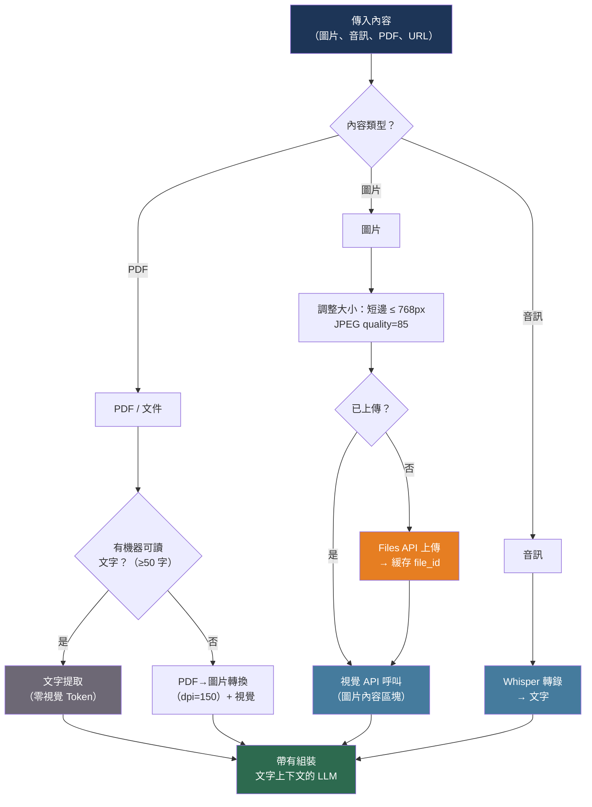

# [BEE-521] 多模態 LLM 整合模式

:::info
多模態 LLM 接受圖片、音訊和文件作為文字之外的輸入。正確整合它們需要了解每種模態如何被 Token 化、計價、預處理及傳遞給 API——因為在攝取層做出的決策決定了模型輸出的品質和每次請求的成本。
:::

## 背景

僅支援文字的 LLM 主導了第一波生產部署。向多模態模型的轉變——由 GPT-4V（2023）、Claude 3（2024）和 Gemini 的原生多模態架構觸發——將輸入合約從 Token 字串擴展到任意排列的文字、圖片、音訊和文件區塊的序列。這大幅改變了整合層。

各供應商的底層機制相同：視覺編碼器（通常是 ViT 或 CLIP 衍生模型）將圖片像素轉換為 Patch 嵌入，這些嵌入被投影到與文字 Token 相同的嵌入空間，並在自回歸解碼器處理之前與文字序列串聯。其結果是圖片消耗 Token 預算、每個處理的像素都有成本，並與文字競爭上下文視窗——所有這些都需要在應用層明確關注。

音訊走的是不同的路徑：OpenAI 的 Whisper 架構在語言模型看到之前將語音轉換為文字，而較新的即時架構（GPT-4o Realtime、Gemini Live）以端到端的方式將音訊作為原生模態處理。這兩種模型的整合合約差異顯著。

## 設計思維

多模態整合增加了純文字整合所沒有的三個維度：

**模態預處理**：圖片必須在 API 呼叫之前調整大小、重新格式化，並可選擇壓縮。當 640×480 的 JPEG 就足夠時，發送 12MP 的原始 JPEG 會浪費 Token 並增加延遲。音訊必須採用支援的容器格式並在時長限制內。

**Token 成本與文件大小不成線性比例**：相同解析度的 100KB JPEG 與 1MB JPEG 消耗相同數量的視覺 Token。Token 成本由像素尺寸決定，而非文件大小。了解供應商的分塊或 Patch 系統是成本估算的前提。

**內容路由**：並非每頁文件都能從視覺中受益。機器可讀文字的頁面通過 PDF 文字提取處理比通過視覺更便宜且更準確。掃描的表單或圖表必須使用視覺。攝取層的路由邏輯——視覺與文字提取——通常是文件密集型工作負載中最高效益的優化。

## 最佳實踐

### 發送前預處理圖片

**MUST**（必須）在編碼前將圖片調整為任務所需的最小解析度。較大的圖片消耗更多 Token 且成本更高；模型在典型任務上的準確性不會超過中等解析度後繼續提升：

```python
from PIL import Image
import io
import base64

def prepare_image(path: str, max_short_edge: int = 768) -> tuple[str, str]:
    """
    調整大小使短邊 <= max_short_edge。
    返回 (base64_string, media_type)。
    """
    img = Image.open(path).convert("RGB")
    w, h = img.size
    scale = min(1.0, max_short_edge / min(w, h))
    if scale < 1.0:
        img = img.resize((int(w * scale), int(h * scale)), Image.LANCZOS)

    buf = io.BytesIO()
    img.save(buf, format="JPEG", quality=85)
    b64 = base64.b64encode(buf.getvalue()).decode()
    return b64, "image/jpeg"
```

**SHOULD**（應該）在設計成本預算前了解每個供應商計算視覺 Token 的方式：

| 供應商 | 計費模型 | 1024×1024 的近似 Token 數 |
|--------|---------|--------------------------|
| OpenAI（`detail: high`）| 85 基礎 + 每個 512×512 分塊 170 個 | ~765 個 Token |
| OpenAI（`detail: low`）| 無論大小統一 85 個 Token | 85 個 Token |
| Anthropic（Claude 3.5+）| 1092×1092 約 1,590 個 Token | ~1,590 個 Token |
| Google Gemini 1.5+ | 每張圖片（≤384px）258 個 Token，最多 1,290 個 | ~1,290 個 Token |

**SHOULD** 對不需要精細像素細節的任務使用 `detail: low`（OpenAI）——UI 佈局偵測、高階圖片分類、縮圖識別。對於全解析度圖片，成本差異約為 9 倍。

**MUST NOT**（不得）發送寬或高超過 8,000 像素的圖片。大多數供應商會拒絕或靜默截斷超過其最大尺寸的圖片。為安全起見，長邊上限設為 2,048px。

### 使用正確的內容區塊結構傳遞圖片

兩個主要供應商都將圖片嵌入 `messages` 陣列中作為類型化的內容區塊，而非作為獨立參數。結構有所不同：

```python
import anthropic
import openai

# Anthropic：圖片作為內容區塊與文字並列
anthropic_client = anthropic.Anthropic()

def analyze_with_claude(b64_image: str, media_type: str, question: str) -> str:
    response = anthropic_client.messages.create(
        model="claude-sonnet-4-6",
        max_tokens=1024,
        messages=[{
            "role": "user",
            "content": [
                {
                    "type": "image",
                    "source": {
                        "type": "base64",
                        "media_type": media_type,  # "image/jpeg"、"image/png" 等
                        "data": b64_image,
                    },
                },
                {"type": "text", "text": question},
            ],
        }],
    )
    return response.content[0].text


# OpenAI：訊息中的 image_url 內容類型
openai_client = openai.OpenAI()

def analyze_with_openai(b64_image: str, media_type: str, question: str) -> str:
    data_url = f"data:{media_type};base64,{b64_image}"
    response = openai_client.chat.completions.create(
        model="gpt-4o",
        messages=[{
            "role": "user",
            "content": [
                {
                    "type": "image_url",
                    "image_url": {"url": data_url, "detail": "high"},
                },
                {"type": "text", "text": question},
            ],
        }],
    )
    return response.choices[0].message.content
```

**SHOULD** 在內容陣列中將圖片放在引用它們的文字之前。根據經驗，模型對出現在問題之前的圖片的關注更準確——這與人類閱讀的方式相同：先看，再解釋。

**SHOULD** 當圖片已託管且可公開存取時使用 URL 引用（傳遞公開的 HTTPS URL 而非 base64）。URL 引用跳過 base64 編碼開銷並減少請求負載大小：

```python
# 基於 URL 的引用——不需要 base64
{"type": "image_url", "image_url": {"url": "https://example.com/chart.png", "detail": "high"}}
```

### 在文字提取與視覺之間路由文件

**SHOULD** 實作根據文件內容類型選擇適當處理路徑的路由層：

```python
import pdfplumber

def process_document_page(pdf_path: str, page_num: int) -> dict:
    """
    根據內容將每頁路由到視覺或文字提取。
    返回 {"text": ..., "method": "extraction"|"vision"}。
    """
    with pdfplumber.open(pdf_path) as pdf:
        page = pdf.pages[page_num]
        extracted_text = page.extract_text() or ""

    word_count = len(extracted_text.split())

    if word_count >= 50:
        # 足夠的機器可讀文字——跳過此頁的視覺處理
        return {"text": extracted_text, "method": "extraction"}
    else:
        # 掃描頁面、表單或圖表——發送到視覺
        from pdf2image import convert_from_path
        images = convert_from_path(pdf_path, first_page=page_num + 1, last_page=page_num + 1, dpi=150)
        b64, media_type = prepare_image_from_pil(images[0])
        vision_response = analyze_with_claude(b64, media_type, "提取所有文字並描述任何非文字內容。")
        return {"text": vision_response, "method": "vision"}
```

**MUST NOT** 將大型 PDF 的每一頁都發送到視覺。一份 200 頁的文件，每個視覺頁面約 1,590 個 Token，在語言模型處理一個字的上下文之前就消耗了大約 318,000 個輸入 Token。文字提取的成本為零 Token。

**SHOULD** 將 PDF 頁面轉換為圖片進行視覺處理時，將 DPI 設置在 100 到 200 之間。DPI 72 產生像素化輸出，會降低 OCR 品質；高於 200 的 DPI 會將圖片尺寸膨脹到超出模型可以利用的範圍。

### 使用語音轉文字 API 轉錄音訊

**SHOULD** 使用 Whisper 在將語音內容傳遞給 LLM 之前進行轉錄，除非需要即時語音互動：

```python
from openai import OpenAI

client = OpenAI()

def transcribe_audio(audio_path: str, language: str = None) -> str:
    """
    轉錄音訊文件。支援：flac、mp3、mp4、mpeg、mpga、m4a、ogg、wav、webm。
    最大文件大小：25MB。
    """
    with open(audio_path, "rb") as audio_file:
        transcript = client.audio.transcriptions.create(
            model="whisper-1",
            file=audio_file,
            language=language,     # ISO-639-1 代碼；None 讓 Whisper 自動偵測
            response_format="text",
        )
    return transcript


def transcribe_and_analyze(audio_path: str, system_prompt: str) -> str:
    """完整流程：轉錄，然後將文字發送給 LLM。"""
    transcript = transcribe_audio(audio_path)
    response = client.chat.completions.create(
        model="gpt-4o",
        messages=[
            {"role": "system", "content": system_prompt},
            {"role": "user", "content": transcript},
        ],
    )
    return response.choices[0].message.content
```

**MUST** 在發送到轉錄 API 之前將大於 25MB 的音訊文件分塊。重疊塊 2-3 秒以避免在段落邊界切割單詞：

```python
from pydub import AudioSegment

def chunk_audio(path: str, chunk_ms: int = 60_000, overlap_ms: int = 2_000) -> list[AudioSegment]:
    audio = AudioSegment.from_file(path)
    chunks = []
    start = 0
    while start < len(audio):
        end = min(start + chunk_ms, len(audio))
        chunks.append(audio[start:end])
        start += chunk_ms - overlap_ms
    return chunks
```

### 使用 Files API 重用圖片資產

當相同圖片出現在多個請求中時（每張發票中的標誌、標準表單模板），重複上傳會增加負載大小和延遲。Anthropic Files API 和類似的上傳端點讓您一次上傳並通過 ID 引用：

```python
import anthropic

client = anthropic.Anthropic()

def upload_image_once(path: str) -> str:
    """上傳圖片並返回 file_id 以跨請求重用。"""
    with open(path, "rb") as f:
        response = client.beta.files.upload(
            file=(path.split("/")[-1], f, "image/png"),
        )
    return response.id  # 例如 "file_abc123"


def analyze_with_file_id(file_id: str, question: str) -> str:
    response = client.beta.messages.create(
        model="claude-sonnet-4-6",
        max_tokens=1024,
        messages=[{
            "role": "user",
            "content": [
                {
                    "type": "image",
                    "source": {"type": "file", "file_id": file_id},
                },
                {"type": "text", "text": question},
            ],
        }],
        betas=["files-api-2025-04-14"],
    )
    return response.content[0].text
```

**SHOULD** 緩存 file ID 並在文件保留在供應商伺服器上的期間重用它們。這將請求負載從千字節（base64）減少到一個短字符串。

### 明確處理多模態錯誤

**MUST** 將圖片上的內容策略拒絕與其他 API 錯誤分開處理。視覺模型應用內容分類器（SafeSearch 等效），可能拒絕處理包含特定內容的圖片：

```python
def safe_vision_call(b64_image: str, media_type: str, question: str) -> dict:
    try:
        text = analyze_with_claude(b64_image, media_type, question)
        return {"ok": True, "text": text}
    except anthropic.BadRequestError as e:
        if "image" in str(e).lower() or "content" in str(e).lower():
            return {"ok": False, "error": "content_policy", "detail": str(e)}
        raise
    except anthropic.APIError as e:
        if "Could not process image" in str(e):
            return {"ok": False, "error": "unsupported_format", "detail": str(e)}
        raise
```

**MUST NOT** 在錯誤日誌中記錄或持久化圖片的 base64 內容。Base64 編碼的圖片可能任意大，且可能包含個人或敏感內容。

**SHOULD** 在 API 呼叫之前驗證圖片格式和尺寸，以提早捕獲常見的拒絕原因：

```python
from PIL import Image
import io

def validate_image(data: bytes) -> None:
    """對 API 可能拒絕的圖片拋出 ValueError。"""
    img = Image.open(io.BytesIO(data))
    w, h = img.size
    if w > 8000 or h > 8000:
        raise ValueError(f"圖片 {w}×{h} 超過 8000px 限制")
    if img.format not in ("JPEG", "PNG", "GIF", "WEBP"):
        raise ValueError(f"不支援的格式：{img.format}")
    if len(data) > 20 * 1024 * 1024:  # 保守的 20MB 限制
        raise ValueError("圖片超過大小限制")
```

## 視覺圖



## 相關 BEE

- [BEE-30001](llm-api-integration-patterns.md) -- LLM API 整合模式：文字 API 的重試、超時和客戶端配置模式同樣適用於多模態呼叫；視覺和音訊端點共享相同的 HTTP 客戶端
- [BEE-30010](llm-context-window-management.md) -- LLM 上下文視窗管理：圖片消耗上下文視窗的大量部分；相同的 Token 預算紀律適用於多模態輸入
- [BEE-30011](ai-cost-optimization-and-model-routing.md) -- AI 成本優化與模型路由：圖片 Token 成本在規模上遠超文字 Token 成本；在選擇模型時，成本路由邏輯必須考慮視覺 Token 定價
- [BEE-30016](llm-streaming-patterns.md) -- LLM 串流模式：多模態響應的串流方式與文字響應相同；對於圖片密集型請求，第一個串流 Token 在視覺編碼器完成後才出現，導致更高的 TTFT

## 參考資料

- [OpenAI. Vision — platform.openai.com](https://platform.openai.com/docs/guides/vision)
- [OpenAI. Speech to Text — platform.openai.com](https://platform.openai.com/docs/guides/speech-to-text)
- [OpenAI. Text to Speech — developers.openai.com](https://developers.openai.com/api/docs/guides/text-to-speech)
- [Anthropic. Vision — platform.claude.com](https://platform.claude.com/docs/en/build-with-claude/vision)
- [Anthropic. Files API — platform.claude.com](https://platform.claude.com/docs/en/build-with-claude/files)
- [Google. Gemini 圖片理解 — ai.google.dev](https://ai.google.dev/gemini-api/docs/image-understanding)
- [OpenAI. GPT-4V 系統說明 — cdn.openai.com](https://cdn.openai.com/papers/GPTV_System_Card.pdf)
- [Sebastian Raschka. 理解多模態 LLM — magazine.sebastianraschka.com](https://magazine.sebastianraschka.com/p/understanding-multimodal-llms)
- [OpenAI. Whisper（開源 ASR）— github.com/openai/whisper](https://github.com/openai/whisper)
