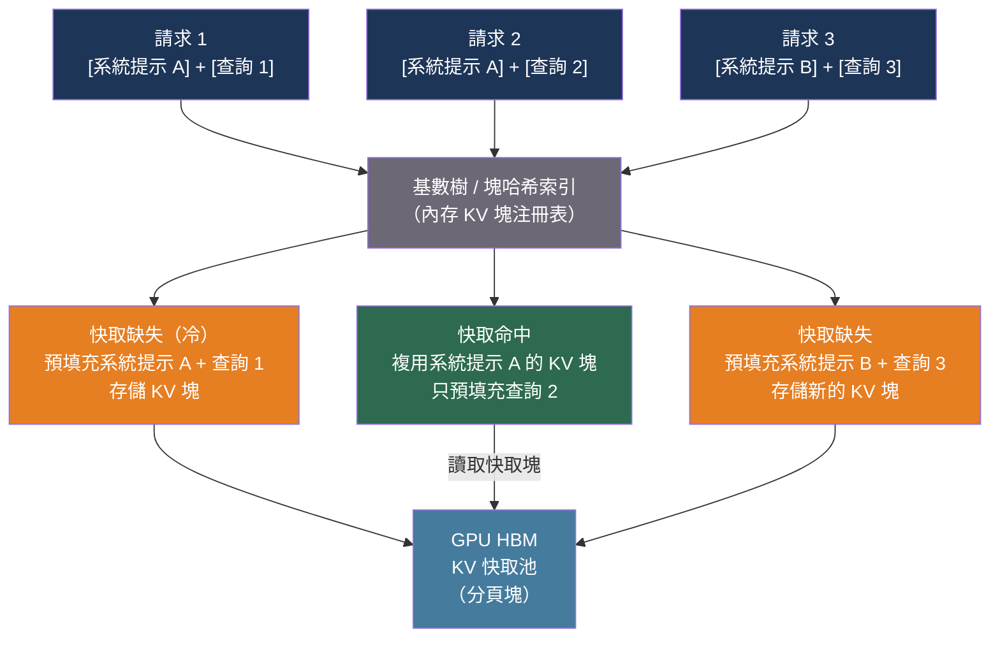

# [BEE-30063] 前綴快取與 KV 快取複用

:::info
當許多 LLM 請求共享相同前綴——系統提示、已檢索的文件或少樣本示例——時，該前綴的預填充計算對每個請求都重複進行。前綴快取存儲生成的 KV 張量並在請求間複用，對長共享提示可將 TTFT 降低最多 86%，API 費用降低最多 90%。
:::

## 背景

LLM 推論的預填充階段為每個輸入 token 計算 KV（鍵值）快取條目。這些中間張量被後續注意力層使用，大小與序列長度成正比。對於一個 10,000 token 的系統提示，預填充需要數秒並產生數 GB 的 KV 數據——而每個發送相同提示的請求的數據都是完全相同的。

沒有前綴快取時，100 個使用相同 2,000 token 系統提示的並發用戶會導致 100 次獨立的預填充計算。每次都以正比於 prefix_length × n_layers × head_dim² 的 GPU FLOPS 和記憶體頻寬代價產生相同的 KV 張量，而該張量在每個請求完成後被丟棄。

前綴快取打破了這一模式。第一個請求計算並存儲 KV 張量；後續請求跳過已快取前綴的預填充，從快取命中邊界恢復推論。TTFT 變得正比於未快取的後綴長度，而非完整提示長度。對於帶有 10,000 token 已快取前綴的 Qwen3-32B 模型，TTFT 從 4.3 秒降至 0.6 秒——降低了 86%。

**RadixAttention** 在 SGLang（Zheng 等人，arXiv:2312.07104，NeurIPS 2024）中引入，實現了首個 LLM 服務的通用前綴快取機制。SGLang 維護一個基數樹，將 token 前綴序列映射到 GPU 記憶體中的 KV 快取塊。當新請求到達時，調度器遍歷樹找到最長匹配前綴；只有不匹配的後綴需要預填充。LRU 淘汰策略首先移除葉節點。快取感知調度器按匹配前綴長度對傳入請求排序——近似深度優先樹遍歷——以最大化複用。Vicuna-33B 的生產部署實現了 74.1% 的快取命中率和平均 1.7 倍的 TTFT 降低；LLaVA-NeXT-34B 實現了 52.4% 的命中率和最高 6 倍的吞吐量提升。

**vLLM 自動前綴快取（APC）** 通過基於塊的哈希複用擴展了 PagedAttention。每個 16 token 的 KV 塊由 SHA-256 哈希標識，該哈希從其父塊的哈希和塊中的 token ID 鏈式計算。鏈式哈希意味著單次哈希查找可驗證整個匹配前綴。APC 在當前 vLLM 版本中默認啟用。對於前綴重疊率高的工作負載，它提供約 13% 的吞吐量提升和約 10% 的 TPOT 降低；對於無重疊的工作負載，由於調度器開銷，它增加約 37% 的額外負擔。

在 API 層，Anthropic（提示快取，2024 年 12 月正式發布）和 OpenAI（自動前綴快取）提供了服務端 KV 複用，無需基礎設施管理。Anthropic 的 API 需要顯式的 `cache_control` 斷點；OpenAI 的以 128 token 粒度自動檢測共享前綴。Anthropic 的測試數據顯示長提示工作負載的 TTFT 降低 79–90%，成本降低 53–90%。

## 最佳實踐

### 在每個邊界將靜態內容置於動態內容之前

**必須（MUST）** 將提示結構化為穩定內容在前、可變內容在後。快取命中需要從提示開頭到快取邊界的精確 token 級前綴匹配。快取段中任何字符的更改都會使該段及所有後續內容失效。

```python
import anthropic

client = anthropic.Anthropic()

# 系統提示：大型、靜態、可快取
SYSTEM_PROMPT = """您是一位法律文件分析師。
[... 5,000 token 的穩定指令和領域知識 ...]"""

def analyze_clause(user_query: str, doc_excerpt: str) -> str:
    response = client.messages.create(
        model="claude-sonnet-4-6",
        max_tokens=1024,
        system=[
            {
                "type": "text",
                "text": SYSTEM_PROMPT,
                "cache_control": {"type": "ephemeral"},  # 標記快取邊界
            }
        ],
        messages=[
            {
                "role": "user",
                # 動態內容放在已快取的系統提示之後，
                # 而不是放在其中。快取塊中的時間戳或用戶 ID
                # 會使每個快取條目失效。
                "content": f"請分析這個條款：\n\n{doc_excerpt}\n\n問題：{user_query}",
            }
        ],
    )
    return response.content[0].text
```

**不得（MUST NOT）** 在快取段中包含時間戳、請求 ID、每用戶標識符或任何每請求變化的內容。對於 Anthropic 的 API，每個請求最多 4 個快取斷點；將它們放在每個穩定段的末尾。

### 將系統提示作為版本化工件進行管理

**應該（SHOULD）** 將系統提示視為代碼——版本控制、審查並原子部署。單個字符的差異（尾隨空格、不同引號樣式、字段重新排序）會破壞快取，並導致 TTFT 峰值。

```python
# prompts/legal_analyst_v3.txt — 提交到版本控制
SYSTEM_PROMPT_HASH = "sha256:a3f4..."  # 部署時驗證

def load_system_prompt(version: str) -> str:
    """從內容尋址存儲加載提示以保證不可變性。"""
    path = f"prompts/legal_analyst_{version}.txt"
    return open(path).read()

# 運行時：在使用前驗證提示沒有偏移
import hashlib

def get_verified_prompt(version: str) -> str:
    text = load_system_prompt(version)
    digest = "sha256:" + hashlib.sha256(text.encode()).hexdigest()
    assert digest == SYSTEM_PROMPT_HASH, f"提示偏移檢測到：{digest}"
    return text
```

### 在 vLLM 中啟用 APC 並測量快取命中率

**應該（SHOULD）** 啟用 vLLM 的自動前綴快取並在聲稱達到性能目標之前監控其命中率：

```python
from vllm import LLM, SamplingParams

llm = LLM(
    model="meta-llama/Llama-3.1-8B-Instruct",
    enable_prefix_caching=True,   # 在當前 vLLM 中默認啟用
    gpu_memory_utilization=0.85,   # 為快取的 KV 塊留出餘量
)

# 前綴共享工作負載：所有請求以相同的系統提示開頭
SHARED_PREFIX = "您是一個有幫助的助手。" * 200  # 約 400 token

requests = [
    f"{SHARED_PREFIX}問題：{q}"
    for q in ["什麼是 RAG？", "解釋 GQA。", "什麼是投機解碼？"]
]

outputs = llm.generate(requests, SamplingParams(temperature=0.0, max_tokens=100))

# 通過 vLLM 的 /metrics 端點（Prometheus）查看前綴快取指標
# vllm:gpu_prefix_cache_hit_rate——前綴密集型工作負載目標 > 0.5
# vllm:gpu_prefix_cache_queries_total——總查詢次數
```

**不應（SHOULD NOT）** 對無前綴共享的工作負載啟用 APC。在隨機前綴工作負載上，APC 從調度器哈希計算和查詢增加約 37% 的開銷而無任何收益。在這些情況下使用 `--no-enable-prefix-caching` 禁用。

### 在多租戶部署中使用 cache_salt 進行租戶隔離

**應該（SHOULD）** 在 vLLM 多租戶部署中為每個租戶應用 `cache_salt`，以防止跨租戶快取共享並減輕計時旁路洩露：

```python
from vllm import LLM

llm = LLM(model="...", enable_prefix_caching=True)

# 每個租戶獲得不同的鹽值——它們的快取永不相交
def make_request(prompt: str, tenant_id: str) -> dict:
    return {
        "prompt": prompt,
        "cache_salt": tenant_id,  # 被納入塊哈希鏈
    }
```

`cache_salt` 被哈希到第一個塊的標識符中，確保即使相同的提示前綴也為不同租戶產生不同的快取鍵。這以約 38% 更高的 TTFT 和一些吞吐量為代價換取隔離保證。

### 調整 KV 快取大小以容納工作集前綴

**必須（MUST）** 在調整 KV 快取分配大小時考慮前綴快取駐留記憶體。在 bf16 格式的 Llama-3.1-8B 所有層中快取的 10,000 token 前綴佔用：

```
prefix_kv_bytes = 2 * n_kv_heads * head_dim * n_layers * prefix_len * 2
                = 2 * 8 * 128 * 32 * 10_000 * 2  # 字節
                = 1,310,720,000 字節 ≈ 1.25 GB
```

如果前綴快取持有 10 個不同的 10,000 token 前綴，則有 12.5 GB 的 KV 快取被快取（非活躍）條目佔用——這些記憶體無法用於活躍請求。在設置 `gpu_memory_utilization` 和 `max_model_len` 時需考慮前綴工作集。

## 比較

| 系統 | 粒度 | 斷點 | TTL | 成本模型 | 隔離 |
|---|---|---|---|---|---|
| SGLang RadixAttention | Token 級（基數樹） | 自動 | LRU | 開源（自托管） | 單租戶或按鹽值 |
| vLLM APC | 16 token 塊（鏈式哈希） | 自動 | LRU | 開源（自托管） | 按 `cache_salt` |
| Anthropic API | 內容塊邊界 | 顯式 `cache_control` | 5 分鐘（臨時），1 小時（延長） | 1.25x 寫入，0.1x 讀取 | 組織 / 工作區 |
| OpenAI API | 128 token 增量 | 自動 | 5–60 分鐘（LRU） | 0.5x 讀取（無寫入費用） | 組織 |

## 圖解



## 常見錯誤

**將可變內容置於固定內容之前。** 在開頭嵌入每請求時間戳的系統提示（例如 `"今天是 2026-04-15。"`）會使每個請求的快取失效，因為前綴不同。將所有動態內容移到用戶輪次，在最後一個快取斷點之後。

**期望前綴快取能加速 token 生成。** 前綴快取只加速預填充階段（TTFT）。解碼階段——生成每個輸出 token——不受影響。對於提示短、輸出長的工作負載（例如故事生成、代碼生成），收益很小。使用負載測試（BEE-30058）測量您特定工作負載的實際 TTFT 對比 TPOT。

**在測試中假設冷快取。** 第一個對冷快取的請求需要支付完整的預填充成本，以及快取寫入開銷（Anthropic 額外收取 25%）。只運行一個請求或在每次運行之間重啟服務器的基準測試會顯示前綴快取為淨負效益。在測量 TTFT 之前至少運行 5+ 次熱身請求。

**不對系統提示進行版本管理。** 部署中途的系統提示更改——修復錯別字、添加一句話——會使所有現有快取條目失效，導致所有用戶的 TTFT 峰值，直到新提示被快取。以謹慎的預熱策略部署提示更改：首先將少量流量路由到新提示，讓快取預熱，然後切換。

**忽略 Anthropic 的損益平衡分析。** Anthropic 的 5 分鐘臨時快取對寫入收取 1.25 倍的輸入 token 價格，對讀取收取 0.1 倍。如果一個快取前綴在其 TTL 內只被寫入一次但從未被命中，您付出的比不快取多 25%。前綴快取在 TTL 內預期讀取次數超過 `1 / (1 - 0.1/1.25)` ≈ 1.09 次時才是正收益——所以即使在 5 分鐘內只複用一次也能回本。對高流量前綴這很容易滿足；對稀有提示則可能不然。

**將前綴快取用作語義快取的替代品。** 前綴快取需要精確的 token 級匹配。語義上相同但措辭不同的提示（「您是有幫助的」對比「請提供幫助」）會錯過快取。對於近似重複的提示去重，語義快取（BEE-30056）是互補工具。

## 相關 BEE

- [BEE-30024](llm-caching-strategies.md) -- LLM 快取策略：響應級快取，與 KV 張量複用不同
- [BEE-30056](semantic-caching-for-llm-applications.md) -- LLM 應用的語義快取：基於嵌入的近似重複檢測，與精確前綴快取互補
- [BEE-30058](llm-load-testing-and-capacity-planning.md) -- LLM 負載測試與容量規劃：用於驗證前綴快取收益的 TTFT 測量
- [BEE-30062](flashattention-and-efficient-attention-kernels.md) -- FlashAttention 與高效注意力核心：前綴快取所避免的預填充計算

## 參考資料

- [Zheng et al. SGLang: Efficient Execution of Structured Language Model Programs — arXiv:2312.07104, NeurIPS 2024](https://arxiv.org/abs/2312.07104)
- [Kwon et al. Efficient Memory Management for Large Language Model Serving with PagedAttention — arXiv:2309.06180, SOSP 2023](https://arxiv.org/abs/2309.06180)
- [vLLM. Automatic Prefix Caching — docs.vllm.ai](https://docs.vllm.ai/en/latest/features/automatic_prefix_caching/)
- [Anthropic. Prompt Caching — claude.com/blog/prompt-caching](https://claude.com/blog/prompt-caching)
- [Anthropic. Prompt Caching API 文檔 — platform.claude.com](https://platform.claude.com/docs/en/docs/build-with-claude/prompt-caching)
- [OpenAI. Prompt Caching 公告 — openai.com](https://openai.com/index/api-prompt-caching/)
- [LMSYS. Fast and Expressive LLM Inference with RadixAttention and SGLang — lmsys.org](https://www.lmsys.org/blog/2024-01-17-sglang/)
