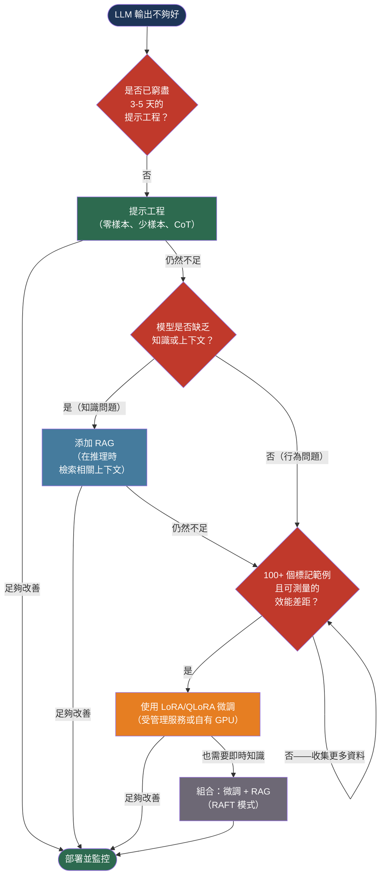

# [BEE-507] 提示工程 vs RAG vs 微調

:::info
讓 LLM 按照您的需求執行有三種方式——提示工程、檢索增強生成和微調——選錯方式會浪費數週的工作和數萬美元。正確的決策取決於您實際面對的是哪種問題。
:::

## 背景

當 GPT-3 於 2020 年發布時，應用程式開發者唯一可用的客製化機制是提示工程：在輸入中精心撰寫指令和範例。RAG 作為一種模式在 2020 年出現，並在 Lewis 等人的論文「Retrieval-Augmented Generation for Knowledge-Intensive NLP Tasks」（arXiv:2005.11401，NeurIPS 2020）中被正式確立，該論文表明在推理時檢索相關文件可以大幅提高開放域問答的事實準確性，且無需重新訓練模型。

微調在 LLM 出現之前就已存在，但當模型擴展到數十億個參數時，對大多數組織來說幾乎無法實際操作——更新所有權重的計算成本是令人望而卻步的。兩篇論文改變了這一局面。Edward Hu 等人的 LoRA: Low-Rank Adaptation of Large Language Models（arXiv:2106.09685，2021 年）表明，微調可以透過在每個 Transformer 注意力層中注入一對小型低秩矩陣來完成，可將可訓練參數減少 10,000 倍，且無推理延遲損失。Tim Dettmers 等人的 QLoRA: Efficient Finetuning of Quantized LLMs（arXiv:2305.14314，2023 年）在 LoRA 中加入了 4 位元量化，使在單個消費級 GPU 上微調 650 億參數模型成為可能。

這些發展創造了三種具有非常不同成本、複雜性和適用性的合法選項。從業者犯的錯誤是首先選擇微調——最昂貴且最耗時的選項——而沒有窮盡更簡單的方案。正確的預設順序是：首先嘗試提示工程，如果知識是瓶頸則使用 RAG，只有當無法透過其他方式在規模上實現一致的行為時才進行微調。

## 設計思維

每種客製化策略都解決 LLM 效能不佳的不同根本原因：

| 策略 | 解決的問題 | 改變什麼 |
|------|-----------|---------|
| 提示工程 | 模型不理解任務或格式 | 給模型的輸入 |
| RAG | 模型缺乏知識（過時或專有） | 推理時可用的上下文 |
| 微調 | 模型行為在規模上不一致 | 模型的權重 |

產生錯誤輸出格式的模型是提示工程問題。提供過時資訊或缺乏專有領域知識的模型是 RAG 問題。在提示工程窮盡後，有時正確遵循任務、有時不遵循的模型是微調候選者。

**提示工程始終是起點**，因為它不需要基礎設施、不需要訓練資料、不需要計算——只需要明確指定的任務。40-70% 的 LLM 問題在這個階段得到解決。

## 最佳實踐

### 在做其他任何事之前，先窮盡提示工程

**MUST（必須）** 首先嘗試提示工程。在得出模型無法透過指令完成任務的結論之前，至少花兩到五天時間迭代提示。

有效的技術，按複雜性排序：
- **零樣本（Zero-shot）**：精確描述任務並指定輸出格式
- **少樣本（Few-shot）**：提供三到五個高品質的輸入-輸出範例；範例的效果優於指令
- **思維鏈（Chain-of-thought）**：添加「逐步思考」或在範例中展示推理——光這一點通常就能解決推理任務的失敗
- **結構化輸出約束**：強制 JSON 模式或指定精確的 Schema 以消除格式不一致

提示工程在以下情況下失敗：模型缺乏底層知識（指令無法解決）、任務需要超過上下文視窗大小的數百個範例，或輸出必須在 99.9% 的請求中保持完美一致。

**SHOULD（應該）** 在得出提示工程不足之前，在具有代表性的測試集上測量基準效能。適用於明顯輸入的提示可能在邊緣情況下失敗——收集失敗範例以了解實際出了什麼問題，然後再選擇下一步。

### 當知識是瓶頸時添加 RAG

**SHOULD（應該）** 當問題是模型缺乏資訊而非行為有問題時，選擇 RAG 而非微調。RAG 在以下情況下是正確的選擇：
- 模型需要存取其訓練截止日期後創建的資訊
- 模型需要存取其訓練語料庫中沒有的專有或機密資料
- 回應必須可追溯到特定的來源文件
- 知識庫頻繁更改，重新訓練的成本令人望而卻步

**MUST NOT（不得）** 將 RAG 作為行為問題的提示工程替代方案。錯誤格式化 JSON 輸出的模型即使有了檢索增強，仍然會繼續錯誤格式化——問題是行為上的，而非資訊上的。

RAG 的失敗模式：嘈雜的檢索（返回錯誤的區塊）、缺失的檢索（相關文件不在語料庫中）和檢索-生成不匹配（檢索到的文件讓模型困惑而非幫助）。分別診斷檢索和生成失敗——RAGAS 框架（BEE-506）獨立測量每個部分。

### 當行為必須在規模上一致時進行微調

**SHOULD（應該）** 在以下情況下考慮微調：提示工程和 RAG 都已窮盡、有至少 100 個高品質的標記範例，以及您已測量到當前最佳方法與目標之間有具體的效能差距。

微調在以下情況下是正確的選擇：
- 輸出格式或風格必須一致，而提示層面的約束偶爾會產生失敗
- 需要模型不可靠地產生的特定領域術語
- 在高流量下降低推理成本很重要——將行為烘焙到權重中可以減少提示長度，從而降低每請求成本
- 任務需要超過上下文視窗大小的更多範例

**MUST NOT（不得）** 在少於 50 個範例的情況下進行微調。低於此閾值，模型會過擬合到訓練資料，並在未見過的輸入上表現不佳。200 個高品質、多樣化的範例通常優於 2,000 個嘈雜的範例。

微調的失敗模式：災難性遺忘（模型失去一般能力）、過擬合（優秀的訓練準確率、差的測試準確率）和分佈偏移（微調後的模型在訓練分佈上表現良好，但在真實生產輸入上失敗）。LoRA 和 QLoRA 透過凍結 99.99% 的模型權重，大幅減少了災難性遺忘。

### 使用參數高效微調（LoRA / QLoRA）

**SHOULD（應該）** 對任何微調任務使用 LoRA 或 QLoRA，而非全量微調。全量微調更新所有模型權重，對 70 億參數模型需要 100+ GB 的 GPU 記憶體，並有災難性遺忘的風險。LoRA 將可訓練的低秩矩陣注入到注意力層中，將可訓練參數減少 10,000 倍，且無推理延遲損失。QLoRA 在 LoRA 中加入了 4 位元量化，使在單個 48 GB GPU 上微調 650 億參數模型成為可能。

```
LoRA: Woriginal（凍結）+ AB（可訓練，秩 r << d）
      其中 A ∈ R^{d×r}，B ∈ R^{r×d}，r 通常為 8-64

可訓練參數：每個注意力層 2 × d × r
對比全量微調：每個注意力層 d × d
```

對於大多數沒有 GPU 基礎設施的團隊，**SHOULD（應該）** 使用受管理的微調服務，而非自行操作 GPU 基礎設施：

| 服務 | 支援的模型 | 備注 |
|------|-----------|------|
| OpenAI Fine-tuning API | GPT-4o mini、GPT-4o | 最簡單；$25/百萬訓練令牌 |
| Google Vertex AI | Gemini 2.5 Pro/Flash | 多模態微調 |
| Amazon Bedrock | Claude 3 Haiku | 用於 Anthropic 模型 |
| Together AI | Llama、Mistral、Qwen | 開源模型，受管理 |

### 透過與基準比較來評估微調效果

**MUST（必須）** 在保留的測試集上——而非訓練集——將微調後的模型效能與最佳可用基準（基礎模型 + 最佳提示，有或沒有 RAG）進行比較。僅在訓練資料上測量改進確認的是過擬合，而非學習。

嚴格的比較：
```
組 A：基礎模型 + 最佳提示
組 B：基礎模型 + 最佳提示 + RAG
組 C：微調後的模型 + 最小提示
組 D：微調後的模型 + RAG

只有當組 C 或組 D 在保留測試集上
對目標指標顯著優於最佳可用基準時才部署。
```

微調項目在以下情況下是合理的：它在應用程式關注的指標上產生可測量的、具有統計顯著性的改進（通常為 5% 或更多）。

### 在每種方法解決不同問題時結合各策略

**MAY（可以）** 在每種方法確實解決了不同問題時，結合提示工程、RAG 和微調。為一致的行為和輸出格式進行微調；為實時知識添加 RAG；使用提示進行任務框架設定。這種組合——有時稱為 RAFT（Retrieval-Augmented Fine-Tuning）——適用於高流量、高風險的應用程式，在這些應用程式中，投資是合理的。

不要組合各策略來彌補其中一個的弱實作。效能不佳的 RAG 管道加上效能不佳的微調模型會產生效能不佳的組合系統。在組合之前修復每個元件。

## 視覺化



## 相關 BEE

- [BEE-30001](llm-api-integration-patterns.md) -- LLM API 整合模式：無論客製化策略如何，令牌成本管理、串流和語義快取都適用
- [BEE-30004](evaluating-and-testing-llm-applications.md) -- 評估與測試 LLM 應用程式：RAGAS 指標、黃金資料集和 LLM 作為評審員的模式是測量每種客製化策略是否成功的評估工具
- [BEE-17004](../search/vector-search-and-semantic-search.md) -- 向量搜尋與語義搜尋：RAG 的檢索元件是一個向量搜尋問題；分塊、嵌入和前 k 個檢索模式在那裡有所涵蓋
- [BEE-9001](../caching/caching-fundamentals-and-cache-hierarchy.md) -- 快取基礎：微調後的模型回應更具可預測性，因此更適合快取；語義快取適用於 RAG 和非 RAG 的 LLM 呼叫

## 參考資料

- [Edward Hu 等人. LoRA: Low-Rank Adaptation of Large Language Models — arXiv:2106.09685, 2021](https://arxiv.org/abs/2106.09685)
- [Tim Dettmers 等人. QLoRA: Efficient Finetuning of Quantized LLMs — arXiv:2305.14314, 2023](https://arxiv.org/abs/2305.14314)
- [Patrick Lewis 等人. Retrieval-Augmented Generation for Knowledge-Intensive NLP Tasks — arXiv:2005.11401, NeurIPS 2020](https://arxiv.org/abs/2005.11401)
- [OpenAI. Supervised Fine-Tuning — developers.openai.com](https://developers.openai.com/api/docs/guides/supervised-fine-tuning)
- [OpenAI. Fine-Tuning Best Practices — developers.openai.com](https://developers.openai.com/api/docs/guides/fine-tuning-best-practices)
- [Google. Tune Gemini models using supervised fine-tuning — cloud.google.com](https://docs.cloud.google.com/vertex-ai/generative-ai/docs/models/gemini-use-supervised-tuning)
- [Hugging Face. PEFT: Parameter-Efficient Fine-Tuning — huggingface.co](https://huggingface.co/docs/peft/en/package_reference/lora)
- [Prompt Engineering Guide — promptingguide.ai](https://www.promptingguide.ai/)
- [IBM. RAG vs Fine-Tuning vs Prompt Engineering — ibm.com](https://www.ibm.com/think/topics/rag-vs-fine-tuning-vs-prompt-engineering)
