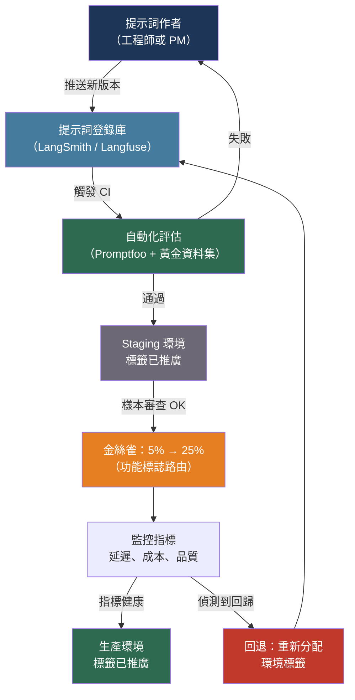

# [BEE-30028] 提示詞管理與版本控制

:::info
提示詞是生產 LLM 系統的主要控制介面——它們需要與應用程式碼相同的運營紀律：版本控制、自動化測試、分階段部署，以及無需完整應用程式發布即可即時回退。
:::

## 背景

在生產 LLM 系統中，提示詞的更改就是一次部署。它改變行為、影響成本，並且可能引入只有在幾小時後邊緣案例輸入觸碰到新措辭時才會出現的回歸問題。與程式碼更改不同，提示詞更改不會產生編譯錯誤、類型不匹配或語言層面的單元測試失敗。失敗模式是靜默退化：結構化輸出錯誤率攀升，幻覺頻率增加，使用者滿意度分數在任何人將原因與兩天前做的三字編輯聯繫起來之前就已向下漂移。

將提示詞直接硬編碼在原始文件中的團隊，把提示詞視為配置而非程式碼，並為此付出了發布耦合的代價。每次提示詞改進都需要一次程式碼部署。非技術貢獻者——產品經理、領域專家、文案撰寫者——無法在不提交 Pull Request 的情況下進行迭代。沒有記錄某個提示詞在特定時間何時處於活動狀態，使得事後分析如同猜謎。

提示詞管理的紀律將版本控制、自動化評估和分階段部署應用於提示詞。工具已在 2023 年後大幅成熟：專用的提示詞登錄庫（LangSmith Prompt Hub、Langfuse、PromptLayer）處理版本控制和熱重載；開源評估框架（Promptfoo）針對每次提示詞更改運行回歸套件；功能標誌系統無需程式碼更改即可實現每個細分群體的金絲雀部署。

## 設計思維

提示詞管理的核心張力在於耦合與控制之間。將提示詞儲存在程式碼中（Git）提供了完全耦合：每次更改都被追蹤、可審查，並與特定應用程式版本綁定。將提示詞儲存在登錄庫中提供了關注點分離：提示詞更改獨立部署，非工程師可以貢獻，回退不需要回退應用程式碼。隨著提示詞迭代速度的增加，大多數生產系統都向登錄庫方式轉移。

第二個張力是熱重載和快取之間的張力。在請求時獲取活動提示詞版本使更改能夠在不部署的情況下即時傳播，但給每次 LLM 呼叫增加了一個網路往返。登錄庫客戶端通過短 TTL 本地快取（LangSmith 預設為 100 個提示詞，300 秒 TTL）來緩解這一問題，為大多數請求提供接近即時的傳播和亞毫秒的查詢。

評估差距是投資最不足的領域。擁有提示詞版本控制但沒有自動化評估的團隊無法安全地發布提示詞更改：他們部署，觀察指標 24 小時，然後要麼繼續要麼回退。自動化評估——針對每次提示詞更改運行並對黃金資料集報告通過/失敗的測試套件——將這個反饋循環壓縮到幾分鐘。

## 最佳實踐

### 將提示詞儲存在登錄庫中，而非應用程式碼中

**SHOULD**（應該）一旦產品向依賴輸出品質的使用者發布，就將提示詞從應用程式原始文件中提取到版本化登錄庫中。登錄庫將提示詞更改週期與應用程式發布週期解耦：

```python
from langsmith import Client

client = Client()

# 在請求時拉取生產標籤版本（預設快取 300 秒）
def get_prompt(name: str, environment: str = "production"):
    return client.pull_prompt(f"{name}:{environment}")

# 在應用程式碼中：沒有提示詞字面量，只有登錄庫引用
prompt_template = get_prompt("support-response-v2")
response = llm.invoke(prompt_template.format_messages(user_query=query))
```

對於 Langfuse（開源替代方案）：

```python
from langfuse import Langfuse

lf = Langfuse()

# 通過標籤拉取；標籤映射到環境
prompt = lf.get_prompt("support-response", label="production")
compiled = prompt.compile(user_query=query)
```

**SHOULD** 使用環境標籤（`development`、`staging`、`production`）而非在應用程式碼中固定特定版本 ID。應用程式碼引用環境標籤；登錄庫運營者在不更改程式碼的情況下在環境之間推廣版本：

```python
# 預備環境部署從 staging 標籤拉取
prompt = get_prompt("support-response", environment="staging")

# 生產環境部署從 production 標籤拉取
prompt = get_prompt("support-response", environment="production")

# 回退：更新登錄庫標籤映射，不需要任何程式碼更改
```

**MAY**（可以）在預上線開發期間將提示詞保留在原始碼中，此時提示詞不穩定且更改始終與程式碼更改捆綁。當團隊開始每週進行超過幾次純提示詞更改時，提取到登錄庫。

### 為每次提示詞更改記錄元資料版本

**MUST**（必須）在每個新提示詞版本旁記錄作者、更改原因和評估結果。說明「v7 從 2026-04-15T14:30Z 到 2026-04-17T09:00Z 期間處於活動狀態」的稽核日誌允許將事後與指標更改相關聯：

```python
# LangSmith：推送帶有提交元資料的新版本
from langchain_core.prompts import ChatPromptTemplate

new_prompt = ChatPromptTemplate.from_messages([
    ("system", "You are a helpful support agent. Be concise and accurate."),
    ("human", "{user_query}"),
])

client.push_prompt(
    "support-response",
    object=new_prompt,
    description="移除冗長的前言——平均輸出 token 減少 23%",
    tags=["staging"],  # 標記為 staging；評估前不要標記為 production
)
```

**SHOULD** 使用語意版本慣例對待提示詞版本：
- **修補版（1.0.x）**：不改變輸出結構或行為的措辭調整
- **次要版（1.x.0）**：新的可選上下文、添加的範例、向後相容的格式更改
- **主要版（x.0.0）**：輸出結構更改、格式更改、角色更改、少樣本範例全面改寫

重大版本更改在推廣到生產環境之前應觸發手動審查關卡。

### 在推廣前針對黃金資料集測試提示詞

**MUST** 在每個候選提示詞到達生產環境之前運行自動化評估。Promptfoo 是這方面的標準開源工具：

```yaml
# promptfooconfig.yaml
prompts:
  - file://prompts/support_v7.txt   # 候選版本
  - file://prompts/support_v6.txt   # 基準線（當前生產）

providers:
  - id: anthropic:messages:claude-haiku-4-5-20251001
    config:
      temperature: 0
      max_tokens: 512

tests:
  - description: "處理帳單問題"
    vars:
      user_query: "為什麼我這個月被收費了兩次？"
    assert:
      - type: icontains
        value: "帳戶"
      - type: llm-rubric
        value: "回應承認帳單問題並提供明確的下一步"
      - type: not-contains
        value: "我不知道"

  - description: "不幻覺政策細節"
    vars:
      user_query: "60天後我可以退款嗎？"
    assert:
      - type: llm-rubric
        value: "除非上下文中出現，否則回應不得說明特定退款期限"

  - description: "保持合理長度"
    vars:
      user_query: "如何重置我的密碼？"
    assert:
      - type: javascript
        value: "output.length < 400"
```

執行評估套件：

```bash
npx promptfoo eval --config promptfooconfig.yaml
npx promptfoo view  # 開啟互動式結果瀏覽器
```

**SHOULD** 將 Promptfoo 整合到 CI/CD 中，以便觸碰提示詞文件的任何拉取請求都會觸發評估運行並將結果作為 PR 評論發布：

```yaml
# .github/workflows/prompt-eval.yml
name: Evaluate prompt changes
on:
  pull_request:
    paths:
      - 'prompts/**'
      - 'promptfooconfig.yaml'

jobs:
  evaluate:
    runs-on: ubuntu-latest
    steps:
      - uses: actions/checkout@v4
      - uses: promptfoo/promptfoo-action@v1
        with:
          github-token: ${{ secrets.GITHUB_TOKEN }}
          openai-api-key: ${{ secrets.OPENAI_API_KEY }}
          anthropic-api-key: ${{ secrets.ANTHROPIC_API_KEY }}
          config: promptfooconfig.yaml
          cache-path: .promptfoo/cache
```

**SHOULD** 維護至少 50-100 個代表性輸入的黃金資料集，涵蓋正常案例、邊緣案例和對抗性輸入。統計可靠性所需的資料集大小比大多數團隊預期的要大：高方差的 LLM 輸出需要更多樣本，而不是更少，才能區分真正的改進和雜訊。

### 使用金絲雀模式推廣

**SHOULD** 在完全推廣之前，將一小部分流量路由到挑戰者提示詞。使用功能標誌來控制路由：

```python
from feature_flags import flags  # 任何功能標誌客戶端：LaunchDarkly、Unleash 等

def get_active_prompt(user_id: str) -> str:
    """根據標誌分配返回此使用者的活動提示詞。"""
    if flags.is_enabled("support_prompt_v7_canary", user_id=user_id):
        return get_prompt("support-response", environment="staging")  # v7 候選
    return get_prompt("support-response", environment="production")   # v6 控制

```

金絲雀推廣階段：
1. **5% 的使用者**：驗證沒有災難性失敗；觀察錯誤率和成本
2. **25% 的使用者**：測量品質指標（使用者滿意度、任務完成率）
3. **100% 的使用者**：在登錄庫中將 staging 標籤推廣到 production；停用標誌

**MUST NOT**（不得）僅依賴自動化指標來批准完整推廣。在推廣之前手動審查金絲雀群體中的 50-100 個輸出樣本。自動化指標會遺漏對人類審查者來說顯而易見的失敗模式（離題回應、微妙的事實錯誤、語氣不匹配）。

### 對每個提示詞呼叫進行活動版本儀器化

**MUST** 在每次 LLM 呼叫旁記錄提示詞名稱和版本（或提交哈希）。這是任何事後分析的前提條件：沒有它，您無法確定在發生退化時哪個提示詞版本處於活動狀態：

```python
import logging
from opentelemetry import trace

tracer = trace.get_tracer("prompt-management")
logger = logging.getLogger(__name__)

def invoke_with_tracking(prompt_name: str, environment: str, **inputs):
    prompt_meta = registry.get_prompt_metadata(prompt_name, environment)

    with tracer.start_as_current_span("llm.call") as span:
        span.set_attribute("prompt.name", prompt_name)
        span.set_attribute("prompt.version", prompt_meta["version"])
        span.set_attribute("prompt.environment", environment)

        response = llm.invoke(prompt_meta["template"].format(**inputs))

        logger.info(
            "llm_call",
            extra={
                "prompt_name": prompt_name,
                "prompt_version": prompt_meta["version"],
                "input_tokens": response.usage.input_tokens,
                "output_tokens": response.usage.output_tokens,
            },
        )
        return response
```

## 視覺圖



## 相關 BEE

- [BEE-30004](evaluating-and-testing-llm-applications.md) -- 評估和測試 LLM 應用：BEE-30004 中描述的黃金資料集構建和 LLM 作為評審員模式直接饋入此處的 Promptfoo 評估套件
- [BEE-30009](llm-observability-and-monitoring.md) -- LLM 可觀察性與監控：觸發金絲雀回退的每版本指標（成本、延遲、錯誤率）由可觀察性層收集
- [BEE-16004](../cicd-devops/feature-flags.md) -- 功能標誌：金絲雀路由機制使用 BEE-16004 中描述的相同功能標誌基礎設施
- [BEE-16002](../cicd-devops/deployment-strategies.md) -- 部署策略：提示詞金絲雀推廣遵循與應用程式金絲雀發布相同的模式——小百分比、監控、擴展或回退

## 參考資料

- [Promptfoo. 開源提示詞評估 — promptfoo.dev](https://www.promptfoo.dev/)
- [Promptfoo. GitHub Actions 整合 — promptfoo.dev](https://www.promptfoo.dev/docs/integrations/github-action/)
- [LangSmith. 管理提示詞 — docs.langchain.com](https://docs.langchain.com/langsmith/manage-prompts)
- [Langfuse. 提示詞管理 — langfuse.com](https://langfuse.com/docs/prompt-management/overview)
- [PromptLayer — promptlayer.com](https://www.promptlayer.com/)
- [Braintrust. 什麼是提示詞版本控制？— braintrust.dev](https://www.braintrust.dev/articles/what-is-prompt-versioning)
- [LaunchDarkly. 提示詞版本控制與管理 — launchdarkly.com](https://launchdarkly.com/blog/prompt-versioning-and-management/)
