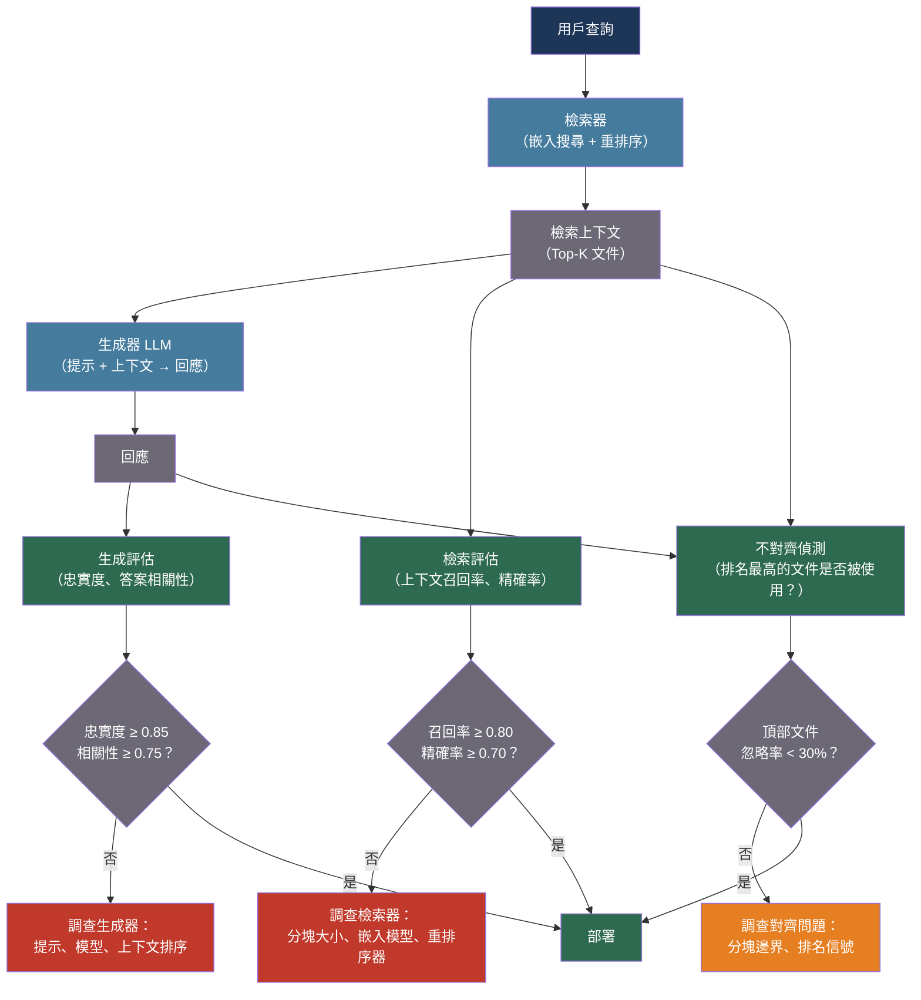

# [BEE-30050] RAG 評估與品質測量

:::info
RAG 評估必須將管道品質分解為兩個獨立的子問題——檢索（我們是否取回了正確的文件？）和生成（模型是否忠實地使用了這些文件？）——因為任一組件的失敗都會導致錯誤答案，而端對端的綜合分數無法區分需要修復的是哪個組件。
:::

## 背景

檢索增強生成（RAG）管道有兩種截然不同的失敗模式。檢索器可能返回不相關的文件、覆蓋不完整，或排名不佳的結果——模型隨後要麼因證據不足而幻覺，要麼基於錯誤的上下文生成答案。生成器可能收到完全相關的文件，但仍然失敗——忽略文件、與文件矛盾，或生成事實上忠實於上下文卻在語義上偏離主題的答案。若無分解評估，除錯錯誤答案的團隊無法確定應該改進嵌入模型、重排序器、分塊大小還是生成提示。

Es et al.（2023，arXiv:2309.15217，EACL 2024）提出了 RAGAS，一個無需參考文本的評估框架，定義了跨檢索-生成對聯合測量的四個指標：上下文精確率（相關塊是否排在不相關塊之前？）、上下文召回率（檢索到的上下文是否涵蓋了回答所需的所有資訊？）、忠實度（回應中的所有聲明是否都由上下文支持？）和答案相關性（回應是否真正回答了問題？）。RAGAS 的關鍵設計決策是：所有四個指標都可以使用 LLM 裁判在沒有人工標注基準答案的情況下計算——使它們無需標注成本即可應用於生產數據。

Saad-Falcon et al.（2023，arXiv:2311.09476，NAACL 2024）提出了 ARES，更進一步：在少量人工標注上訓練輕量級 LLM 分類器（而非零樣本裁判），並使用預測驅動推理（PPI）為指標估計生成統計有效的置信區間。ARES 在相同評估預算下比 RAGAS 的方差顯著更低，代價是每個任務需要 150–300 個人工標注樣本。

Randl et al.（2026，arXiv:2601.21803）在生產 RAG 中測量到一個關鍵失敗模式：47–67% 的查詢存在檢索器-生成器不對齊，即生成器忽略排名最高的文件，而依賴排名較低的文件。這意味著高檢索召回率分數並不保證生成器使用了所檢索到的內容——兩個組件可以分別表現良好，而整合後的管道卻失敗。

## 最佳實踐

### 獨立測量檢索和生成

**MUST**（必須）將檢索品質和生成品質作為獨立指標進行評估。答案品質的退化可能由檢索變化（上下文中的文件更差）、生成變化（不同的提示或模型）或兩者的交互引起。沒有獨立指標，就無法歸因失敗：

```python
import anthropic
import json
import re

FAITHFULNESS_SYSTEM = """You are a fact-checking assistant. Given a context and a response,
extract all factual claims from the response and determine whether each claim is
supported, contradicted, or not mentioned in the context.

Output JSON:
{
  "claims": [
    {"claim": "<claim text>", "verdict": "supported" | "contradicted" | "not_in_context"}
  ],
  "faithfulness_score": <float 0.0 to 1.0>
}

faithfulness_score = (number of supported claims) / (total claims)
A contradicted claim is worse than a not_in_context claim, but both count as not supported."""

RELEVANCY_SYSTEM = """You are an evaluation assistant. Given a question and a response,
determine how well the response answers the question.

Output JSON:
{
  "addresses_question": true | false,
  "completeness": "full" | "partial" | "minimal",
  "relevancy_score": <float 0.0 to 1.0>
}

relevancy_score:
  1.0 = response fully addresses the question with appropriate scope
  0.5 = response addresses the question partially (key aspects missing)
  0.0 = response does not address the question"""

async def measure_faithfulness(
    context: str,
    response: str,
    *,
    judge_model: str = "claude-sonnet-4-20250514",
) -> dict:
    """
    測量回應中的所有聲明是否都由檢索到的上下文支持。
    返回 faithfulness_score：1.0 = 完全忠實，0.0 = 所有聲明均不受支持。
    """
    client = anthropic.AsyncAnthropic()
    r = await client.messages.create(
        model=judge_model,
        max_tokens=1024,
        system=FAITHFULNESS_SYSTEM,
        messages=[{
            "role": "user",
            "content": (
                f"Context:\n{context}\n\n"
                f"Response:\n{response}"
            ),
        }],
    )
    text = r.content[0].text
    match = re.search(r"\{.*\}", text, re.DOTALL)
    if match:
        return json.loads(match.group(0))
    return {"faithfulness_score": 0.0, "claims": [], "parse_error": True}

async def measure_answer_relevancy(
    question: str,
    response: str,
    *,
    judge_model: str = "claude-sonnet-4-20250514",
) -> dict:
    """
    測量回應是否真正回答了用戶的問題。
    注意：相關性與忠實度無關——如果檢索到了錯誤的文件，
    回應可以忠實於上下文但完全偏離主題。
    """
    client = anthropic.AsyncAnthropic()
    r = await client.messages.create(
        model=judge_model,
        max_tokens=256,
        system=RELEVANCY_SYSTEM,
        messages=[{
            "role": "user",
            "content": f"Question: {question}\n\nResponse: {response}",
        }],
    )
    text = r.content[0].text
    match = re.search(r"\{.*\}", text, re.DOTALL)
    if match:
        return json.loads(match.group(0))
    return {"relevancy_score": 0.0, "parse_error": True}
```

### 計算上下文召回率和精確率以評估檢索

**SHOULD** 使用上下文召回率和上下文精確率獨立於生成器評估檢索器。這些指標需要參考答案或一組參考事實——但可以使用 LLM 從基準答案中自動提取參考事實：

```python
RECALL_SYSTEM = """Given a reference answer and a retrieved context, identify which
statements from the reference answer are supported by the context.

Output JSON:
{
  "reference_statements": ["<stmt>", ...],
  "supported_statements": ["<stmt>", ...],
  "context_recall": <float 0.0 to 1.0>
}

context_recall = len(supported_statements) / len(reference_statements)
A statement is supported if the context contains information that entails it."""

async def measure_context_recall(
    reference_answer: str,
    retrieved_context: str,
    *,
    judge_model: str = "claude-sonnet-4-20250514",
) -> float:
    """
    測量檢索到的上下文中支持了多少參考答案。
    高召回率 = 檢索器找到了生成正確答案所需的文件。
    低召回率 = 相關文件被遺漏（檢索器問題）。
    """
    client = anthropic.AsyncAnthropic()
    r = await client.messages.create(
        model=judge_model,
        max_tokens=1024,
        system=RECALL_SYSTEM,
        messages=[{
            "role": "user",
            "content": (
                f"Reference answer:\n{reference_answer}\n\n"
                f"Retrieved context:\n{retrieved_context}"
            ),
        }],
    )
    text = r.content[0].text
    match = re.search(r"\{.*\}", text, re.DOTALL)
    if match:
        return json.loads(match.group(0)).get("context_recall", 0.0)
    return 0.0

async def evaluate_rag_example(
    question: str,
    retrieved_context: str,
    response: str,
    reference_answer: str | None = None,
) -> dict:
    """
    對單個 RAG 樣本進行 RAGAS 風格的完整評估。
    返回四個指標：context_recall、context_precision、faithfulness、answer_relevancy。
    context_recall 需要 reference_answer；其他指標無需參考。
    """
    import asyncio

    faithfulness_task = measure_faithfulness(retrieved_context, response)
    relevancy_task = measure_answer_relevancy(question, response)
    recall_task = (
        measure_context_recall(reference_answer, retrieved_context)
        if reference_answer else None
    )

    faith, relev = await asyncio.gather(faithfulness_task, relevancy_task)
    recall = await recall_task if recall_task else None

    return {
        "faithfulness": faith.get("faithfulness_score", 0.0),
        "answer_relevancy": relev.get("relevancy_score", 0.0),
        "context_recall": recall,  # 若無參考答案則為 None
        "claims": faith.get("claims", []),
    }
```

### 在 CI/CD 中以品質閾值運行評估

**SHOULD** 在部署管道中為每個指標強制執行最低品質閾值。不同的指標指示不同的失敗模式，需要不同的阻擋閾值：

```python
from dataclasses import dataclass

@dataclass
class RAGQualityThresholds:
    """
    RAG 管道部署的最低品質閾值。
    Faithfulness < 0.85 意味著超過 15% 的回應聲明不受支持——
    這是應予以阻擋的幻覺風險。
    Context recall < 0.80 意味著回答所需的 20% 事實不在
    檢索上下文中——這是檢索器問題。
    """
    faithfulness: float = 0.85       # 低於此值：阻擋——幻覺風險
    answer_relevancy: float = 0.75   # 低於此值：阻擋——回應偏題
    context_recall: float = 0.80     # 低於此值：調查檢索器
    context_precision: float = 0.70  # 低於此值：檢索文件噪音過多

def evaluate_pipeline_health(
    results: list[dict],
    thresholds: RAGQualityThresholds = RAGQualityThresholds(),
) -> dict:
    """
    彙總跨測試案例的指標並與閾值比較。
    返回每個指標的通過/失敗情況和整體管道結論。
    """
    metrics = ["faithfulness", "answer_relevancy", "context_recall"]
    averages = {}
    for metric in metrics:
        values = [r[metric] for r in results if r.get(metric) is not None]
        averages[metric] = sum(values) / len(values) if values else None

    failures = []
    for metric, avg in averages.items():
        if avg is None:
            continue
        threshold = getattr(thresholds, metric)
        if avg < threshold:
            failures.append({
                "metric": metric,
                "average": avg,
                "threshold": threshold,
                "delta": avg - threshold,
            })

    return {
        "averages": averages,
        "failures": failures,
        "verdict": "PASS" if not failures else "FAIL",
        "recommendation": (
            "Safe to deploy"
            if not failures else
            f"Block deployment — {len(failures)} metric(s) below threshold: "
            + ", ".join(f["metric"] for f in failures)
        ),
    }
```

### 偵測檢索器-生成器不對齊

**SHOULD** 監控生成器是否真正使用了檢索到的文件。Randl et al.（2026）發現在 47–67% 的查詢中，生成器忽略了排名最高的文件——這意味著檢索品質的改進不會轉化為生成品質的改進：

```python
ATTRIBUTION_SYSTEM = """Given a retrieved context with numbered documents and a response,
identify which documents (by number) the response draws information from.

Output JSON:
{
  "used_documents": [<doc_numbers>],
  "ignored_top_ranked": <true | false>,
  "alignment_note": "<brief explanation>"
}

A document is 'used' if the response cites or is clearly informed by information in it.
'ignored_top_ranked' is true if document 1 (the top-ranked result) is not in used_documents."""

async def detect_misalignment(
    retrieved_docs: list[str],   # 按檢索器排名排序：索引 0 = 最相關
    response: str,
    *,
    judge_model: str = "claude-haiku-4-5-20251001",   # 便宜模型已足夠
) -> dict:
    """
    檢查生成器是否使用了檢索器排名最高的文件。
    若排名最高的文件被系統性忽略，說明檢索器和生成器的
    排名標準不對齊——應審查分塊或嵌入策略。
    """
    client = anthropic.AsyncAnthropic()
    numbered = "\n\n".join(
        f"[Document {i+1}]:\n{doc}"
        for i, doc in enumerate(retrieved_docs)
    )
    r = await client.messages.create(
        model=judge_model,
        max_tokens=256,
        system=ATTRIBUTION_SYSTEM,
        messages=[{
            "role": "user",
            "content": f"Context:\n{numbered}\n\nResponse:\n{response}",
        }],
    )
    text = r.content[0].text
    import re, json
    match = re.search(r"\{.*\}", text, re.DOTALL)
    if match:
        return json.loads(match.group(0))
    return {"used_documents": [], "ignored_top_ranked": None, "parse_error": True}
```

**SHOULD** 追蹤生產查詢樣本中 `ignored_top_ranked` 的比率。若比率超過 30%，說明檢索器的排名信號與生成器認為有用的內容不對應——需調查的候選項包括分塊大小、嵌入模型選擇和重排序器校準。

## 視覺化



## RAGAS 指標參考

| 指標 | 測量內容 | 需要參考 | 失敗指示 |
|---|---|---|---|
| 上下文召回率 | 檢索上下文涵蓋的參考事實比例 | 是（參考答案） | 檢索器遺漏了相關文件 |
| 上下文精確率 | 檢索句子中與查詢相關的比例 | 否 | 檢索器返回了嘈雜、不相關的塊 |
| 忠實度 | 回應聲明中受上下文支持的比例 | 否 | 生成器超出檢索證據進行幻覺 |
| 答案相關性 | 回應回答問題的程度 | 否 | 儘管檢索正確，回應仍偏題 |

## 常見錯誤

**僅使用端對端準確率作為唯一指標。** 整體正確率 75% 的分數無法告訴你應該修復檢索器還是生成器。分解指標使根本原因可見。

**不使用「oracle 檢索」進行測試。** 為了隔離生成品質，以基準文件作為上下文運行生成器。若即使在完美上下文下生成品質仍然較差，問題在於提示或模型，而非檢索。

**將忠實度等同於正確性。** 回應可以完全忠實於本身就是錯誤或過時的檢索上下文。忠實度測量與上下文的一致性；正確性需要與基準事實比較。

**忽略不對齊率。** 若生成器忽略了檢索到的文件，改進檢索召回率並不能改善用戶效果。追蹤模型實際使用了哪些文件，而不僅僅是檢索到了哪些。

**對檢索和生成評估使用相同的測試案例。** 檢索應使用語料庫中有已知相關文件的查詢進行測試。生成應使用固定上下文進行測試以隔離生成組件。混合使用會產生難以解釋的結果。

## 相關 BEE

- [BEE-30007](rag-pipeline-architecture.md) -- RAG 管道架構：本文評估的系統架構；分塊、嵌入和檢索策略都影響這些指標
- [BEE-30029](advanced-rag-and-agentic-retrieval-patterns.md) -- 進階 RAG 與智能體檢索模式：重排序器、查詢擴展和混合搜尋改善上下文召回率和精確率
- [BEE-30043](llm-hallucination-detection-and-factual-grounding.md) -- LLM 幻覺偵測與事實接地：忠實度檢查是應用於檢索上下文的幻覺偵測的特化形式
- [BEE-30049](llm-evaluation-metrics-and-automated-scoring-pipelines.md) -- LLM 評估指標與自動化評分管道：RAG 特定指標在其中運行的通用評估基礎設施

## 參考資料

- [Es et al. Ragas: Automated Evaluation of Retrieval Augmented Generation — arXiv:2309.15217, EACL 2024](https://arxiv.org/abs/2309.15217)
- [Saad-Falcon et al. ARES: An Automated Evaluation Framework for Retrieval-Augmented Generation Systems — arXiv:2311.09476, NAACL 2024](https://arxiv.org/abs/2311.09476)
- [Chen et al. Benchmarking Large Language Models in Retrieval-Augmented Generation — arXiv:2309.01431, AAAI 2024](https://arxiv.org/abs/2309.01431)
- [Randl et al. RAG-E: Quantifying Retriever-Generator Alignment and Failure Modes — arXiv:2601.21803, 2026](https://arxiv.org/abs/2601.21803)
- [Thakur et al. BEIR: A Heterogenous Benchmark for Zero-shot Evaluation of Information Retrieval Models — arXiv:2104.08663, NeurIPS 2021](https://arxiv.org/abs/2104.08663)
- [Yu et al. Evaluation of Retrieval-Augmented Generation: A Survey — arXiv:2405.07437, 2024](https://arxiv.org/abs/2405.07437)
- [RAGAS Documentation — docs.ragas.io](https://docs.ragas.io/)
