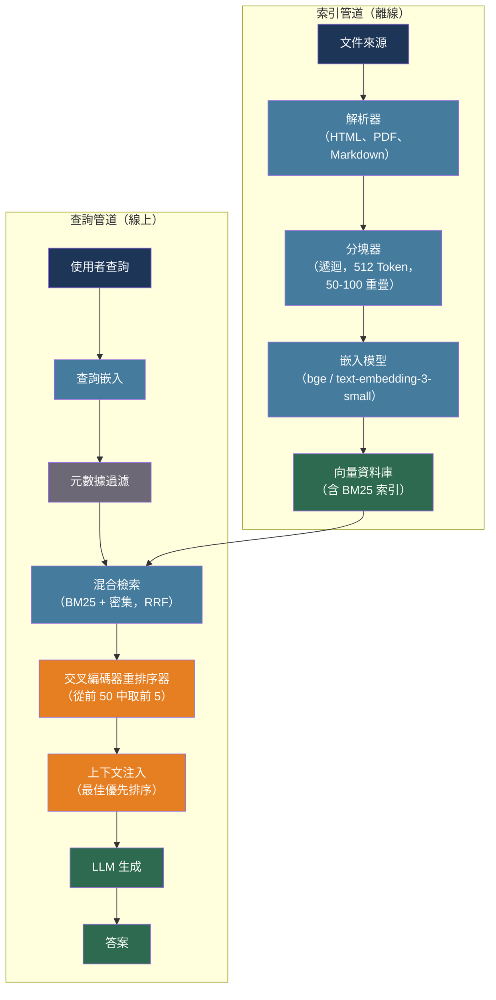

# [BEE-509] RAG 管道架構

:::info
檢索增強生成（RAG）解決了 LLM 應用程式中的知識問題：不依賴模型凍結的訓練權重，而是在推理時注入相關文件。讓管道正確運作需要做出數十個具體的工程決策——分塊策略、嵌入模型、檢索方法、重排序以及上下文注入——每個決策都對生產環境有可衡量的影響。
:::

## 背景

Patrick Lewis 等人在「Retrieval-Augmented Generation for Knowledge-Intensive NLP Tasks」（arXiv:2005.11401，NeurIPS 2020）中引入了檢索增強生成。該論文表明，將預訓練 LLM 與非參數檢索組件（可微分文件索引）結合，可以在不重新訓練模型的情況下，顯著提高開放域問答的事實準確性。關鍵洞察是 LLM 將事實知識儲存在其權重中，但缺乏精確的機制來存取和更新這些知識。外部檢索層解決了這兩個問題：它提供對訓練語料庫中不存在的文件的存取，且索引可以在不接觸模型的情況下更新。

到 2023 年，RAG 已成為將 LLM 回應紮根於組織知識的主要模式。使用案例很明確：任何模型需要存取訓練截止日期後創建的資訊、從未在訓練語料庫中的專有資料，或必須明確引用來源的場景。RAG 不是模型能力不足的解藥——輸出格式錯誤或行為不一致的模型需要提示工程或微調（BEE-507），而非檢索增強。

工程挑戰在於 RAG 在概念驗證中看起來很簡單（嵌入文件、嵌入查詢、獲取前 K 個、填充到提示中），但在生產中成為一個多組件系統，每個組件都有各自的失敗模式。檢索錯誤、破壞性壓縮或注入位置不當的上下文會產生自信但錯誤的答案。有效的 RAG 管道需要在每個階段做出刻意的決策。

## 設計思維

RAG 系統分為兩個獨立的管道，具有不同的操作特性：

**索引管道**（批次或流式，容忍延遲）：載入文件 → 解析 → 分塊 → 嵌入 → 存入向量索引。這個管道離線或按計劃運行。它可以很慢，因為工作分攤到所有未來的查詢。主要關注點是正確性、完整性和每個文件的成本。

**查詢管道**（線上，延遲敏感）：嵌入查詢 → 檢索候選 → 重排序 → 注入上下文 → 呼叫 LLM。這個管道在每個使用者請求時運行。主要關注點是延遲、精確性和每次請求的成本。

將這兩者視為獨立關注點，可以讓每個都被獨立擴展、最佳化和除錯。分塊中的錯誤影響索引；重排序中的錯誤影響每個查詢。了解你在除錯哪個組件。

三個主要失敗模式對應三個管道階段：
- **檢索到錯誤的 Chunk**：檢索精確性失敗（嵌入質量、檢索策略、元數據過濾）
- **遺漏正確的 Chunk**：檢索召回率失敗（分塊、稀疏/密集權衡、Chunk 邊界）
- **正確的 Chunk，錯誤的答案**：上下文注入失敗（排序、壓縮、上下文視窗溢出）

在組合修復之前，分別測量每個問題。

## 最佳實踐

### 選擇與文件結構匹配的分塊策略

**SHOULD（應該）** 使用遞迴字元分割作為通用 RAG 的基準，設定 512 個 Token 和 50–100 個 Token 的重疊。這是通過基準驗證的預設值：它透過按順序嘗試分隔符（`\n\n`、`\n`、` `、字元）來尊重句子和段落邊界，且速度足夠快可以在攝入管道中內聯運行。

**SHOULD（應該）** 對結構化格式使用文件特定的分塊：
- Markdown：按標題層次分塊，將父標題作為元數據保留在每個 Chunk 上
- 程式碼：絕不在函數定義或塊結構內部分割
- 表格：保持表格行完整；跨 Chunk 分割的表格會作為兩個不完整的事實被檢索

**SHOULD（應該）** 在查詢精確性和答案完整性都很重要時，使用父子分塊。索引小型子 Chunk（128–256 個 Token）以獲得檢索精確性；以對應的父 Chunk（512–1024 個 Token）作為上下文視窗輸入。子 Chunk 找到針；父 Chunk 提供周圍的故事。

**MUST NOT（不得）** 在初始索引後更改 Chunk 邊界或 Chunk 大小，而不重新嵌入整個語料庫。在同一索引中混合來自不同分塊配置的 Chunk 會產生不一致的檢索——某些查詢將匹配舊邊界，其他查詢匹配新邊界，沒有任何可見的錯誤信號。

### 選擇與您的流量和隱私約束對齊的嵌入模型

| 模型 | 維度 | MTEB 分數 | 成本 | 備注 |
|------|------|-----------|------|------|
| OpenAI text-embedding-3-small | 1,536 | 62.3 | $0.00002/1K Token | 支援 MRL；最佳性價比 |
| OpenAI text-embedding-3-large | 3,072 | 64.6 | $0.00013/1K Token | 支援 MRL；可截斷到 256 維，質量仍優於 ada-002 的 1,536 維 |
| BAAI/bge-large-en-v1.5 | 1,024 | 64.2 | 自託管 | 無供應商鎖定；強英文檢索 |
| BAAI/bge-m3 | 1,024 | — | 自託管 | 單一模型支援密集 + 稀疏 + 多向量；100+ 種語言 |

**SHOULD（應該）** 對成本敏感的應用優先考慮 text-embedding-3-small。透過 Matryoshka 表示學習（MRL，arXiv:2205.13147），3-small 模型可以在推理時截斷到 256 維，同時優於舊版 ada-002 模型的完整 1,536 維——實現 6 倍的儲存和延遲降低，並具有更好的準確性。

**MUST NOT（不得）** 在同一向量索引中混合來自不同模型或不同模型版本的嵌入。同時包含 ada-002 和 text-embedding-3-small 嵌入的索引將產生無意義的相似度分數——這兩個向量空間不對齊。

### 使用混合檢索提高生產可靠性

純密集檢索會遺漏精確的關鍵字匹配。純稀疏檢索（BM25）會遺漏語義等效項。混合檢索同時運行兩者，並使用倒數排名融合（RRF）合併結果：

```
RRF 分數 = Σ 1 / (排名_i + k)    其中 k = 60（經驗最優值）
```

RRF 合併 BM25 和密集檢索的排名列表，無需跨兩個系統進行分數正規化（BM25 分數 0–200；餘弦相似度 0–1）。合併單位是排名位置，而非原始分數。

**SHOULD（應該）** 在任何生產系統中使用混合檢索。這種組合同時處理詞彙不匹配問題（BM25 捕獲精確術語）和語義差距問題（密集檢索捕獲同義詞和意譯）。

**SHOULD（應該）** 在 ANN 搜尋之前應用元數據過濾，以縮小候選池：

```python
results = vector_store.similarity_search(
    query_embedding,
    filter={"source": "product_docs", "published_after": "2024-01-01"},
    top_k=20
)
```

在搜尋前過濾可同時降低檢索延遲和精確性雜訊。關於 2024 年產品發布的問題不應檢索到 2018 年的文件，即使向量相似。

**MAY（可以）** 使用多查詢檢索——為使用者問題生成 3–5 個改述版本，對每個版本運行檢索，並對結果去重——適用於詞彙歧義常見的查詢。每個改述都從不同的語義角度闡明同一問題。

**MAY（可以）** 使用 HyDE（假設文件嵌入，arXiv:2212.10496）適用於問題形式與答案形式差異很大的查詢。模型生成假設答案；使用該假設答案的嵌入而非問題的嵌入進行檢索。這彌合了短問題和長文件段落之間的語義差距，儘管它會在檢索延遲中增加一個 LLM 生成步驟。

### 在上下文注入之前添加重排序階段

雙編碼器檢索（嵌入相似度）很快但不精確：它將所有含義壓縮到一個向量中，因此查詢和文件 Token 在評分期間從不互動。交叉編碼器重排序將查詢和文件連接起來，一起評分，以更高的延遲成本產生更高的精確性。

使用兩階段管道：

```
第 1 階段：雙編碼器檢索 → 前 50 個候選（快速，廣召回）
第 2 階段：交叉編碼器重排序 → 前 5 個候選（精確，延遲受限）
```

**SHOULD（應該）** 在任何答案精確性重要的 RAG 系統中添加重排序。BGE-reranker-v2-m3（BAAI，自託管，2.78 億參數）在 CPU 上處理不到 100 對查詢-文件的批次只需不到 1 秒。Cohere Rerank 是托管服務的替代方案。

**SHOULD（應該）** 保守地設定重排序輸入的 `top_k`（20–50 個候選）。在 200 個候選上運行交叉編碼器會增加 3–5 秒的延遲，而回報遞減。

### 使用位置感知的方式注入上下文

Liu 等人在「Lost in the Middle: How Language Models Use Long Contexts」（arXiv:2307.03172，TACL 2024）中表明，LLM 性能在上下文位置上呈 U 形曲線：上下文開頭和結尾的資訊召回率遠高於埋在中間的資訊。中間位置資訊的性能下降在多文件問答任務中超過 30%。

**MUST（必須）** 將最高相關性的 Chunk 放在上下文視窗的開頭。重排序後，將排名第一的 Chunk 放在第一位。不要隨機化或保留任意順序。

**SHOULD（應該）** 對安全關鍵的應用使用三明治模式：將最相關的 Chunk 放在注入上下文的開頭和結尾，將較不相關的材料放在中間。

**SHOULD（應該）** 在檢索到的 Chunk 超出可用上下文預算時使用上下文壓縮。微軟的 LLMLingua（EMNLP 2023）使用小型模型的困惑度來識別和刪除冗餘 Token，最多可將提示壓縮 20 倍，同時準確性損失最小。優先選擇壓縮而非截斷——截斷丟棄整個 Chunk；壓縮保留資訊密度。

### 將索引和查詢管道分離

**MUST（必須）** 將索引管道和查詢管道視為具有獨立部署週期的獨立系統。分塊修復需要重新索引；提示修復則不需要。在一個程式碼庫中耦合它們會帶來操作風險。

```
索引管道（離線）：
  文件來源 → 解析器 → 分塊器 → 嵌入模型 → 向量資料庫

查詢管道（線上）：
  使用者查詢 → 查詢嵌入 → 混合檢索（BM25 + 密集）
             → 元數據過濾 → 重排序器 → 上下文注入器 → LLM
```

**SHOULD（應該）** 實現增量索引：在攝入時對文件內容進行雜湊；只重新嵌入雜湊已更改的文件。重新嵌入未更改的語料庫會浪費計算資源並引入不必要的模型版本風險。將嵌入模型版本和分塊配置作為元數據追蹤在每個儲存的 Chunk 上。

**MUST NOT（不得）** 用新嵌入模型重新嵌入語料庫的子集，同時保留舊模型的其餘部分。兩個模型的向量空間不相容；混合模型索引會產生不可預測的檢索質量，且沒有可見的錯誤信號。如果嵌入模型必須更改，請重新嵌入整個語料庫。

### 獨立評估每個管道階段

**MUST（必須）** 使用 RAGAS（BEE-506）分別測量檢索和生成失敗：

| 指標 | 衡量什麼 | 低分意味著 |
|------|---------|-----------|
| Context Precision | 檢索到的 Chunk 是否按相關性排名？ | 修復檢索器排名 / 重排序器 |
| Context Recall | 是否檢索到了所有需要的 Chunk？ | 修復分塊 / 檢索召回率 |
| Faithfulness | 聲明是否紮根於上下文？ | 修復生成器提示 / 上下文注入 |
| Answer Relevance | 答案是否解決了問題？ | 修復查詢理解 / 路由 |

**SHOULD（應該）** 從系統失敗的真實生產查詢中建立黃金資料集（BEE-506）。合成測試查詢會遺漏生產中出現的真實世界詞彙、文件格式和邊緣情況的長尾。

## 失敗模式

**嘈雜的檢索** — 返回錯誤的 Chunk。由查詢和文件之間的詞彙不匹配或弱嵌入模型引起。透過混合檢索、元數據過濾和重排序修復。

**遺漏的檢索** — 正確的文件存在於語料庫中，但其 Chunk 邊界將相關段落分割成兩半，或文件根本不在語料庫中。透過語義分塊或父子分塊修復；審計語料庫完整性。

**迷失在中間** — 正確的 Chunk 被檢索到，但位於長上下文的中間，降低了 LLM 的召回率。透過位置感知注入（最佳 Chunk 優先）或上下文壓縮修復。

**嵌入漂移** — 模型版本更改或預處理更改後的靜默退化，因為舊嵌入和新嵌入被混合，或預處理系統性地產生不同的輸入。透過版本化嵌入、透過檢索指標監控偵測更改，以及在管道更改時原子性地重新嵌入完整語料庫來修復。

**過時的嵌入** — 文件已更新，但向量索引未更新。透過以內容雜湊為鍵的增量索引修復；對頻繁更改的文件為 Chunk 設定 TTL。

## 視覺化



## 相關 BEE

- [BEE-17004](../search/vector-search-and-semantic-search.md) -- 向量搜尋與語義搜尋：RAG 的密集檢索組件是一個向量搜尋問題；ANN 索引選擇、HNSW 參數和近似搜尋取捨在那裡有所涵蓋
- [BEE-30005](prompt-engineering-vs-rag-vs-fine-tuning.md) -- 提示工程 vs RAG vs 微調：何時選擇 RAG 而非微調的決策框架；RAG 是知識存取問題而非模型行為問題的正確選擇
- [BEE-30004](evaluating-and-testing-llm-applications.md) -- 評估與測試 LLM 應用程式：RAGAS 指標、黃金資料集以及測量 RAG 管道健康狀況的離線/線上評估分割
- [BEE-30006](structured-output-and-constrained-decoding.md) -- 結構化輸出與受限解碼：當 RAG 答案必須以結構化格式連同引用一起返回時，結構化輸出約束適用於生成步驟
- [BEE-9001](../caching/caching-fundamentals-and-cache-hierarchy.md) -- 快取基礎：嵌入快取和檢索結果快取降低每次查詢的成本和延遲；查詢層面的語義快取重用相似查詢的結果

## 參考資料

- [Patrick Lewis 等人. Retrieval-Augmented Generation for Knowledge-Intensive NLP Tasks — arXiv:2005.11401, NeurIPS 2020](https://arxiv.org/abs/2005.11401)
- [Nelson F. Liu 等人. Lost in the Middle: How Language Models Use Long Contexts — arXiv:2307.03172, TACL 2024](https://arxiv.org/abs/2307.03172)
- [Luyu Gao 等人. Precise Zero-Shot Dense Retrieval without Relevance Labels (HyDE) — arXiv:2212.10496, ACL 2023](https://arxiv.org/abs/2212.10496)
- [Omar Khattab 和 Matei Zaharia. ColBERT: Efficient and Effective Passage Search — arXiv:2004.12832, SIGIR 2020](https://arxiv.org/abs/2004.12832)
- [Aditya Kusupati 等人. Matryoshka Representation Learning — arXiv:2205.13147, NeurIPS 2022](https://arxiv.org/abs/2205.13147)
- [Niklas Muennighoff 等人. MTEB: Massive Text Embedding Benchmark — arXiv:2210.07316](https://arxiv.org/abs/2210.07316)
- [Huiqiang Jiang 等人. LLMLingua: Compressing Prompts for Accelerated Inference — EMNLP 2023](https://github.com/microsoft/LLMLingua)
- [Jon Saad-Falcon 等人. ARES: An Automated Evaluation Framework for RAG — arXiv:2311.09476, NAACL 2024](https://arxiv.org/abs/2311.09476)
- [Shahul Es 等人. RAGAS: Automated Evaluation of Retrieval Augmented Generation — arXiv:2309.15217, EACL 2024](https://arxiv.org/abs/2309.15217)
- [OpenAI. New Embedding Models and API Updates — openai.com](https://openai.com/index/new-embedding-models-and-api-updates/)
- [BAAI. BGE-M3: Multi-Functionality, Multi-Linguality, Multi-Granularity — huggingface.co](https://huggingface.co/BAAI/bge-m3)
