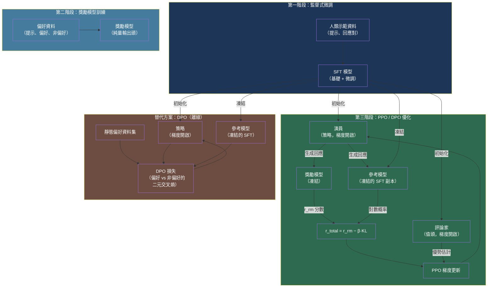

# [BEE-30071] RLHF 與對齊訓練基礎設施

:::info
基於 PPO 的 RLHF 需要同時維護四個模型副本——演員（actor）、評論家（critic）、獎勵模型（reward model）與參考模型（reference model）——消耗超過監督式微調（SFT）三倍的 GPU 記憶體。DPO 消除了獎勵模型與評論家，僅需兩個副本，將訓練複雜度降低為對偏好對的二元交叉熵損失，代價是僅支援離線優化。
:::

## 背景

訓練出的 LLM 基礎模型能生成合理的文字，但不能可靠地遵循指令、保持有益性或避免有害輸出。**人類反饋強化學習（Reinforcement Learning from Human Feedback，RLHF）** 是將基礎模型或指令調整模型轉換為符合人類偏好行為模型的對齊技術。Ouyang 等人（InstructGPT，arXiv:2203.02155，2022）證明：經過 RLHF 訓練的 1.3B 模型在人類評估者眼中優於 175B 的基礎 GPT-3 模型，確立了 RLHF 作為主流對齊技術的地位。

標準流水線分三個階段：

1. **監督式微調（SFT）：** 在高品質人類示範資料上微調基礎模型，產生行為良好的起始策略。
2. **獎勵模型（RM）訓練：** 收集人類對模型回應對的偏好比較資料，訓練一個獨立模型預測偏好回應，輸出純量獎勵分數。
3. **RL 優化（PPO）：** 使用近端策略優化（Proximal Policy Optimization，PPO）微調 SFT 模型，以獎勵模型分數作為學習信號。

PPO 的核心基礎設施挑戰在於需要同時維護四個模型實例：

| 角色 | 梯度 | 用途 |
|---|---|---|
| 演員（Actor） | 是 | 正在訓練的策略；在每個 batch 中生成回應 |
| 評論家（Critic） | 是 | 估計期望獎勵的值函數網路；用於優勢估計 |
| 獎勵模型（Reward model） | 凍結 | 對演員回應打分以產生訓練信號 |
| 參考模型（Reference model） | 凍結 | 凍結的 SFT 檢查點；用於計算 KL 散度懲罰 |

獎勵信號並非原始的獎勵模型輸出，而是以當前策略與凍結參考之間的 KL 散度加以懲罰：

```
r_total = r_reward_model(x, y) - beta * KL(policy(y|x) || reference(y|x))
```

KL 項防止**獎勵駭客（reward hacking）**——策略利用不完美的代理獎勵模型的方式來獲得高分，而實際品質卻下降。Gao 等人（arXiv:2210.10760，ICML 2023）將此形式化為縮放定律：對代理獎勵的過度優化會降低黃金標準品質，且降幅係數隨獎勵模型規模增大而減小——更大的 RM 過優化速度更慢。

## DPO 與 RLAIF 替代方案

**直接偏好優化（Direct Preference Optimization，DPO）**（Rafailov 等人，arXiv:2305.18290，NeurIPS 2023）推導出最優策略與獎勵之間的閉合形式關係，允許使用對偏好對的簡單二元交叉熵損失來求解 RLHF 目標——無需訓練獎勵模型或執行線上策略採樣：

```python
# DPO 訓練目標（簡化）
# chosen_logps: 策略下偏好回應的對數概率
# rejected_logps: 策略下非偏好回應的對數概率
# ref_chosen_logps / ref_rejected_logps: 凍結參考下的對應值

def dpo_loss(
    chosen_logps: torch.Tensor,
    rejected_logps: torch.Tensor,
    ref_chosen_logps: torch.Tensor,
    ref_rejected_logps: torch.Tensor,
    beta: float = 0.1,
) -> torch.Tensor:
    chosen_rewards = beta * (chosen_logps - ref_chosen_logps)
    rejected_rewards = beta * (rejected_logps - ref_rejected_logps)
    loss = -F.logsigmoid(chosen_rewards - rejected_rewards)
    return loss.mean()
```

DPO 將基礎設施從四個模型副本降至兩個（正在訓練的策略 + 凍結參考）。代價是 DPO 是**離線方法**：在靜態偏好資料集上訓練，無法生成新的策略採樣來探索策略空間。PPO 的線上策略生成在複雜任務上可實現更好的探索，但需要完整的四模型設置。

**AI 反饋強化學習（RLAIF）**（Lee 等人，arXiv:2309.00267，2023）以 LLM 取代人類標注者生成偏好標籤。RL 訓練基礎設施與標準 RLHF 完全相同，只有資料收集流水線發生變化。論文發現 RLAIF 在摘要任務上與人工標注 RLHF 不相上下（勝過 SFT 基線的比率：71% 對 73%），同時消除了標注瓶頸。

**憲法式 AI（Constitutional AI，CAI）**（Bai 等人，arXiv:2212.08073，Anthropic 2022）結合監督式修訂（依據一組原則批評並改寫輸出）與 AI 生成的偏好標籤用於 RL 階段，是 RLAIF 後來進行系統性基準測試的早期形式化方法。

## 最佳實踐

### 使用 TRL 或 OpenRLHF，而非自訂 RLHF 實作

**應當（SHOULD）** 使用成熟的 RLHF 函式庫。為 LLM 正確實作 PPO 並非易事：「RLHF with PPO 的 N+ 實作細節」（arXiv:2403.17031）記錄了超過 13 個影響訓練穩定性的正確性細節。HuggingFace TRL 和 OpenRLHF 已納入這些細節，是目前的標準實作。

```python
# TRL PPOTrainer：SFT 模型同時充當演員與參考模型
from trl import PPOTrainer, PPOConfig, AutoModelForCausalLMWithValueHead

config = PPOConfig(
    model_name="meta-llama/Llama-3-8b-sft",
    learning_rate=1.41e-5,
    batch_size=128,
    mini_batch_size=16,
    gradient_accumulation_steps=1,
    optimize_cuda_cache=True,
    kl_coef=0.05,          # beta：KL 懲罰係數
    cliprange=0.2,          # PPO clip 參數
    vf_coef=0.1,            # 值函數損失係數
    num_ppo_epochs=4,
)

# AutoModelForCausalLMWithValueHead 在頂層添加純量值頭
model = AutoModelForCausalLMWithValueHead.from_pretrained(config.model_name)
ref_model = AutoModelForCausalLMWithValueHead.from_pretrained(config.model_name)

trainer = PPOTrainer(config=config, model=model, ref_model=ref_model,
                     tokenizer=tokenizer, dataset=dataset,
                     data_collator=collate_fn)
```

### 不需要線上策略探索的對齊任務，從 DPO 開始

**應當（SHOULD）** 對於存在良好偏好資料集的指令跟隨和一般對齊任務，預設使用 DPO。DPO 消除了獎勵模型訓練、線上策略生成和評論家網路，顯著縮短訓練時間，且僅需兩個模型副本：

```python
from trl import DPOTrainer, DPOConfig

dpo_config = DPOConfig(
    model_name_or_path="meta-llama/Llama-3-8b-sft",
    beta=0.1,               # KL 正則化強度
    loss_type="sigmoid",    # 標準 DPO 損失（vs IPO："ipo"，KTO："kto_pair"）
    max_length=1024,
    max_prompt_length=512,
    per_device_train_batch_size=4,
    gradient_accumulation_steps=8,
    bf16=True,
)

# 資料集必須包含：prompt、chosen、rejected 欄位
trainer = DPOTrainer(
    model=model,
    ref_model=ref_model,    # 凍結參考；可設為 None 使用隱式參考
    args=dpo_config,
    train_dataset=preference_dataset,
    tokenizer=tokenizer,
)
trainer.train()
```

**不應當（SHOULD NOT）** 在任務需要線上策略探索時使用 DPO——例如代碼生成，其中獎勵信號（測試通過率）無法在靜態資料集上預先計算。

### 使用 LoRA 將 PPO 記憶體從 4× 降至低於 SFT

**應當（SHOULD）** 在執行 PPO 時對演員和評論家使用 PEFT/LoRA，以避免全參數 PPO 3× 的記憶體開銷。Santacroce 等人（arXiv:2309.00754）證明 LoRA-PPO 能在 SFT 的記憶體預算內執行，同時達到全參數 PPO 的品質：

```python
from peft import LoraConfig, get_peft_model, TaskType

lora_config = LoraConfig(
    task_type=TaskType.CAUSAL_LM,
    r=16,
    lora_alpha=32,
    target_modules=["q_proj", "v_proj", "k_proj", "o_proj"],
    lora_dropout=0.05,
    bias="none",
)

# 僅對演員應用 LoRA；參考和獎勵模型保持凍結的全精度
model = get_peft_model(base_model, lora_config)
model = AutoModelForCausalLMWithValueHead(model)
```

**絕不能（MUST NOT）** 對參考模型應用 LoRA。參考模型必須是原始 SFT 權重，以提供準確的 KL 基準；對其進行適配將使 KL 懲罰失去作用。

### 全程監控 KL 散度與代理/黃金獎勵差距

**必須（MUST）** 追蹤 `objective/kl`（與參考的 KL 散度），如果 KL 超出預期預算則停止訓練或降低 KL 係數。依據 Gao 等人（arXiv:2210.10760）的研究，代理獎勵（RM 分數）和黃金獎勵（真實人類偏好）會隨著 KL 增大而發散——RM 分數持續上升，而實際品質卻下降：

```python
# 將關鍵 RLHF 指標記錄到 Weights & Biases / TensorBoard
def log_rlhf_metrics(stats: dict, step: int):
    wandb.log({
        "train/kl": stats["objective/kl"],          # 應保持 < 10 奈特
        "train/reward": stats["ppo/mean_scores"],    # 代理獎勵——上升是預期的
        "train/entropy": stats["objective/entropy"], # 策略多樣性
        "train/approxkl": stats["ppo/policy/approxkl"],
        "train/clipfrac": stats["ppo/policy/clipfrac"],  # > 0.2 → 學習率過高
    }, step=step)

    # 如果 KL 超出預算則發出警告
    if stats["objective/kl"] > 10.0:
        logger.warning(f"KL 散度 {stats['objective/kl']:.2f} 超出預算——"
                       f"考慮降低 kl_coef 或提前停止")
```

**應當（SHOULD）** 使用更強的模型評判者或人類評估者對獨立評估集進行評分，全程追蹤黃金/代理獎勵差距。至少每 500 個 PPO 步驟評估一次。

### 70B+ 模型的分散式四模型 PPO 使用 OpenRLHF

**可以（MAY）** 在使用 PPO 訓練 70B+ 模型時採用 OpenRLHF（arXiv:2405.11143）。OpenRLHF 使用 Ray 將四個模型角色分發到不同的 GPU 組，由 vLLM 處理演員生成。這避免了將所有四個模型共置於同一 GPU 組時的記憶體競爭，並且相比 DeepSpeed-Chat 在 70B 訓練上實現了 2.3× 的加速：

```yaml
# OpenRLHF Ray 叢集配置，用於 70B PPO
# 32 × A800 80GB GPU：8 個用於演員+vLLM，8 個用於參考，8 個用於評論家，8 個用於獎勵

actor_num_nodes: 2
actor_num_gpus_per_node: 4
vllm_num_engines: 2          # vLLM 用於快速演員生成
vllm_tensor_parallel_size: 4 # 跨演員 GPU 的張量並行

critic_num_nodes: 2
critic_num_gpus_per_node: 4

ref_num_nodes: 2
ref_num_gpus_per_node: 4

reward_num_nodes: 2
reward_num_gpus_per_node: 4

# PPO 超參數
kl_target: 6.0               # 自適應 KL 控制器目標
init_kl_coef: 0.01
adap_kl_ctrl: true
```

## 視覺化



## 常見錯誤

**從獎勵信號中省略 KL 懲罰。** 使用原始獎勵模型分數而不加 KL 散度項執行 PPO，會導致策略立即利用代理獎勵——生成變得重複、語義不連貫，或刻意構造以獲得高分。務必使用 `r_total = r_rm - beta * KL`，初始 beta 建議設為 0.05–0.1。

**演員和參考使用同一個模型實例但未凍結參考。** TRL 的 `PPOTrainer` 接受獨立的 `ref_model` 參數正是出於此原因。在訓練過程中更新參考會移除 KL 錨點，導致在沒有糾正信號的情況下發生獎勵駭客。

**在 DPO 上使用來自與被訓練模型差異很大的策略收集的偏好資料。** DPO 的推導假設偏好資料分佈接近被訓練的策略。使用由更強模型收集的偏好會引入分佈偏移，降低 DPO 收斂效果。應從同一模型系列收集偏好，或使用重要性加權。

**僅根據代理獎勵停止 RLHF 訓練。** 即使品質因過度優化而下降，代理 RM 分數仍會持續上升。應始終進行獨立評估（更強的模型評判者或人類偏好），並根據保留評估品質指標而非 RM 分數來停止訓練。

**忘記值函數損失係數。** PPO 目標是策略損失與值函數損失的組合：`L = L_policy - vf_coef * L_value`。將 `vf_coef=0` 會斷開評論家的訓練連接——優勢估計退化，導致高方差梯度更新和不穩定的訓練。

## 相關 BEE

- [BEE-30012](fine-tuning-and-peft-patterns.md) -- 微調與 PEFT 模式：LoRA 減少了 RLHF 演員和評論家必須更新的可訓練參數數量；LoRA-PPO 將記憶體降至低於 SFT 水平
- [BEE-30070](distributed-training-infrastructure-for-large-language-models.md) -- 大型語言模型的分散式訓練基礎設施：ZeRO 分片和 FSDP 應用於所有四個 PPO 模型副本；OpenRLHF 對評論家、獎勵和參考模型使用 DeepSpeed ZeRO-3
- [BEE-30005](prompt-engineering-vs-rag-vs-fine-tuning.md) -- 提示工程 vs RAG vs 微調：RLHF 和 DPO 是在監督式微調之後運作的主要對齊方法
- [BEE-30035](ai-agent-safety-and-reliability-patterns.md) -- AI 代理安全與可靠性模式：RLHF 對齊的模型是安全代理系統的基礎；獎勵模型過度優化是已部署代理的可靠性風險

## 參考資料

- [Ouyang et al. Training language models to follow instructions with human feedback (InstructGPT) — arXiv:2203.02155, 2022](https://arxiv.org/abs/2203.02155)
- [Rafailov et al. Direct Preference Optimization: Your Language Model is Secretly a Reward Model — arXiv:2305.18290, NeurIPS 2023](https://arxiv.org/abs/2305.18290)
- [Lee et al. RLAIF vs. RLHF: Scaling Reinforcement Learning from Human Feedback with AI Feedback — arXiv:2309.00267, 2023](https://arxiv.org/abs/2309.00267)
- [Bai et al. Constitutional AI: Harmlessness from AI Feedback — arXiv:2212.08073, Anthropic 2022](https://arxiv.org/abs/2212.08073)
- [Gao et al. Scaling Laws for Reward Model Overoptimization — arXiv:2210.10760, ICML 2023](https://arxiv.org/abs/2210.10760)
- [Santacroce et al. Efficient RLHF: Reducing the Memory Usage of PPO — arXiv:2309.00754, 2023](https://arxiv.org/abs/2309.00754)
- [Zheng et al. Secrets of RLHF in Large Language Models Part I: PPO — arXiv:2307.04964, 2023](https://arxiv.org/abs/2307.04964)
- [Hu et al. OpenRLHF: An Easy-to-use, Scalable and High-performance RLHF Framework — arXiv:2405.11143, 2024](https://arxiv.org/abs/2405.11143)
- [Yao et al. DeepSpeed-Chat: Easy, Fast and Affordable RLHF Training of ChatGPT-like Models — arXiv:2308.01320, Microsoft 2023](https://arxiv.org/abs/2308.01320)
- [HuggingFace. TRL: Transformer Reinforcement Learning — huggingface.co/docs/trl](https://huggingface.co/docs/trl/en/index)
- [HuggingFace. Illustrating Reinforcement Learning from Human Feedback — huggingface.co/blog/rlhf](https://huggingface.co/blog/rlhf)
